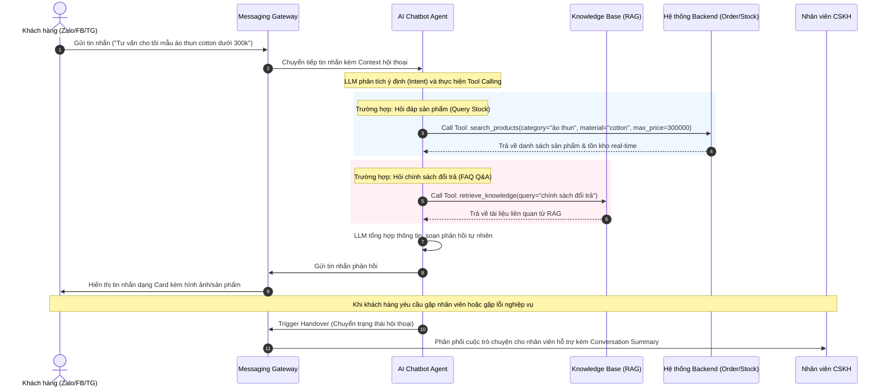
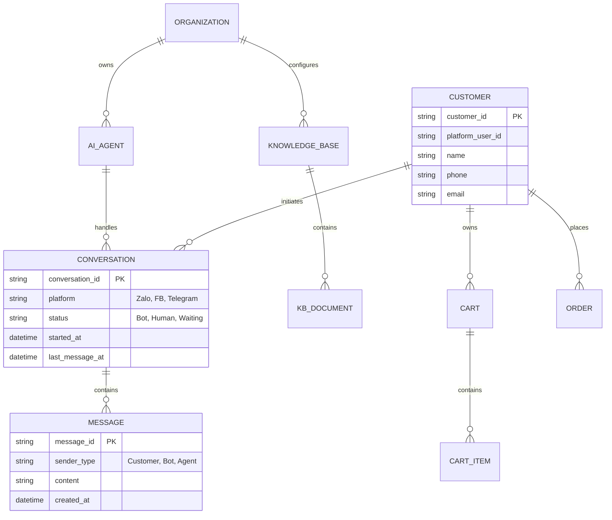

# Nhật ký thay đổi (Revision History)

| Phiên bản | Ngày | Người cập nhật | Vị trí thay đổi | Lý do chi tiết |
| :--- | :--- | :--- | :--- | :--- |
| 1.0.5 | 2026-07-01 | Mira-Miraaa | Bản đồ tài liệu, Biểu đồ Mermaid | Bổ sung tài liệu PRD AI Conversation Memory (prd-conversation-memory.md) vào chỉ mục |
| 1.0.4 | 2026-06-26 | Mira-Miraaa | Bản đồ tài liệu, Biểu đồ Mermaid | Bổ sung tài liệu PRD Tự động tóm tắt phiên hội thoại (prd-conversation-summary.md) vào chỉ mục |
| 1.0.3 | 2026-06-26 | Mira-Miraaa | Bản đồ tài liệu, Biểu đồ Mermaid | Chuẩn hóa tên file PRD thành định dạng prd- theo đúng nội dung và đồng bộ liên kết |
| 1.0.2 | 2026-06-26 | Mira-Miraaa | Bản đồ tài liệu, Biểu đồ Mermaid | Cập nhật tên các file .md sau khi đổi tên theo chuẩn rõ ràng và bổ sung các tài liệu PRD phân rã |
| 1.0.1 | 2026-06-26 | Mira-Miraaa | Bản đồ tài liệu, Cấu hình | Cập nhật danh sách tài liệu sau khi lưu trữ các file .docx gốc vào .archive_docx |
| 1.0.0 | 2026-06-26 | Mira-Miraaa | Toàn bộ tài liệu | Tạo mới tài liệu chỉ mục (README.md) để tổng hợp và liên kết tất cả tài liệu SRS/PRD của Module AI Chatbot |

---

# 🤖 Module AI Chatbot - Trợ lý bán hàng đa kênh

## 1. Tổng quan Module
GAPCon AI Chatbot là hệ thống trợ lý mua sắm và chăm sóc khách hàng (CSKH) đa kênh cho thương mại điện tử, hoạt động trực tiếp trên Zalo, Facebook Messenger và Telegram. 

Hệ thống cho phép khách hàng thực hiện toàn bộ hành trình mua sắm từ hỏi đáp thông tin (FAQ Q&A), tìm kiếm & gợi ý sản phẩm, quản lý giỏ hàng, đặt hàng đến tra cứu trạng thái đơn hàng ngay trong cuộc trò chuyện mà không cần chuyển sang nền tảng khác.

> [!NOTE]
> Module AI Chatbot được xây dựng dựa trên kiến trúc **Tool Calling** của LLM. Trợ lý AI có khả năng tự động chọn và gọi các API nghiệp vụ tương ứng (tra cứu tồn kho, tạo đơn, tóm tắt...) dựa trên câu thoại và ngữ cảnh của khách hàng.

---

## 2. Bản đồ chức năng (Functional Map) & Liên kết tài liệu
Các tài liệu liên quan đến Module AI Chatbot đã được tổng hợp hoàn chỉnh trong thư mục [AI_Chatbot](file:///F:/Gapone%20Conversation/Docs/AI_Chatbot). Dưới đây là sơ đồ liên kết và chức năng chi tiết của từng file:

```mermaid
graph TD
    Root[README.md - Index] --> PRD[Tài liệu PRD phân rã]
    Root --> SRS_Core[Tài liệu SRS chi tiết]

    PRD --> PRD_Main["prd-ai-chatbot.md (PRD Tổng thể)"]
    PRD --> PRD_Intro["prd-ai-chatbot-intro.md (Giới thiệu)"]
    PRD --> PRD_Remind["prd-reminder-agent.md (Reminder Agent)"]
    PRD --> PRD_Img["prd-image-upload-feasibility.md (Upload ảnh)"]
    PRD --> PRD_File["prd-file-processing.md (Đọc/Xử lý file)"]
    PRD --> PRD_Tool["prd-tool-calling-architecture.md (Kiến trúc Tool Calling)"]
    PRD --> PRD_Sum_P["prd-conversation-summary.md (Tóm tắt hội thoại)"]
    PRD --> PRD_Mem_P["prd-conversation-memory.md (Bộ nhớ hội thoại)"]

    SRS_Core --> SRS_AI["srs-ai-settings.md (Thiết lập & Cấu hình)"]
    SRS_Core --> SRS_Auto["srs-chatbot-scenarios.md (Kịch bản & Phản hồi)"]
    SRS_Core --> SRS_KB["srs-knowledge-base.md (Cơ sở tri thức RAG)"]
    SRS_Core --> SRS_Mem["srs-conversation-memory.md (Bộ nhớ hội thoại)"]
    SRS_Core --> SRS_Sum["srs-conversation-summary.md (Tóm tắt hội thoại)"]

    style Root fill:#f9f,stroke:#333,stroke-width:4px
    style PRD_Main fill:#bbf,stroke:#333,stroke-width:1px
    style SRS_AI fill:#bbf,stroke:#333,stroke-width:1px
```

### 📋 Danh sách tài liệu đặc tả chi tiết:

| STT | Tài liệu | Mô tả | Liên kết file `.md` |
| :--- | :--- | :--- | :--- |
| 1 | **PRD AI Chatbot (Tổng thể)** | Tài liệu yêu cầu sản phẩm (PRD) chính cho dự án trợ lý bán hàng AI. | [prd-ai-chatbot.md](file:///F:/Gapone%20Conversation/Docs/AI_Chatbot/prd-ai-chatbot.md) |
| 2 | **PRD AI Chatbot (Intro)** | Phần giới thiệu tóm tắt sản phẩm và năng lực MVP. | [prd-ai-chatbot-intro.md](file:///F:/Gapone%20Conversation/Docs/AI_Chatbot/prd-ai-chatbot-intro.md) |
| 3 | **PRD Reminder Agent** | Tài liệu PRD về cơ chế nhắc nhở (Reminder) & tự đóng phiên thông minh. | [prd-reminder-agent.md](file:///F:/Gapone%20Conversation/Docs/AI_Chatbot/prd-reminder-agent.md) |
| 4 | **PRD Image Upload Feasibility** | Đánh giá tính khả thi kỹ thuật khi xử lý upload ảnh của khách hàng. | [prd-image-upload-feasibility.md](file:///F:/Gapone%20Conversation/Docs/AI_Chatbot/prd-image-upload-feasibility.md) |
| 5 | **PRD File Processing** | Đặc tả kiến trúc xử lý tài liệu (PDF, Word, Excel/CSV) của LLM. | [prd-file-processing.md](file:///F:/Gapone%20Conversation/Docs/AI_Chatbot/prd-file-processing.md) |
| 6 | **PRD Tool Calling Architecture** | Đặc tả kiến trúc Tool Calling và chi tiết các tool MVP. | [prd-tool-calling-architecture.md](file:///F:/Gapone%20Conversation/Docs/AI_Chatbot/prd-tool-calling-architecture.md) |
| 7 | **PRD Conversation Summary** | Tài liệu PRD đặc tả tính năng tự động tóm tắt phiên hội thoại bằng AI. | [prd-conversation-summary.md](file:///F:/Gapone%20Conversation/Docs/AI_Chatbot/prd-conversation-summary.md) |
| 8 | **PRD Conversation Memory** | Tài liệu PRD đặc tả tính năng AI ghi nhớ 5 phiên hội thoại gần nhất. | [prd-conversation-memory.md](file:///F:/Gapone%20Conversation/Docs/AI_Chatbot/prd-conversation-memory.md) |
| 9 | **SRS AI Integration** | Đặc tả tích hợp AI vào hệ thống, quản lý thiết lập AI và tích hợp nhà cung cấp mô hình. | [srs-ai-settings.md](file:///F:/Gapone%20Conversation/Docs/AI_Chatbot/srs-ai-settings.md) |
| 10 | **SRS Automation** | Đặc tả chatbot tự động trong các kịch bản tự động phản hồi. | [srs-chatbot-scenarios.md](file:///F:/Gapone%20Conversation/Docs/AI_Chatbot/srs-chatbot-scenarios.md) |
| 11 | **SRS Knowledge Base** | Đặc tả cơ sở tri thức phục vụ cho RAG để Chatbot trả lời FAQ chính xác. | [srs-knowledge-base.md](file:///F:/Gapone%20Conversation/Docs/AI_Chatbot/srs-knowledge-base.md) |
| 12 | **SRS Conversation Memory** | Đặc tả lưu trữ và quản lý bộ nhớ hội thoại giúp giữ ngữ cảnh trao đổi. | [srs-conversation-memory.md](file:///F:/Gapone%20Conversation/Docs/AI_Chatbot/srs-conversation-memory.md) |
| 13 | **SRS Conversation Summary** | Đặc tả tóm tắt hội thoại nhằm tối ưu hóa token và bàn giao cho agent người. | [srs-conversation-summary.md](file:///F:/Gapone%20Conversation/Docs/AI_Chatbot/srs-conversation-summary.md) |

> [!NOTE]
> Các file gốc `.docx` tương ứng đã được lưu trữ (archive) trong thư mục ẩn `.archive_docx/` để phục vụ sao lưu và không tham gia vào quá trình đọc/quét tự động của AI Agent.

---

## 3. Kiến trúc hệ thống AI Chatbot
Dưới đây là luồng xử lý tin nhắn của hệ thống dựa trên mô hình Tool Calling và RAG (Retrieval-Augmented Generation):

---

## 4. Sơ đồ thực thể ERD mức cao (High-Level ERD)
Mô tả quan hệ của các thực thể chính liên quan đến quản lý hội thoại và xử lý AI Chatbot:

---

> [!IMPORTANT]
> - Mọi thay đổi cấu trúc hoặc bổ sung tài liệu SRS liên quan tới AI Chatbot cần phải được cập nhật bản đồ liên kết tại file này để đảm bảo tính đồng bộ của hệ thống tài liệu.
> - Thiết kế chi tiết về cấu trúc dữ liệu và API tích hợp cụ thể nằm trong các file SRS con tương ứng.
