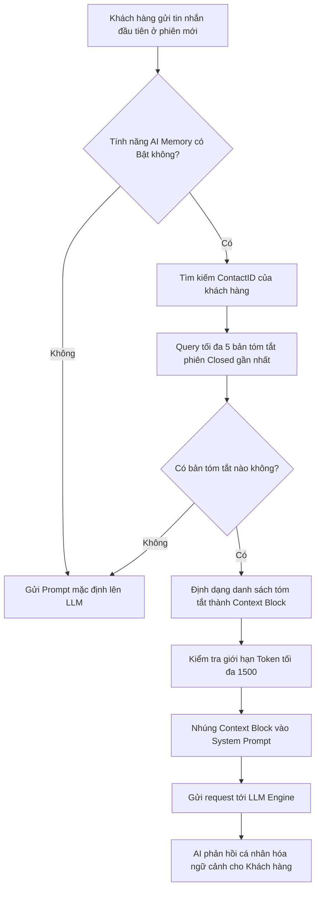

# Nhật ký thay đổi (Revision History)

| Phiên bản | Ngày | Người cập nhật | Vị trí thay đổi | Lý do chi tiết |
| :--- | :--- | :--- | :--- | :--- |
| 1.0.0 | 2026-07-01 | Mira-Miraaa | Toàn bộ tài liệu | Tạo mới tài liệu PRD đặc tả tính năng AI ghi nhớ 5 phiên hội thoại gần nhất |

---

# 📝 PRD - AI Ghi Nhớ Lịch Sử Phiên Hội Thoại (AI Conversation Memory)

## 1. Tổng quan & Mục tiêu sản phẩm

### 1.1. User Story
> **Là PO (Product Owner)**, tôi muốn AI Chatbot tự động ghi nhớ và tham chiếu nội dung tóm tắt của **tối đa 5 phiên hội thoại gần nhất** của khách hàng, giúp cuộc trò chuyện ở phiên mới được cá nhân hóa cao hơn, liền mạch hơn và tránh việc hỏi lại các thông tin khách hàng đã cung cấp ở các phiên cũ.

### 1.2. Hiện trạng & Vấn đề (Problem Statement)
Hệ thống GAPCon AI Chatbot hiện tại hoạt động theo từng phiên độc lập (session-based). Khi một phiên hội thoại đóng lại, toàn bộ bộ nhớ ngắn hạn của AI về cuộc trò chuyện đó sẽ bị giải phóng.
*   **Thiếu tính liên kết**: Khi khách hàng quay lại chat ở phiên mới, AI không biết họ là ai, từng quan tâm sản phẩm gì hay gặp sự cố gì ở phiên trước.
*   **Trải nghiệm khách hàng kém**: Khách hàng phải lặp lại các thông tin cá nhân (tên, SĐT, địa chỉ) hoặc mô tả lại vấn đề cũ cho AI.
*   **Lãng phí tài nguyên**: Việc gửi toàn bộ tin nhắn thô (raw messages) của các phiên cũ lên LLM để làm ngữ cảnh sẽ tốn rất nhiều chi phí token và dễ làm tràn cửa sổ ngữ cảnh (Context Window).

### 1.3. Mục tiêu sản phẩm (Objectives)
*   **Cá nhân hóa trải nghiệm chat**: Giúp AI Bot nhận diện khách hàng cũ, chủ động nhắc nhở giỏ hàng bỏ quên hoặc tiếp tục hỗ trợ các vấn đề chưa được giải quyết ở phiên trước.
*   **Tối ưu hóa token và chi phí**: Sử dụng bản tóm tắt phiên (`session_summaries`) có sẵn thay vì tin nhắn thô.
*   **Đồng bộ đa kênh (Omni-channel)**: Nhận diện bộ nhớ của khách hàng ngay cả khi họ chat trên các kênh khác nhau (Zalo OA, Facebook Messenger, Web Livechat) sau khi đã được hợp nhất hồ sơ (Merge Contact).
*   **Kiểm soát tài nguyên**: Giới hạn tối đa \(N = 5\) phiên gần nhất gửi lên LLM để tránh lãng phí token.

---

## 2. Đối tượng người dùng & Hành trình (User Personas & Journey)

*   **Admin / Quản lý (Manager)**: Thực hiện bật/tắt tính năng, thiết lập giới hạn số phiên ghi nhớ \(N\) (\(1 \le N \le 5\)) và tùy biến mẫu Prompt nhúng ngữ cảnh.
*   **Khách hàng (Buyer)**: Trực tiếp trò chuyện với AI Bot, nhận được các phản hồi thông minh kế thừa từ lịch sử giao dịch/chat cũ.

---

## 3. Đặc tả yêu cầu chức năng (Functional Requirements)

### 3.1. Luồng xử lý nghiệp vụ (Business Flow)



### 3.2. Yêu cầu chi tiết các tính năng

#### FR-1: Cơ chế tự động truy xuất bộ nhớ (Trigger & Retrieval)
*   Hệ thống tự động kích hoạt truy xuất lịch sử khi nhận được tin nhắn đầu tiên từ khách hàng trong một phiên hội thoại mới (`Open` hoặc `In Progress`).
*   Truy xuất dựa trên `contact_id` để lấy ra tối đa \(N\) phiên hội thoại đã đóng (`Closed`) gần nhất, sắp xếp theo thời gian kết thúc (`end_time`) giảm dần.

#### FR-2: Giới hạn số lượng phiên ghi nhớ (\(N\) Sessions Limit)
*   Số lượng phiên tối đa được cấu hình động bởi Admin trong khoảng từ 1 đến 5 phiên.
*   Mặc định hệ thống sẽ lấy 5 phiên gần nhất để đảm bảo đủ bối cảnh mà không làm loãng Prompt.

#### FR-3: Nhúng ngữ cảnh lịch sử vào Prompt (Prompt Injection)
Hệ thống tự động biên dịch dữ liệu tóm tắt thành khối Markdown và chèn vào System Prompt theo mẫu:
```markdown
[BẮT ĐẦU LỊCH SỬ TƯƠNG TÁC CŨ]
- Phiên #1 (Gần nhất):
  + Kênh: Zalo OA | Thời gian: [Thời gian đóng]
  + Ý định: [Ý định của khách]
  + Tóm tắt: [Nội dung tóm tắt phiên]
  + Kết quả: [Trạng thái kết quả]
...
[KẾT THÚC LỊCH SỬ TƯƠNG TÁC CŨ]
```

#### FR-4: Giao diện cấu hình dành cho Admin (Admin Dashboard)
*   **Đường dẫn**: Cài đặt > Kênh > Cấu hình AI > Bộ nhớ hội thoại (AI Memory).
*   **Toggle Switch**: Bật/Tắt tính năng AI Memory.
*   **Giới hạn số phiên**: Ô nhập số nguyên từ 1 đến 5 (kèm nút tăng/giảm).
*   **Khung tùy chỉnh Prompt**: Textarea hiển thị mẫu System Prompt mẫu và cho phép chỉnh sửa cách AI ứng xử với lịch sử phiên cũ.

#### FR-5: Kế thừa hành vi và phản hồi cá nhân hóa
*   **Xử lý giỏ hàng bỏ quên**: Nếu phiên gần nhất có kết quả `Abandoned` (bỏ quên giỏ hàng), AI Bot khi chào khách hàng ở phiên mới sẽ chủ động nhắc về sản phẩm cũ.
*   **Kế thừa thông tin cá nhân**: Tự động sử dụng lại Tên, SĐT, Địa chỉ giao hàng đã xác nhận ở phiên trước để làm thủ tục thanh toán nhanh.

---

## 4. Yêu cầu phi chức năng (Non-Functional Requirements)

*   **Thời gian phản hồi (Latency)**: Quá trình truy xuất dữ liệu tóm tắt từ Database và nhúng vào Prompt phải hoàn thành trong thời gian \(\Delta t \le 500 \text{ ms}\) để tránh gây trễ câu trả lời của AI.
*   **Quản lý Token (Token Budgeting)**:
    Tổng dung lượng token của khối dữ liệu lịch sử nhúng vào Prompt không được vượt quá ngưỡng giới hạn \(T_{\text{max}} = 1500 \text{ tokens}\). Nếu vượt quá:
    $$T_{\text{context}} > T_{\text{max}}$$
    Hệ thống sẽ tự động cắt bỏ phiên cũ nhất trong danh sách (giảm từ phiên thứ 5 xuống phiên thứ 4, 3...) cho đến khi:
    $$T_{\text{context}} \le T_{\text{max}}$$
*   **Bảo mật dữ liệu**: Đảm bảo thông tin tóm tắt chỉ được lấy đúng theo `contact_id` đã được xác thực, không bị lộ thông tin của khách hàng khác.

---

## 5. Tiêu chí nghiệm thu (Acceptance Criteria)

| Mã AC | Tiêu chí | Điều kiện nghiệm thu thành công |
| :--- | :--- | :--- |
| **AC-01** | Bật/tắt & Cấu hình số lượng phiên | Admin có thể bật tính năng, lưu cấu hình số phiên cần nhớ là `3` và hệ thống áp dụng chính xác giới hạn này khi query. |
| **AC-02** | Giới hạn tối đa 5 phiên gần nhất | Khách hàng có 7 phiên cũ đã đóng. Khi bắt đầu phiên thứ 8, hệ thống chỉ lấy thông tin tóm tắt của đúng 5 phiên gần nhất (phiên 7, 6, 5, 4, 3) đưa vào Prompt. |
| **AC-03** | Tự động cắt giảm Token quá hạn | Khi tổng dung lượng 5 bản tóm tắt vượt quá 1500 tokens, hệ thống tự động loại bỏ bản tóm tắt của phiên xa nhất để đảm bảo an toàn token. |
| **AC-04** | Cá nhân hóa theo giỏ hàng bỏ quên | Khách hàng thêm sản phẩm vào giỏ ở phiên cũ rồi im lặng. Khi khách chat lại ở phiên mới, AI Bot chủ động hỏi khách có muốn mua tiếp sản phẩm đó không. |

---

> [!IMPORTANT]
> Tài liệu PRD này mô tả các yêu cầu sản phẩm mức cao và tiêu chí nghiệm thu của PO. Đặc tả kỹ thuật chi tiết về cơ sở dữ liệu và API được quy định tại tài liệu [srs-conversation-memory.md](file:///F:/Gapone%20Conversation/Docs/AI_Chatbot/srs-conversation-memory.md).
