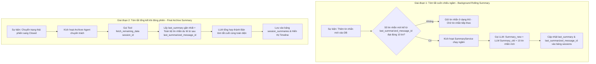
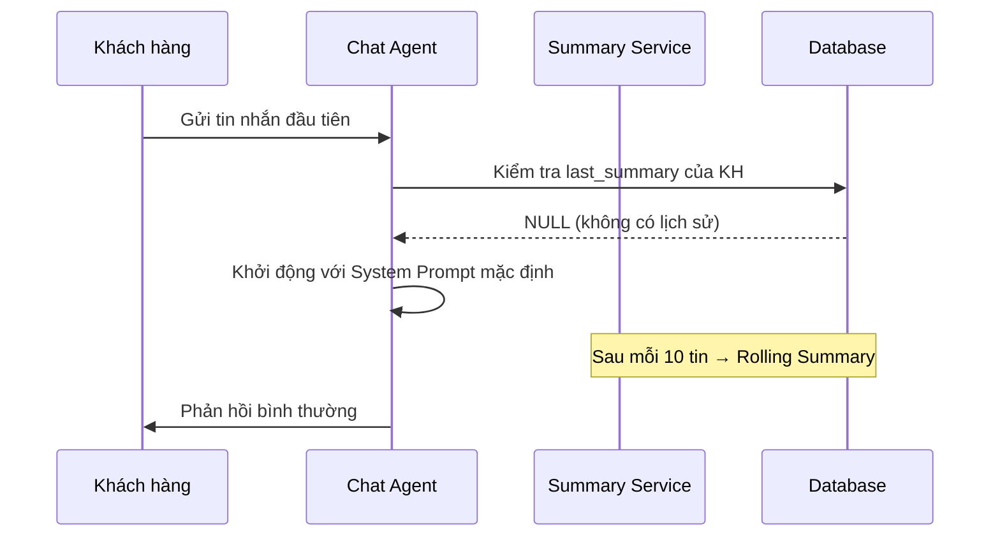
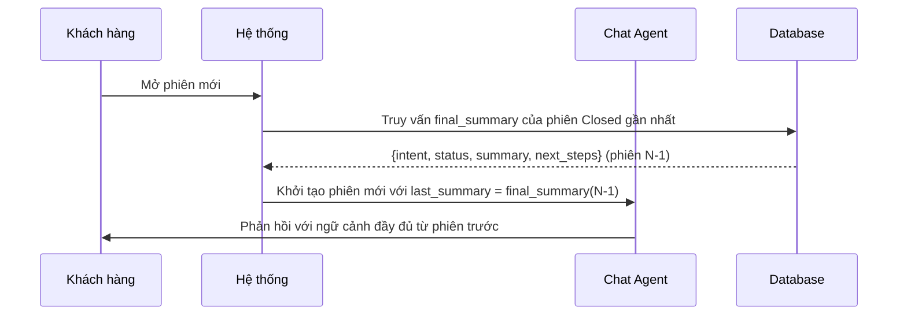
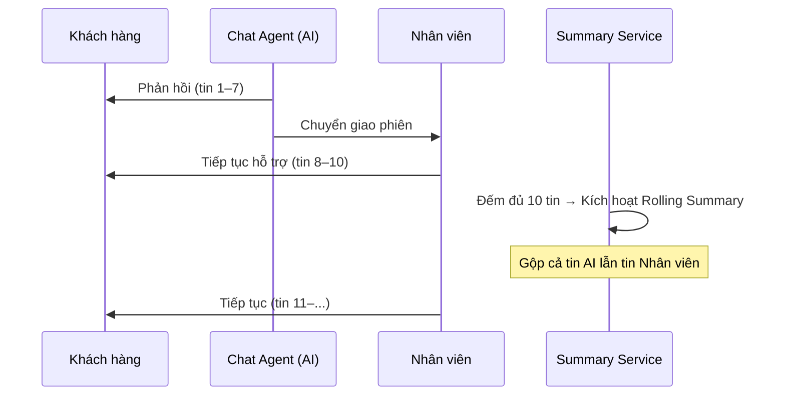

# Nhật ký thay đổi (Revision History)

| Phiên bản | Ngày      | Người cập nhật | Vị trí thay đổi  | Lý do chi tiết                                                                                                                                                        |
| :---------- | :--------- | :----------------- | :------------------- | :---------------------------------------------------------------------------------------------------------------------------------------------------------------------- |
| 1.0.0       | 2026-06-26 | Mira-Miraaa        | Toàn bộ tài liệu | Tạo mới tài liệu PRD đặc tả tính năng tự động tóm tắt phiên hội thoại bằng AI                                                                         |
| 2.0.0       | 2026-07-08 | Mira-Miraaa        | Toàn bộ tài liệu | Cải tiến kiến trúc tóm tắt: Tách biệt logic phản hồi, bổ sung cơ chế cuốn chiếu ngầm 10 tin và tóm tắt tổng kết đóng phiên bằng Archiver Agent |
| 2.1.0       | 2026-07-09 | Mira-Miraaa        | Mục 3.3 (mới)    | Bổ sung mô tả chi tiết các case thường và case đặc biệt để diễn giải logic kế thừa tóm tắt giữa các phiên                                      |

---

# 📝 PRD - AI Tự Động Tóm Tắt Phiên Hội Thoại (AI Conversation Summary)

## 1. Hiện Trạng & Vấn Đề Hệ Thống (Context & Problem Statement)

### 1.1. Mô hình hiện tại

Hệ thống GapOne Conversation quản lý các cuộc trò chuyện đa kênh thông qua mô hình quản lý hội thoại đa phiên (**Multi-session**). Mỗi phiên (Session) trải qua các trạng thái tuần tự: **Mở (Open)** $\rightarrow$ **Đang xử lý (Processing)** $\rightarrow$ **Đóng (Closed)**. Mỗi phiên mới được định tuyến cho một Chat Agent (AI hoặc Nhân viên) xử lý.

### 1.2. Cơ chế tóm tắt cũ

Sử dụng cơ chế tóm tắt cuốn chiếu đệ quy (**Recursive Rolling Summary**). Khi đạt điều kiện, hệ thống lấy bản tóm tắt cũ cộng với 10 tin nhắn mới nhất để ghi đè thành bản tóm tắt mới nhằm tối ưu hóa cửa sổ ngữ cảnh (Context Window) cho Chat Agent.

### 1.3. Lỗ hổng & Hạn chế

* **Lỗi logic Trigger**: Hàm tóm tắt hiện đang bị gắn chặt vào sự kiện *"AI phản hồi"*. Khi chuyển giao cuộc trò chuyện cho con người xử lý (quy trình Human-in-the-loop), AI ngừng phản hồi dẫn đến hệ thống ngừng tóm tắt hoàn toàn, gây mất dấu và mất toàn bộ dữ liệu phần sau của cuộc trò chuyện.
* **Hiệu ứng Tam sao thất bản (Information Decay)**: Việc tóm tắt tự do dựa trên bản tóm tắt cũ lặp đi lặp lại qua nhiều vòng đệ quy khiến thông tin ở các tin nhắn đầu tiên bị mờ nhạt dần hoặc biến mất hoàn toàn theo thời gian.

---

## 2. Mục Tiêu Thiết Kế Hệ Thống Mới (System Objectives)

* **Tách biệt logic Tóm tắt (Summarization) ra khỏi logic Phản hồi (Chat/Response)**: Đảm bảo quy trình tóm tắt chạy độc lập và trọn vẹn $100\%$ phiên hội thoại trong mọi kịch bản: AI chat hoàn toàn, Người chat hoàn toàn, hoặc Lai (AI chuyển giao cho Người).
* **Tối ưu hóa hiệu suất và chi phí**: Ngăn chặn tình trạng quá tải hoặc tràn cửa sổ ngữ cảnh (Context Window) của LLM bằng việc quản lý chặt chẽ số lượng tin nhắn gửi đi, chỉ thực hiện tóm tắt khi đủ số lượng tin nhắn cố định.
* **Rút ngắn thời gian xử lý trung bình ($AHT$)**: Giảm thời gian xử lý của Agent khi nhận bàn giao ca hoặc khi khách hàng cũ quay lại ít nhất $30\%$:
  $$
  AHT_{\text{mới}} \le AHT_{\text{cũ}} \times 0.70
  $$

---

## 3. Giải Pháp Kiến Trúc Đề Xuất (Proposed Architecture)

Hệ thống áp dụng kiến trúc **Hướng sự kiện (Event-Driven)** kết hợp giải pháp lai (Hybrid) giữa tầng xử lý dữ liệu và thuật toán **Map-Reduce**.

### 3.1. Thiết Kế Cơ Sở Dữ Liệu (Database Schema)

Bảng Quản lý Phiên (`sessions`) cần được bổ sung/cập nhật các trường dữ liệu sau để hỗ trợ tiến trình chạy ngầm:

* `last_summary`: Lưu đoạn văn/cấu trúc tóm tắt gần nhất (Dạng TEXT hoặc JSON định dạng).
* `last_summarized_message_id`: Lưu ID của tin nhắn cuối cùng được đưa vào bản tóm tắt trước đó. Các tin nhắn có ID lớn hơn giá trị này được coi là *"tin nhắn mới/tin nhắn dư lẻ"* chưa qua xử lý.

### 3.2. Quy Trình Xử Lý Gồm 2 Giai Đoạn (Dual-Phase Workflow)

#### Giai đoạn 1: Tóm tắt cuốn chiếu ngầm (Background Rolling Summary)

* **Trigger**: Hệ thống lắng nghe sự kiện thêm tin nhắn mới vào Database (bất kể là từ Khách hàng, AI hay Nhân viên gõ). Khi số lượng tin nhắn mới tính từ `last_summarized_message_id` đạt đúng **10 tin**, hệ thống tự động kích hoạt `SummaryService` chạy ngầm.
* **Thuật toán**:
  $$
  Summary_{new} = \text{LLM}(Summary_{old} + \text{10 tin nhắn mới từ ID đã lưu})
  $$
* **Cải tiến quan trọng**: Không gom các tin nhắn dư lẻ ($< 10$ tin) vào giai đoạn này. Giữ chúng ở dạng tin nhắn thô cho đến khi đủ số lượng để tối ưu hóa chi phí token.

#### Giai đoạn 2: Tóm tắt tổng kết khi đóng phiên (Final Archive Summary)

* **Trigger**: Khi nhân viên hoặc hệ thống chuyển trạng thái phiên sang **Đóng (Closed)**.
* **Hành động (Tool Calling)**: Hệ thống kích hoạt một **Archiver Agent** chuyên trách và gọi Tool `fetch_remaining_data(session_id)` để lấy ra:
  1. Bản tóm tắt gần nhất `last_summary` trong DB.
  2. Toàn bộ các tin nhắn dư lẻ còn sót lại từ sau `last_summarized_message_id` đến cuối phiên.
* **Kết quả**: Archiver Agent tổng hợp hai nguồn thông tin trên thành bản tóm tắt cuối cùng toàn diện và lưu vào bảng lưu trữ cố định (`session_summaries`).

### 3.3. Diễn Giải Logic Kế Thừa Tóm Tắt Giữa Các Phiên (Cross-Session Inheritance Logic)

Khi một khách hàng quay lại và mở phiên mới, hệ thống cần xác định **điểm khởi đầu ngữ cảnh** (`initial_context`) cho Chat Agent và Summary Service của phiên đó. Mục này mô tả toàn bộ các kịch bản có thể xảy ra.

> [!IMPORTANT]
> **Nguyên tắc cốt lõi:** Tóm tắt chỉ được kế thừa từ phiên liền trước (phiên cuối cùng đã đóng thành công của cùng khách hàng). Không gộp tóm tắt từ nhiều phiên lịch sử xa hơn. Điều này đảm bảo ngữ cảnh luôn gọn, có độ liên quan cao và không vượt quá giới hạn token.

---

#### 3.3.1. Các Case Thường (Happy Path)

##### Case T1 – Phiên Đầu Tiên Của Khách Hàng (Cold Start)

> **Điều kiện:** Khách hàng liên hệ lần đầu, không có lịch sử phiên nào trong DB.

* **Dữ liệu kế thừa:** Không có. `last_summary = NULL`, `last_summarized_message_id = NULL`.
* **Hành vi:**
  * Chat Agent khởi động với **ngữ cảnh trống** — chỉ dùng System Prompt mặc định.
  * Summary Service bắt đầu đếm từ tin nhắn đầu tiên của phiên.
* **Kết quả khi đóng phiên:** Archiver Agent tạo bản tóm tắt đầy đủ và lưu vào `session_summaries`. Đây là bản tóm tắt gốc, không có tiền tố kế thừa.

---

##### Case T2 – Khách Hàng Quay Lại, Phiên Trước Đã Đóng Hoàn Chỉnh

> **Điều kiện:** Khách hàng đã có ít nhất một phiên trước được đóng thành công, đã có bản tóm tắt cuối phiên trong `session_summaries`.

* **Dữ liệu kế thừa:** Lấy `final_summary` của phiên liền trước (phiên mới nhất có trạng thái `Closed` của cùng `customer_id`).
* **Hành vi:**
  * Hệ thống nạp `final_summary` của phiên cũ vào `last_summary` của phiên mới ngay khi phiên mới được tạo.
  * Chat Agent nhận được ngữ cảnh tóm tắt đã có sẵn, phản hồi ngay mà không cần đọc lại toàn bộ lịch sử.
  * Summary Service bắt đầu đếm từ tin nhắn **đầu tiên của phiên mới** (không kế thừa `last_summarized_message_id` của phiên cũ).
* **Kết quả:** Agent phục vụ khách hàng quay lại nhanh hơn nhờ ngữ cảnh phiên trước. Góp phần đạt mục tiêu giảm $AHT \ge 30\%$.

---

##### Case T3 – Phiên Nhiều Tin Nhắn, Tóm Tắt Cuốn Chiếu Kích Hoạt Nhiều Lần

> **Điều kiện:** Phiên có trên 30 tin nhắn, tóm tắt cuốn chiếu đã chạy nhiều lần trong phiên.

* **Hành vi:**
  * Mỗi lần đủ 10 tin mới: `Summary Service` gọi LLM để cập nhật `last_summary` và `last_summarized_message_id`.
  * Sau nhiều vòng, `last_summary` là kết quả tóm tắt tích lũy của toàn bộ phần đã xử lý.
  * Khi phiên đóng: `Archiver Agent` chỉ cần xử lý thêm phần **tin nhắn dư lẻ** còn sót lại (thường dưới 10 tin), gộp với `last_summary` cuối cùng để ra bản tóm tắt hoàn chỉnh.
* **Hiệu quả:** Chi phí xử lý tại bước đóng phiên được tối thiểu hóa — Archiver không phải đọc lại toàn bộ hội thoại dài.

  $$
  Summary_{\text{final}} = \text{LLM}(Summary_{\text{last\_rolling}} + \text{tin nhắn dư lẻ})
  $$

---

##### Case T4 – Phiên Ít Tin Nhắn (Dưới 10 Tin), Không Có Tóm Tắt Cuốn Chiếu

> **Điều kiện:** Phiên kết thúc sớm trước khi đủ 10 tin nhắn.

* **Hành vi:**
  * Summary Service không kích hoạt lần nào trong phiên (chưa đủ điều kiện trigger).
  * `last_summary` và `last_summarized_message_id` vẫn mang giá trị kế thừa từ phiên trước (hoặc `NULL` nếu là phiên đầu tiên).
  * Khi phiên đóng: `Archiver Agent` lấy toàn bộ tin nhắn của phiên (dư lẻ 100%) và gộp với `last_summary` kế thừa để tạo bản tóm tắt cuối.
* **Lưu ý:** Archiver luôn được kích hoạt khi đóng phiên, bất kể số lượng tin nhắn có đủ 10 hay không.

---

#### 3.3.2. Các Case Đặc Biệt (Edge Cases)

##### Case E1 – Chuyển Giao AI → Nhân Viên (Human Handover) Trong Cùng Phiên

> **Điều kiện:** Agent AI đang phục vụ, gặp yêu cầu phức tạp, chuyển giao cho nhân viên người thật tiếp tục trong cùng session.

* **Vấn đề cũ (đã khắc phục):** Hệ thống cũ dừng tóm tắt vì trigger gắn với sự kiện AI phản hồi.
* **Hành vi mới:**
  * Trigger của Summary Service là **sự kiện thêm tin nhắn vào DB** (độc lập với tác nhân gửi — KH, AI hay Nhân viên).
  * Sau khi chuyển giao, nhân viên tiếp tục chat → các tin nhắn vẫn được đếm tích lũy.
  * Khi đủ 10 tin mới kể từ `last_summarized_message_id`, Summary Service vẫn kích hoạt bình thường.
* **Kết quả:** Phần hội thoại do nhân viên xử lý **không bị mất** trong bản tóm tắt cuối.

---

##### Case E2 – Phiên Bị Timeout / Tự Động Đóng Bởi Hệ Thống

> **Điều kiện:** Phiên không có hoạt động sau khoảng thời gian cấu hình (ví dụ: 30 phút không có tin nhắn mới), hệ thống tự động chuyển trạng thái sang `Closed`.

* **Hành vi:** Sự kiện đóng phiên (dù từ hệ thống hay nhân viên) đều kích hoạt `Archiver Agent` theo cùng một luồng.
* **Trường hợp con:**
  * Nếu có `last_summary` và có tin dư lẻ → Archiver gộp và lưu.
  * Nếu có `last_summary` nhưng không có tin dư lẻ → Archiver dùng `last_summary` trực tiếp làm bản tóm tắt cuối.
  * Nếu cả hai đều `NULL` (phiên không có tin nhắn nào, ví dụ bot greeting bị timeout) → Archiver bỏ qua, không tạo bản tóm tắt, phiên được đánh dấu `status = Abandoned`.

> [!NOTE]
> Phiên `Abandoned` sẽ không được kế thừa làm ngữ cảnh cho phiên tiếp theo. Hệ thống sẽ tìm lùi lại phiên `Closed` gần nhất có bản tóm tắt hợp lệ.

---

##### Case E3 – Phiên Được Mở Lại Sau Khi Đã Đóng (Reopen)

> **Điều kiện:** Phiên đã đóng nhưng được nhân viên hoặc hệ thống mở lại (trạng thái chuyển từ `Closed` → `Open`).

* **Hành vi:**
  * Bản tóm tắt cuối cùng đã lưu trong `session_summaries` **không bị xóa**.
  * Phiên mở lại được coi như một **phiên tiếp nối** — hệ thống nạp lại `final_summary` của lần đóng trước vào `last_summary` của phiên đang hoạt động.
  * `last_summarized_message_id` được reset về giá trị tương ứng với lần đóng trước (tin nhắn cuối cùng đã được Archiver xử lý).
  * Các tin nhắn phát sinh sau khi reopen được đếm từ đầu theo cơ chế cuốn chiếu bình thường.
  * Khi phiên đóng lại: Archiver tạo bản tóm tắt mới, ghi đè (hoặc thêm version mới) vào `session_summaries`.

> [!WARNING]
> Cần xác định rõ chiến lược lưu trữ khi reopen: **Ghi đè** bản tóm tắt cũ hay **thêm version mới** vào `session_summaries`. Quyết định này ảnh hưởng đến khả năng truy vết lịch sử và cần được PO xác nhận trước khi implement.

---

##### Case E4 – Archiver Agent Gặp Lỗi Khi Đóng Phiên

> **Điều kiện:** LLM hoặc hệ thống gặp lỗi trong quá trình Archiver Agent xử lý (timeout API, lỗi mạng, v.v.).

* **Hành vi (Retry & Fallback):**
  * Hệ thống tự động thử lại (`retry`) tối đa **3 lần** với khoảng cách lũy tiến (exponential backoff: 5s, 15s, 45s).
  * Nếu cả 3 lần đều thất bại: Phiên được đánh dấu `summary_status = Failed`. Bản tóm tắt cuốn chiếu cuối (`last_summary`) vẫn được giữ nguyên trong bảng `sessions` như là dữ liệu dự phòng.
  * Hệ thống sinh cảnh báo (alert) cho đội vận hành để xử lý thủ công nếu cần.
* **Kế thừa phiên sau:** Nếu phiên kế tiếp của KH được mở trong khi `summary_status = Failed`, hệ thống dùng `last_summary` (bản cuốn chiếu cuối) thay thế cho `final_summary` (bản Archiver) để làm ngữ cảnh kế thừa, kèm flag `context_source = rolling` để theo dõi.

  $$
  \text{context\_source} = \begin{cases} \text{final\_summary} & \text{nếu } summary\_status = \text{Success} \\ \text{last\_summary (rolling)} & \text{nếu } summary\_status = \text{Failed} \\ \text{NULL (cold start)} & \text{nếu không có phiên trước hợp lệ} \end{cases}
  $$

---

##### Case E5 – Phiên Mới Kế Thừa Từ Phiên Trước Có `summary_status = Failed`

> **Điều kiện:** Khách hàng quay lại, nhưng phiên cũ nhất gần nhất bị lỗi Archiver, không có `final_summary`.

* **Chiến lược ưu tiên kế thừa (theo thứ tự):**
  1. **Ưu tiên 1:** Dùng `final_summary` của phiên `Closed` gần nhất có `summary_status = Success`.
  2. **Ưu tiên 2:** Nếu không tìm được, dùng `last_summary` (rolling) của phiên `Closed` gần nhất (dù status là `Failed`).
  3. **Ưu tiên 3:** Nếu cả hai đều không có, khởi động Cold Start (không kế thừa).

---

#### 3.3.3. Bảng Tổng Hợp Các Case

| Case | Tên | Phiên trước | Hành vi kế thừa | Trigger Archiver? |
| :--- | :--- | :--- | :--- | :---: |
| **T1** | Cold Start | Không có | `last_summary = NULL` | ✅ |
| **T2** | Khách quay lại (bình thường) | Closed + Success | Nạp `final_summary` của phiên N-1 | ✅ |
| **T3** | Phiên dài, Rolling nhiều lần | Bất kỳ | Rolling chạy nhiều vòng, Archiver chỉ xử lý phần dư | ✅ |
| **T4** | Phiên ngắn < 10 tin | Bất kỳ | Rolling không chạy, Archiver xử lý 100% tin nhắn | ✅ |
| **E1** | Chuyển giao AI → Nhân viên | Bất kỳ | Trigger không bị gián đoạn, đếm tiếp bình thường | ✅ |
| **E2** | Timeout / Hệ thống tự đóng | Bất kỳ | Archiver chạy như bình thường; nếu 0 tin → `Abandoned` | ⚠️ Điều kiện |
| **E3** | Reopen phiên đã đóng | Closed | Nạp lại `final_summary`, reset `last_summarized_message_id` | ✅ (lần đóng mới) |
| **E4** | Archiver lỗi khi đóng phiên | Bất kỳ | Retry 3 lần, fallback dùng `last_summary` (rolling) | ❌ Thất bại |
| **E5** | Kế thừa từ phiên Failed | Failed | Ưu tiên: `final_summary (Success)` > `last_summary` > Cold Start | ✅ |

---

## 4. Đặc Tả Kỹ Thuật Cho AI Agent & Prompting (Technical Specifications)

### 4.1. Chiến Lược Phân Tách Mô Hình (Model Splitting)

Để tối ưu hóa hiệu năng phản hồi và chi phí vận hành, hệ thống phân tách tác vụ cho hai nhóm model khác nhau:

* **Chat Agent (Mô hình hội thoại)**: Sử dụng các Model thông minh bậc nhất, có độ trễ thấp và khả năng thấu cảm tốt (ví dụ: `gpt-4o`, `claude-3-5-sonnet`, `gemini-1.5-pro`). Mô hình này chỉ đọc `last_summary` để làm ngữ cảnh phản hồi, giúp giảm thiểu tối đa kích thước token đầu vào.
* **Summary Service & Archiver Agent (Mô hình tóm tắt)**: Sử dụng các Model tối ưu chi phí xử lý lượng token lớn (ví dụ: `gemini-1.5-flash`, `gpt-4o-mini`). Mô hình này chỉ làm nhiệm vụ ghi/cập nhật dữ liệu tóm tắt chạy ngầm.

### 4.2. Định Dạng Cấu Trúc Tóm Tắt (Structured Prompting)

Để giải quyết triệt để lỗi *"mất trí nhớ"* hoặc *"tam sao thất bản"*, cấu trúc đầu ra của hàm tóm tắt bắt buộc phải được định dạng theo schema có cấu trúc (JSON / Structured Context) nhằm duy trì các thông tin cốt lõi xuyên suốt phiên.

#### Cấu trúc JSON Schema bắt buộc:

1. **Ý định (Intent)**: Chuỗi ký tự (dưới 150 ký tự) mô tả mục đích chính (Ví dụ: "Hỏi giá quần Jean", "Khiếu nại giao chậm").
2. **Trạng thái giải quyết (Resolution Status)**: Phân loại thuộc nhóm: `Order_Created`, `Escalated_to_Human`, `FAQ_Resolved`, `Abandoned`, `Other`.
3. **Tóm tắt nội dung chính (Summary)**: Đoạn văn ngắn (không quá 500 ký tự, định dạng Markdown) tóm tắt diễn biến chính (sản phẩm quan tâm, thỏa thuận giao hàng, vấn đề của khách).
4. **Hành động tiếp theo (Next Steps)**: Gợi ý các hành động cần làm (Ví dụ: "Gửi hàng bảo hành", "Không có").

---

## 5. Thiết Kế Giao Diện & Cấu Hình (UI/UX Mockups & Settings)

### 5.1. Màn hình Cấu hình AI Tóm Tắt (Admin Dashboard)

* Không có giao diện cấu hình AI Tóm Tắt. AI Tóm Tắt sẽ được tích hợp sẵn vào hệ thống, không hiển thị với Admin hay user.

### 5.2. Giao diện hiển thị Timeline Chat của Agent (Agent Interface)

* Hiển thị thẻ thông báo **"Tóm tắt phiên bởi AI"** trực tiếp trên Timeline hội thoại tại thời điểm phiên được đóng.
* Tại phần panel thông tin cuộc hội thoại, bổ sung thêm một collap expand có title: Tóm tắt phiên hội thoại bởi AI và hiển thị nội dung tóm tắt. Nội dung tóm tắt hiển thị đầy đủ các thông tin có cấu trúc:
    * Ý định (Intent),
    * Trạng thái (Resolution Status),
    * Nội dung tóm tắt (Summary) và
    * Hành động tiếp theo (Next Steps).
* Chỉ hiển thị trong CRM nội bộ phục vụ bàn giao và quản trị, tuyệt đối không gửi sang kênh của khách hàng (Zalo OA, Messenger, Telegram).

---

## 6. Yêu Cầu Phi Chức Năng (Non-Functional Requirements)

* **Hiệu năng (Latency)**: Thời gian từ khi phiên đóng đến khi nội dung tóm tắt hiển thị tại panel không quá $5$ giây (áp dụng cho $95\%$ số phiên).
* **Độ tin cậy (Accuracy)**:
  * Tỷ lệ tóm tắt thành công ($SR$):
    $$
    SR = \frac{\text{Số phiên tóm tắt thành công}}{\text{Tổng số phiên đủ điều kiện tóm tắt}} \ge 98\%
    $$
  * Không bịa đặt thông tin (Hallucination) liên quan đến mã đơn hàng, giá tiền, số điện thoại hoặc địa chỉ khách hàng.
* **Bảo mật**: API Key của các nhà cung cấp AI phải được mã hóa và lưu trữ an toàn ở phía Backend.

> [!IMPORTANT]
> Tài liệu PRD này là cơ sở để phát triển các tính năng chi tiết trong tài liệu SRS liên quan (tham chiếu tại [srs-conversation-summary.md](<file:///F:/Gapone%20Conversation/Docs/AI_Chatbot/srs-conversation-summary.md>)). Mọi thay đổi về mặt nghiệp vụ cần được PO phê duyệt trước khi cập nhật vào hệ thống.
