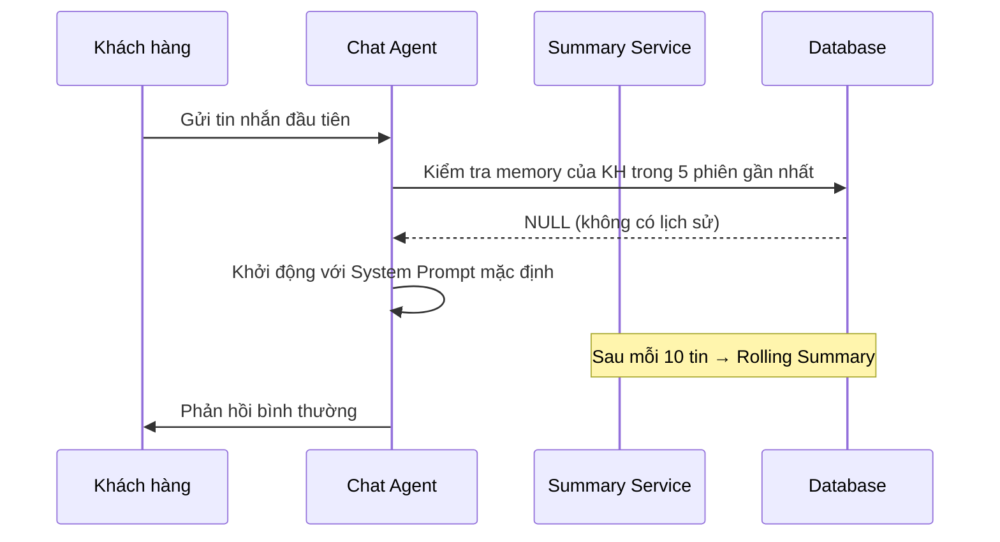
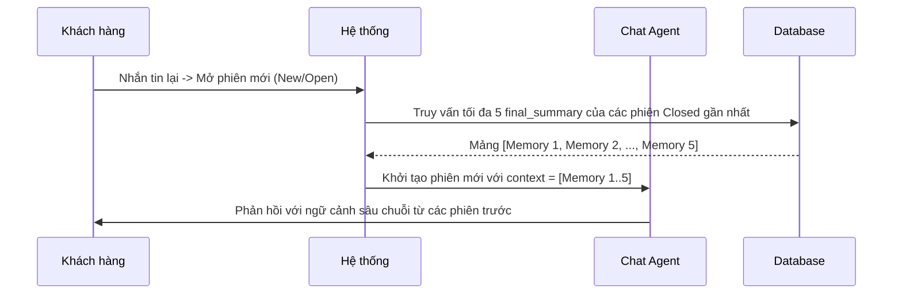
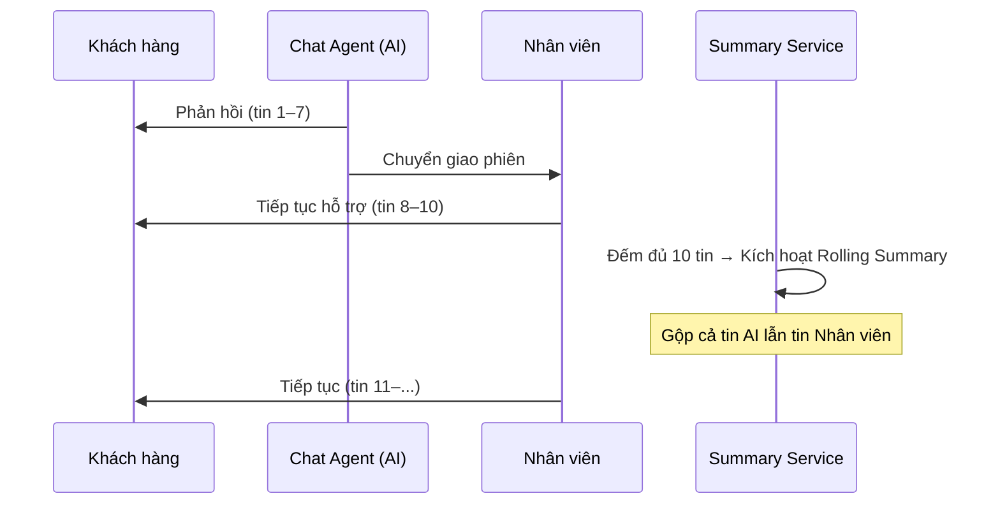

# Nhật ký thay đổi (Revision History)

| Phiên bản | Ngày       | Người cập nhật | Vị trí thay đổi                      | Lý do chi tiết                                                                                                                                                                                                                                         |
| :-------- | :--------- | :------------- | :----------------------------------- | :----------------------------------------------------------------------------------------------------------------------------------------------------------------------------------------------------------------------------------------------------- |
| 1.0.0     | 2026-06-26 | Mira-Miraaa    | Toàn bộ tài liệu                     | Tạo mới tài liệu PRD đặc tả tính năng tự động tóm tắt phiên hội thoại bằng AI                                                                                                                                                                          |
| 2.0.0     | 2026-07-08 | Mira-Miraaa    | Toàn bộ tài liệu                     | Cải tiến kiến trúc tóm tắt: Tách biệt logic phản hồi, bổ sung cơ chế cuốn chiếu ngầm 10 tin và tóm tắt tổng kết đóng phiên bằng Archiver Agent                                                                                                         |
| 2.1.0     | 2026-07-09 | Mira-Miraaa    | Mục 3.3 (mới)                        | Bổ sung mô tả chi tiết các case thường và case đặc biệt để diễn giải logic kế thừa tóm tắt giữa các phiên                                                                                                                                               |
| 2.2.0     | 2026-07-11 | Phương Nguyễn  | Mục 3.3, 4.1                         | Cập nhật cơ chế kế thừa hội thoại: Lưu memory mỗi phiên vào DB và thay đổi thiết kế đọc 5 memory của 5 phiên gần nhất làm ngữ cảnh thay vì chỉ đọc phiên liền trước để AI hiểu khách hàng                                                              |
| 2.3.0     | 2026-07-11 | Phương Nguyễn  | Mục 3.3.1, 3.3.2                     | Gộp case E3 (Reopen) vào T2 (Khách quay lại) do hệ thống luôn tạo phiên mới (Trạng thái New) khi khách nhắn tin lại sau khi phiên cũ đã đóng (bao gồm cả đóng tự động do timeout).                                                                     |
| 2.4.0     | 2026-07-11 | Phương Nguyễn  | Mục 3.1, 4.2                         | Bổ sung thiết kế bảng `session_summaries` và làm rõ cấu trúc JSON của nội dung tóm tắt.                                                                                                                                                                 |
| 2.5.0     | 2026-07-11 | Phương Nguyễn  | Mục 3.1                              | Định dạng lại thiết kế các bảng CSDL (`sessions`, `session_summaries`) sang dạng bảng biểu mô tả chi tiết.                                                                                                                                              |
| 3.0.0     | 2026-07-15 | Phương Nguyễn  | Mục 3.2, 4.2 (mới), 5.2, Mục 7 (mới) | Cải tiến lớn theo US-01 & US-02: (1) Làm rõ trigger độc lập với tác nhân gửi tin cho US-01; (2) Bổ sung luồng chi tiết và đường dẫn UI cho US-02 (Archiver Agent); (3) Tách schema JSON bắt buộc 4 trường riêng cho Archiver vs 6 trường cho Rolling; (4) Bổ sung mục 7 — Acceptance Criteria đầy đủ cho cả hai User Story. |
| 3.1.0     | 2026-07-15 | Phương Nguyễn  | Mục 3.1, 3.2, 4.2                     | Bổ sung đầy đủ bảng mô tả data schema còn thiếu: (1) Mở rộng bảng `sessions` với toàn bộ trường liên quan tính năng; (2) Bổ sung trường tracking LLM (`model_used`, `input_tokens`, `output_tokens`, `cost_estimation`, `summary_status`) vào `session_summaries`; (3) Thêm bảng payload I/O của `SummaryService`; (4) Thêm bảng mô tả Tool `fetch_remaining_data`; (5) Bổ sung bảng schema con cho object sản phẩm trong Rolling Summary. |

---

# 📝 PRD - AI Tự Động Tóm Tắt Phiên Hội Thoại (AI Conversation Summary)

## 1. Hiện Trạng & Vấn Đề Hệ Thống (Context & Problem Statement)

### 1.1. Mô hình hiện tại

Hệ thống GapOne Conversation quản lý các cuộc trò chuyện đa kênh thông qua mô hình quản lý hội thoại đa phiên (**Multi-session**). Mỗi phiên (Session) trải qua các trạng thái tuần tự: **Mở (Open)** $\rightarrow$ **Đang xử lý (Processing)** $\rightarrow$ **Đóng (Closed)**. Mỗi phiên mới được định tuyến cho một Chat Agent (AI hoặc Nhân viên) xử lý.

### 1.2. Cơ chế tóm tắt cũ

Sử dụng cơ chế tóm tắt cuốn chiếu đệ quy (**Recursive Rolling Summary**). Khi đạt điều kiện, hệ thống lấy bản tóm tắt cũ cộng với 10 tin nhắn mới nhất để ghi đè thành bản tóm tắt mới nhằm tối ưu hóa cửa sổ ngữ cảnh (Context Window) cho Chat Agent.

### 1.3. Lỗ hổng & Hạn chế

* **Lỗi logic Trigger**: Hàm tóm tắt hiện đang bị gắn chặt vào sự kiện *"AI phản hồi"*. Khi chuyển giao cuộc trò chuyện cho con người xử lý (quy trình Human-in-the-loop), AI ngừng phản hồi dẫn đến hệ thống ngừng tóm tắt hoàn toàn, gây mất dấu và mất toàn bộ dữ liệu phần sau của cuộc trò chuyện.
* **Hiệu ứng Tam sao thất bản (Information Decay)**: Việc tóm tắt tự do dựa trên bản tóm tắt cũ lặp đi lặp lại qua nhiều vòng đệ quy khiến thông tin ở các tin nhắn đầu tiên bị mờ nhạt dần hoặc biến mất hoàn toàn theo thời gian.

---

## 2. Mục Tiêu Thiết Kế Hệ Thống Mới (System Objectives)

* **Tách biệt logic Tóm tắt (Summarization) ra khỏi logic Phản hồi (Chat/Response)**: Đảm bảo quy trình tóm tắt chạy độc lập và trọn vẹn $100\%$ phiên hội thoại trong mọi kịch bản: AI chat hoàn toàn, Người chat hoàn toàn, hoặc Lai (AI chuyển giao cho Người).
* **Tối ưu hóa hiệu suất và chi phí**: Ngăn chặn tình trạng quá tải hoặc tràn cửa sổ ngữ cảnh (Context Window) của LLM bằng việc quản lý chặt chẽ số lượng tin nhắn gửi đi, chỉ thực hiện tóm tắt khi đủ số lượng tin nhắn cố định.
* **Rút ngắn thời gian xử lý trung bình ($AHT$)**: Giảm thời gian xử lý của Agent khi nhận bàn giao ca hoặc khi khách hàng cũ quay lại ít nhất $30\%$:
  $$
  AHT_{\text{mới}} \le AHT_{\text{cũ}} \times 0.70
  $$

---

## 3. Giải Pháp Kiến Trúc Đề Xuất (Proposed Architecture)

Hệ thống áp dụng kiến trúc **Hướng sự kiện (Event-Driven)** kết hợp giải pháp lai (Hybrid) giữa tầng xử lý dữ liệu và thuật toán **Map-Reduce**.

### 3.1. Thiết Kế Cơ Sở Dữ Liệu (Database Schema)

#### 3.1.1. Bảng Quản lý Phiên (`sessions`)
Các trường liên quan đến tính năng tóm tắt AI trong bảng `sessions` (bao gồm cả trường hiện có và trường **mới cần bổ sung**):

| Tên trường | Kiểu dữ liệu | Ràng buộc | Trạng thái | Mô tả |
| :--- | :--- | :--- | :---: | :--- |
| `id` | `VARCHAR` / `BIGINT` | `PK` | Hiện có | ID duy nhất của phiên hội thoại. |
| `customer_id` | `VARCHAR` | `FK`, Index | Hiện có | Liên kết với ID khách hàng — dùng để truy vấn lịch sử 5 phiên gần nhất. |
| `status` | `ENUM` | Not Null | Hiện có | Trạng thái phiên: `New` / `Open` / `Processing` / `Closed` / `Abandoned`. |
| `created_at` | `TIMESTAMP` | Default `NOW()` | Hiện có | Thời điểm phiên được tạo. |
| `closed_at` | `TIMESTAMP` | Nullable | Hiện có | Thời điểm phiên được đóng (thủ công hoặc auto-timeout). |
| `last_summary` | `TEXT` / `JSON` | Nullable | **🆕 Mới** | Lưu cấu trúc JSON tóm tắt cuốn chiếu gần nhất (Rolling Summary) của phiên đang diễn ra. Được cập nhật mỗi khi `SummaryService` chạy thành công. |
| `last_summarized_message_id` | `VARCHAR` | Nullable | **🆕 Mới** | ID tin nhắn cuối cùng đã được đưa vào bản tóm tắt cuốn chiếu. Tin nhắn có ID lớn hơn giá trị này được coi là **tin nhắn dư lẻ** chưa qua xử lý. |
| `summary_status` | `ENUM` | Default `Pending` | **🆕 Mới** | Trạng thái xử lý tóm tắt cuối của Archiver Agent: `Pending` / `Success` / `Failed`. |

#### 3.1.2. Bảng Lưu Trữ Memory (`session_summaries`)
Bảng **mới** được tạo để lưu trữ độc lập memory (tóm tắt cuối cùng) của từng phiên hội thoại sau khi đóng. Bảng này đóng vai trò quan trọng trong việc cung cấp lịch sử 5 phiên gần nhất cho Chat Agent kế thừa.

| Tên trường | Kiểu dữ liệu | Ràng buộc | Mô tả |
| :--- | :--- | :--- | :--- |
| `id` | `BIGINT` | `PK`, Auto-increment | ID tự tăng của bản ghi memory. |
| `session_id` | `VARCHAR` | `FK`, Unique | Liên kết 1-1 với ID phiên hội thoại trong bảng `sessions`. |
| `customer_id` | `VARCHAR` | `FK`, Index | Liên kết với ID khách hàng — dùng để truy vấn 5 phiên `Closed` gần nhất. |
| `intent` | `VARCHAR(150)` | Nullable | Ý định chính của khách hàng trong phiên (trường `intent` từ JSON Archiver). |
| `resolution_status` | `ENUM` | Nullable | Trạng thái giải quyết: `Order_Created` / `Escalated_to_Human` / `FAQ_Resolved` / `Abandoned` / `Other`. |
| `summary` | `TEXT` | Nullable | Đoạn văn tóm tắt nội dung chính (định dạng Markdown, ≤ 800 ký tự). |
| `next_steps` | `VARCHAR(255)` | Nullable | Các hành động đề xuất tiếp theo sau phiên chat. |
| `raw_json` | `JSON` | Nullable | Toàn bộ JSON thô sinh ra từ LLM để phục vụ đối soát, debug. |
| `summary_status` | `ENUM` | Default `Pending` | Trạng thái xử lý Archiver: `Pending` / `Success` / `Failed`. |
| `model_used` | `VARCHAR(100)` | Nullable | Tên model LLM đã dùng để tạo tóm tắt (VD: `gpt-4o-mini`, `gemini-1.5-flash`). |
| `input_tokens` | `INT` | Nullable | Số token đầu vào đã gửi cho LLM khi tạo tóm tắt — dùng để tính chi phí. |
| `output_tokens` | `INT` | Nullable | Số token đầu ra LLM trả về — dùng để tính chi phí. |
| `cost_estimation` | `DECIMAL(10,6)` | Nullable | Ước tính chi phí API cho lần gọi LLM này (đơn vị: USD). |
| `created_at` | `TIMESTAMP` | Default `NOW()` | Thời điểm bản ghi memory được tạo (khi Archiver Agent hoàn thành). |

> [!NOTE]
> Các trường `model_used`, `input_tokens`, `output_tokens`, `cost_estimation` được điền bởi Archiver Agent sau mỗi lần gọi LLM thành công. Nếu `summary_status = Failed`, các trường này có thể là `NULL`.

### 3.2. Quy Trình Xử Lý Gồm 2 Giai Đoạn (Dual-Phase Workflow)

```mermaid
flowchart TD
    subgraph Phase1 ["US-01 · Giai đoạn 1: Tóm tắt cuốn chiếu ngầm (Background Rolling Summary)"]
        A["Sự kiện: message.created\n(KH / AI / Nhân viên gửi)"] --> B{"Số tin nhắn mới kể từ\nlast_summarized_message_id\n≥ 10 tin?"}
        B -- "Chưa đủ" --> C["Giữ ở dạng thô\nChờ tin nhắn tiếp theo"]
        B -- "Đúng 10 tin" --> D["Kích hoạt SummaryService\nchạy ngầm (async)"]
        D --> E["Gọi LLM:\nSummary_new = LLM(Summary_old + 10 tin mới)"]
        E --> F["Cập nhật last_summary &\nlast_summarized_message_id\nvào bảng sessions"]
    end

    subgraph Phase2 ["US-02 · Giai đoạn 2: Tóm tắt tổng kết khi đóng phiên (Final Archive Summary)"]
        G["Sự kiện: Phiên → Closed\n(Thủ công hoặc Auto-timeout)"] --> H["Kích hoạt Archiver Agent\nchuyên trách"]
        H --> I["Gọi Tool fetch_remaining_data(session_id)"]
        I --> J["Lấy last_summary gần nhất\n+ Tin nhắn dư lẻ sau last_summarized_message_id"]
        J --> K["LLM tổng hợp → JSON 4 trường:\nintent / resolution_status / summary / next_steps"]
        K --> L["Lưu vào session_summaries\n→ emit event summary_created"]
        L --> M["Hiển thị 'Tóm tắt phiên bởi AI'\ntrên Timeline hội thoại"]
        L --> N["Hiển thị tại Panel thông tin:\nCollapse 'Tóm tắt phiên hội thoại bởi AI'"]
    end
```



#### Giai đoạn 1 (US-01) — Tóm tắt cuốn chiếu ngầm (Background Rolling Summary)

* **Kênh áp dụng**: Zalo OA, Facebook Messenger, Telegram, Website Livechat.
* **Trigger độc lập với tác nhân**: Hệ thống lắng nghe sự kiện `message.created` — **không phân biệt** Khách hàng, AI hay Nhân viên gửi. Đây là cải tiến cốt lõi khắc phục lỗi cũ: trigger bị gán vào sự kiện AI phản hồi khiến mất tóm tắt khi Human Handover.
* **Ngưỡng kích hoạt cố định**: Chỉ kích hoạt khi đủ **đúng 10 tin nhắn mới** tính từ `last_summarized_message_id`. Không tóm tắt sớm hơn để tối ưu chi phí token.
* **Thuật toán tích lũy (Incremental)**:
  $$
  Summary_{new} = \text{LLM}(Summary_{old} + \text{10 tin nhắn mới từ last\_summarized\_message\_id})
  $$
* **Không xử lý tin dư lẻ**: Tin nhắn chưa đủ batch 10 tin được **giữ nguyên ở dạng thô**, ủy quyền cho Archiver Agent xử lý khi đóng phiên.

**Bảng mô tả Payload gọi LLM — SummaryService (US-01):**

| Chiều | Tên trường | Kiểu | Mô tả |
| :---: | :--- | :--- | :--- |
| **Đầu vào** | `session_id` | `VARCHAR` | ID phiên hội thoại hiện tại. |
| **Đầu vào** | `last_summary` | `TEXT` / `JSON` / `NULL` | Bản tóm tắt cuốn chiếu gần nhất — `NULL` nếu chưa có lần tóm tắt nào. |
| **Đầu vào** | `last_summarized_message_id` | `VARCHAR` / `NULL` | ID tin nhắn mốc cuối cùng đã được tóm tắt — `NULL` nếu chưa có. |
| **Đầu vào** | `new_messages` | `ARRAY[Object]` | Mảng đúng 10 tin nhắn mới kể từ `last_summarized_message_id`, bao gồm: `message_id`, `sender_type` (`customer`/`ai`/`agent`), `content`, `sent_at`. |
| **Đầu ra** | `last_summary` | `TEXT` / `JSON` | Bản tóm tắt cuốn chiếu mới (JSON 6 trường — xem Mục 4.2.1) — ghi đè vào bảng `sessions`. |
| **Đầu ra** | `last_summarized_message_id` | `VARCHAR` | ID của tin nhắn cuối cùng trong batch 10 tin vừa xử lý — ghi đè vào bảng `sessions`. |

> [!NOTE]
> `SummaryService` chạy **bất đồng bộ (async)** — không chặn luồng chat chính. Nếu gặp lỗi API LLM, hệ thống ghi log lỗi và giữ nguyên `last_summary` cũ; phiên chat tiếp tục bình thường.

#### Giai đoạn 2 (US-02) — Tóm tắt tổng kết khi đóng phiên (Final Archive Summary)

* **Kênh áp dụng**: Zalo OA, Facebook Messenger, Telegram, Website Livechat.
* **Đường dẫn xem kết quả (Agent)**: `Hội thoại` → `Timeline` và `Panel thông tin cuộc hội thoại` → Collapse **"Tóm tắt phiên hội thoại bởi AI"**.
* **Trigger**: Khi nhân viên đóng thủ công **hoặc** hệ thống auto-close (timeout) → Session chuyển sang trạng thái `Closed`.
* **Hành động (Tool Calling)**: Hệ thống kích hoạt **Archiver Agent** chuyên trách và gọi Tool `fetch_remaining_data(session_id)` để lấy ra:
  1. Bản tóm tắt gần nhất `last_summary` trong DB.
  2. Toàn bộ các tin nhắn **dư lẻ** còn sót lại từ sau `last_summarized_message_id` đến cuối phiên.
* **Đầu ra**: Archiver Agent tổng hợp hai nguồn thông tin thành bản tóm tắt cuối cùng toàn diện (JSON 4 trường bắt buộc — xem Mục 4.2.2), lưu vào bảng `session_summaries`, emit event `summary_created`.
* **Hiển thị kết quả**:
  1. Thẻ **"Tóm tắt phiên bởi AI lúc hh:mm"** xuất hiện trực tiếp trên Timeline hội thoại (trong vòng tối đa **5 giây** sau khi phiên đóng).
  2. Nội dung tóm tắt đầy đủ 4 mục có cấu trúc tại Panel thông tin → Collapse/Expand **"Tóm tắt phiên hội thoại bởi AI"**.

**Bảng mô tả Tool `fetch_remaining_data` — Archiver Agent (US-02):**

| Chiều | Tên trường | Kiểu | Mô tả |
| :---: | :--- | :--- | :--- |
| **Input** | `session_id` | `VARCHAR` | ID phiên hội thoại vừa được đóng. |
| **Output** | `last_summary` | `TEXT` / `JSON` / `NULL` | Bản tóm tắt cuốn chiếu cuối cùng từ `sessions.last_summary` — `NULL` nếu Rolling chưa chạy lần nào. |
| **Output** | `last_summarized_message_id` | `VARCHAR` / `NULL` | ID mốc tin nhắn cuối đã tóm tắt — dùng để xác định điểm bắt đầu lấy tin nhắn dư lẻ. |
| **Output** | `remaining_messages` | `ARRAY[Object]` | Mảng toàn bộ tin nhắn dư lẻ từ sau `last_summarized_message_id` đến cuối phiên. Mỗi phần tử gồm: `message_id`, `sender_type`, `content`, `sent_at`. Trả về mảng rỗng `[]` nếu không có tin dư lẻ. |

> [!IMPORTANT]
> Nội dung tóm tắt **tuyệt đối không** được gửi sang kênh của khách hàng (Zalo OA / FB Messenger / Telegram / Website). Chỉ hiển thị trong CRM nội bộ.

### 3.3. Diễn Giải Logic Kế Thừa Tóm Tắt Giữa Các Phiên (Cross-Session Inheritance Logic)

Khi một khách hàng quay lại và mở phiên mới, hệ thống cần xác định **điểm khởi đầu ngữ cảnh** (`initial_context`) cho Chat Agent và Summary Service của phiên đó. Mục này mô tả toàn bộ các kịch bản có thể xảy ra.

> [!IMPORTANT]
> **Nguyên tắc cốt lõi:** Tóm tắt (memory) của mỗi phiên sau khi đóng sẽ được lưu trữ độc lập vào Database (`session_summaries`). Khi khởi tạo phiên mới, hệ thống sẽ truy xuất **5 memory của 5 phiên gần nhất** đã đóng thành công của cùng khách hàng để làm ngữ cảnh. Điều này giúp AI có cái nhìn toàn diện về lịch sử tương tác và hiểu khách hàng hơn.

---

#### 3.3.1. Các Case Thường (Happy Path)

##### Case T1 – Phiên Đầu Tiên Của Khách Hàng (Cold Start)

> **Điều kiện:** Khách hàng liên hệ lần đầu, không có lịch sử phiên nào trong DB.

* **Dữ liệu kế thừa:** Không có. `last_summary = NULL`, `last_summarized_message_id = NULL`.
* **Hành vi:**
  * Chat Agent khởi động với **ngữ cảnh trống** — chỉ dùng System Prompt mặc định.
  * Summary Service bắt đầu đếm từ tin nhắn đầu tiên của phiên.
* **Kết quả khi đóng phiên:** Archiver Agent tạo bản tóm tắt đầy đủ (memory) và lưu vào `session_summaries`. Đây là bản tóm tắt gốc, không có tiền tố kế thừa.



---

##### Case T2 – Khách Hàng Quay Lại (Mở Phiên Mới), Đã Có Lịch Sử Giao Dịch Trước Đó

> **Điều kiện:** Khách hàng đã có ít nhất một phiên trước được đóng (dù đóng thủ công hoàn chỉnh hay hệ thống tự động đóng do timeout). Lần này khách nhắn tin lại, hệ thống sẽ tạo một phiên hoàn toàn mới với trạng thái **New (Open)** từ đầu. Không có khái niệm "Reopen" phiên cũ.

* **Dữ liệu kế thừa:** Lấy danh sách **tối đa 5 `final_summary` (memories)** của các phiên gần nhất có trạng thái `Closed` của cùng `customer_id`.
* **Hành vi:**
  * Hệ thống truy xuất và tổng hợp 5 memory gần nhất, nạp vào làm ngữ cảnh khởi tạo (context) cho phiên mới.
  * Chat Agent nhận được ngữ cảnh đa phiên, giúp hiểu sâu hơn về khách hàng và phản hồi chính xác mà không cần khách hàng lặp lại thông tin.
  * Summary Service đếm từ tin nhắn **đầu tiên của phiên mới**. Tóm tắt cuốn chiếu `last_summary` và memory của phiên mới này sẽ được hoạt động độc lập, không ghi đè vào các memory của phiên trước.
* **Kết quả:** Agent phục vụ khách hàng quay lại nhanh hơn nhờ ngữ cảnh phong phú từ nhiều phiên trước. Góp phần đạt mục tiêu giảm $AHT \ge 30\%$.



---

##### Case T3 – Phiên Nhiều Tin Nhắn, Tóm Tắt Cuốn Chiếu Kích Hoạt Nhiều Lần

> **Điều kiện:** Phiên có trên 30 tin nhắn, tóm tắt cuốn chiếu đã chạy nhiều lần trong phiên.

* **Hành vi:**
  * Mỗi lần đủ 10 tin mới: `Summary Service` gọi LLM để cập nhật `last_summary` và `last_summarized_message_id`.
  * Sau nhiều vòng, `last_summary` là kết quả tóm tắt tích lũy của toàn bộ phần đã xử lý.
  * Khi phiên đóng: `Archiver Agent` chỉ cần xử lý thêm phần **tin nhắn dư lẻ** còn sót lại (thường dưới 10 tin), gộp với `last_summary` cuối cùng để ra bản tóm tắt hoàn chỉnh.
* **Hiệu quả:** Chi phí xử lý tại bước đóng phiên được tối thiểu hóa — Archiver không phải đọc lại toàn bộ hội thoại dài.

  $$
  Summary_{\text{final}} = \text{LLM}(Summary_{\text{last\_rolling}} + \text{tin nhắn dư lẻ})
  $$

---

##### Case T4 – Phiên Ít Tin Nhắn (Dưới 10 Tin), Không Có Tóm Tắt Cuốn Chiếu

> **Điều kiện:** Phiên kết thúc sớm trước khi đủ 10 tin nhắn.

* **Hành vi:**
  * Summary Service không kích hoạt lần nào trong phiên (chưa đủ điều kiện trigger).
  * `last_summary` (của riêng phiên này) ban đầu là `NULL`.
  * Khi phiên đóng: `Archiver Agent` lấy toàn bộ tin nhắn của phiên (dư lẻ 100%) để tạo bản tóm tắt cuối và lưu thành một memory mới (không gộp đè lên memory cũ).
* **Lưu ý:** Archiver luôn được kích hoạt khi đóng phiên, bất kể số lượng tin nhắn có đủ 10 hay không.

---

#### 3.3.2. Các Case Đặc Biệt (Edge Cases)

##### Case E1 – Chuyển Giao AI → Nhân Viên (Human Handover) Trong Cùng Phiên

> **Điều kiện:** Agent AI đang phục vụ, gặp yêu cầu phức tạp, chuyển giao cho nhân viên người thật tiếp tục trong cùng session.

* **Vấn đề cũ (đã khắc phục):** Hệ thống cũ dừng tóm tắt vì trigger gắn với sự kiện AI phản hồi.
* **Hành vi mới:**
  * Trigger của Summary Service là **sự kiện thêm tin nhắn vào DB** (độc lập với tác nhân gửi — KH, AI hay Nhân viên).
  * Sau khi chuyển giao, nhân viên tiếp tục chat → các tin nhắn vẫn được đếm tích lũy.
  * Khi đủ 10 tin mới kể từ `last_summarized_message_id`, Summary Service vẫn kích hoạt bình thường.
* **Kết quả:** Phần hội thoại do nhân viên xử lý **không bị mất** trong bản tóm tắt cuối.



---

##### Case E2 – Phiên Bị Timeout / Tự Động Đóng Bởi Hệ Thống

> **Điều kiện:** Phiên không có hoạt động sau khoảng thời gian cấu hình (ví dụ: 30 phút không có tin nhắn mới), hệ thống tự động chuyển trạng thái sang `Closed`.

* **Hành vi:** Sự kiện đóng phiên (dù từ hệ thống hay nhân viên) đều kích hoạt `Archiver Agent` theo cùng một luồng.
* **Trường hợp con:**
  * Nếu có `last_summary` (cuốn chiếu của phiên hiện tại) và có tin dư lẻ → Archiver gộp và lưu.
  * Nếu có `last_summary` nhưng không có tin dư lẻ → Archiver dùng `last_summary` trực tiếp làm bản tóm tắt cuối.
  * Nếu cả hai đều `NULL` (phiên không có tin nhắn nào, ví dụ bot greeting bị timeout) → Archiver bỏ qua, không tạo bản tóm tắt (memory), phiên được đánh dấu `status = Abandoned`.

> [!NOTE]
> Phiên `Abandoned` sẽ không được lưu memory. Hệ thống vẫn chỉ truy xuất 5 memory của 5 phiên `Closed` hợp lệ gần nhất.

---

##### Case E3 – Archiver Agent Gặp Lỗi Khi Đóng Phiên

> **Điều kiện:** LLM hoặc hệ thống gặp lỗi trong quá trình Archiver Agent xử lý (timeout API, lỗi mạng, v.v.).

* **Hành vi (Retry & Fallback):**
  * Hệ thống tự động thử lại (`retry`) tối đa **3 lần** với khoảng cách lũy tiến (exponential backoff: 5s, 15s, 45s).
  * Nếu cả 3 lần đều thất bại: Phiên được đánh dấu `summary_status = Failed`. Bản tóm tắt cuốn chiếu cuối (`last_summary`) vẫn được giữ nguyên trong bảng `sessions` như là dữ liệu dự phòng.
  * Hệ thống sinh cảnh báo (alert) cho đội vận hành để xử lý thủ công nếu cần.
* **Kế thừa phiên sau:** Nếu phiên kế tiếp của KH được mở trong khi `summary_status = Failed`, hệ thống dùng `last_summary` (bản cuốn chiếu cuối) thay thế cho `final_summary` (bản Archiver) để làm ngữ cảnh kế thừa, kèm flag `context_source = rolling` để theo dõi.

  $$
  \text{context\_source} = \begin{cases} \text{final\_summary} & \text{nếu } summary\_status = \text{Success} \\ \text{last\_summary (rolling)} & \text{nếu } summary\_status = \text{Failed} \\ \text{NULL (cold start)} & \text{nếu không có phiên trước hợp lệ} \end{cases}
  $$

---

##### Case E4 – Phiên Mới Kế Thừa Từ Lịch Sử Có Phiên Lỗi `summary_status = Failed`

> **Điều kiện:** Khách hàng quay lại, hệ thống truy xuất 5 phiên gần nhất nhưng có phiên bị lỗi Archiver, không có `final_summary` hoàn chỉnh.

* **Chiến lược lấy memory cho phiên bị lỗi trong danh sách 5 phiên:**
  1. **Ưu tiên 1:** Dùng `last_summary` (bản rolling cuối cùng) của phiên đó nếu có, ghi chú nguồn là `rolling`.
  2. **Ưu tiên 2:** Nếu không có dữ liệu nào từ phiên đó, bỏ qua phiên đó và tiếp tục lấy các phiên cũ hơn để đủ số lượng 5 (nếu có).

---

#### 3.3.3. Bảng Tổng Hợp Các Case

| Case | Tên | Phiên trước | Hành vi kế thừa | Trigger Archiver? |
| :--- | :--- | :--- | :--- | :---: |
| **T1** | Cold Start | Không có | Context rỗng | ✅ |
| **T2** | Khách quay lại (Mở phiên mới) | Có phiên Closed (Thủ công hoặc Timeout) | Nạp mảng tối đa 5 `final_summary` (memories) gần nhất | ✅ |
| **T3** | Phiên dài, Rolling nhiều lần | Bất kỳ | Rolling chạy nhiều vòng, Archiver chỉ xử lý phần dư | ✅ |
| **T4** | Phiên ngắn < 10 tin | Bất kỳ | Rolling không chạy, Archiver xử lý 100% tin nhắn thành memory | ✅ |
| **E1** | Chuyển giao AI → Nhân viên | Bất kỳ | Trigger không bị gián đoạn, đếm tiếp bình thường | ✅ |
| **E2** | Timeout / Hệ thống tự đóng | Bất kỳ | Archiver chạy bình thường; nếu 0 tin → `Abandoned` (không lưu memory) | ⚠️ Điều kiện |
| **E3** | Archiver lỗi khi đóng phiên | Bất kỳ | Retry 3 lần, fallback lưu `last_summary` (rolling) làm memory | ❌ Thất bại |
| **E4** | Kế thừa khi có phiên Failed | Có phiên Failed | Dùng `last_summary` (rolling) cho phiên lỗi, hoặc bỏ qua lấy phiên cũ hơn | ✅ |

---

## 4. Đặc Tả Kỹ Thuật Cho AI Agent & Prompting (Technical Specifications)

### 4.1. Chiến Lược Phân Tách Mô Hình (Model Splitting)

Để tối ưu hóa hiệu năng phản hồi và chi phí vận hành, hệ thống phân tách tác vụ cho hai nhóm model khác nhau:

* **Chat Agent (Mô hình hội thoại)**: Sử dụng các Model thông minh bậc nhất, có độ trễ thấp và khả năng thấu cảm tốt (ví dụ: `gpt-4o`, `claude-3-5-sonnet`, `gemini-1.5-pro`). Mô hình này **đọc 5 memory của 5 phiên gần nhất** cùng với hội thoại hiện tại để làm ngữ cảnh phản hồi, giúp cá nhân hóa và thấu hiểu sâu sắc nhu cầu khách hàng, tối ưu token bằng cách không gửi toàn bộ dữ liệu lịch sử thô.
* **Summary Service & Archiver Agent (Mô hình tóm tắt)**: Sử dụng các Model tối ưu chi phí xử lý lượng token lớn (ví dụ: `gemini-1.5-flash`, `gpt-4o-mini`). Mô hình này chỉ làm nhiệm vụ ghi/cập nhật dữ liệu tóm tắt chạy ngầm.

### 4.2. Định Dạng Cấu Trúc Tóm Tắt (Structured Prompting)

Để giải quyết triệt để lỗi *"mất trí nhớ"* hoặc *"tam sao thất bản"*, cấu trúc đầu ra của hàm tóm tắt bắt buộc phải được định dạng theo schema có cấu trúc (JSON / Structured Context) nhằm duy trì các thông tin cốt lõi xuyên suốt phiên.

> [!NOTE]
> Hai giai đoạn sử dụng hai schema JSON khác nhau phù hợp với mục tiêu của từng giai đoạn:
> - **Giai đoạn 1 (Rolling Summary)**: Schema mở rộng 6 trường — tập trung vào ngữ cảnh phong phú để Chat Agent phản hồi chính xác.
> - **Giai đoạn 2 (Archiver Agent)**: Schema bắt buộc 4 trường — tập trung vào bản tóm tắt cuối ngắn gọn, súc tích để Agent/Admin bàn giao nhanh.

#### 4.2.1. Schema Rolling Summary — Giai đoạn 1 (6 trường)

| Trường | Kiểu | Ràng buộc | Mô tả |
| :--- | :--- | :--- | :--- |
| `intent` | `VARCHAR(150)` | Bắt buộc | Ý định chính của khách hàng (VD: "Hỏi giá quần Jean", "Khiếu nại giao chậm") |
| `resolution_status` | `ENUM` | Bắt buộc | Phân loại: `Order_Created` / `Escalated_to_Human` / `FAQ_Resolved` / `Abandoned` / `Other` |
| `summary` | `TEXT` | ≤ 800 ký tự, Markdown | Diễn biến chính: sản phẩm quan tâm, vấn đề KH, thỏa thuận xử lý & giao hàng |
| `interested_products` | `ARRAY[Object]` | Nullable | Danh sách sản phẩm KH quan tâm. Mỗi phần tử là một object — xem schema con bên dưới. |
| `unliked_products` | `ARRAY[Object]` | Nullable | Danh sách sản phẩm KH không thích. Mỗi phần tử là một object — xem schema con bên dưới. |
| `next_steps` | `VARCHAR(255)` | Bắt buộc | Hành động gợi ý tiếp theo (VD: "Gửi hàng bảo hành", "Không có") |

**Schema con cho mỗi Object trong `interested_products` và `unliked_products`:**

| Tên trường | Kiểu | Bắt buộc | Mô tả |
| :--- | :--- | :---: | :--- |
| `product_name` | `STRING` | ✅ | Tên sản phẩm. VD: `"Quần Jean Slim"`. |
| `product_id` | `STRING` | ❌ | Mã sản phẩm trong hệ thống (nếu có). VD: `"SPX001"`. |
| `size` | `STRING` | ❌ | Size khách hàng quan tâm. VD: `"M"`, `"L"`, `"XL"`. |
| `color` | `STRING` | ❌ | Màu sắc khách hàng quan tâm. VD: `"Đen"`, `"Xanh Navy"`. |
| `link_product` | `STRING` (URL) | ❌ | Đường dẫn đến trang sản phẩm (nếu có). VD: `"https://example.com/spx001"`. |

**Ví dụ JSON Output — Rolling Summary:**
```json
{
  "intent": "Hỏi thông tin và mua sản phẩm X",
  "resolution_status": "Order_Created",
  "summary": "Khách hàng quan tâm sản phẩm X size M màu đen. Đã tư vấn chính sách đổi trả. Khách chốt đơn và cung cấp địa chỉ nhận hàng.",
  "interested_products": [
    {
      "product_name": "Sản phẩm X",
      "product_id": "SPX001",
      "size": "M",
      "color": "Đen",
      "link_product": "https://example.com/spx001"
    }
  ],
  "unliked_products": [
    {
      "product_name": "Sản phẩm Y",
      "product_id": "SPY001",
      "size": "L",
      "color": "Xanh",
      "link_product": "https://example.com/spy001"
    }
  ],
  "next_steps": "Gửi thông tin đơn hàng cho bộ phận kho để đóng gói và giao hàng."
}
```

#### 4.2.2. Schema Archiver Agent — Giai đoạn 2 (4 trường bắt buộc)

Đây là **schema chuẩn bắt buộc** dành riêng cho bản tóm tắt cuối cùng do Archiver Agent tạo ra khi đóng phiên. Schema được giữ gọn ở 4 trường cốt lõi để Agent/Admin nắm bắt nhanh mà không cần đọc lại toàn bộ hội thoại.

| Trường | Kiểu | Ràng buộc | Mô tả |
| :--- | :--- | :--- | :--- |
| `intent` | `VARCHAR(150)` | **Bắt buộc** | Ý định chính của khách hàng trong toàn bộ phiên (VD: "Hỏi giá quần Jean") |
| `resolution_status` | `ENUM` | **Bắt buộc** | `Order_Created` / `Escalated_to_Human` / `FAQ_Resolved` / `Abandoned` / `Other` |
| `summary` | `TEXT` | **Bắt buộc**, ≤ 800 ký tự, Markdown | Tóm tắt diễn biến chính: sản phẩm quan tâm, thỏa thuận, vấn đề của khách |
| `next_steps` | `VARCHAR(255)` | **Bắt buộc** | Hành động tiếp theo gợi ý (VD: "Gửi hàng bảo hành" hoặc "Không có") |

> [!WARNING]
> **Giới hạn `summary` ≤ 800 ký tự** (khác với Rolling Summary ≤ 800 ký tự). Archiver Agent phải đảm bảo bản tóm tắt ngắn gọn, súc tích và không vượt quá giới hạn này.

**Ví dụ JSON Output — Archiver Agent:**
```json
{
  "intent": "Hỏi thông tin và mua sản phẩm X",
  "resolution_status": "Order_Created",
  "summary": "Khách hàng quan tâm sản phẩm X size M màu đen. Đã tư vấn chính sách đổi trả. Khách chốt đơn và cung cấp địa chỉ nhận hàng.",
  "next_steps": "Gửi thông tin đơn hàng cho bộ phận kho để đóng gói và giao hàng."
}
```

**Cơ chế fallback khi LLM trả về JSON sai schema:**

Nếu LLM trả về JSON không đúng cấu trúc 4 trường → Worker tự động fallback parse text thô, bản tóm tắt vẫn được hiển thị dưới dạng text thường thay vì để trống.
```

---

## 5. Thiết Kế Giao Diện & Cấu Hình (UI/UX Mockups & Settings)

### 5.1. Màn hình Cấu hình AI Tóm Tắt (Admin Dashboard)

* Không có giao diện cấu hình AI Tóm Tắt (V1). AI Tóm Tắt sẽ được tích hợp sẵn vào hệ thống, không hiển thị cấu hình với Admin hay User.

### 5.2. Giao diện hiển thị Timeline Chat của Agent (Agent Interface)

**Đường dẫn xem kết quả:** `Hội thoại` → `Timeline` và `Panel thông tin cuộc hội thoại`.

* **Timeline hội thoại**: Hiển thị thẻ thông báo **"Tóm tắt phiên bởi AI lúc hh:mm"** trực tiếp trên Timeline hội thoại ngay tại thời điểm phiên được đóng (trong vòng tối đa **5 giây**).
* **Panel thông tin cuộc hội thoại**: Bổ sung thêm một Collapse/Expand có tiêu đề **"Tóm tắt phiên hội thoại bởi AI"**. Click mở rộng → Hiển thị đầy đủ nội dung tóm tắt AI với 4 mục có cấu trúc:
    * **Ý định** (Intent)
    * **Trạng thái giải quyết** (Resolution Status)
    * **Nội dung tóm tắt** (Summary — định dạng Markdown, ≤ 800 ký tự)
    * **Hành động tiếp theo** (Next Steps)
* **Giới hạn phạm vi hiển thị**: Chỉ hiển thị trong CRM nội bộ phục vụ bàn giao và quản trị. **Tuyệt đối không** gửi sang kênh của khách hàng (Zalo OA, Facebook Messenger, Telegram, Website Livechat).
* **Quyền chỉnh sửa**: V1 chỉ hỗ trợ read-only. Agent không thể chỉnh sửa nội dung tóm tắt AI.

---

## 6. Yêu Cầu Phi Chức Năng (Non-Functional Requirements)

* **Hiệu năng (Latency)**: Thời gian từ khi phiên đóng đến khi nội dung tóm tắt hiển thị tại panel không quá $5$ giây (áp dụng cho $95\%$ số phiên).
* **Độ tin cậy (Accuracy)**:
  * Tỷ lệ tóm tắt thành công ($SR$):
    $$
    SR = \frac{\text{Số phiên tóm tắt thành công}}{\text{Tổng số phiên đủ điều kiện tóm tắt}} \ge 98\%
    $$
  * Không bịa đặt thông tin (Hallucination) liên quan đến mã đơn hàng, giá tiền, số điện thoại hoặc địa chỉ khách hàng.
* **Bảo mật**: API Key của các nhà cung cấp AI phải được mã hóa và lưu trữ an toàn ở phía Backend.

> [!IMPORTANT]
> Tài liệu PRD này là cơ sở để phát triển các tính năng chi tiết trong tài liệu SRS liên quan (tham chiếu tại [srs-conversation-summary.md](<file:///F:/Gapone%20Conversation/Docs/AI_Chatbot/srs-conversation-summary.md>)). Mọi thay đổi về mặt nghiệp vụ cần được PO phê duyệt trước khi cập nhật vào hệ thống.

---

## 7. Acceptance Criteria (User Story Map)

### US-01 · Tóm Tắt Cuốn Chiếu Ngầm Trong Phiên (Background Rolling Summary)

#### Happy Path

| Mã AC | Mô tả | Kết quả kỳ vọng |
| :--- | :--- | :--- |
| **AC-01** | Phiên có đúng 10 tin nhắn mới kể từ `last_summarized_message_id` | `SummaryService` tự động kích hoạt (async), gọi LLM thành công, cập nhật `last_summary` và `last_summarized_message_id` vào bảng `sessions` |
| **AC-02** | Phiên có 25 tin nhắn | `SummaryService` được kích hoạt **2 lần** (tại tin thứ 10 và tin thứ 20); `last_summarized_message_id` sau mỗi lần phản ánh đúng ID tin nhắn thứ 10 và thứ 20 |
| **AC-03** | Nhân viên tiếp nhận Human Handover và tiếp tục chat | Các tin nhắn từ Nhân viên vẫn được đếm tích lũy; khi đủ 10 tin, `SummaryService` vẫn kích hoạt bình thường |
| **AC-04** | Kiểm tra DB sau mỗi lần `SummaryService` chạy | Bảng `sessions`: trường `last_summary` và `last_summarized_message_id` được cập nhật đúng |

#### Edge Cases

| Mã AC | Mô tả | Kết quả kỳ vọng |
| :--- | :--- | :--- |
| **AC-05** | Phiên chỉ có 7 tin nhắn (chưa đủ 10) từ lúc mở đến khi đóng | `SummaryService` **không** được kích hoạt lần nào; `last_summary` và `last_summarized_message_id` giữ nguyên giá trị kế thừa từ phiên trước (hoặc `NULL` nếu là phiên đầu tiên) |
| **AC-06** | `SummaryService` gặp lỗi API LLM | Ghi log lỗi; **không crash** hệ thống; `last_summary` giữ nguyên bản cũ (không cập nhật); phiên chat tiếp tục hoạt động bình thường |

#### Out of Scope

* Tóm tắt cuốn chiếu cho các phiên đang ở trạng thái `Open` nhưng không có hoạt động — xử lý bởi US-02 (Archiver Agent khi đóng phiên).
* Hiển thị kết quả Rolling Summary lên Timeline — chỉ lưu ngầm vào DB; Timeline chỉ hiển thị kết quả của Archiver Agent.

---

### US-02 · Tóm Tắt Tổng Kết Khi Đóng Phiên (Final Archive Summary)

#### Happy Path

| Mã AC | Mô tả | Kết quả kỳ vọng |
| :--- | :--- | :--- |
| **AC-01** | Nhân viên hoặc hệ thống tự động đóng phiên có ≥ 1 tin nhắn thực tế | Sau tối đa **5 giây**: Timeline chat hiển thị **"Tóm tắt phiên bởi AI lúc hh:mm"** |
| **AC-02** | Mở Panel thông tin cuộc hội thoại | Hiển thị Collapse **"Tóm tắt phiên hội thoại bởi AI"**; click mở rộng → hiển thị đúng 4 mục có cấu trúc: `intent`, `resolution_status`, `summary`, `next_steps` |
| **AC-03** | Hệ thống auto-close phiên sau timeout | Archiver Agent vẫn được kích hoạt và lưu thành công vào `session_summaries` |
| **AC-04** | Phiên dài > 30 tin nhắn (Rolling đã chạy nhiều lần) | Archiver chỉ xử lý phần **dư lẻ** kết hợp với bản `last_summary` cuối của Rolling, **không đọc lại** toàn bộ lịch sử tin nhắn thô; bản tóm tắt cuối vẫn phản ánh đầy đủ nội dung phiên |
| **AC-05** | Kiểm tra DB sau khi Archiver chạy | Bảng `session_summaries`: các trường `summary_content`, `intent_detected`, `resolution_status`, `model_used`, `input_tokens`, `output_tokens`, `cost_estimation` đều có giá trị hợp lệ |
| **AC-06** | Tóm tắt được tạo thành công | Nội dung tóm tắt **không** được gửi sang kênh của khách hàng (Zalo OA / FB Messenger / Telegram / Website) |

#### Edge Cases

| Mã AC | Mô tả | Kết quả kỳ vọng |
| :--- | :--- | :--- |
| **AC-07** | Lỗi API LLM khi Archiver xử lý | Hệ thống **thử lại 3 lần** (5s → 15s → 45s); vẫn thất bại → `summary_status = Failed`; sự kiện lỗi hiển thị trên Timeline; gửi cảnh báo đến đội vận hành; **hệ thống không bị treo hay crash** |
| **AC-08** | LLM trả về JSON sai schema 4 trường | Worker fallback parse text thô; bản tóm tắt vẫn hiển thị dưới dạng text thường thay vì để trống |

#### Out of Scope

* Giao diện cấu hình AI Tóm Tắt cho Admin — tính năng được tích hợp sẵn vào hệ thống, không hiển thị cấu hình với Admin hay User (V1).
* Agent chỉnh sửa nội dung tóm tắt AI → V1 chỉ hỗ trợ read-only.
* Tóm tắt đa ngôn ngữ (đầu ra linh hoạt) → xem xét ở Phase 2.
* Phân tích Sentiment (Angry/Happy/Neutral) → Phase 2.
