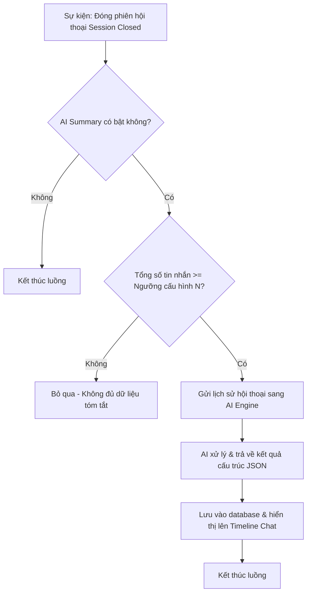

# Nhật ký thay đổi (Revision History)

| Phiên bản | Ngày | Người cập nhật | Vị trí thay đổi | Lý do chi tiết |
| :--- | :--- | :--- | :--- | :--- |
| 1.0.0 | 2026-06-26 | Mira-Miraaa | Toàn bộ tài liệu | Tạo mới tài liệu PRD đặc tả tính năng tự động tóm tắt phiên hội thoại bằng AI |

---

# 📝 PRD - AI Tự Động Tóm Tắt Phiên Hội Thoại (AI Conversation Summary)

## 1. Tổng quan & Mục tiêu sản phẩm

### 1.1. User Story
> **Là PO (Product Owner)**, tôi muốn hệ thống AI tự động tóm tắt nội dung sau khi kết thúc mỗi phiên hội thoại (Session), giúp nhân viên chăm sóc khách hàng (CSKH) nhanh chóng nắm bắt lịch sử tương tác cũ mà không cần đọc lại toàn bộ tin nhắn thô, từ đó nâng cao hiệu suất vận hành và tối ưu hóa trải nghiệm khách hàng.

### 1.2. Hiện trạng & Vấn đề (Problem Statement)
Hệ thống GapOne Conversation hiện đang quản lý các cuộc trò chuyện đa kênh (Zalo OA, Facebook, Telegram) thông qua các **Phiên hội thoại (Sessions)**. Khi một phiên kết thúc (do Agent chủ động đóng hoặc hệ thống tự động đóng do hết thời gian chờ), toàn bộ ngữ cảnh sẽ bị đóng lại.
*   **Mất thời gian**: Khi khách hàng quay lại hoặc khi bàn giao ca giữa các Agent, nhân viên phải đọc lại hàng chục tin nhắn cũ để hiểu bối cảnh.
*   **Thiếu dữ liệu phân tích**: Quản lý (Manager) không có cách nào thống kê nhanh khách hàng nhắn tin chủ yếu vì mục đích gì (Ý định - Intent) và kết quả giải quyết cuối cùng ra sao (Trạng thái - Resolution Status).

### 1.3. Mục tiêu sản phẩm (Objectives)
*   **Tối ưu hiệu suất CSKH**: Giảm thời gian xử lý trung bình ($AHT$) khi nhận bàn giao ca hoặc khi khách hàng quay lại ít nhất $30\%$:
    $$AHT_{\text{mới}} \le AHT_{\text{cũ}} \times 0.70$$
*   **Hỗ trợ bộ nhớ AI**: Tạo dữ liệu tóm tắt đầu vào chất lượng để làm ngữ cảnh (Context) cho tính năng **AI Conversation Memory (Bộ nhớ hội thoại)** mà không làm loãng Token.
*   **Chuẩn hóa dữ liệu phân tích**: Tự động phân loại Intent và Resolution Status phục vụ báo cáo quản trị.

---

## 2. Đối tượng người dùng & Hành trình (User Personas & Journey)

*   **Admin/Manager (Người quản lý)**: Cấu hình kích hoạt tính năng, thiết lập API Key, Model AI (ví dụ: `gpt-4o-mini`, `gemini-2.5-flash`), ngưỡng tin nhắn tối thiểu và Prompt tóm tắt.
*   **Agent (Nhân viên CSKH)**: Trực tiếp xem thẻ tóm tắt (Summary Card) hiển thị trên timeline chat hoặc trong tab Lịch sử phiên hội thoại để nắm bắt nhanh yêu cầu của khách hàng.

---

## 3. Đặc tả yêu cầu chức năng (Functional Requirements)

### 3.1. Luồng xử lý nghiệp vụ (Business Flow)

### 3.2. Yêu cầu chi tiết các tính năng

#### FR-1: Cơ chế kích hoạt tự động (Automatic Trigger)
*   Hệ thống lắng nghe sự kiện đóng phiên (`Session Closed`). Ngay khi trạng thái session chuyển sang `Closed` (bất kể đóng bằng tay bởi Agent hay tự động đóng do timeout), một tác vụ bất đồng bộ (Background Job) sẽ được kích hoạt để thực hiện tóm tắt.

#### FR-2: Bộ lọc điều kiện (Trigger Constraints)
*   Hệ thống chỉ gửi lệnh tóm tắt sang AI nếu phiên hội thoại thỏa mãn:
    $$\text{Tổng số tin nhắn} \ge N_{\text{ngưỡng}} \quad (\text{Mặc định } N_{\text{ngưỡng}} = 3)$$
*   Bỏ qua các phiên chỉ chứa tin nhắn hệ thống tự động (Auto-messages) mà không có tương tác thực tế từ khách hàng.

#### FR-3: Cấu trúc thông tin đầu ra của AI (Structured Output Schema)
AI Engine bắt buộc phải trả về dữ liệu dưới dạng JSON với cấu trúc sau:
1.  **Intent (Ý định)**: Chuỗi ký tự (dưới 5 từ) mô tả mục đích chính (Ví dụ: "Hỏi giá quần Jean", "Khiếu nại giao chậm").
2.  **Resolution Status (Trạng thái giải quyết)**: Phân loại thuộc nhóm: `Order_Created` (Đã tạo đơn), `Escalated_to_Human` (Chuyển nhân viên), `FAQ_Resolved` (Giải đáp FAQ), `Abandoned` (Khách im lặng), `Other` (Khác).
3.  **Summary (Tóm tắt nội dung)**: Đoạn văn ngắn (dưới 150 từ, định dạng Markdown) tóm tắt diễn biến chính (sản phẩm quan tâm, thỏa thuận giao hàng, vấn đề của khách).
4.  **Next Steps (Hành động tiếp theo)**: Gợi ý các hành động cần làm (Ví dụ: "Gửi hàng bảo hành", "Không có").

#### FR-4: Giao diện thiết lập Admin (Admin Dashboard Configuration)
*   Cung cấp màn hình tại: **Cài đặt > Kênh > Cấu hình AI > Tóm tắt hội thoại**.
*   **Toggle Switch**: Bật/Tắt tính năng.
*   **Model Selection**: Cho phép chọn Provider (OpenAI, Gemini) và Model tương ứng (khuyên dùng `gpt-4o-mini` để tối ưu chi phí).
*   **API Key Input**: Nhập và kiểm tra kết nối API Key.
*   **Threshold Input**: Nhập số tin nhắn tối thiểu để kích hoạt.
*   **Prompt Customization**: Khung soạn thảo cho phép Admin chỉnh sửa System Prompt gửi cho AI.

#### FR-5: Giao diện hiển thị Timeline Chat của Agent (Agent Interface)
*   Hiển thị một thẻ thông báo **"Tóm tắt phiên bởi AI"** trực tiếp trên Timeline hội thoại tại thời điểm phiên được đóng.
*   Thẻ hiển thị đầy đủ các thông tin: Ý định (Intent), Trạng thái (Resolution Status), Nội dung tóm tắt (Summary) và Hành động tiếp theo (Next Steps).
*   Thẻ hỗ trợ copy nội dung nhanh để Agent gửi báo cáo hoặc bàn giao ca.

---

## 4. Yêu cầu phi chức năng (Non-Functional Requirements)

*   **Hiệu năng (Latency)**: Thời gian từ khi phiên đóng đến khi thẻ tóm tắt xuất hiện trên timeline không quá $5$ giây (áp dụng cho $95\%$ số phiên).
*   **Độ tin cậy (Accuracy)**:
    *   Tỷ lệ tóm tắt thành công ($SR$):
        $$SR = \frac{\text{Số phiên tóm tắt thành công}}{\text{Tổng số phiên đủ điều kiện tóm tắt}} \ge 98\%$$
    *   Không có hiện tượng bịa đặt thông tin (Hallucination) liên quan đến mã đơn hàng, giá tiền, số điện thoại hoặc địa chỉ của khách hàng.
*   **Bảo mật**: API Key của các nhà cung cấp AI phải được mã hóa và lưu trữ an toàn ở phía Backend, không để lộ lên Client side.

---

> [!IMPORTANT]
> Tài liệu PRD này là cơ sở để phát triển các tính năng chi tiết trong tài liệu SRS liên quan (tham chiếu tại [srs-conversation-summary.md](file:///F:/Gapone%20Conversation/Docs/AI_Chatbot/srs-conversation-summary.md)). Mọi thay đổi về mặt nghiệp vụ cần được PO phê duyệt trước khi cập nhật vào hệ thống.
