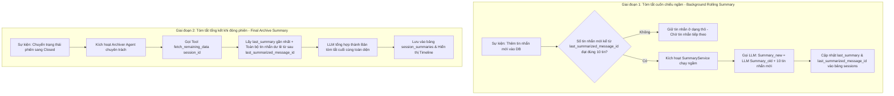

# Nhật ký thay đổi (Revision History)

| Phiên bản | Ngày      | Người cập nhật | Vị trí thay đổi  | Lý do chi tiết                                                                                                                                                        |
| :---------- | :--------- | :----------------- | :------------------- | :---------------------------------------------------------------------------------------------------------------------------------------------------------------------- |
| 1.0.0       | 2026-06-26 | Mira-Miraaa        | Toàn bộ tài liệu | Tạo mới tài liệu PRD đặc tả tính năng tự động tóm tắt phiên hội thoại bằng AI                                                                         |
| 2.0.0       | 2026-07-08 | Mira-Miraaa        | Toàn bộ tài liệu | Cải tiến kiến trúc tóm tắt: Tách biệt logic phản hồi, bổ sung cơ chế cuốn chiếu ngầm 10 tin và tóm tắt tổng kết đóng phiên bằng Archiver Agent |

---

# 📝 PRD - AI Tự Động Tóm Tắt Phiên Hội Thoại (AI Conversation Summary)

## 1. Hiện Trạng & Vấn Đề Hệ Thống (Context & Problem Statement)

### 1.1. Mô hình hiện tại

Hệ thống GapOne Conversation quản lý các cuộc trò chuyện đa kênh thông qua mô hình quản lý hội thoại đa phiên (**Multi-session**). Mỗi phiên (Session) trải qua các trạng thái tuần tự: **Mở (Open)** $\rightarrow$ **Đang xử lý (Processing)** $\rightarrow$ **Đóng (Closed)**. Mỗi phiên mới được định tuyến cho một Chat Agent (AI hoặc Nhân viên) xử lý.

### 1.2. Cơ chế tóm tắt cũ

Sử dụng cơ chế tóm tắt cuốn chiếu đệ quy (**Recursive Rolling Summary**). Khi đạt điều kiện, hệ thống lấy bản tóm tắt cũ cộng với 10 tin nhắn mới nhất để ghi đè thành bản tóm tắt mới nhằm tối ưu hóa cửa sổ ngữ cảnh (Context Window) cho Chat Agent.

### 1.3. Lỗ hổng & Hạn chế

* **Lỗi logic Trigger**: Hàm tóm tắt hiện đang bị gắn chặt vào sự kiện *"AI phản hồi"*. Khi chuyển giao cuộc trò chuyện cho con người xử lý (quy trình Human-in-the-loop), AI ngừng phản hồi dẫn đến hệ thống ngừng tóm tắt hoàn toàn, gây mất dấu và mất toàn bộ dữ liệu phần sau của cuộc trò chuyện.
* **Hiệu ứng Tam sao thất bản (Information Decay)**: Việc tóm tắt tự do dựa trên bản tóm tắt cũ lặp đi lặp lại qua nhiều vòng đệ quy khiến thông tin ở các tin nhắn đầu tiên bị mờ nhạt dần hoặc biến mất hoàn toàn theo thời gian.

---

## 2. Mục Tiêu Thiết Kế Hệ Thống Mới (System Objectives)

* **Tách biệt logic Tóm tắt (Summarization) ra khỏi logic Phản hồi (Chat/Response)**: Đảm bảo quy trình tóm tắt chạy độc lập và trọn vẹn $100\%$ phiên hội thoại trong mọi kịch bản: AI chat hoàn toàn, Người chat hoàn toàn, hoặc Lai (AI chuyển giao cho Người).
* **Tối ưu hóa hiệu suất và chi phí**: Ngăn chặn tình trạng quá tải hoặc tràn cửa sổ ngữ cảnh (Context Window) của LLM bằng việc quản lý chặt chẽ số lượng tin nhắn gửi đi, chỉ thực hiện tóm tắt khi đủ số lượng tin nhắn cố định.
* **Rút ngắn thời gian xử lý trung bình ($AHT$)**: Giảm thời gian xử lý của Agent khi nhận bàn giao ca hoặc khi khách hàng cũ quay lại ít nhất $30\%$:
  $$
  AHT_{\text{mới}} \le AHT_{\text{cũ}} \times 0.70
  $$

---

## 3. Giải Pháp Kiến Trúc Đề Xuất (Proposed Architecture)

Hệ thống áp dụng kiến trúc **Hướng sự kiện (Event-Driven)** kết hợp giải pháp lai (Hybrid) giữa tầng xử lý dữ liệu và thuật toán **Map-Reduce**.

### 3.1. Thiết Kế Cơ Sở Dữ Liệu (Database Schema)

Bảng Quản lý Phiên (`sessions`) cần được bổ sung/cập nhật các trường dữ liệu sau để hỗ trợ tiến trình chạy ngầm:

* `last_summary`: Lưu đoạn văn/cấu trúc tóm tắt gần nhất (Dạng TEXT hoặc JSON định dạng).
* `last_summarized_message_id`: Lưu ID của tin nhắn cuối cùng được đưa vào bản tóm tắt trước đó. Các tin nhắn có ID lớn hơn giá trị này được coi là *"tin nhắn mới/tin nhắn dư lẻ"* chưa qua xử lý.

### 3.2. Quy Trình Xử Lý Gồm 2 Giai Đoạn (Dual-Phase Workflow)

#### Giai đoạn 1: Tóm tắt cuốn chiếu ngầm (Background Rolling Summary)

* **Trigger**: Hệ thống lắng nghe sự kiện thêm tin nhắn mới vào Database (bất kể là từ Khách hàng, AI hay Nhân viên gõ). Khi số lượng tin nhắn mới tính từ `last_summarized_message_id` đạt đúng **10 tin**, hệ thống tự động kích hoạt `SummaryService` chạy ngầm.
* **Thuật toán**:
  $$
  Summary_{new} = \text{LLM}(Summary_{old} + \text{10 tin nhắn mới từ ID đã lưu})
  $$
* **Cải tiến quan trọng**: Không gom các tin nhắn dư lẻ ($< 10$ tin) vào giai đoạn này. Giữ chúng ở dạng tin nhắn thô cho đến khi đủ số lượng để tối ưu hóa chi phí token.

#### Giai đoạn 2: Tóm tắt tổng kết khi đóng phiên (Final Archive Summary)

* **Trigger**: Khi nhân viên hoặc hệ thống chuyển trạng thái phiên sang **Đóng (Closed)**.
* **Hành động (Tool Calling)**: Hệ thống kích hoạt một **Archiver Agent** chuyên trách và gọi Tool `fetch_remaining_data(session_id)` để lấy ra:
  1. Bản tóm tắt gần nhất `last_summary` trong DB.
  2. Toàn bộ các tin nhắn dư lẻ còn sót lại từ sau `last_summarized_message_id` đến cuối phiên.
* **Kết quả**: Archiver Agent tổng hợp hai nguồn thông tin trên thành bản tóm tắt cuối cùng toàn diện và lưu vào bảng lưu trữ cố định (`session_summaries`).

---

## 4. Đặc Tả Kỹ Thuật Cho AI Agent & Prompting (Technical Specifications)

### 4.1. Chiến Lược Phân Tách Mô Hình (Model Splitting)

Để tối ưu hóa hiệu năng phản hồi và chi phí vận hành, hệ thống phân tách tác vụ cho hai nhóm model khác nhau:

* **Chat Agent (Mô hình hội thoại)**: Sử dụng các Model thông minh bậc nhất, có độ trễ thấp và khả năng thấu cảm tốt (ví dụ: `gpt-4o`, `claude-3-5-sonnet`, `gemini-1.5-pro`). Mô hình này chỉ đọc `last_summary` để làm ngữ cảnh phản hồi, giúp giảm thiểu tối đa kích thước token đầu vào.
* **Summary Service & Archiver Agent (Mô hình tóm tắt)**: Sử dụng các Model tối ưu chi phí xử lý lượng token lớn (ví dụ: `gemini-1.5-flash`, `gpt-4o-mini`). Mô hình này chỉ làm nhiệm vụ ghi/cập nhật dữ liệu tóm tắt chạy ngầm.

### 4.2. Định Dạng Cấu Trúc Tóm Tắt (Structured Prompting)

Để giải quyết triệt để lỗi *"mất trí nhớ"* hoặc *"tam sao thất bản"*, cấu trúc đầu ra của hàm tóm tắt bắt buộc phải được định dạng theo schema có cấu trúc (JSON / Structured Context) nhằm duy trì các thông tin cốt lõi xuyên suốt phiên.

#### Cấu trúc JSON Schema bắt buộc:

1. **Ý định (Intent)**: Chuỗi ký tự (dưới 150 ký tự) mô tả mục đích chính (Ví dụ: "Hỏi giá quần Jean", "Khiếu nại giao chậm").
2. **Trạng thái giải quyết (Resolution Status)**: Phân loại thuộc nhóm: `Order_Created`, `Escalated_to_Human`, `FAQ_Resolved`, `Abandoned`, `Other`.
3. **Tóm tắt nội dung chính (Summary)**: Đoạn văn ngắn (không quá 500 ký tự, định dạng Markdown) tóm tắt diễn biến chính (sản phẩm quan tâm, thỏa thuận giao hàng, vấn đề của khách).
4. **Hành động tiếp theo (Next Steps)**: Gợi ý các hành động cần làm (Ví dụ: "Gửi hàng bảo hành", "Không có").

---

## 5. Thiết Kế Giao Diện & Cấu Hình (UI/UX Mockups & Settings)

### 5.1. Màn hình Cấu hình AI Tóm Tắt (Admin Dashboard)

* Không có giao diện cấu hình AI Tóm Tắt. AI Tóm Tắt sẽ được tích hợp sẵn vào hệ thống, không hiển thị với Admin hay user.

### 5.2. Giao diện hiển thị Timeline Chat của Agent (Agent Interface)

* Hiển thị thẻ thông báo **"Tóm tắt phiên bởi AI"** trực tiếp trên Timeline hội thoại tại thời điểm phiên được đóng.
* Tại phần panel thông tin cuộc hội thoại, bổ sung thêm một collap expand có title: Tóm tắt phiên hội thoại bởi AI và hiển thị nội dung tóm tắt. Nội dung tóm tắt hiển thị đầy đủ các thông tin có cấu trúc:
    * Ý định (Intent),
    * Trạng thái (Resolution Status),
    * Nội dung tóm tắt (Summary) và
    * Hành động tiếp theo (Next Steps).
* Chỉ hiển thị trong CRM nội bộ phục vụ bàn giao và quản trị, tuyệt đối không gửi sang kênh của khách hàng (Zalo OA, Messenger, Telegram).

---

## 6. Yêu Cầu Phi Chức Năng (Non-Functional Requirements)

* **Hiệu năng (Latency)**: Thời gian từ khi phiên đóng đến khi nội dung tóm tắt hiển thị tại panel không quá $5$ giây (áp dụng cho $95\%$ số phiên).
* **Độ tin cậy (Accuracy)**:
  * Tỷ lệ tóm tắt thành công ($SR$):
    $$
    SR = \frac{\text{Số phiên tóm tắt thành công}}{\text{Tổng số phiên đủ điều kiện tóm tắt}} \ge 98\%
    $$
  * Không bịa đặt thông tin (Hallucination) liên quan đến mã đơn hàng, giá tiền, số điện thoại hoặc địa chỉ khách hàng.
* **Bảo mật**: API Key của các nhà cung cấp AI phải được mã hóa và lưu trữ an toàn ở phía Backend.

> [!IMPORTANT]
> Tài liệu PRD này là cơ sở để phát triển các tính năng chi tiết trong tài liệu SRS liên quan (tham chiếu tại [srs-conversation-summary.md](<file:///F:/Gapone%20Conversation/Docs/AI_Chatbot/srs-conversation-summary.md>)). Mọi thay đổi về mặt nghiệp vụ cần được PO phê duyệt trước khi cập nhật vào hệ thống.
