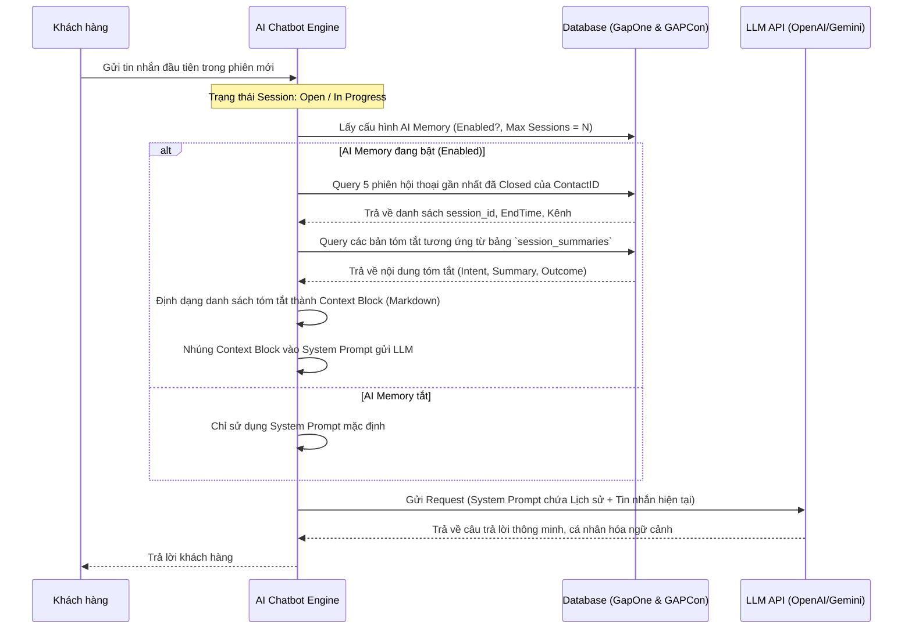

# SRS – AI GHI NHỚ LỊCH SỬ PHIÊN HỘI THOẠI (AI CONVERSATION MEMORY)

# BẢNG GHI NHẬN THAY ĐỔI TÀI LIỆU

| **Ngày thay đổi** | **Vị trí** | **Lý do** | **Mô tả thay đổi** | **Phiên bản cũ** | **Phiên bản mới** |
| --- | --- | --- | --- | --- | --- |
| 16/06/2026 | Tạo mới | Yêu cầu tính năng mới | Tài liệu đặc tả tính năng AI ghi nhớ 5 phiên hội thoại gần nhất của khách hàng | — | V1.0 |

---

# BẢNG QUẢN LÝ TIẾN ĐỘ THỰC THI

| **Giai đoạn** | **Thời gian** | **Phần mục** | **Phiên bản áp dụng** |
| --- | --- | --- | --- |
| Sprint 8 | 16/06/2026 - ... | Toàn bộ tài liệu | V1.0 |

---

# TÀI LIỆU THAM CHIẾU

| **STT** | **Tài liệu** | **Liên kết / Đường dẫn** |
| --- | --- | --- |
| 1 | GAPCon AI Chatbot for e-commerce (PRD) | [PRD](file:///f:/Gapone%20Conversation/Docs/AI_Chatbot/prd-ai-chatbot.md) |
| 2 | SRS Conversation | [SRS Conversation](file:///f:/Gapone%20Conversation/Docs/SRS%20Conversation.md) |
| 3 | SRS AI chatbot - Conversation Summary | [SRS AI Summary](file:///f:/Gapone%20Conversation/Docs/AI_Chatbot/srs-conversation-summary.md) |

---

## I. TỔNG QUAN & MỤC TIÊU

### 1.1. Hiện trạng
Hệ thống GAPCon AI Chatbot hoạt động theo mô hình session-based: khi một phiên hội thoại (Session) được đóng, toàn bộ ngữ cảnh (short-term memory) của phiên đó sẽ bị giải phóng. Khi cùng một khách hàng quay lại nhắn tin ở một phiên mới, AI Chatbot sẽ tiếp cận khách hàng như một người xa lạ hoàn toàn, không có bất kỳ thông tin gì về những gì đã trao đổi trước đó (sản phẩm quan tâm, đơn hàng bị lỗi, câu hỏi FAQ đã giải đáp...). Việc này làm giảm tính cá nhân hóa, khiến khách hàng phải lặp lại thông tin và làm giảm tỷ lệ chuyển đổi.

### 1.2. Mục tiêu tính năng
Xây dựng tính năng **AI ghi nhớ lịch sử phiên hội thoại (AI Conversation Memory)** cho phép AI Chatbot tự động truy xuất và ghi nhớ thông tin tóm tắt của **tối đa 5 phiên hội thoại gần nhất** của khách hàng.
- **Tăng tính cá nhân hóa (Personalization)**: AI Bot có thể chủ động chào hỏi, nhắc nhở về giỏ hàng bị bỏ quên ở phiên trước, hoặc tiếp tục xử lý các khiếu nại chưa dứt điểm.
- **Tối ưu hóa Token**: Sử dụng trực tiếp bản tóm tắt AI (Summary) từ tính năng tóm tắt tự động để làm ngữ cảnh đầu vào thay vì gửi toàn bộ lịch sử tin nhắn thô, giúp tiết kiệm chi phí API LLM và tránh làm loãng context.
- **Trải nghiệm khách hàng xuyên suốt (Omni-channel Context)**: Cho phép nhận diện lịch sử phiên của khách hàng kể cả khi họ đổi kênh nhắn tin (ví dụ: phiên trước nhắn trên Zalo, phiên sau nhắn trên Facebook), miễn là hồ sơ khách hàng đã được đồng nhất (merge identity) trong hệ thống GapOne.

### 1.3. Phạm vi áp dụng

| **Phạm vi** | **Chi tiết** |
| --- | --- |
| **Hệ thống áp dụng** | GAPCon AI Chatbot Engine (Orchestrator) & GapOne Contact Service. |
| **Đối tượng người dùng** | - **Admin/Manager**: Cấu hình bật/tắt tính năng, số lượng phiên cần nhớ (tối đa 5), và định dạng template đưa vào Prompt.<br>- **Khách hàng (Buyer)**: Nhận được các phản hồi thông minh, cá nhân hóa dựa trên lịch sử tương tác cũ. |
| **Ngoài phạm vi** | - Ghi nhớ không giới hạn số lượng phiên (giới hạn cứng tối đa là 5 phiên gần nhất để tối ưu chi phí và hiệu suất).<br>- Tự động đồng bộ lịch sử nhắn tin chi tiết (raw messages) của các phiên cũ vào luồng chat hiện tại (chỉ gửi bản tóm tắt AI). |

---

## II. ĐỊNH NGHĨA ĐỐI TƯỢNG & PHÂN QUYỀN

### 2.1. Đối tượng người dùng

| **Vai trò** | **Quyền hạn** | **Ghi chú** |
| --- | --- | --- |
| **Admin / Quản lý (Manager)** | - Bật/Tắt tính năng AI Memory.<br>- Cài đặt số lượng phiên ghi nhớ tối đa (N = 1 đến 5).<br>- Tùy chỉnh template đưa ngữ cảnh lịch sử vào System Prompt. | Thực hiện cấu hình trong trang Cài đặt AI. |
| **Khách hàng (Buyer)** | - Không trực tiếp sử dụng giao diện nhưng là đối tượng thụ hưởng phản hồi cá nhân hóa từ AI. | — |

### 2.2. Ràng buộc quan hệ đối tượng (Data Mapping)

Theo thiết kế trong [SRS Conversation](file:///f:/Gapone%20Conversation/Docs/SRS%20Conversation.md) và PRD:
- Một cuộc hội thoại (`Conversation`) liên kết với một hồ sơ khách hàng (`CustomerProfile/Contact` qua `ContactID`).
- Một cuộc hội thoại chứa nhiều phiên hội thoại (`Session`). Mỗi phiên có trạng thái `Closed` hoặc `Open` / `In Progress`.
- Mỗi phiên hội thoại cũ (đã đóng) liên kết 1-1 với một bản tóm tắt trong bảng `conversation.session_summaries` (qua `session_id`).

Tính năng này yêu cầu: khi có một session mới ở trạng thái `Open`, hệ thống sẽ dựa vào `ContactID` để tìm các session thuộc về khách hàng đó trên tất cả các kênh nhắn tin liên kết, sắp xếp theo thời gian kết thúc (`closed_at` hoặc `EndTime`) mới nhất để lấy ra tối đa 5 bản tóm tắt.

---

## III. PHÂN TÍCH CHI TIẾT TÍNH NĂNG

### 3.1. Luồng xử lý kỹ thuật (Technical Workflow)

Khi AI Chatbot nhận được tin nhắn đầu tiên của khách hàng trong một phiên hội thoại mới:



#### Truy vấn SQL tối ưu lấy danh sách tóm tắt phiên cũ:
```sql
SELECT 
    s.session_id,
    s.start_time,
    s.end_time,
    c.channel_type,
    ss.summary_content,
    ss.intent_detected,
    ss.resolution_status
FROM conversation.sessions s
JOIN conversation.conversations conv ON s.conversation_id = conv.conversation_id
JOIN conversation.channels c ON conv.channel_id = c.channel_id
JOIN conversation.session_summaries ss ON s.session_id = ss.session_id
WHERE conv.contact_id = :contact_id
  AND s.status = 'Closed'
  AND s.session_id != :current_session_id
ORDER BY s.end_time DESC
LIMIT :max_sessions_limit; -- Cấu hình động, mặc định = 5
```

---

### 3.2. Cấu trúc Prompt & Cách nhúng Ngữ cảnh Lịch sử (Prompt Injection)

Khi hệ thống lấy được danh sách tóm tắt của các phiên cũ, AI Orchestrator sẽ định dạng chúng thành một chuỗi Markdown và nhúng vào phần đầu của System Prompt trước khi gửi tới LLM.

#### Định dạng Khối dữ liệu Lịch sử (Context Block Template):
```markdown
[BẮT ĐẦU LỊCH SỬ TƯƠNG TÁC CŨ CỦA KHÁCH HÀNG]
Hệ thống ghi nhận khách hàng này đã có các phiên hội thoại trước đó. Hãy sử dụng thông tin này để phản hồi cá nhân hóa hơn, tránh hỏi lại các thông tin đã biết trừ khi cần xác nhận lại.

- Phiên hội thoại gần nhất #1:
  + Kênh: Zalo OA
  + Thời gian đóng: 15/06/2026 14:30
  + Ý định khách hàng: Hỏi mua quần Jean Slim Fit Nike màu đen size M.
  + Tóm tắt diễn biến: Khách hàng được tư vấn sản phẩm SKU QJN-DEN-M. Khách đã thêm 1 chiếc vào giỏ hàng nhưng sau đó im lặng không hoàn tất thanh toán.
  + Kết quả: Abandoned (Bỏ quên giỏ hàng)

- Phiên hội thoại #2:
  + Kênh: Facebook Messenger
  + Thời gian đóng: 10/06/2026 10:15
  + Ý định khách hàng: Hỏi về phí ship tỉnh và chính sách đổi size.
  + Tóm tắt diễn biến: Nhân viên đã tư vấn shop miễn phí vận chuyển cho đơn từ 500k và hỗ trợ đổi size trong vòng 7 ngày kể từ khi nhận hàng.
  + Kết quả: FAQ_Resolved

(Tối đa hiển thị 5 phiên theo thứ tự thời gian gần nhất lên trước)
[KẾT THÚC LỊCH SỬ TƯƠNG TÁC CŨ CỦA KHÁCH HÀNG]
```

#### Quy tắc hành vi của AI Chatbot khi có Lịch sử phiên cũ:
1. **Chủ động khơi gợi giỏ hàng bỏ quên**: Nếu phiên gần nhất có trạng thái kết quả là `Abandoned` (Bỏ quên giỏ hàng) và giỏ hàng hiện tại vẫn còn sản phẩm, AI Bot khi bắt đầu cuộc trò chuyện mới có thể chủ động hỏi: *"Chào anh/chị, em thấy lần trước mình đang chọn dở chiếc quần Jean Slim Fit Nike màu đen size M trong giỏ hàng. Không biết anh/chị có muốn tiến hành đặt mua luôn bây giờ không ạ?"*
2. **Kế thừa thông tin cá nhân**: Nếu các phiên trước đã thu thập và xác nhận tên, SĐT của khách hàng, AI Bot sẽ tự động điền hoặc hỏi xác nhận thay vì bắt đầu luồng checkout từ đầu (ví dụ: *"Thông tin nhận hàng của anh vẫn là anh Nguyễn Văn A - SĐT 0901234567 đúng không ạ?"*).
3. **Tránh lặp lại câu trả lời**: Nếu khách hàng hỏi một câu hỏi FAQ đã được trả lời ở phiên trước, AI có thể đưa ra câu trả lời ngắn gọn và đi thẳng vào hành động tiếp theo.

---

## IV. GIAO DIỆN NGƯỜI DÙNG (UI/UX)

### 4.1. Màn hình Cấu hình Ghi nhớ AI (Dành cho Admin)

#### Đường dẫn: Cài đặt > Kênh > tab Cấu hình AI > sub-tab Bộ nhớ hội thoại (AI Memory)

Giao diện cho phép Admin quản lý các thông số lưu trữ và nhúng bộ nhớ:

1. **Bật/Tắt tính năng (Toggle Switch)**:
   - Nhãn: `Kích hoạt ghi nhớ lịch sử phiên cũ`
   - Trạng thái: On/Off. Khi Off, Orchestrator sẽ không thực hiện query các phiên cũ.
2. **Giới hạn số phiên ghi nhớ (Input Number)**:
   - Nhãn: `Số lượng phiên gần nhất cần ghi nhớ`
   - Trình điều khiển: Ô nhập số hoặc nút tăng/giảm.
   - Ràng buộc: Giá trị nhập từ `1` đến `5` (Mặc định: `5`).
3. **Template nhúng prompt (Textarea)**:
   - Cho phép Admin xem và tùy chỉnh cấu trúc hiển thị của Khối dữ liệu Lịch sử (Context Block) khi nhúng vào System Prompt.
4. **Nút thao tác**:
   - `Lưu thay đổi`
   - `Khôi phục mặc định`

---

## V. CÁC RÀNG BUỘC VÀ XỬ LÝ LỖI (CONSTRAINTS & ERROR HANDLING)

### 5.1. Ràng buộc hệ thống (System Constraints)
- **Ràng buộc định danh (Contact Binding)**: Tính năng chỉ hoạt động khi cuộc hội thoại hiện tại có `contact_id` hợp lệ và liên kết với một hồ sơ khách hàng thực tế trong database GapOne. Nếu khách hàng mới tinh chưa được tạo profile (hoặc chat ẩn danh chưa có thông tin định danh), AI Memory sẽ tự động bỏ qua.
- **Ràng buộc trạng thái phiên**: Chỉ lấy các phiên có trạng thái `Closed`. Không lấy các phiên đang `Open` hoặc `In Progress` để tránh nhiễu thông tin đang xử lý trực tiếp.
- **Giới hạn dung lượng Token (Token Budgeting)**: Trong trường hợp các bản tóm tắt phiên cũ quá dài (ví dụ: do system prompt cũ tạo ra tóm tắt quá chi tiết), tổng dung lượng của Khối dữ liệu Lịch sử nhúng vào không được vượt quá **1500 tokens**. Nếu vượt quá, hệ thống sẽ thực hiện cắt giảm (trực tiếp loại bỏ các phiên cũ nhất trong danh sách 5 phiên) cho đến khi nằm trong ngưỡng an toàn, nhằm tránh phát sinh chi phí API quá lớn hoặc làm tràn cửa sổ ngữ cảnh của LLM.

### 5.2. Xử lý lỗi (Error Handling)

| **Tình huống lỗi** | **Hành vi xử lý của hệ thống** | **Trải nghiệm người dùng** |
| --- | --- | --- |
| **Một hoặc nhiều phiên cũ chưa được tóm tắt (thiếu record `session_summaries`)** | Hệ thống tự động bỏ qua phiên đó và tìm phiên cũ tiếp theo có sẵn tóm tắt để bù vào cho đủ số lượng cấu hình (tối đa 5). | Trải nghiệm mượt mà, AI vẫn nhận diện được các phiên có dữ liệu tóm tắt. |
| **Lỗi kết nối Database khi query lịch sử phiên** | Nếu query DB bị timeout hoặc lỗi kết nối, hệ thống sẽ tự động bỏ qua bước nạp bộ nhớ cũ và chuyển thẳng tin nhắn tới LLM với System Prompt mặc định. Ghi log lỗi vào hệ thống giám sát. | Cuộc hội thoại hiện tại không bị gián đoạn hoặc treo, AI Bot phản hồi như một khách hàng mới. |
| **Hồ sơ khách hàng bị merge/unmerge giữa chừng** | Khi thực hiện merge 2 contact (ví dụ Zalo và Facebook): hệ thống tự động gộp danh sách lịch sử phiên của cả 2 contact lại và lấy 5 phiên mới nhất. Khi unmerge: lịch sử phiên trả về đúng contact gốc. | AI nhận diện ngữ cảnh lịch sử chính xác theo trạng thái định danh mới nhất của khách hàng. |

---

## VI. TIÊU CHÍ NGHIỆM THU CHI TIẾT (ACCEPTANCE CRITERIA)

### 6.1. Luồng chạy thành công (Happy Path)

| **Mã AC** | **Tên tiêu chí** | **Điều kiện Pass (Đạt)** |
| --- | --- | --- |
| **AC-01** | Bật/tắt cấu hình AI Memory | Admin bật tính năng trong Cài đặt và chọn số lượng phiên ghi nhớ = `3`. Hệ thống lưu cấu hình thành công. |
| **AC-02** | Khách hàng mới (Không có lịch sử) | Khách hàng mới gửi tin nhắn đầu tiên. Hệ thống kiểm tra thấy không có phiên cũ nào đã closed. Tin nhắn gửi lên LLM chỉ chứa prompt mặc định. Bot trả lời bình thường. |
| **AC-03** | Khách hàng cũ quay lại (Có tóm tắt cũ) | Khách hàng có 2 phiên cũ đã đóng (đều có bản tóm tắt AI lưu trong DB). Khách gửi tin nhắn mới. Kiểm tra log API gửi lên LLM phải chứa chính xác khối Context Block dạng Markdown chứa tóm tắt của 2 phiên cũ này. |
| **AC-04** | Nhận diện giỏ hàng bỏ quên | Phiên cũ gần nhất của khách bị đóng ở trạng thái `Abandoned` (còn sản phẩm trong giỏ). Khi khách nhắn tin ở phiên mới, AI Bot chủ động nhắc về sản phẩm cũ trong giỏ hàng ngay câu chào đầu tiên. |
| **AC-05** | Đồng bộ liên kênh (Zalo & Facebook) | Khách hàng có 1 phiên closed trên Facebook Messenger và 1 phiên closed trên Zalo OA (đã merge cùng 1 contact). Khi khách chat trên Telegram ở phiên mới, Prompt gửi lên LLM phải chứa tóm tắt của cả phiên trên Facebook và Zalo. |

### 6.2. Các trường hợp ngoại lệ (Edge Cases)

| **Mã AC** | **Tên tiêu chí** | **Điều kiện Pass (Đạt)** |
| --- | --- | --- |
| **AC-06** | Giới hạn tối đa 5 phiên | Khách hàng có 8 phiên cũ đã đóng trong DB. Khi khách chat phiên mới, kiểm tra Prompt gửi lên LLM chỉ được chứa tóm tắt của **đúng 5 phiên gần nhất** (sắp xếp theo thời gian kết thúc giảm dần). |
| **AC-07** | Phiên cũ chưa có tóm tắt | Khách hàng có 3 phiên cũ đã closed nhưng phiên thứ 2 bị lỗi hệ thống nên không có record tóm tắt trong DB. Prompt gửi lên LLM chỉ chứa tóm tắt của phiên 1 và phiên 3. |
| **AC-08** | Vượt giới hạn Token cho phép | Giả lập 5 bản tóm tắt phiên cũ cực kỳ dài khiến tổng dung lượng vượt quá 1500 tokens. Hệ thống tự động loại bỏ phiên thứ 5 và thứ 4 ra khỏi Prompt để đưa dung lượng về mức an toàn trước khi gọi API. |

---

## VII. ĐỊNH HƯỚNG TƯƠNG LAI (OUT OF SCOPE)

- **Vector Search trên lịch sử tin nhắn thô**: Tìm kiếm ngữ cảnh cũ bằng cơ chế Vector Similarity trên toàn bộ tin nhắn cũ (sẽ nghiên cứu tích hợp ở Phase 2 khi cần độ chính xác cao hơn).
- **Chủ động nhắn tin lại (Proactive Outbound)**: Sử dụng lịch sử phiên cũ để tự động tạo chiến dịch gửi tin nhắn hàng loạt nhắc nhở khách hàng (Ví dụ: gửi tin nhắn Zalo OA ZNS tự động nhắc giỏ hàng bỏ quên sau 24h). Module này sẽ do hệ thống Automation/Campaign quản lý, không thuộc phạm vi xử lý trực tiếp của Chatbot Agent.
