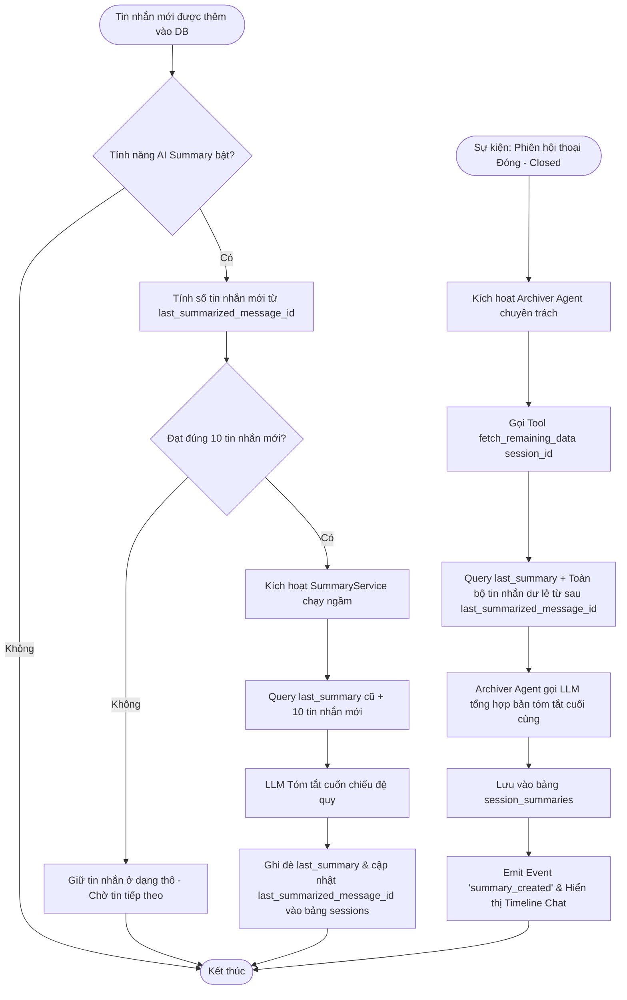
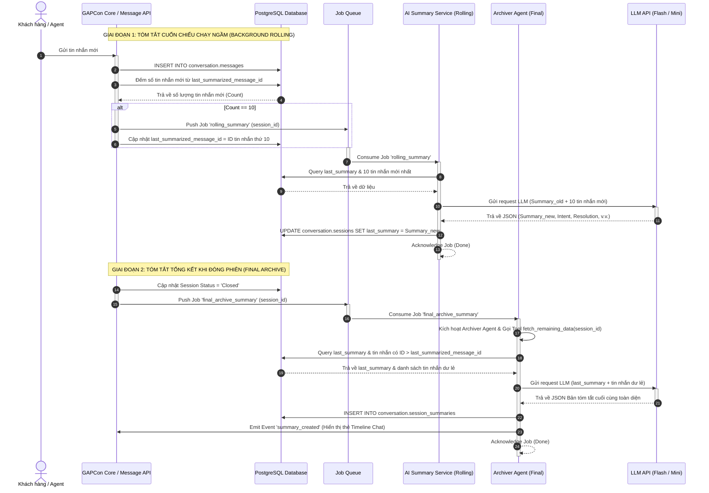

# 🏗️ Đặc Tả Chức Năng & Kỹ Thuật - Tóm Tắt Hội Thoại AI (AI Conversation Summary)

## ⏱️ Nhật ký Thay đổi Tài liệu (Revision History)

Bảng dưới đây ghi nhận toàn bộ lịch sử thay đổi của tài liệu đối với Module này:

| Phiên bản | Ngày cập nhật | Người cập nhật | Vị trí thay đổi | Loại thay đổi (Thêm mới/Sửa đổi/Xóa) | Lý do chi tiết |
| :--- | :--- | :--- | :--- | :--- | :--- |
| v1.0.0 | 2026-06-16 | Mira-Miraaa | Toàn bộ tài liệu | Thêm mới | Khởi tạo tài liệu đặc tả ban đầu cho module |
| v2.0.0 | 2026-07-08 | Mira-Miraaa | Toàn bộ tài liệu | Sửa đổi | Cải tiến kiến trúc tóm tắt: Tách biệt logic phản hồi, bổ sung cơ chế cuốn chiếu ngầm 10 tin và tóm tắt tổng kết đóng phiên bằng Archiver Agent |

---

## 1. Giới thiệu Module (Introduction)

### 1.1. Mục đích (Purpose)
Tài liệu này đặc tả chi tiết về mặt chức năng và kỹ thuật cho tính năng **Tự động tóm tắt phiên hội thoại bằng AI (AI Conversation Summary)** trong hệ thống GapOne CRM.
Tính năng này được xây dựng nhằm giải quyết nhu cầu nắm bắt nhanh ngữ cảnh trò chuyện của Nhân viên Chăm sóc Khách hàng (Agent) và làm dữ liệu ngữ cảnh tinh gọn cho Chat Agent (AI), tránh việc phải đọc lại hoặc gửi toàn bộ lịch sử tin nhắn thô lên LLM.

### 1.2. Phạm vi Module (Scope)
*   **Chức năng trong phạm vi (In-Scope)**:
    *   **Giai đoạn 1**: Cơ chế tự động chạy ngầm tóm tắt cuốn chiếu (Background Rolling Summary) cứ mỗi 10 tin nhắn mới được thêm vào DB.
    *   **Giai đoạn 2**: Cơ chế tự động tóm tắt tổng kết khi đóng phiên (Final Archive Summary) bằng cách kích hoạt Archiver Agent kết hợp bản tóm tắt cũ với các tin nhắn dư lẻ.
    *   Cấu hình Admin: Thiết lập Bật/Tắt, lựa chọn nhà cung cấp và model AI riêng cho Chat Agent (mô hình phản hồi) và Summary Service / Archiver Agent (mô hình tóm tắt).
    *   Giao diện hiển thị: Thẻ tóm tắt trên Timeline cuộc trò chuyện và biểu tượng xem nhanh trong Lịch sử phiên (tab Session History).
*   **Chức năng ngoài phạm vi (Out-of-Scope)**:
    *   Chỉnh sửa thủ công nội dung tóm tắt do AI tạo ra (phiên bản hiện tại chỉ cho phép xem dạng tĩnh).
    *   Tự động tóm tắt các cuộc trò chuyện đang trong trạng thái Open/Processing khi chưa đủ ngưỡng 10 tin nhắn mới.

---

## 2. Mô tả Nghiệp vụ & Sơ đồ Quy trình (Business Flow & User Journey)

### 2.1. Mô tả Tổng quan Nghiệp vụ
*   **Quy trình 1: Tóm tắt cuốn chiếu chạy ngầm (Giai đoạn 1)**
    *   Khi khách hàng, AI Chatbot hoặc Agent gửi tin nhắn, hệ thống đếm số tin nhắn mới phát sinh kể từ lần tóm tắt trước đó (lưu theo `last_summarized_message_id`).
    *   Khi số lượng tin nhắn mới đạt đúng 10 tin, hệ thống sẽ kích hoạt một tiến trình chạy ngầm gửi bản tóm tắt trước đó (`last_summary`) cùng 10 tin nhắn mới này sang LLM tối ưu chi phí (ví dụ: Gemini 1.5 Flash hoặc GPT-4o-mini) để ghi đè bản tóm tắt mới vào bảng `sessions`.
    *   Các tin nhắn dư lẻ ($< 10$ tin) sẽ được giữ lại ở dạng thô trong DB và chưa đưa vào tóm tắt cuốn chiếu.
*   **Quy trình 2: Tóm tắt khi đóng phiên (Giai đoạn 2)**
    *   Khi phiên hội thoại chuyển trạng thái sang **Closed** (Đóng thủ công bởi Agent hoặc tự động đóng do timeout), hệ thống kích hoạt **Archiver Agent**.
    *   Archiver Agent thực hiện gọi Tool `fetch_remaining_data(session_id)` để lấy bản `last_summary` gần nhất và các tin nhắn dư lẻ cuối phiên chưa tóm tắt.
    *   Archiver Agent gọi LLM để tổng hợp thành bản tóm tắt cuối cùng toàn diện và lưu vào bảng `session_summaries`, đồng thời hiển thị thẻ tóm tắt trên Timeline.

### 2.2. Sơ đồ Nghiệp vụ (Business Flow)



### 2.3. Sơ đồ Tuần tự (Sequence Diagram)



---

## 3. Thiết kế Cơ sở dữ liệu (Database Schema)

Để lưu trữ thông tin tóm tắt chạy ngầm cuốn chiếu và bản tóm tắt lưu trữ cuối cùng, cần bổ sung cột vào bảng `sessions` và cấu trúc lại bảng `session_summaries`.

### 3.1. Cập nhật bảng `conversation.sessions`
Bổ sung các cột phục vụ tiến trình chạy ngầm:

| Tên cột (Column) | Kiểu dữ liệu | Ràng buộc DB | Giá trị mặc định | Giải thích ý nghĩa |
| :--- | :--- | :--- | :--- | :--- |
| `last_summary` | TEXT | Nullable | NULL | Lưu trữ tạm thời bản tóm tắt cuốn chiếu dạng văn bản/cấu trúc (JSON). |
| `last_summarized_message_id` | UUID | FK -> `messages(message_id)` | NULL | ID của tin nhắn cuối cùng được đưa vào bản tóm tắt trước đó. |

### 3.2. Bảng `conversation.session_summaries`
Bảng lưu trữ cố định bản tóm tắt cuối cùng của phiên sau khi đóng:

| Tên cột (Column) | Kiểu dữ liệu | Ràng buộc DB | Giá trị mặc định | Giải thích ý nghĩa |
| :--- | :--- | :--- | :--- | :--- |
| `summary_id` | UUID | PK, Default `uuid_generate_v4()` | - | Mã định danh duy nhất của bản tóm tắt. |
| `session_id` | UUID | FK -> `sessions(session_id)`, Unique, Index | - | Liên kết 1-1 với phiên hội thoại đã đóng. |
| `summary_content` | TEXT | NOT NULL | - | Nội dung tóm tắt cuối cùng hoàn chỉnh (Định dạng Markdown rút gọn). |
| `intent_detected` | VARCHAR(255) | Nullable | NULL | Ý định chính của khách hàng do AI phân tích. |
| `resolution_status` | VARCHAR(100) | Nullable | NULL | Trạng thái kết quả của phiên: `Order_Created`, `Escalated_to_Human`, `FAQ_Resolved`, `Abandoned`, `Other`. |
| `model_used` | VARCHAR(100) | NOT NULL | - | Tên model AI thực hiện tóm tắt (ví dụ: `gemini-1.5-flash`, `gpt-4o-mini`). |
| `input_tokens` | INT | Nullable | NULL | Số lượng token đầu vào được gửi cho LLM. |
| `output_tokens` | INT | Nullable | NULL | Số lượng token đầu ra do LLM sinh ra. |
| `cost_estimation` | NUMERIC(10, 6) | Nullable | NULL | Ước lượng chi phí API (USD). |
| `created_at` | TIMESTAMPTZ | NOT NULL | NOW() | Thời gian tạo bản ghi. |

---

## 4. Yêu cầu Chức năng & Kỹ thuật Chi tiết (Functional & Technical Specs)

### 4.1. Đặc tả Chi tiết Yêu cầu Chức năng (Use Cases)

#### UC-01: Tóm tắt cuốn chiếu ngầm (Background Rolling Summary)
*   **Mô tả**: Hệ thống tự động đếm tin nhắn mới và kích hoạt `SummaryService` tóm tắt cuốn chiếu sau mỗi 10 tin nhắn mới.
*   **Tiền điều kiện**: Tính năng AI Summary được Bật (Active) trong cài đặt Admin.
*   **Hậu điều kiện**: Trường `last_summary` và `last_summarized_message_id` trong bảng `sessions` được cập nhật.
*   **Luồng xử lý chính**:
    1. Khi một tin nhắn mới được lưu vào bảng `conversation.messages`, hệ thống tính khoảng cách tin nhắn:
       $$\text{Tin nhắn mới} = \{ m \in \text{Messages} \mid m.\text{message\_id} > \text{last\_summarized\_message\_id} \}$$
    2. Nếu số lượng tin nhắn mới đạt đúng $10$:
       a. Hệ thống gửi sự kiện chạy ngầm sang `SummaryService`.
       b. Hệ thống ghi nhận `last_summarized_message_id` tạm thời là ID của tin nhắn thứ 10 này.
       c. `SummaryService` truy xuất `last_summary` cũ từ DB và 10 tin nhắn mới.
       d. Hệ thống gọi LLM tóm tắt theo công thức:
          $$Summary_{new} = \text{LLM}(Summary_{old} + \text{10 tin nhắn mới})$$
       e. Ghi đè `last_summary` mới thu được vào bảng `sessions`.
    3. Nếu số lượng tin nhắn mới $< 10$, hệ thống không kích hoạt LLM, giữ tin nhắn ở dạng thô.

#### UC-02: Tóm tắt tổng kết khi đóng phiên (Final Archive Summary)
*   **Mô tả**: Khi phiên chuyển sang trạng thái đóng (`Closed`), Archiver Agent sẽ gom `last_summary` và các tin nhắn dư lẻ còn lại để tạo bản tóm tắt cuối cùng.
*   **Tiền điều kiện**: Phiên hội thoại đổi trạng thái sang `Closed`.
*   **Hậu điều kiện**: Bản ghi tóm tắt cuối cùng được lưu vào `session_summaries`. Thẻ tóm tắt được hiển thị trên Timeline.
*   **Luồng xử lý chính**:
    1. Phiên hội thoại đóng (Agent click đóng hoặc hệ thống tự đóng).
    2. Event-driven kích hoạt **Archiver Agent** chạy tác vụ tổng hợp.
    3. Archiver Agent thực thi gọi Tool `fetch_remaining_data(session_id)`.
    4. Hệ thống lấy ra `last_summary` và các tin nhắn dư lẻ từ sau `last_summarized_message_id` đến cuối phiên.
    5. Archiver Agent gửi dữ liệu sang LLM tích hợp thành bản tóm tắt cuối cùng có cấu trúc đầy đủ.
    6. Lưu trữ thông tin kết quả vào bảng `session_summaries`.
    7. Emit sự kiện `summary_created` để hiển thị Thẻ tóm tắt trên Chat Timeline.

### 4.2. Quy tắc Nghiệp vụ (Business Rules)
*   **BR-01 (Tách biệt logic Tóm tắt & Phản hồi)**: Tiến trình tóm tắt chạy độc lập với luồng chat của Chat Agent. Khi con người vào chat (Human-in-the-loop) hoặc chuyển giao hoàn toàn, tiến trình cuốn chiếu 10 tin vẫn tự kích hoạt khi đủ điều kiện.
*   **BR-02 (Tối ưu hóa token)**: Tuyệt đối không gom các tin nhắn dư lẻ ($< 10$ tin) vào tiến trình cuốn chiếu ngầm để tránh lãng phí chi phí API.
*   **BR-03 (Bảo vệ thông tin - Ngăn chặn Decay)**: Khi LLM tóm tắt cuốn chiếu, Prompt bắt buộc phải yêu cầu giữ lại các thực thể thông tin cốt lõi (Tên khách hàng, Số điện thoại, Mã đơn hàng, Sản phẩm quan tâm, Địa chỉ giao hàng) có sẵn trong `last_summary` cũ.
*   **BR-04 (Ngưỡng kích hoạt tối thiểu)**: Phiên hội thoại chỉ được tóm tắt tổng kết khi đóng phiên nếu tổng số tin nhắn thực tế từ khách hàng và nhân viên trong phiên đó đạt tối thiểu $N_{\text{ngưỡng}} = 3$ tin nhắn (không tính các tin tự động của hệ thống).

### 4.3. Xử lý lỗi & Ngoại lệ (Error Handling)

| Mã lỗi (Error Code) | HTTP Status | Nội dung thông báo lỗi trên API | Mô tả nguyên nhân | Hướng xử lý đề xuất |
| :--- | :--- | :--- | :--- | :--- |
| `ERR_LLM_TIMEOUT` | 504 | LLM service timeout during summary. | Mô hình LLM (Flash/Mini) không phản hồi trong 10 giây. | Ghi nhận lỗi chạy ngầm, kích hoạt cơ chế retry (Exponential backoff) tối đa 3 lần. |
| `ERR_INVALID_JSON_FORMAT` | 422 | LLM output does not match structured JSON schema. | Kết quả trả về từ LLM không thể parse thành JSON hợp lệ. | Sử dụng Fallback Request yêu cầu định dạng lại hoặc tự động chuyển đổi văn bản thô thành cấu trúc mặc định. |
| `ERR_TOOL_CALL_FAILED` | 500 | Tool fetch_remaining_data failed to execute. | Lỗi kết nối DB hoặc lỗi logic khi tool lấy tin nhắn dư lẻ. | Hệ thống ghi log chi tiết lỗi, bỏ qua phần tin lẻ và tiến hành tóm tắt chỉ dựa trên bản `last_summary` gần nhất để tránh treo luồng. |

---

## 5. Đặc tả API, Tool Calling & Prompting (API & Integration Specs)

### 5.1. Đặc tả Tool Calling cho Archiver Agent: `fetch_remaining_data`
Hàm tool này cho phép Archiver Agent lấy thông tin tóm tắt cuốn chiếu cũ và các tin nhắn dư lẻ cuối phiên để hoàn thiện tóm tắt tổng kết.

*   **Tên hàm (Tool Name)**: `fetch_remaining_data`
*   **Tham số đầu vào (Parameters)**:
    ```json
    {
      "type": "object",
      "properties": {
        "session_id": {
          "type": "string",
          "description": "Mã UUID của phiên hội thoại cần truy xuất dữ liệu tin nhắn dư lẻ."
        }
      },
      "required": ["session_id"]
    }
    ```
*   **Dữ liệu trả về (Response Payload - Success 200)**:
    ```json
    {
      "session_id": "8fa1d29c-ef1b-4b2a-89cf-41cb98b671ef",
      "last_summary": "Khách hàng tên Nguyễn Văn A liên hệ hỏi mua áo khoác da size L. Đang phân vân giữa màu đen và màu nâu.",
      "last_summarized_message_id": "3c02d1a4-fa2b-4d43-a612-882d499320e1",
      "remaining_messages": [
        {
          "message_id": "41fa890e-8fb2-473d-88b1-3829ad01b22e",
          "sender_type": "customer",
          "sender_name": "Nguyen Van A",
          "content": "Mình lấy cái màu đen nhé shop.",
          "created_at": "2026-07-08T16:05:00Z"
        },
        {
          "message_id": "55ae90ff-4e2b-422d-bb91-49fae018a33a",
          "sender_type": "agent",
          "sender_name": "CSKH Hoa",
          "content": "Dạ shop đã xác nhận đơn áo khoác da màu đen size L cho mình ạ. Shop sẽ gửi hàng trong chiều nay.",
          "created_at": "2026-07-08T16:06:00Z"
        }
      ]
    }
    ```

### 5.2. Đặc tả Prompting & Output Schema cho LLM

#### A. Prompt của Summary Service (Tóm tắt cuốn chiếu ngầm - Phase 1)
```text
Bạn là AI Summary Service chạy ngầm của hệ thống GapOne CRM.
Nhiệm vụ của bạn là cập nhật bản tóm tắt cũ (last_summary) bằng cách bổ sung 10 tin nhắn mới nhận được từ phiên hội thoại.

Đầu vào:
- last_summary: Bản tóm tắt tích lũy từ đầu phiên đến tin nhắn thứ n.
- new_messages: 10 tin nhắn mới tiếp theo trong phiên.

Yêu cầu nghiệp vụ:
- Phải giữ lại các thông tin cốt lõi quan trọng trong last_summary (Tên khách hàng, SĐT, Địa chỉ, Mã đơn hàng, Nhu cầu chính).
- Tích hợp thêm các diễn biến mới từ 10 tin nhắn mới.
- Định dạng kết quả trả về dưới dạng JSON khớp hoàn toàn với JSON Schema được yêu cầu dưới đây.

Không tự ý bịa đặt thông tin không có trong lịch sử trò chuyện.
```

#### B. Prompt của Archiver Agent (Tóm tắt tổng kết đóng phiên - Phase 2)
```text
Bạn là một AI Archiver Agent chuyên trách tóm tắt và đóng hồ sơ khách hàng cho hệ thống GapOne CRM.
Nhiệm vụ của bạn là nhận:
1) Bản tóm tắt cuốn chiếu tích lũy gần nhất (last_summary)
2) Các tin nhắn dư lẻ cuối phiên chưa được tóm tắt (remaining_messages)

Hãy tổng hợp hai nguồn thông tin trên thành một Bản tóm tắt cuối cùng (Final Archive Summary) toàn diện và đầy đủ nhất cho phiên hội thoại.

Yêu cầu nghiệp vụ:
- Bảo toàn thông tin: Không được bỏ sót các thông tin cốt lõi đã có trong last_summary (tránh tình trạng information decay).
- Cập nhật diễn biến cuối phiên: Tích hợp đầy đủ các thỏa thuận, chốt đơn hoặc khiếu nại phát sinh trong phần remaining_messages.
- Xác định rõ Ý định (Intent) và Kết quả xử lý cuối cùng (Resolution Status) của phiên.
- Định dạng kết quả trả về dưới dạng JSON khớp hoàn toàn với JSON Schema được yêu cầu dưới đây.
```

#### C. JSON Output Schema yêu cầu từ LLM (Áp dụng cho cả 2 Phase)
```json
{
  "type": "object",
  "properties": {
    "intent": {
      "type": "string",
      "description": "Ý định chính của khách hàng (dưới 5 từ). Ví dụ: 'Mua áo khoác da', 'Khiếu nại đổi trả size'"
    },
    "resolution_status": {
      "type": "string",
      "enum": ["Order_Created", "Escalated_to_Human", "FAQ_Resolved", "Abandoned", "Other"],
      "description": "Trạng thái kết quả cuối cùng của phiên hội thoại."
    },
    "summary": {
      "type": "string",
      "description": "Nội dung tóm tắt chi tiết nhưng ngắn gọn (dưới 150 từ, định dạng Markdown). Chứa đầy đủ các thông tin cốt lõi: tên, SĐT, sản phẩm chốt mua, hoặc mã đơn hàng."
    },
    "next_steps": {
      "type": "string",
      "description": "Hành động tiếp theo cần thực hiện. Nếu không có, ghi 'Không có'."
    }
  },
  "required": ["intent", "resolution_status", "summary", "next_steps"]
}
```

---

## 6. Yêu cầu Phi chức năng riêng cho Module (Module NFRs)

*   **Hiệu năng tóm tắt ngầm**: Tác vụ tóm tắt cuốn chiếu ngầm của `SummaryService` phải được xử lý bất đồng bộ, không gây ảnh hưởng hay tạo độ trễ cho tốc độ gửi/nhận tin nhắn thực tế của khách hàng và Agent.
*   **Bảo mật dữ liệu**: Dữ liệu truyền lên LLM API (Gemini/OpenAI) phải đi qua cổng API Gateway nội bộ của GapOne và được mã hóa đường truyền bằng SSL/TLS.
*   **Tính toàn vẹn**: Cơ chế tóm tắt cuốn chiếu phải đảm bảo tính tuần tự của tin nhắn, không được xử lý các tin nhắn sai thứ tự thời gian (`created_at`).

---

## 7. Tiêu chí Nghiệm thu Chi tiết (Acceptance Criteria)

### 7.1. Luồng chạy thành công (Happy Path)

| Mã AC | Tên tiêu chí | Điều kiện đạt (Pass Constraints) |
| :--- | :--- | :--- |
| **AC-01** | Cấu hình phân tách model thành công | Admin cấu hình Chat Agent dùng `gpt-4o`, Summary Service dùng `gemini-1.5-flash`. Hệ thống lưu cấu hình và định tuyến API chính xác đến các model này. |
| **AC-02** | Trigger tóm tắt cuốn chiếu ngầm | Gửi tin nhắn thứ 10 kể từ đầu phiên (hoặc kể từ `last_summarized_message_id`). Hệ thống tự động push job chạy ngầm, cập nhật trường `last_summary` trong bảng `sessions` thành công. Các tin nhắn lẻ ($< 10$) không kích hoạt job. |
| **AC-03** | Tóm tắt đóng phiên toàn diện | Phiên hội thoại có `last_summary` và 3 tin nhắn lẻ cuối phiên. Khi đóng phiên, Archiver Agent kích hoạt, gọi tool `fetch_remaining_data` thành công, tạo bản tóm tắt hoàn chỉnh lưu vào `session_summaries` và hiển thị trên Timeline. |
| **AC-04** | Chat Agent kế thừa ngữ cảnh | Khi phiên mới mở ra, Chat Agent (đang cấu hình `gpt-4o`) tự động đọc `last_summary` từ phiên cũ gần nhất của khách hàng đó để phản hồi cá nhân hóa mà không cần nạp tin nhắn thô. |

### 7.2. Các trường hợp ngoại lệ & Cận biên (Edge Cases)

| Mã AC | Tên tiêu chí | Điều kiện đạt (Pass Constraints) |
| :--- | :--- | :--- |
| **AC-05** | Phiên quá ngắn ($< 3$ tin nhắn) | Đóng một phiên chỉ có 1 hoặc 2 tin nhắn (ví dụ: Khách: "Hi shop", Hệ thống tự động đóng). Archiver Agent kiểm tra điều kiện ngưỡng và bỏ qua không thực hiện tóm tắt. Không tạo bản ghi lỗi trong hệ thống. |
| **AC-06** | Lỗi gọi Tool fetch_remaining_data | Khi tool `fetch_remaining_data` bị lỗi kết nối DB, Archiver Agent nhận diện lỗi, tự động chuyển sang cơ chế fallback: Chỉ sử dụng `last_summary` trong sessions để tạo tóm tắt cuối cùng, tránh treo luồng. |
| **AC-07** | LLM trả về sai cấu trúc JSON | LLM trả về dữ liệu tóm tắt không đúng định dạng JSON. Worker nhận diện lỗi, thực hiện gửi yêu cầu khẩn cấp lần 2 (fallback call) yêu cầu format lại, hoặc tự động parse văn bản thô vào cấu trúc mặc định. |
