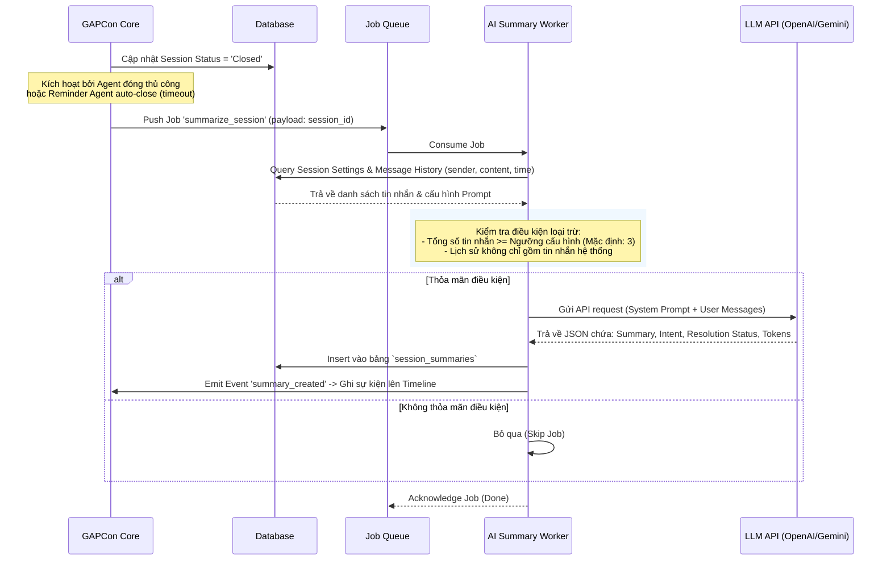

# SRS – AI TỰ ĐỘNG TÓM TẮT PHIÊN HỘI THOẠI (AI CONVERSATION SUMMARY)

# BẢNG GHI NHẬN THAY ĐỔI TÀI LIỆU

| **Ngày thay đổi** | **Vị trí** | **Lý do** | **Mô tả thay đổi** | **Phiên bản cũ** | **Phiên bản mới** |
| --- | --- | --- | --- | --- | --- |
| 16/06/2026 | Tạo mới | Yêu cầu tính năng mới | Tài liệu đặc tả tính năng AI tự động tóm tắt sau khi kết thúc phiên hội thoại | — | V1.0 |

---

# BẢNG QUẢN LÝ TIẾN ĐỘ THỰC THI

| **Giai đoạn** | **Thời gian** | **Phần mục** | **Phiên bản áp dụng** |
| --- | --- | --- | --- |
| Sprint 8 | 16/06/2026 - ... | Toàn bộ tài liệu | V1.0 |

---

# TÀI LIỆU THAM CHIẾU

| **STT** | **Tài liệu** | **Liên kết / Đường dẫn** |
| --- | --- | --- |
| 1 | GAPCon AI Chatbot for e-commerce (PRD) | [PRD](file:///f:/Gapone%20Conversation/Docs/AI_Chatbot/prd-ai-chatbot.md) |
| 2 | SRS Conversation | [SRS Conversation](file:///f:/Gapone%20Conversation/Docs/SRS%20Conversation.md) |
| 3 | SRS Time Settings | [SRS Time Settings](file:///f:/Gapone%20Conversation/Docs/SRS%20Time%20Settings.md) |

---

## I. TỔNG QUAN & MỤC TIÊU

### 1.1. Hiện trạng
Hệ thống GapOne Conversation hiện quản lý các cuộc hội thoại đa kênh (Zalo OA, Facebook Messenger, Telegram) dưới dạng các **Phiên hội thoại (Sessions)**. Khi một phiên hội thoại kết thúc (được đóng thủ công bởi Agent hoặc tự động đóng bởi hệ thống/Reminder Agent do hết thời gian chờ), nhân viên CSKH hoặc Admin khi xem lại lịch sử phải đọc toàn bộ nội dung tin nhắn để hiểu ngữ cảnh của phiên làm việc cũ. Điều này gây mất thời gian và giảm hiệu suất khi xử lý các khách hàng quay lại hoặc khi cần bàn giao ca.

### 1.2. Mục tiêu tính năng
Xây dựng tính năng **AI tự động tóm tắt phiên hội thoại (AI Conversation Summary)**. Khi một phiên hội thoại chuyển sang trạng thái **Đã đóng (Closed)**, hệ thống sẽ tự động gửi toàn bộ lịch sử tin nhắn của phiên đó tới LLM (Large Language Model) để tạo ra một bản tóm tắt ngắn gọn, có cấu trúc. 
- **Tối ưu hóa thời gian**: Giúp Agent/Admin nhanh chóng nắm bắt ý định của khách hàng, kết quả xử lý và các hành động tiếp theo mà không cần đọc lại toàn bộ lịch sử trò chuyện.
- **Lưu trữ tri thức**: Lưu trữ bản tóm tắt để phục vụ việc phân tích nhu cầu khách hàng và báo cáo hiệu quả CSKH của bot/người.
- **Nâng cao trải nghiệm bàn giao**: Hỗ trợ đắc lực cho việc chuyển tiếp ngữ cảnh giữa AI Bot và Nhân viên (Human Handoff), hoặc giữa các Agent với nhau.

### 1.3. Phạm vi áp dụng

| **Phạm vi** | **Chi tiết** |
| --- | --- |
| **Đường dẫn truy cập** | - **Đối với Admin**: Đăng nhập > Cài đặt > Kênh > tab Cấu hình AI > tab Tóm tắt hội thoại<br>- **Đối với Agent (Xem kết quả)**: Trang chủ > Hội thoại > Chi tiết cuộc hội thoại (Timeline & tab Lịch sử phiên) |
| **Đối tượng người dùng** | - **Admin/Manager**: Bật/tắt tính năng, cấu hình model LLM, prompt mẫu và điều kiện kích hoạt.<br>- **Agent/CSKH**: Xem nội dung tóm tắt trên màn hình Chat. |
| **Ngoài phạm vi** | - Chỉnh sửa nội dung tóm tắt do AI tạo ra (ở phiên bản V1.0 chỉ cho phép đọc và lưu trữ tĩnh).<br>- Tự động tóm tắt các cuộc hội thoại đang trong trạng thái Open hoặc In Progress (chỉ tóm tắt khi session đã Closed). |

---

## II. ĐỊNH NGHĨA ĐỐI TƯỢNG & PHÂN QUYỀN

### 2.1. Đối tượng người dùng

| **Vai trò** | **Quyền hạn** | **Ghi chú** |
| --- | --- | --- |
| **Admin / Quản lý (Manager)** | - Bật/Tắt tính năng AI Summary.<br>- Cấu hình API key, Model LLM (GPT-4o-mini, Gemini 2.5 Flash, ...).<br>- Cài đặt quy tắc loại trừ (ví dụ: không tóm tắt session có < N tin nhắn).<br>- Tùy chỉnh System Prompt cho AI tóm tắt.<br>- Xem toàn bộ bản tóm tắt của các session trong hệ thống. | — |
| **Nhân viên (Agent)** | - Xem nội dung tóm tắt AI trên Timeline hội thoại và phần Lịch sử phiên (Session History) ở bảng thông tin khách hàng. | Không được phép thay đổi cấu hình tính năng. |

### 2.2. Mô hình dữ liệu bổ sung (Database Schema)

Để lưu trữ thông tin tóm tắt hội thoại, cần bổ sung bảng `session_summaries` liên kết với bảng `sessions` (thuộc schema `conversation` của GAPCon).

#### Bảng: `conversation.session_summaries`

| **Tên cột** | **Kiểu dữ liệu** | **Ràng buộc** | **Mô tả** |
| --- | --- | --- | --- |
| `summary_id` | UUID | PK, Default `uuid_generate_v4()` | Mã định danh duy nhất của bản tóm tắt. |
| `session_id` | UUID | FK -> `conversation.sessions(session_id)`, Unique, Index | Liên kết 1-1 với phiên hội thoại. |
| `summary_content` | TEXT | Not Null | Nội dung tóm tắt được sinh ra bởi AI (Định dạng Markdown rút gọn). |
| `intent_detected` | VARCHAR(255) | Nullable | Ý định chính của khách hàng do AI phân tích và phân loại (dùng cho thống kê). |
| `resolution_status` | VARCHAR(100) | Nullable | Trạng thái kết quả của phiên (Ví dụ: Order_Created, Escalated_to_Human, FAQ_Resolved, Abandoned). |
| `model_used` | VARCHAR(100) | Not Null | Tên model AI đã thực hiện tóm tắt (ví dụ: `gpt-4o-mini`, `gemini-2.5-flash`). |
| `input_tokens` | INT | Nullable | Số lượng token đầu vào được gửi cho LLM. |
| `output_tokens` | INT | Nullable | Số lượng token đầu ra do LLM sinh ra. |
| `cost_estimation` | NUMERIC(10, 6) | Nullable | Ước lượng chi phí API (USD) cho lượt tóm tắt này. |
| `created_at` | TIMESTAMP | Default `NOW()` | Thời gian tạo bản tóm tắt. |

---

## III. PHÂN TÍCH CHI TIẾT TÍNH NĂNG

### 3.1. Luồng xử lý nghiệp vụ tự động (Automated Workflow)

Tính năng tóm tắt sẽ chạy dưới dạng một tác vụ bất đồng bộ (Asynchronous Background Job) được kích hoạt bởi Event Driven Architecture.



#### Các bước chi tiết của Worker:
1. **Trigger**: Lắng nghe sự kiện `session.status_changed` có giá trị `new_status = 'Closed'`.
2. **Kiểm tra cấu hình**: Đọc cấu hình xem tính năng AI Summary có đang bật (Active) hay không. Nếu không, kết thúc job.
3. **Lấy dữ liệu**: Query toàn bộ tin nhắn trong phiên (từ bảng `conversation.messages` lọc theo `session_id`).
4. **Safety Check & Điều kiện loại trừ**:
   - Không tóm tắt nếu tổng số tin nhắn của khách hàng và nhân viên/bot trong session `< N` (mặc định `N = 3`, có thể cấu hình).
   - Không tóm tắt nếu phiên chỉ chứa các tin nhắn tự động từ hệ thống mà không có tin nhắn thực tế từ khách hàng.
5. **Gọi LLM API**:
   - Sử dụng Model và API Key được cấu hình trong admin.
   - Định dạng payload: Gửi dưới dạng Conversation History chuẩn (System prompt, User role, Assistant role).
   - Sử dụng cấu trúc đầu ra mong muốn (Structured Outputs - JSON Mode) để đảm bảo LLM trả về đúng schema dữ liệu cần thiết.
6. **Lưu trữ và Ghi nhận**:
   - Lưu thông tin trả về vào bảng `session_summaries`.
   - Tạo một bản ghi tin nhắn sự kiện (Event Message) trên Timeline cuộc hội thoại.

---

### 3.2. Cấu trúc System Prompt & Output Schema (AI Engine)

Để đảm bảo tính nhất quán và chất lượng tóm tắt, Agent tóm tắt sẽ sử dụng System Prompt và yêu cầu đầu ra theo định dạng JSON.

#### System Prompt mặc định:
```text
Bạn là một trợ lý AI phân tích và tóm tắt cuộc hội thoại dành cho hệ thống GapOne CRM.
Nhiệm vụ của bạn là đọc lịch sử tin nhắn của một phiên hội thoại e-commerce và tạo ra một bản tóm tắt ngắn gọn, chính xác bằng Tiếng Việt.

Hãy trích xuất các thông tin sau:
1. Ý định chính của khách hàng (Intent): Khách hàng muốn làm gì? (ví dụ: mua hàng, hỏi giá, khiếu nại, hỗ trợ kỹ thuật...).
2. Kết quả xử lý (Resolution): Kết quả cuối cùng của phiên là gì? (ví dụ: đã tạo đơn hàng thành công, chuyển nhân viên hỗ trợ, khách im lặng...).
3. Tóm tắt nội dung chính (Summary): Tóm tắt ngắn gọn diễn biến chính dưới 150 từ. Tập trung vào: sản phẩm quan tâm, lý do khiếu nại, thông tin giao hàng đã xác nhận.
4. Hành động tiếp theo (Next Steps): Các việc cần làm tiếp theo (nếu có).

Quy tắc quan trọng:
- Không bịa đặt thông tin không có trong cuộc hội thoại (không có hallucination).
- Viết ngắn gọn, súc tích, tránh từ ngữ rườm rà.
- Trả về kết quả dưới định dạng JSON theo đúng schema được yêu cầu.
```

#### JSON Output Schema yêu cầu từ LLM:
```json
{
  "type": "object",
  "properties": {
    "intent": {
      "type": "string",
      "description": "Ý định chính của khách hàng (dưới 5 từ). Ví dụ: 'Mua quần jean Nike', 'Khiếu nại đổi trả'"
    },
    "resolution_status": {
      "type": "string",
      "enum": ["Order_Created", "Escalated_to_Human", "FAQ_Resolved", "Abandoned", "Other"],
      "description": "Trạng thái kết quả của phiên hội thoại."
    },
    "summary": {
      "type": "string",
      "description": "Nội dung tóm tắt chi tiết nhưng ngắn gọn (dưới 150 từ, sử dụng markdown nếu cần thiết để bôi đậm các thông tin quan trọng như mã đơn, tên sản phẩm)."
    },
    "next_steps": {
      "type": "string",
      "description": "Hành động tiếp theo cần thực hiện. Nếu không có, ghi 'Không có'."
    }
  },
  "required": ["intent", "resolution_status", "summary", "next_steps"]
}
```

---

## IV. GIAO DIỆN NGƯỜI DÙNG (UI/UX)

### 4.1. Màn hình Cấu hình AI Tóm Tắt (Dành cho Admin)

#### Đường dẫn: Cài đặt > Kênh > tab Cấu hình AI > sub-tab Tóm tắt hội thoại

Giao diện cho phép Admin quản lý các thiết lập của mô hình AI:

1. **Kích hoạt tính năng (Toggle Switch)**:
   - Nhãn: `Bật tự động tóm tắt bằng AI`
   - Trạng thái: On/Off. Khi Off, Worker sẽ bỏ qua toàn bộ Job tóm tắt.
2. **Cấu hình nhà cung cấp AI (Provider & Model Configuration)**:
   - **Provider (Dropdown)**: `OpenAI` | `Google Gemini` | `GAPIT AI Gateway`
   - **API Key (Input Password)**: Ô nhập API Key. Có icon hình con mắt để ẩn/hiện và nút `Kiểm tra kết nối`.
   - **AI Model (Dropdown)**: Danh sách model khả dụng (Ví dụ: `gpt-4o-mini`, `gpt-4o`, `gemini-2.5-flash`, `gemini-2.5-pro`). Mặc định gợi ý model giá rẻ và tối ưu: `gpt-4o-mini`.
3. **Điều kiện kích hoạt (Trigger Constraints)**:
   - **Số tin nhắn tối thiểu (Input Number)**: Mặc định là `3`. Chỉ tóm tắt các phiên có số lượng tin nhắn lớn hơn hoặc bằng giá trị này.
4. **Tùy chỉnh Prompt (Textarea)**:
   - Hiển thị System Prompt mặc định của hệ thống.
   - Cho phép Admin chỉnh sửa và nhấn nút `Khôi phục mặc định` nếu cần.
5. **Nút thao tác**:
   - `Lưu cấu hình` (Lưu các thiết lập vào hệ thống)
   - `Hủy` (Quay về thiết lập trước đó)

---

### 4.2. Màn hình Chi tiết cuộc hội thoại (Dành cho Agent)

Bản tóm tắt AI được hiển thị ở 2 vị trí trên giao diện làm việc của Agent để tối đa hóa khả năng tiếp cận thông tin:

#### Vị trí 1: Trên Timeline cuộc trò chuyện (Chat Timeline Event)
Khi một phiên hội thoại được đóng và AI hoàn thành tóm tắt, hệ thống sẽ chèn một **Tin nhắn sự kiện (Event Message)** đặc biệt vào timeline.

```text
┌────────────────────────────────────────────────────────────────────────┐
│                                                                        │
│               [username] đã đóng cuộc trò chuyện này lúc 14:02          │
│                                                                        │
│   🤖 TÓM TẮT PHIÊN HỘI THOẠI BỞI AI                                    │
│   • Ý định: Khách hàng hỏi mua áo thun trắng và tìm đơn hàng cũ.        │
│   • Nội dung: Khách hàng đã được tư vấn về Áo thun Basic (trắng, M).   │
│     Đồng thời đã kiểm tra đơn hàng cũ #7DE649BB (Trạng thái: Chờ xác    │
│     nhận). Khách hàng chưa tạo đơn mới và hẹn phản hồi lại sau.        │
│   • Kết quả: FAQ_Resolved                                              │
│   • Hành động tiếp theo: Không có.                                     │
│                                                                        │
└────────────────────────────────────────────────────────────────────────┘
```
- Tin nhắn sự kiện này có background màu xanh nhạt hoặc xám nhạt để phân biệt với tin nhắn chat thường.
- Có icon robot `🤖` ở đầu tiêu đề.
- Chỉ hiển thị trong màn hình CRM nội bộ, **không gửi tin nhắn này sang kênh của khách hàng (Zalo/FB/Telegram)**.

#### Vị trí 2: Tab Lịch sử phiên (Session History) trong bảng thông tin khách hàng (Cột phải)
Tại bảng thông tin khách hàng bên phải (như mô tả trong [SRS Conversation](file:///f:/Gapone%20Conversation/Docs/SRS%20Conversation.md)), thêm sub-tab `Lịch sử phiên`.
- Danh sách hiển thị các phiên hội thoại cũ kèm theo: `Mã phiên`, `Thời gian (Bắt đầu - Kết thúc)`, `Người phụ trách` và `Trạng thái đóng`.
- Mỗi phiên hội thoại cũ sẽ có một icon **Tóm tắt (Summary Icon)**.
- Khi Agent di chuột (Hover) hoặc Click vào icon này, một Popover/Tooltip hoặc Modal nhỏ sẽ hiển thị nội dung tóm tắt AI tương ứng. Điều này giúp Agent hiểu nhanh các phiên trước đó mà không cần mở lại/tải lại toàn bộ lịch sử tin nhắn của phiên đó.

---

## V. CÁC RÀNG BUỘC VÀ XỬ LÝ LỖI (CONSTRAINTS & ERROR HANDLING)

### 5.1. Ràng buộc nghiệp vụ (Business Rules)
- **Tách biệt Session**: Bản tóm tắt chỉ áp dụng cho nội dung tin nhắn thuộc phạm vi `session_id` được chỉ định. Tin nhắn của phiên trước hoặc phiên sau không được đưa vào context của LLM cho phiên hiện tại.
- **Bảo mật dữ liệu**: Trước khi gửi tin nhắn lên LLM API của bên thứ ba, hệ thống phải thực hiện lọc bỏ cơ bản các thông tin nhạy cảm của khách hàng nếu được cấu hình (ví dụ: che bớt số thẻ ngân hàng, mật khẩu nếu xuất hiện trong chat).
- **Không gửi cho khách hàng**: File đặc tả nhấn mạnh bản tóm tắt AI này là dữ liệu quản trị nội bộ. Tuyệt đối không có cơ chế tự động gửi nội dung này tới khách hàng qua Zalo OA, Messenger hay Telegram.

### 5.2. Xử lý lỗi hệ thống (System Error Handling)

| **Tình huống lỗi** | **Hành vi xử lý của hệ thống** | **Trải nghiệm người dùng** |
| --- | --- | --- |
| **LLM API Timeout hoặc Rate Limit (Lỗi 429/503)** | Hệ thống tự động thực hiện cơ chế **Retry** sau thời gian tăng dần (Exponential backoff): lần 1 sau 5s, lần 2 sau 15s, lần 3 sau 45s. | Agent không thấy sự gián đoạn. Nếu retry thành công, tóm tắt vẫn hiện trên Timeline. |
| **API Key không hợp lệ hoặc hết số dư** | Sau khi Retry thất bại 3 lần, Worker đánh dấu Job là `Failed` trong DB, ghi log chi tiết lỗi API. | - Timeline hiển thị thông báo sự kiện lỗi: *"Không thể tạo tóm tắt AI cho phiên này (Lỗi kết nối AI)"*.<br>- Gửi thông báo cảnh báo (Notification) đến Admin về việc kiểm tra API Key. |
| **LLM trả về định dạng JSON sai cấu trúc yêu cầu** | Worker sẽ thực hiện một lượt gọi LLM khẩn cấp thứ 2 (Fall-back request) yêu cầu định dạng lại text thô, hoặc tự động parse text thô thành định dạng tóm tắt mặc định nếu parse JSON thất bại. | Bản tóm tắt vẫn được hiển thị dạng text thường thay vì cấu trúc JSON hoàn chỉnh. |
| **Mất kết nối mạng/Sập Worker khi đang xử lý** | Sử dụng cơ chế Ack/Nack của Job Queue. Nếu worker sập khi chưa gửi Ack, Job sẽ được queue phát lại cho worker khác sau khi khởi động lại. | Đảm bảo không bị rơi rớt/mất job tóm tắt. |

---

## VI. TIÊU CHÍ NGHIỆM THU CHI TIẾT (ACCEPTANCE CRITERIA)

### 6.1. Luồng chạy thành công (Happy Path)

| **Mã AC** | **Tên tiêu chí** | **Điều kiện Pass (Đạt)** |
| --- | --- | --- |
| **AC-01** | Bật/tắt cấu hình AI Summary | Admin có thể bật toggle, điền API key và chọn model `gpt-4o-mini` thành công. Khi nhấn `Kiểm tra kết nối`, hệ thống báo kết nối thành công tới API. |
| **AC-02** | Tự động tóm tắt khi đóng thủ công | Agent nhấn nút "Đóng cuộc trò chuyện". Hệ thống đóng session thành công. Sau tối đa 10 giây, trên Timeline chat xuất hiện tin nhắn sự kiện chứa bản tóm tắt AI đầy đủ 4 phần (Ý định, Nội dung, Kết quả, Hành động tiếp theo). |
| **AC-03** | Tự động tóm tắt khi đóng tự động | Hệ thống/Reminder Agent tự động đóng một session sau 96 giờ không hoạt động. Job tóm tắt được kích hoạt, tóm tắt thành công và lưu vào DB. |
| **AC-04** | Hiển thị trong Lịch sử phiên | Trong tab Lịch sử phiên ở cột thông tin khách hàng bên phải, hiển thị icon tóm tắt. Khi click vào, hiển thị chính xác nội dung tóm tắt AI đã lưu của phiên đó. |
| **AC-05** | Ghi nhận metadata sử dụng | Kiểm tra DB bảng `conversation.session_summaries`, các trường `input_tokens`, `output_tokens`, `model_used` và `cost_estimation` phải có dữ liệu số thực tế hợp lệ. |

### 6.2. Các trường hợp ngoại lệ (Edge Cases)

| **Mã AC** | **Tên tiêu chí** | **Điều kiện Pass (Đạt)** |
| --- | --- | --- |
| **AC-06** | Session quá ngắn (< N tin nhắn) | Đóng một session chỉ có 2 tin nhắn (ví dụ: Khách: "Xin chào", Bot: "Chào bạn, mình có thể giúp gì?"). Hệ thống đóng session bình thường nhưng không kích hoạt Job gọi LLM. Không tạo bản ghi trong bảng `session_summaries`. |
| **AC-07** | Lỗi API hoặc mất kết nối | Khi tắt kết nối internet hoặc dùng API Key giả lập bị lỗi: hệ thống thử lại 3 lần rồi ghi nhận sự kiện lỗi trên Timeline: *"Không thể tạo tóm tắt AI cho phiên này"*. Hệ thống không bị treo hoặc crash. |
| **AC-08** | Thay đổi cấu hình tức thời | Admin đổi model từ `gpt-4o-mini` sang `gemini-2.5-flash` và lưu. Session đóng sau đó phải được tóm tắt bằng model mới và lưu đúng tên model `gemini-2.5-flash` vào trường `model_used`. |

---

## VII. HẠN CHẾ VÀ ĐỊNH HƯỚNG TƯƠNG LAI (OUT OF SCOPE)

- **Audit log & chỉnh sửa**: Nhân viên CSKH không thể chỉnh sửa bản tóm tắt AI (phiên bản V1 chỉ hỗ trợ read-only). Tính năng cho phép Agent đính kèm note/edit summary sẽ được đưa vào các pha sau.
- **Tóm tắt đa ngôn ngữ**: Mặc định tóm tắt dịch ngược ra Tiếng Việt bất kể khách hàng chat bằng tiếng Anh hay ngôn ngữ khác (chưa hỗ trợ tùy chọn ngôn ngữ đầu ra linh hoạt).
- **Phân tích Sentiment nâng cao**: Phân tích biểu cảm/thái độ khách hàng chi tiết (Angry, Happy, Neutral) theo thang điểm để hiển thị biểu đồ báo cáo (sẽ phát triển ở Phase 2).
