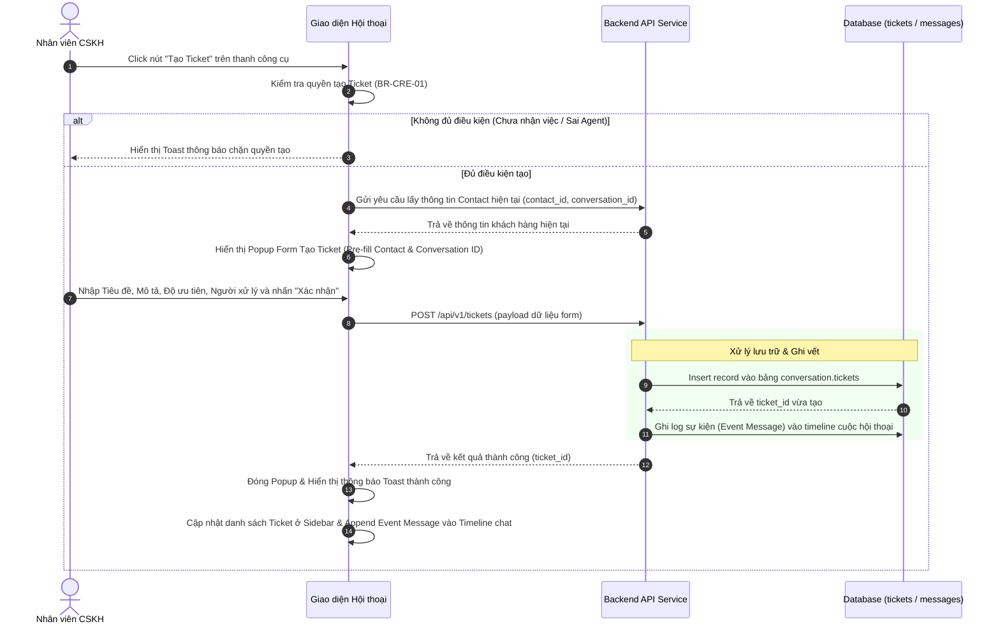

# BẢNG GHI NHẬN THAY ĐỔI TÀI LIỆU

| Phiên bản | Ngày | Người cập nhật | Vị trí thay đổi | Lý do chi tiết |
| :--- | :--- | :--- | :--- | :--- |
| 1.0.0 | 2026-07-01 | Mira-Miraaa | Toàn bộ tài liệu | Tạo mới tài liệu đặc tả tính năng Tạo Ticket tại màn hình Hội thoại |
| 1.1.0 | 2026-07-02 | Mira-Miraaa | Toàn bộ tài liệu | Cập nhật chi tiết các trường dữ liệu, thuộc tính ID HTML, quy tắc validation, logic hiển thị timeline và sidebar liên quan đến Ticket dựa trên mockup/prototype thực tế. |
| 1.2.0 | 2026-07-15 | Phương Nguyễn | Mục 2.1, 3.1.1, 3.1.3, 3.3, 3.4 (mới) | Thống nhất tên trạng thái hội thoại → "In process"; sửa logic sinh `ticket_id` (DB AUTO_INCREMENT, quy tắc tạo đồng thời); sửa `creator_id`/`assignee` về `agent_id` (INT); bổ sung phân quyền Admin (không bị BR-CRE-01); cập nhật BR-CRE-01 loại trừ Admin; bổ sung mục 3.4 bảng tổng hợp In-app Notification & Toast. |

---

# BẢNG QUẢN LÝ TIẾN ĐỘ THỰC THI

| Giai đoạn | Thời gian | Phần mục | Phiên bản áp dụng |
| :--- | :--- | :--- | :--- |
| Sprint 5 | 01/07/2026 - ... | Xây dựng nút tạo ticket, form tạo nhanh pre-fill thông tin, ghi nhận timeline và hiển thị liên kết ở sidebar | V1.1 |

---

# TÀI LIỆU THAM CHIẾU

| STT | Tài liệu | Liên kết / Đường dẫn |
| :--- | :--- | :--- |
| 1 | SRS Conversation | [SRS Conversation](file:///f:/Gapone%20Conversation/Docs/SRS%20Conversation.md) |
| 2 | SRS Ticket Management | [SRS Ticket Management](file:///f:/Gapone%20Conversation/Docs/SRS%20Ticket%20Management.md) |

---

## I. TỔNG QUAN & MỤC TIÊU

### 1.1. Hiện trạng
Khi nhân viên chăm sóc khách hàng (Agent) đang nhắn tin hỗ trợ khách hàng tại màn hình **Hội thoại (Conversation)**, nếu phát sinh các yêu cầu cần xử lý liên phòng ban hoặc cần theo dõi lâu dài (ví dụ: Khách báo lỗi sản phẩm, yêu cầu xuất hóa đơn đỏ), Agent phải chuyển sang phân hệ Ticket để nhập thủ công lại toàn bộ thông tin khách hàng. Việc này gây gián đoạn công việc, kéo dài thời gian phản hồi tin nhắn của khách và dễ dẫn đến sai sót khi nhập lại dữ liệu (tên, SĐT, mã cuộc hội thoại liên quan).

### 1.2. Mục tiêu tính năng
*   Cho phép Agent tạo nhanh Ticket xử lý ngay tại màn hình chat Hội thoại hiện tại.
*   Tự động liên kết (pre-fill) thông tin hồ sơ khách hàng (`ContactID`) và cuộc trò chuyện hiện tại (`ConversationID`).
*   Ghi vết hành động tạo Ticket lên Timeline trò chuyện để làm căn cứ theo dõi lịch sử.
*   Hiển thị danh sách các Ticket đã tạo của khách hàng ngay trên Sidebar thông tin khách hàng ở góc phải màn hình chat.

### 1.3. Phạm vi áp dụng
*   **Đường dẫn truy cập**: Đăng nhập hệ thống > **Hội thoại** > Click chọn một cuộc trò chuyện cụ thể.
*   **Đối tượng người dùng**: Nhân viên CSKH (Agent) phụ trách cuộc trò chuyện.

---

## II. ĐỊNH NGHĨA ĐỐI TƯỢNG & PHÂN QUYỀN

### 2.1. Đối tượng người dùng và phân quyền

| Vai trò | Quyền tại màn hình Tạo Ticket từ Hội thoại | Ghi chú |
| :--- | :--- | :--- |
| **Admin** | Toàn quyền tạo Ticket tại bất kỳ hội thoại nào, không bị giới hạn bởi trạng thái hội thoại hay người phụ trách. **BR-CRE-01 không áp dụng với Admin.** | Vai trò cao nhất, không bị giới hạn phân quyền. |
| **Agent (được phân công)** | Chỉ được tạo Ticket khi hội thoại đang ở trạng thái **In process** và `assignee_id` của hội thoại trùng với `agent_id` của Agent đang đăng nhập. | Bị kiểm soát bởi BR-CRE-01. |
| **Hệ thống (Bot / Automation)** | Có thể tự động kích hoạt tạo Ticket theo kịch bản được cấu hình sẵn (ngoài phạm vi tài liệu này). | — |

### 2.2. Luồng xử lý nghiệp vụ tạo Ticket tại Hội thoại (Technical Workflow)

---

## III. PHÂN TÍCH CHI TIẾT TÍNH NĂNG

### 3.1. Form Tạo nhanh Ticket trên giao diện Hội thoại

#### 3.1.1. Vị trí nút kích hoạt
Nút **"Tạo Ticket"** được thiết kế tại hai vị trí trên giao diện Hội thoại để Agent dễ tiếp cận:
1.  **Thanh công cụ chat (Chat Tool Bar)**: Nút có ID `btn-create-ticket-chat` nằm cạnh các công cụ gửi hình ảnh, tin nhắn mẫu (ở phía trên thanh nhập tin nhắn). Khi di chuột vào hiển thị tooltip: `"Tạo Ticket cho cuộc hội thoại này (BR-CRE-01)"`.
2.  **Sidebar thông tin bên phải (Right Profile Sidebar)**: Nút có ID `btn-create-ticket-sidebar` nằm tại phần đầu mục accordion **"Ticket"** bên phải màn hình. Khi di chuột vào hiển thị tooltip: `"Tạo Ticket mới"`.

> [!IMPORTANT]
> **Quy tắc chặn quyền mở Form (BR-CRE-01) — Chỉ áp dụng với Agent, không áp dụng với Admin:**
> Khi **Agent** click vào bất kỳ nút tạo Ticket nào, hệ thống kiểm tra đồng thời 2 điều kiện:
> 1. Cuộc hội thoại đang ở trạng thái **In process**.
> 2. `assignee_id` của hội thoại trùng với `agent_id` của Agent đang đăng nhập (so sánh kiểu `INT`, lấy từ session token).
>
> Nếu không thỏa mãn, hệ thống chặn không hiển thị Popup và kích hoạt Toast:
> *"Bạn chỉ được tạo Ticket khi cuộc hội thoại ở trạng thái In process và được gán cho chính bạn! (BR-CRE-01)"*
>
> **Admin** luôn được mở Form tạo Ticket tại bất kỳ hội thoại nào — bỏ qua kiểm tra trên.

#### 3.1.2. Trường dữ liệu và Ràng buộc của Form (Popup Form ID: `create-ticket-modal`)
Khi thỏa mãn điều kiện ở quy tắc **BR-CRE-01**, hệ thống hiển thị Popup Form tạo ticket hỗ trợ (độ rộng tối đa thẻ modal-card là 500px) với các trường thông tin chi tiết:

| STT | Tên trường trên Form | ID HTML Component | Loại control | Quy tắc hiển thị / Ràng buộc dữ liệu & Logic xử lý |
| :--- | :--- | :--- | :--- | :--- |
| 1 | Khách hàng | `ticket-form-cust-name` | Input Text (Read-only / Disabled) | Tự động lấy tên khách hàng và số điện thoại của cuộc trò chuyện hiện tại. Định dạng hiển thị: `[Tên khách hàng] - [Số điện thoại / N/A]`. Background-color sử dụng `var(--bg-hover)`. |
| 2 | Mã cuộc hội thoại | `ticket-form-conv-id` | Input Text (Read-only / Disabled) | Tự động điền mã `conversation_id` hiện tại để liên kết nguồn gốc cuộc trò chuyện phát sinh lỗi. Background-color sử dụng `var(--bg-hover)`. |
| 3 | Tiêu đề Ticket * | `ticket-form-title` | Input Text | **Bắt buộc nhập**. Tối đa 255 ký tự. Gợi ý Agent nhập ngắn gọn vấn đề. Sự kiện `oninput` sẽ trigger hàm validate. |
| - | Nhãn thông báo lỗi | `ticket-form-title-error` | Span Text | Ẩn mặc định. Chỉ hiển thị dòng chữ màu đỏ (`#ef4444`, font-size 11px) bên dưới ô Tiêu đề khi độ dài tiêu đề vượt quá 255 ký tự: *"Tiêu đề là bắt buộc (tối đa 255 ký tự)."* |
| 4 | Nội dung chi tiết | `ticket-form-desc` | Textarea | Không bắt buộc. Ô nhập mô tả chi tiết yêu cầu của khách hàng. Chiều cao cố định 100px, không cho phép kéo giãn (`resize: none`), padding 8px. |
| 5 | Mức độ ưu tiên * | `ticket-form-priority` | Select Dropdown | **Bắt buộc**. Giá trị chọn: {`Low`, `Medium`, `High`, `Urgent`}. Mặc định chọn: `Medium` (`selected`). |
| 6 | Người xử lý | `ticket-form-assignee` | Select Dropdown | Không bắt buộc. Tìm kiếm và chọn Agent trong hệ thống để gán xử lý. Mặc định chọn: `-- Chưa phân công --` (giá trị trống). Danh sách được hệ thống tải động từ `agentsList`. |

#### 3.1.3. Logic xử lý khi gửi Form (Submit Form)
*   **Nút Xác nhận (`btn-submit-ticket`)**: Chỉ hoạt động (enabled) khi trường Tiêu đề hợp lệ (không rỗng và dưới 255 ký tự). Nếu không hợp lệ, nút bị `disabled`, giảm opacity xuống `0.5` và con trỏ chuột chuyển sang `not-allowed`.
*   Khi Agent/Admin click nút "Xác nhận", hệ thống thực thi hàm `submitCreateTicketForm()` để:
    1.  **Sinh `ticket_id`**: DB tự động sinh theo cơ chế **`AUTO_INCREMENT`** — frontend không tự tính ID. Trong trường hợp nhiều người dùng tạo Ticket đồng thời, DB xử lý tuần tự theo thứ tự tiếp nhận request: Ticket nào được `INSERT` vào bảng `tickets` trước sẽ nhận `ticket_id` nhỏ hơn; Ticket đến sau nhận `ticket_id` lớn hơn. Không có cơ chế đặt trước (reservation) số thứ tự.
    2.  Tạo bản ghi Ticket mới với trạng thái mặc định `Open`, `creator_id` = `agent_id` của người dùng đang đăng nhập (lấy từ session token, kiểu dữ liệu `INT`), `created_date` = thời điểm hệ thống ghi nhận `INSERT`, `resolved_date = null`.
    3.  Lưu bản ghi vào DB và cập nhật danh sách `ticketsList` trên client. Đánh dấu sidebar bị thay đổi dữ liệu (`markSidebarDirty()`).
    4.  Nếu có gán người phụ trách (chọn Agent ở trường số 6), hệ thống kích hoạt gửi thông báo in-app `ASSIGNMENT` đến Agent nhận việc (xem bảng thông báo tại Mục 3.4).
    5.  Đóng popup, reset các trường và hiển thị Toast: *"Tạo Ticket #[Mã Ticket] thành công!"*.

---

### 3.2. Ghi nhận sự kiện trên Timeline cuộc trò chuyện & Sidebar thông tin

#### 3.2.1. Ghi nhận sự kiện trên Timeline (Chat Log)
Ngay sau khi Ticket được tạo thành công, hệ thống tự động ghi nhận một tin nhắn hệ thống (System Event Message, `senderType: 'system'`) vào luồng chat hiện tại của cuộc hội thoại để các Agent khác cùng theo dõi:

> **Hệ thống**: Ticket **#[Mã Ticket] - [Tiêu đề Ticket]** được tạo bởi **[Tên Agent tạo]** lúc **hh:mm**

*Ví dụ:* *"Ticket #106 - Lỗi xuất hóa đơn đỏ được tạo bởi Nguyen Phuong lúc 10:15"*

*Ràng buộc tương tác:*
*   Tin nhắn này có thuộc tính `isTicketLink: true` và `ticketId` lưu trữ ID của ticket vừa tạo.
*   Mã Ticket `#[Mã Ticket]` hiển thị dạng liên kết (Hyperlink) có màu xanh thương hiệu (`var(--primary-color)`), in đậm.
*   Khi Agent click vào liên kết này, hệ thống sẽ gọi hàm `openDetailTicketPopup(ticketId)` để mở Popup xem nhanh chi tiết thông tin Ticket đó trực tiếp trên màn hình chat hiện tại mà không cần chuyển trang.

#### 3.2.2. Sidebar "Ticket liên quan"
Tại cột thông tin khách hàng bên phải (Customer Profile Sidebar), bổ sung phân mục **"Ticket"** (Accordion Section ID: `section-tickets`):
*   Khi click vào header của accordion sẽ đóng/mở nội dung (`toggleAccordion('tickets')`), icon chevron `chevron-tickets` sẽ tự động xoay (`.rotated`).
*   Danh sách ticket hiển thị tại thẻ div ID `sidebar-related-tickets-list` (được thiết lập chiều cao tối đa `max-height: 158px` và cho phép cuộn dọc `overflow-y: auto`).
*   Hệ thống lọc các Ticket có `contact_id` trùng khớp với cuộc hội thoại đang mở, lấy **tối đa 5 Ticket gần nhất** và sắp xếp theo thứ tự mới nhất hiển thị lên trên (`slice(-5).reverse()`).
*   Mỗi dòng Ticket hiển thị có class `sidebar-ticket-item` gồm:
    *   Mã và Tiêu đề: hiển thị `#ID - [Tiêu đề]` (áp dụng style `font-weight: 600; text-overflow: ellipsis; overflow: hidden; white-space: nowrap; max-width: 140px;` để chống tràn giao diện).
    *   Badge Trạng thái: hiển thị trạng thái hiện tại với class màu sắc chuẩn (`open`, `in_progress`, `resolved`, `closed`), kích thước font 10px, padding 1px 6px.
*   Hành vi tương tác:
    *   Click vào một dòng ticket bất kỳ sẽ mở popup chi tiết của ticket đó (`openDetailTicketPopup(ticket_id)`).
    *   Nếu khách hàng chưa có ticket nào phát sinh, sidebar hiển thị: *"Chưa có ticket nào..."* (dạng chữ nghiêng, font-size 11px, màu `var(--text-muted)`).
    *   Nếu khách hàng đã có ticket, hiển thị nút **"Xem tất cả"** dưới cùng (class `btn btn-secondary`, width 100%, font-size 11px, padding 4px). Khi click nút này, hệ thống tự động chuyển hướng người dùng sang giao diện Quản lý Ticket (`showTicketsView()`), đồng thời tự động điền tên khách hàng vào ô tìm kiếm `ticket-search-input` và render lại bảng để lọc nhanh toàn bộ danh sách ticket của khách hàng này.

---

### 3.3. Quy tắc nghiệp vụ (Business Rules)

*   **BR-CRE-01 (Yêu cầu nhận hội thoại — Chỉ áp dụng với Agent)**: Agent chỉ được phép tạo Ticket khi cuộc hội thoại đang ở trạng thái **In process** và `assignee_id` của hội thoại trùng với `agent_id` của Agent đang đăng nhập. Nếu hội thoại ở trạng thái **Open (Chưa phân công)** hoặc được gán cho Agent khác, hệ thống chặn không cho mở Form tạo Ticket. **Admin không bị giới hạn bởi BR-CRE-01.**
*   **BR-CRE-02 (Liên kết dữ liệu)**: Một Ticket được tạo từ hội thoại bắt buộc phải lưu trữ đồng thời cả `contact_id` và `conversation_id` để phục vụ đối soát nguồn gốc phát sinh lỗi từ cuộc chat nào.

---

### 3.4. Bảng tổng hợp Thông báo — In-app Notification & Toast

#### 3.4.1. In-app Notification (Bell — lưu vào `ticket_notifications`, gửi đến người nhận)

| Sự kiện kích hoạt | Người nhận | `event_type` | Nội dung thông báo |
| :--- | :--- | :--- | :--- |
| Ticket được phân công cho Agent | Agent nhận việc | `ASSIGNMENT` | *"Bạn được phân công xử lý Ticket #[ID] - [Tiêu đề]"* |
| Phân công bị hủy (`assignee_id` → `null`) | Agent bị hủy phân công | `UNASSIGNMENT` | *"Phân công xử lý Ticket #[ID] - [Tiêu đề] của bạn bị hủy"* |
| Ticket `Urgent` tồn tại > 4 giờ chưa `Resolved`/`Closed` | Manager | `SLA_ALERT` | *"Ticket Urgent #[ID] - [Tiêu đề] quá hạn giải quyết (Thời gian: [X]h > 4h)"* |

#### 3.4.2. Toast Notification (hiển thị trên giao diện người thực thi hành động)

| Hành động | Điều kiện / Vai trò | Nội dung Toast |
| :--- | :--- | :--- |
| Tạo Ticket thành công | Agent / Admin | *"Tạo Ticket #[ID] thành công!"* |
| Bị chặn tạo Ticket | Agent không thỏa BR-CRE-01 | *"Bạn chỉ được tạo Ticket khi cuộc hội thoại ở trạng thái In process và được gán cho chính bạn! (BR-CRE-01)"* |
| Thay đổi độ ưu tiên | Bất kỳ | *"Ticket #[ID] được đổi độ ưu tiên thành [Mức] lúc hh:mm"* |
| Chuyển trạng thái → `Open` | Bất kỳ | *"Ticket #[ID] được tạo mới lúc hh:mm"* |
| Chuyển trạng thái → `In_Progress` | Bất kỳ | *"Ticket #[ID] đang xử lý lúc hh:mm"* |
| Chuyển trạng thái → `Resolved` | Bất kỳ | *"Ticket #[ID] đã xử lý. Thời gian xử lý: [X] giờ lúc hh:mm"* |
| Chuyển trạng thái → `Closed` | Chỉ Admin / Manager | *"Ticket #[ID] được đóng lúc hh:mm"* |
| Agent cố chuyển sang `Closed` | Agent (bị chặn) | *"Bạn không có quyền đóng Ticket. Chỉ Admin/Manager mới được thực hiện thao tác này."* |
| Gán người phụ trách cho Agent khác | Admin / Manager | *"Đã phân công xử lý Ticket #[ID] cho [Tên Agent]"* |
| Tự gán Ticket cho chính mình | Agent / Admin | Toast in-app cá nhân: *"Bạn được phân công xử lý Ticket #[ID] - [Tiêu đề]"* |
| Gỡ phân công (`-- Chưa gán --`) | Admin / Manager | *"Gỡ phân công Ticket #[ID] lúc hh:mm"* |
| Agent cố gỡ / thay đổi phân công | Agent (bị chặn) | *"Bạn không có quyền thay đổi hoặc hủy phân công Ticket."* |
| Xóa Ticket thành công | Admin | *"Đã xóa Ticket #[ID] thành công."* |
| SLA vi phạm — cảnh báo khẩn cấp | Người dùng trên màn hình | Toast khẩn cấp: *"Cảnh báo SLA quá hạn! Ticket #[ID] - [Tiêu đề]"* |

#### Chỉ số Đo lường (Conversation Ticket Conversion Rate)
Hệ thống tính toán tỷ lệ cuộc hội thoại phát sinh Ticket hỗ trợ ($CR_{\text{ticket}}$) để phân tích mức độ phức tạp của các kênh:
$$CR_{\text{ticket}} = \frac{C_{\text{ticket}}}{C_{\text{closed}}} \times 100\%$$
*Trong đó:*
*   \(C_{\text{ticket}}\): Số lượng cuộc hội thoại có phát sinh ít nhất 1 Ticket trong kỳ báo cáo.
*   \(C_{\text{closed}}\): Tổng số lượng cuộc hội thoại đã đóng (`Closed`) trong kỳ báo cáo.

---

> [!IMPORTANT]
> Việc tạo Ticket tại hội thoại sẽ trigger sự kiện ghi log và phân phối thông báo đến Agent xử lý. Mọi thay đổi về cấu trúc API lưu trữ cần đồng bộ với đặc tả cấu trúc cơ sở dữ liệu quy định tại [SRS Ticket Management](file:///f:/Gapone%20Conversation/Docs/SRS%20Ticket%20Management.md).
