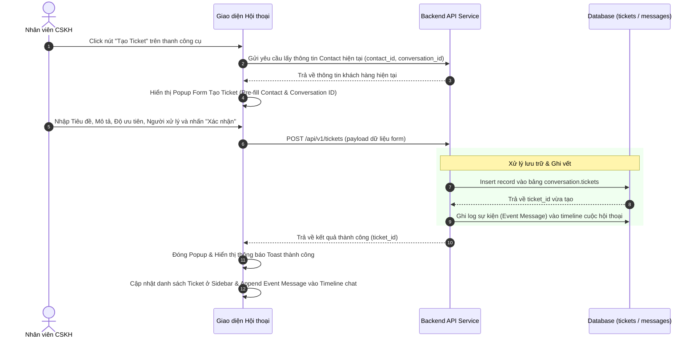

# BẢNG GHI NHẬN THAY ĐỔI TÀI LIỆU

| Phiên bản | Ngày | Người cập nhật | Vị trí thay đổi | Lý do chi tiết |
| :--- | :--- | :--- | :--- | :--- |
| 1.0.0 | 2026-07-01 | Mira-Miraaa | Toàn bộ tài liệu | Tạo mới tài liệu đặc tả tính năng Tạo Ticket tại màn hình Hội thoại |

---

# BẢNG QUẢN LÝ TIẾN ĐỘ THỰC THI

| Giai đoạn | Thời gian | Phần mục | Phiên bản áp dụng |
| :--- | :--- | :--- | :--- |
| Sprint 5 | 01/07/2026 - ... | Xây dựng nút tạo ticket, form tạo nhanh pre-fill thông tin, ghi nhận timeline và hiển thị liên kết ở sidebar | V1.0 |

---

# TÀI LIỆU THAM CHIẾU

| STT | Tài liệu | Liên kết / Đường dẫn |
| :--- | :--- | :--- |
| 1 | SRS Conversation | [SRS Conversation](file:///F:/Gapone%20Conversation/Docs/SRS%20Conversation.md) |
| 2 | SRS Ticket Management | [SRS Ticket Management](file:///F:/Gapone%20Conversation/Docs/SRS%20Ticket%20Management.md) |

---

## I. TỔNG QUAN & MỤC TIÊU

### 1.1. Hiện trạng
Khi nhân viên chăm sóc khách hàng (Agent) đang nhắn tin hỗ trợ khách hàng tại màn hình **Hội thoại (Conversation)**, nếu phát sinh các yêu cầu cần xử lý liên phòng ban hoặc cần theo dõi lâu dài (ví dụ: Khách báo lỗi sản phẩm, yêu cầu xuất hóa đơn đỏ), Agent phải chuyển sang phân hệ Ticket để nhập thủ công lại toàn bộ thông tin khách hàng. Việc này gây gián đoạn công việc, kéo dài thời gian phản hồi tin nhắn của khách và dễ dẫn đến sai sót khi nhập lại dữ liệu (tên, SĐT, mã cuộc hội thoại liên quan).

### 1.2. Mục tiêu tính năng
*   Cho phép Agent tạo nhanh Ticket xử lý ngay tại màn hình chat Hội thoại hiện tại.
*   Tự động liên kết (pre-fill) thông tin hồ sơ khách hàng (`ContactID`) và cuộc trò chuyện hiện tại (`ConversationID`).
*   Ghi vết hành động tạo Ticket lên Timeline trò chuyện để làm căn cứ theo dõi lịch sử.
*   Hiển thị danh sách các Ticket đã tạo của khách hàng ngay trên Sidebar thông tin khách hàng ở góc phải màn hình chat.

### 1.3. Phạm vi áp dụng
*   **Đường dẫn truy cập**: Đăng nhập hệ thống > **Hội thoại** > Click chọn một cuộc trò chuyện cụ thể.
*   **Đối tượng người dùng**: Nhân viên CSKH (Agent) phụ trách cuộc trò chuyện.

---

## II. ĐỊNH NGHĨA ĐỐI TƯỢNG & PHÂN QUYỀN

### 2.1. Đối tượng người dùng và phân quyền
*   **Agent (được phân công chăm sóc hội thoại)**: Có quyền nhấn nút tạo Ticket và điền form thông tin.
*   **Hệ thống (Bot / Automation)**: Có thể tự động kích hoạt tạo ticket theo kịch bản (nếu được cấu hình, tuy nhiên phạm vi tài liệu này chỉ tập trung vào luồng Agent tạo thủ công).

### 2.2. Luồng xử lý nghiệp vụ tạo Ticket tại Hội thoại (Technical Workflow)

---

## III. PHÂN TÍCH CHI TIẾT TÍNH NĂNG

### 3.1. Form Tạo nhanh Ticket trên giao diện Hội thoại

#### Vị trí nút kích hoạt
Nút **"Tạo Ticket"** (kèm icon thẻ/ticket) được thiết kế tại hai vị trí để Agent dễ tiếp cận:
1.  Tại thanh công cụ phía trên khung nhập tin nhắn (nằm cạnh các nút gửi ảnh, mẫu tin nhắn).
2.  Tại đầu phần mục **"Ticket liên quan"** ở Sidebar thông tin khách hàng bên phải màn hình.

#### Trường dữ liệu và Ràng buộc của Form (Popup Form)

| STT | Tên trường trên Form | Loại control | Quy tắc hiển thị / Ràng buộc dữ liệu |
| :--- | :--- | :--- | :--- |
| 1 | Khách hàng | Text (Read-only) | Tự động lấy tên khách hàng của cuộc trò chuyện hiện tại. Định dạng: `[Tên khách hàng] - SĐT`. |
| 2 | Mã cuộc hội thoại | Text (Read-only) | Tự động điền mã `conversation_id` hiện tại để liên kết nguồn gốc. |
| 3 | Tiêu đề Ticket | Input Text | **Bắt buộc**, tối đa 255 ký tự. Gợi ý Agent nhập ngắn gọn vấn đề. |
| 4 | Nội dung chi tiết | Textarea | Không bắt buộc, tối đa 2000 ký tự. Lưu thông tin mô tả chi tiết yêu cầu. |
| 5 | Mức độ ưu tiên | Dropdown | **Bắt buộc**. Giá trị chọn: {`Low`, `Medium`, `High`, `Urgent`}. Mặc định: `Medium`. |
| 6 | Người xử lý | Dropdown Search | Không bắt buộc. Tìm kiếm và chọn Agent trong hệ thống để gán xử lý. Mặc định: Để trống (Chưa phân công). |

---

### 3.2. Ghi nhận sự kiện trên Timeline cuộc trò chuyện & Sidebar thông tin

#### 3.2.1. Ghi nhận sự kiện trên Timeline (Chat Log)
Ngay sau khi Ticket được tạo thành công, hệ thống tự động ghi nhận một tin nhắn hệ thống (System Event Message) vào luồng chat hiện tại của cuộc hội thoại để các Agent khác cùng theo dõi:
> **Hệ thống**: Ticket **#[Mã Ticket] - [Tiêu đề Ticket]** được tạo bởi **[Tên Agent tạo]** lúc **hh:mm**

*Ràng buộc tương tác:*
*   Mã Ticket `#[Mã Ticket]` hiển thị dạng liên kết (Hyperlink) màu xanh thương hiệu.
*   Khi Agent click vào liên kết này, hệ thống sẽ hiển thị một Popup xem nhanh chi tiết thông tin Ticket đó mà không cần chuyển trang.

#### 3.2.2. Sidebar "Ticket liên quan"
Tại cột thông tin khách hàng bên phải (Customer Profile Sidebar), bổ sung phân mục **"Ticket liên quan"** hiển thị danh sách tối đa 5 Ticket gần nhất của khách hàng này (lọc theo `contact_id`):
*   Thông tin hiển thị mỗi dòng: `#[Mã Ticket] - [Tiêu đề] - [Trạng thái (Badge màu)]`.
*   Có nút "Xem tất cả" để chuyển hướng sang màn hình quản lý danh sách Ticket (đã được lọc sẵn theo khách hàng này).

---

### 3.3. Quy tắc nghiệp vụ (Business Rules) & Chỉ số đo lường

*   **BR-CRE-01 (Yêu cầu nhận hội thoại)**: Agent chỉ được phép tạo Ticket khi cuộc hội thoại đang ở trạng thái **Đang xử lý (In Progress)** và đã được phân công cho chính Agent đó. Nếu hội thoại đang ở trạng thái **Mới (Open - Chưa phân công)**, nút "Tạo Ticket" sẽ bị ẩn hoặc disabled.
*   **BR-CRE-02 (Liên kết dữ liệu)**: Một Ticket được tạo từ hội thoại bắt buộc phải lưu trữ đồng thời cả `contact_id` và `conversation_id` để phục vụ đối soát nguồn gốc phát sinh lỗi từ cuộc chat nào.

#### Chỉ số Đo lường (Conversation Ticket Conversion Rate)
Hệ thống tính toán tỷ lệ cuộc hội thoại phát sinh Ticket hỗ trợ ($CR_{\text{ticket}}$) để phân tích mức độ phức tạp của các kênh:
$$CR_{\text{ticket}} = \frac{C_{\text{ticket}}}{C_{\text{closed}}} \times 100\%$$
*Trong đó:*
*   \(C_{\text{ticket}}\): Số lượng cuộc hội thoại có phát sinh ít nhất 1 Ticket trong kỳ báo cáo.
*   \(C_{\text{closed}}\): Tổng số lượng cuộc hội thoại đã đóng (`Closed`) trong kỳ báo cáo.

---

> [!IMPORTANT]
> Việc tạo Ticket tại hội thoại sẽ trigger sự kiện ghi log và phân phối thông báo đến Agent xử lý. Mọi thay đổi về cấu trúc API lưu trữ cần đồng bộ với đặc tả cấu trúc cơ sở dữ liệu quy định tại [SRS Ticket Management](file:///F:/Gapone%20Conversation/Docs/SRS%20Ticket%20Management.md).
