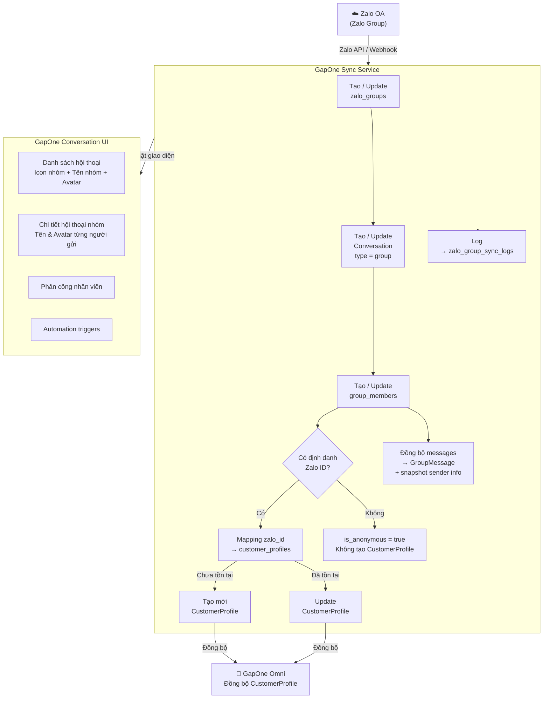

# SRS – ĐỒNG BỘ HỘI THOẠI NHÓM VÀ CONTACT TỪ ZALO OA (GMF GROUP)

---

# BẢNG GHI NHẬN THAY ĐỔI TÀI LIỆU

| **Ngày thay đổi** | **Vị trí** | **Lý do**           | **Mô tả thay đổi**                               | **Phiên bản cũ** | **Phiên bản mới** |
| -------------------------- | ------------------ | -------------------------- | ---------------------------------------------------------- | ------------------------- | -------------------------- |
| 25/05/2026                 | Tạo mới          | Yêu cầu tính năng mới | Đồng bộ Zalo Group (GMF) – Hội thoại nhóm & Contact | —                        | V1.0                       |

---

# BẢNG QUẢN LÝ TIẾN ĐỘ THỰC THI

| **Giai đoạn** | **Thời gian** | **Phần mục** | **Phiên bản áp dụng** |
| --------------------- | -------------------- | -------------------- | ------------------------------- |
| Sprint TBD            | TBD                  | Toàn bộ tài liệu | V1.0                            |

---

# TÀI LIỆU THAM CHIẾU

| **STT** | **Tài liệu**                                          |
| ------------- | ------------------------------------------------------------- |
| 1             | Story GMF Group –`Output/Mô tả story/Story GMF Group.md` |
| 2             | SRS Conversation –`Docs/SRS Conversation.md`               |
| 3             | Zalo OA API Documentation (https://developers.zalo.me/docs)   |

---

## I. TỔNG QUAN & MỤC TIÊU

### 1.1. Hiện trạng

Hệ thống GapOne Conversation hiện tại chỉ hỗ trợ cuộc hội thoại **1-1** (Chat đơn) giữa tài khoản kênh Zalo OA và một khách hàng. Toàn bộ cơ chế đồng bộ, lưu trữ và hiển thị dữ liệu đang được xây dựng xung quanh mô hình `Conversation ↔ CustomerProfile` (1 hội thoại – 1 khách hàng).

### 1.2. Mục tiêu tính năng

Nâng cấp hệ thống để hỗ trợ **cuộc hội thoại nhóm (Zalo Group / GMF Group)**:

- Tự động quét, đồng bộ toàn bộ danh sách Zalo Group mà Zalo OA tạo ra.
- Khởi tạo và hiển thị hội thoại nhóm trên giao diện module Hội thoại.
- Bóc tách, tạo mới / cập nhật hồ sơ khách hàng từ thành viên nhóm.
- Cho phép agent chat, phân công và chạy Automation trong nhóm.

### 1.3. Phạm vi áp dụng

| **Phạm vi**                    | **Chi tiết**                                                                                  |
| ------------------------------------- | ---------------------------------------------------------------------------------------------------- |
| **Kênh**                       | Zalo OA tích hợp với GapOne                                                                       |
| **Loại hội thoại mới**      | Zalo Group (Chat nhóm / GMF Group)                                                                  |
| **Đối tượng người dùng** | Agent, Admin, Supervisor trên GapOne Conversation                                                   |
| **Ngoài phạm vi**             | Xóa/thêm thành viên nhóm trực tiếp từ GapOne; lịch sử chat trước thời điểm đồng bộ |

---

## II. ĐỊNH NGHĨA ĐỐI TƯỢNG & BỔ SUNG MÔ HÌNH DỮ LIỆU

### 2.1. Bổ sung định nghĩa loại Conversation

| **STT** | **Khái niệm**                          | **Mô tả**                                                                           | **Giá trị type** |
| ------------- | ---------------------------------------------- | ------------------------------------------------------------------------------------------- | ------------------------ |
| 1             | **Cuộc hội thoại đơn / Chat 1-1**   | Cuộc hội thoại 1-1 giữa tài khoản kênh và một khách hàng                         | `individual`           |
| 2             | **Cuộc hội thoại nhóm / Chat nhóm** | Cuộc hội thoại 1-n giữa tài khoản kênh và nhiều khách hàng trong một Zalo Group | `group`                |

> **Quy tắc phân loại:** Trường `conversation_type` (ENUM: `individual` / `group`) được thêm vào bảng `Conversation` để phân biệt và áp dụng logic hiển thị, trạng thái, Automation riêng biệt.

---

### 2.2. Mở rộng bảng định nghĩa đối tượng

Kế thừa toàn bộ bảng đối tượng từ **SRS Conversation (Mục I – Thiết kế hạ tầng)**, bổ sung các đối tượng mới sau:

| **STT** | **Đối tượng** | **Mô tả**                                                                                | **Thuộc tính chính**                                                                                                                                                                                                      | **Mối quan hệ**                                                                                     |
| ------------- | ----------------------- | ------------------------------------------------------------------------------------------------ | ---------------------------------------------------------------------------------------------------------------------------------------------------------------------------------------------------------------------------------- | ----------------------------------------------------------------------------------------------------------- |
| 9             | **ZaloGroup**     | Đại diện cho một Zalo Group mà Zalo OA đã tạo và đã được đồng bộ về hệ thống | `group_id` (PK, Zalo Group ID), `oa_id` (FK → Account), `group_name`, `avatar_url`, `member_count`, `sync_status` (active / inactive), `synced_at`, `created_at`, `updated_at`                                  | ZaloGroup 1—1 Conversation (type=group): Mỗi Zalo Group map tới đúng 1 Conversation nhóm trên GapOne |
| 10            | **GroupMember**   | Đại diện cho một thành viên trong Zalo Group đã được đồng bộ                       | `member_id` (PK), `group_id` (FK → ZaloGroup), `zalo_id` (Zalo User ID), `display_name`, `avatar_url`, `is_anonymous` (bool), `contact_id` (FK → CustomerProfile, nullable), `joined_at`, `left_at` (nullable) | GroupMember n—1 ZaloGroup; GroupMember 0..1—1 CustomerProfile (map khi có đủ thông tin định danh)   |
| 11            | **GroupMessage**  | Tin nhắn trong hội thoại nhóm, mở rộng từ Message                                         | Kế thừa Message + thêm:`sender_member_id` (FK → GroupMember), `sender_display_name`, `sender_avatar_url`                                                                                                                 | GroupMessage n—1 Conversation (type=group); GroupMessage n—1 GroupMember                                  |

---

### 2.3. Mối quan hệ giữa Contact hệ thống và Contact từ nhóm

Đây là điểm cốt lõi cần làm rõ về logic mapping:

```
CustomerProfile (hệ thống GapOne)
    ↑ 0..1
    |  (map khi có đủ Zalo ID để định danh)
GroupMember (thành viên trong nhóm)
    ↑ n
    |
ZaloGroup (nhóm Zalo)
```

#### Quy tắc mapping Contact:

| **Tình huống**                                                             | **Hành vi hệ thống**                                                                                                                                                |
| ---------------------------------------------------------------------------------- | ---------------------------------------------------------------------------------------------------------------------------------------------------------------------------- |
| **Thành viên nhóm đã tồn tại trong CustomerProfile** (trùng Zalo ID) | Hệ thống**map** `GroupMember.contact_id` → `CustomerProfile` hiện có. Không tạo bản ghi mới. Cập nhật `display_name`, `avatar_url` nếu thay đổi. |
| **Thành viên nhóm chưa tồn tại trong CustomerProfile** (Zalo ID mới)  | Hệ thống**tạo mới** `CustomerProfile` với thông tin từ Zalo (Zalo ID, tên, avatar). Gán `contact_id` vào `GroupMember`. Đồng bộ về GapOne Omni.    |
| **Zalo không trả về định danh thành viên** (từ chối chia sẻ)       | `GroupMember.is_anonymous = true`. `contact_id = null`. Hiển thị tên: `"Thành viên [Zalo_ID_rút_gọn]"`. **Không tạo CustomerProfile**.                  |
| **Thành viên nhóm đã có CustomerProfile nhưng SĐT/email chưa có**  | Tạo CustomerProfile với Zalo ID là định danh chính. Các trường SĐT, email để trống, agent có thể bổ sung thủ công.                                         |
| **Thành viên rời nhóm**                                                  | `GroupMember.left_at` được cập nhật. `CustomerProfile` giữ nguyên, không bị xóa.                                                                               |

#### Cơ chế định danh chính (Primary Identifier):

- Đối với thành viên nhóm Zalo, **`zalo_id`** là khóa định danh chính để mapping vào `CustomerProfile`.
- Nếu `CustomerProfile` đã được tạo từ hội thoại 1-1 Zalo OA trước đó (cùng `zalo_id`), hệ thống **không tạo duplicate** mà map trực tiếp.
- Nếu `CustomerProfile` từ kênh khác (Telegram, Messenger) có SĐT trùng → **không tự động merge**, chỉ GapOne Omni mới xử lý merge liên kênh.

---

## III. DATA SCHEMA ĐỀ XUẤT

### 3.1. Bảng `conversations` – Bổ sung trườn

| **Tên cột**   | **Kiểu dữ liệu**           | **Nullable** | **Mặc định** | **Mô tả**                                                                  |
| --------------------- | ----------------------------------- | ------------------ | --------------------- | ---------------------------------------------------------------------------------- |
| `conversation_type` | ENUM(`'individual'`, `'group'`) | NOT NULL           | `'individual'`      | Phân loại loại hội thoại: đơn hoặc nhóm                                   |
| `group_ref_id`      | VARCHAR(64)                         | NULL               | —                    | Zalo Group ID tương ứng, chỉ có giá trị khi `conversation_type = 'group'` |

---

### 3.2. Bảng `zalo_groups` *(Mới)*

| **Tên cột**  | **Kiểu dữ liệu**          | **Nullable** | **Mặc định** | **Ràng buộc**             | **Mô tả**                                                    |
| -------------------- | ---------------------------------- | ------------------ | --------------------- | --------------------------------- | -------------------------------------------------------------------- |
| `id`               | BIGINT UNSIGNED                    | NOT NULL           | AUTO_INCREMENT        | PRIMARY KEY                       | ID nội bộ                                                          |
| `group_id`         | VARCHAR(64)                        | NOT NULL           | —                    | UNIQUE                            | Zalo Group ID từ Zalo API                                           |
| `oa_account_id`    | BIGINT UNSIGNED                    | NOT NULL           | —                    | FK →`accounts.id`              | Tài khoản Zalo OA sở hữu nhóm                                   |
| `conversation_id`  | BIGINT UNSIGNED                    | NULL               | —                    | FK →`conversations.id`, UNIQUE | Conversation nhóm tương ứng trên GapOne                         |
| `group_name`       | VARCHAR(500)                       | NOT NULL           | —                    | —                                | Tên hiển thị của nhóm                                           |
| `avatar_url`       | VARCHAR(2048)                      | NULL               | —                    | —                                | URL ảnh đại diện nhóm                                           |
| `member_count`     | INT UNSIGNED                       | NOT NULL           | `0`                 | —                                | Số lượng thành viên hiện tại                                  |
| `sync_status`      | ENUM(`'active'`, `'inactive'`) | NOT NULL           | `'active'`          | —                                | `active`: nhóm còn tồn tại; `inactive`: nhóm bị xóa/khóa |
| `synced_at`        | DATETIME                           | NOT NULL           | —                    | —                                | Thời điểm lần đầu đồng bộ về hệ thống                    |
| `last_activity_at` | DATETIME                           | NULL               | —                    | —                                | Thời điểm hoạt động cuối cùng của nhóm                     |
| `created_at`       | DATETIME                           | NOT NULL           | `CURRENT_TIMESTAMP` | —                                | Thời điểm tạo bản ghi                                           |
| `updated_at`       | DATETIME                           | NOT NULL           | `CURRENT_TIMESTAMP` | ON UPDATE CURRENT_TIMESTAMP       | Thời điểm cập nhật gần nhất                                   |

---

### 3.3. Bảng `group_members` *(Mới)*

| **Tên cột** | **Kiểu dữ liệu** | **Nullable** | **Mặc định** | **Ràng buộc**         | **Mô tả**                                                        |
| ------------------- | ------------------------- | ------------------ | --------------------- | ----------------------------- | ------------------------------------------------------------------------ |
| `id`              | BIGINT UNSIGNED           | NOT NULL           | AUTO_INCREMENT        | PRIMARY KEY                   | ID nội bộ                                                              |
| `group_id`        | VARCHAR(64)               | NOT NULL           | —                    | FK →`zalo_groups.group_id` | Nhóm mà thành viên này thuộc về                                   |
| `zalo_id`         | VARCHAR(128)              | NOT NULL           | —                    | UNIQUE KEY cùng `group_id` | Zalo User ID của thành viên                                           |
| `display_name`    | VARCHAR(500)              | NULL               | —                    | —                            | Tên hiển thị lấy từ Zalo                                            |
| `avatar_url`      | VARCHAR(2048)             | NULL               | —                    | —                            | URL ảnh đại diện thành viên                                        |
| `is_anonymous`    | TINYINT(1)                | NOT NULL           | `0`                 | —                            | `1` = Zalo không trả về định danh (từ chối chia sẻ thông tin) |
| `contact_id`      | BIGINT UNSIGNED           | NULL               | —                    | FK →`customer_profiles.id` | Liên kết hồ sơ khách hàng;`NULL` nếu ẩn danh                   |
| `joined_at`       | DATETIME                  | NULL               | —                    | —                            | Thời điểm thành viên tham gia nhóm                                 |
| `left_at`         | DATETIME                  | NULL               | —                    | —                            | Thời điểm thành viên rời nhóm;`NULL` nếu còn trong nhóm      |
| `created_at`      | DATETIME                  | NOT NULL           | `CURRENT_TIMESTAMP` | —                            | Thời điểm tạo bản ghi                                               |
| `updated_at`      | DATETIME                  | NOT NULL           | `CURRENT_TIMESTAMP` | ON UPDATE CURRENT_TIMESTAMP   | Thời điểm cập nhật gần nhất                                       |

---

### 3.4. Bảng `messages` – Bổ sung trường cho Group Message

| **Tên cột**     | **Kiểu dữ liệu** | **Nullable** | **Mặc định** | **Ràng buộc**     | **Mô tả**                                                 |
| ----------------------- | ------------------------- | ------------------ | --------------------- | ------------------------- | ----------------------------------------------------------------- |
| `sender_member_id`    | BIGINT UNSIGNED           | NULL               | —                    | FK →`group_members.id` | Thành viên gửi tin; chỉ có giá trị với hội thoại nhóm  |
| `sender_display_name` | VARCHAR(500)              | NULL               | —                    | —                        | **Snapshot** tên thành viên tại thời điểm gửi tin   |
| `sender_avatar_url`   | VARCHAR(2048)             | NULL               | —                    | —                        | **Snapshot** avatar thành viên tại thời điểm gửi tin |

> **Lý do snapshot:** Tên và avatar của thành viên có thể thay đổi sau khi tin nhắn được gửi. Lưu snapshot đảm bảo lịch sử tin nhắn luôn hiển thị đúng, không bị ảnh hưởng bởi thay đổi sau này.

---

### 3.5. Bảng `customer_profiles` – Bổ sung trường định danh Zalo

| **Tên cột** | **Kiểu dữ liệu** | **Nullable** | **Mặc định** | **Ràng buộc** | **Mô tả**                                         |
| ------------------- | ------------------------- | ------------------ | --------------------- | --------------------- | --------------------------------------------------------- |
| `zalo_id`         | VARCHAR(128)              | NULL               | —                    | UNIQUE                | Zalo User ID – định danh chính để mapping từ nhóm |
| `zalo_avatar`     | VARCHAR(2048)             | NULL               | —                    | —                    | URL avatar từ Zalo                                       |
| `zalo_name`       | VARCHAR(500)              | NULL               | —                    | —                    | Tên Zalo của khách hàng                               |

---

### 3.6. Bảng `zalo_group_sync_logs` *(Mới)*

| **Tên cột** | **Kiểu dữ liệu**                         | **Nullable** | **Mặc định** | **Ràng buộc** | **Mô tả**                                                |
| ------------------- | ------------------------------------------------- | ------------------ | --------------------- | --------------------- | ---------------------------------------------------------------- |
| `id`              | BIGINT UNSIGNED                                   | NOT NULL           | AUTO_INCREMENT        | PRIMARY KEY           | ID nội bộ                                                      |
| `oa_account_id`   | BIGINT UNSIGNED                                   | NOT NULL           | —                    | FK →`accounts.id`  | Tài khoản Zalo OA thực hiện đồng bộ                       |
| `sync_type`       | ENUM(`'full_scan'`, `'webhook'`, `'retry'`) | NOT NULL           | —                    | —                    | Loại đồng bộ: quét toàn bộ / webhook / thử lại          |
| `status`          | ENUM(`'success'`, `'failed'`, `'partial'`)  | NOT NULL           | —                    | —                    | Kết quả đồng bộ                                             |
| `error_code`      | VARCHAR(20)                                       | NULL               | —                    | —                    | HTTP status code hoặc mã lỗi nội bộ (VD:`401`, `ZG001`) |
| `error_message`   | TEXT                                              | NULL               | —                    | —                    | Chi tiết thông báo lỗi                                       |
| `groups_synced`   | INT UNSIGNED                                      | NOT NULL           | `0`                 | —                    | Số nhóm được đồng bộ thành công trong lần này        |
| `members_synced`  | INT UNSIGNED                                      | NOT NULL           | `0`                 | —                    | Số thành viên được đồng bộ thành công trong lần này |
| `started_at`      | DATETIME                                          | NOT NULL           | —                    | —                    | Thời điểm bắt đầu đồng bộ                               |
| `finished_at`     | DATETIME                                          | NULL               | —                    | —                    | Thời điểm kết thúc đồng bộ;`NULL` nếu đang chạy     |
| `created_at`      | DATETIME                                          | NOT NULL           | `CURRENT_TIMESTAMP` | —                    | Thời điểm tạo bản ghi log                                   |

---

## IV. PHÂN TÍCH CHI TIẾT TÍNH NĂNG

### 4.1. Đồng bộ danh sách Zalo Group

#### Mô tả chức năng

| **Tên nghiệp vụ**         | Đồng bộ danh sách Zalo Group từ Zalo OA                                                                                                                                  |
| ---------------------------------- | ----------------------------------------------------------------------------------------------------------------------------------------------------------------------------- |
| **Module**                   | Hệ thống (Background Service) → Module Hội thoại                                                                                                                         |
| **Mô tả**                  | Sau khi Zalo OA được kết nối thành công với GapOne, hệ thống tự động quét toàn bộ Zalo Group mà OA đó đã tạo và đồng bộ về danh sách Hội thoại. |
| **Điều kiện kích hoạt** | (1) Kết nối Zalo OA thành công lần đầu; (2) Webhook nhận event nhóm mới; (3) Cron job định kỳ kiểm tra nhóm có phát sinh hoạt động                        |
| **Kết quả**                | Các Zalo Group được hiển thị trong danh sách Hội thoại với `type = group`                                                                                         |

#### Luồng xử lý đồng bộ

```
1. GapOne kết nối Zalo OA (Access Token hợp lệ)
      ↓
2. Gọi Zalo API: GET /v2.0/oa/groups?oa_id={oa_id}
      ↓
3. Với mỗi Group trả về:
   a. Kiểm tra group_id đã tồn tại trong zalo_groups chưa?
      - Chưa có → INSERT zalo_groups + tạo mới Conversation (type=group) + INSERT zalo_group_sync_logs
      - Đã có + sync_status=active → UPDATE last_activity_at
      - Đã có + sync_status=inactive → UPDATE sync_status=active (nhóm được khôi phục)
      ↓
4. Gọi Zalo API: GET /v2.0/oa/group/members?group_id={group_id}
   → Đồng bộ danh sách thành viên (xem mục 4.3)
      ↓
5. Cập nhật UI: Hiển thị Conversation mới trong danh sách
      ↓
6. Đăng ký Webhook nhận event real-time từ nhóm
```

#### Điều kiện đồng bộ lịch sử

| **Điều kiện**                                        | **Hành vi**                                           |
| ------------------------------------------------------------- | ------------------------------------------------------------ |
| Nhóm có hoạt động**sau** thời điểm kết nối OA | Đồng bộ tin nhắn từ thời điểm kết nối trở về sau |
| Nhóm**không có hoạt động** từ sau khi kết nối  | Không đồng bộ, không tạo Conversation                  |
| Nhóm được tạo**sau** khi OA kết nối              | Nhận qua Webhook, đồng bộ từ tin nhắn đầu tiên      |

---

### 4.2. Phân biệt giao diện Nhóm vs Chat 1-1

#### Trường dữ liệu bổ sung trong danh sách Hội thoại

| **STT** | **Tên Trường** | **Kiểu Dữ Liệu** | **Mô Tả**                                                       | **Ràng Buộc**                                                                                 |
| ------------- | ----------------------- | ------------------------- | ----------------------------------------------------------------------- | ----------------------------------------------------------------------------------------------------- |
| 1             | Icon nhóm              | ICON / IMAGE              | Biểu tượng nhóm (icon nhiều người) hiển thị trước tên nhóm | Bắt buộc khi `conversation_type = group`                                                          |
| 2             | Tên nhóm              | VARCHAR(500)              | Tên hiển thị của Zalo Group                                         | Lấy từ `zalo_groups.group_name`. Không được để trống                                       |
| 3             | Avatar nhóm            | IMAGE / STRING            | Ảnh đại diện của nhóm                                             | Lấy từ `zalo_groups.avatar_url`. Nếu null → hiển thị avatar mặc định (icon nhiều người) |
| 4             | Logo Zalo               | IMAGE                     | Symbol logo Zalo hiển thị ở góc dưới avatar nhóm                 | Bắt buộc, giống như hội thoại đơn Zalo                                                        |
| 5             | Nội dung xem trước   | TEXT                      | `[Tên người gửi]: [nội dung tin nhắn gần nhất]`               | Tối đa 100 ký tự                                                                                  |

#### Quy tắc hiển thị Avatar nhóm

| **Trường hợp**             | **Hiển thị**                                                    |
| ----------------------------------- | ----------------------------------------------------------------------- |
| Nhóm có avatar                    | Hiển thị avatar của nhóm                                            |
| Nhóm không có avatar             | Hiển thị avatar mặc định hệ thống (icon group – nhiều người) |
| Avatar URL lỗi/không tải được | Fallback về avatar mặc định hệ thống                              |

---

### 4.3. Đồng bộ thông tin thành viên (Member – Customer Info)

#### Luồng xử lý mapping Contact

```
Nhận danh sách thành viên từ Zalo API
      ↓
Với mỗi thành viên:
│
├─── [Zalo trả về định danh đầy đủ]
│         ↓
│    Tìm CustomerProfile theo zalo_id
│    ├─── [Tìm thấy] → Map group_members.contact_id → CustomerProfile
│    │                  Update display_name, avatar nếu thay đổi
│    └─── [Không tìm thấy] → Tạo mới CustomerProfile
│                              (zalo_id, zalo_name, zalo_avatar)
│                              Map group_members.contact_id → CustomerProfile mới
│                              Đồng bộ sang GapOne Omni
│
└─── [Zalo không trả về định danh (is_anonymous)]
          ↓
     Tạo GroupMember với is_anonymous=true, contact_id=NULL
     Hiển thị: "Thành viên [zalo_id_rút_gọn]"
     Không tạo CustomerProfile
```

#### Trường dữ liệu CustomerProfile tạo từ nhóm

| **Trường** | **Nguồn dữ liệu** | **Bắt buộc**   | **Ghi chú**        |
| ------------------ | -------------------------- | ---------------------- | ------------------------- |
| `zalo_id`        | Zalo API                   | Bắt buộc             | Định danh chính        |
| `zalo_name`      | Zalo API                   | Có nếu Zalo trả về |                           |
| `zalo_avatar`    | Zalo API                   | Không bắt buộc      |                           |
| `first_name`     | Tách từ `zalo_name`    | Có nếu có tên      |                           |
| `phone`          | Không có                 | Để trống            | Agent bổ sung thủ công |
| `email`          | Không có                 | Để trống            | Agent bổ sung thủ công |
| `source_channel` | `'zalo_group'`           | Bắt buộc             | Đánh dấu nguồn tạo   |

---

### 4.4. Xem chi tiết Hội thoại nhóm

#### Mô tả chức năng

| **Tên nghiệp vụ** | Xem chi tiết cuộc hội thoại nhóm Zalo                                                                                                |
| -------------------------- | ----------------------------------------------------------------------------------------------------------------------------------------- |
| **Module**           | Trang chủ > Hội thoại > Chọn hội thoại nhóm                                                                                        |
| **Mô tả**          | Khi agent click vào một hội thoại nhóm, giao diện hiển thị lịch sử tin nhắn nhóm kèm tên và avatar người gửi từng tin. |
| **Điều kiện**     | `conversation_type = group`; nhóm đang ở `sync_status = active`                                                                    |
| **Kết quả**        | Hiển thị đầy đủ khung chat nhóm với tên nhóm, thành viên, lịch sử tin nhắn                                                 |

#### Trường dữ liệu chi tiết hội thoại nhóm

| **STT** | **Tên Trường**  | **Kiểu Dữ Liệu** | **Mô Tả**                                    | **Ràng Buộc**                                                        |
| ------------- | ------------------------ | ------------------------- | ---------------------------------------------------- | ---------------------------------------------------------------------------- |
| 1             | Tên nhóm               | VARCHAR(500)              | Tên của Zalo Group                                 | Bắt buộc                                                                   |
| 2             | Avatar nhóm             | IMAGE                     | Ảnh đại diện nhóm                               | Bắt buộc (fallback về mặc định nếu null)                              |
| 3             | Số lượng thành viên | INT                       | Tổng số thành viên hiện tại trong nhóm        | Hiển thị dạng "X thành viên"                                            |
| 4             | Avatar người gửi      | IMAGE                     | Ảnh đại diện của từng thành viên trong nhóm | Hiển thị bên cạnh từng tin nhắn                                        |
| 5             | Tên người gửi        | VARCHAR(500)              | Tên thành viên gửi tin nhắn đó                | Hiển thị phía trên nội dung tin nhắn (với tin nhắn từ khách hàng) |
| 6             | Nội dung tin nhắn      | TEXT                      | Nội dung từng tin nhắn                            | Bắt buộc                                                                   |
| 7             | Thời gian gửi          | DATETIME                  | Thời điểm gửi tin nhắn                          | Không được null                                                          |
| 8             | Khung nhập              | STRING                    | Ô nhập tin nhắn gửi vào nhóm                   | Bị khóa (disabled) khi `sync_status = inactive`                          |
| 9             | Nút gửi                | BUTTON                    | Gửi tin nhắn vào Zalo Group                       | Chỉ hoạt động khi `sync_status = active`                               |

#### Hiệu chỉnh hiển thị so với hội thoại đơn

| **Yếu tố**                                 | **Hội thoại đơn**  | **Hội thoại nhóm**                         |
| -------------------------------------------------- | ---------------------------- | --------------------------------------------------- |
| Panel thông tin khách hàng (bên phải)         | Hiển thị đầy đủ        | **Không hiển thị**                         |
| Trạng thái hội thoại (Open/In Progress/Closed) | Áp dụng                    | **Không áp dụng**                          |
| Trạng thái nhóm                                 | N/A                          | `Hoạt động` / `Ngừng hoạt động`          |
| Phân công nhân viên                            | Có                          | **Vẫn áp dụng**                            |
| Nhãn hội thoại (Tag)                            | Có                          | Có                                                 |
| Hiển thị tên người gửi từng tin             | Chỉ hiện tên khách hàng | **Hiện tên + avatar cho mọi thành viên** |

---

### 4.5. Trạng thái Hội thoại nhóm

#### Bảng định nghĩa trạng thái

| **STT** | **Trạng thái** | **Giá trị** | **Mô tả**                         | **Hành vi**                                                    |
| ------------- | ---------------------- | ------------------- | ----------------------------------------- | --------------------------------------------------------------------- |
| 1             | Hoạt động           | `active`          | Nhóm vẫn tồn tại trên Zalo           | Cho phép gửi/nhận tin nhắn, chạy Automation                      |
| 2             | Ngừng hoạt động    | `inactive`        | Nhóm bị xóa hoặc bị khóa trên Zalo | Khóa ô nhập liệu; ngừng Automation; hiển thị banner cảnh báo |

#### Bảng hành vi chuyển trạng thái

| **Từ trạng thái** | **Sang trạng thái** | **Điều kiện kích hoạt**                                    |
| -------------------------- | --------------------------- | --------------------------------------------------------------------- |
| `active`                 | `inactive`                | Webhook nhận event `group_deleted` hoặc `group_locked` từ Zalo |
| `inactive`               | `active`                  | Webhook nhận event `group_restored` (nếu Zalo hỗ trợ)           |

---

### 4.6. Tương tác trong nhóm – Agent chat vào nhóm

| **Hành vi**       | **Mô tả**                                                                                          |
| ------------------------ | ---------------------------------------------------------------------------------------------------------- |
| Agent nhập tin và gửi | Hệ thống gọi Zalo API gửi tin vào `group_id` tương ứng                                           |
| Tin nhắn thành công   | Hiển thị trong khung chat với nhãn [Tên Agent] + logo GapOne                                          |
| Tin nhắn thất bại     | Hiển thị thông báo lỗi (xem Bảng mã lỗi – Mục 4.9)                                               |
| Rate limit               | Đưa vào hàng đợi, retry tối đa 3 lần; sau 3 lần thất bại → log "Failed", cảnh báo Dashboard |

---

### 4.7. Kích hoạt Tự động hóa (Automation) cho nhóm

#### Các trigger mới dành cho Hội thoại nhóm

| **Trigger**            | **Mô tả**                     | **Event Zalo tương ứng**    |
| ---------------------------- | ------------------------------------- | ------------------------------------ |
| Thành viên mới join nhóm | Thành viên được thêm vào nhóm | `group_member_join`                |
| Thành viên rời nhóm      | Thành viên tự rời hoặc bị kick  | `group_member_leave`               |
| Tin nhắn mới trong nhóm   | Bất kỳ thành viên nào gửi tin   | `group_message`                    |
| Nhóm bị xóa/khóa         | Zalo Group bị xóa hoặc khóa       | `group_deleted` / `group_locked` |

#### Ràng buộc Automation cho nhóm

- Automation chỉ hoạt động khi `sync_status = active`.
- Khi nhóm chuyển sang `inactive`, toàn bộ Automation đang chạy cho nhóm đó bị dừng ngay lập tức.
- Automation gửi tin vào nhóm áp dụng cơ chế retry và Rate Limit giống hành vi gửi thủ công (Mục 4.6).

---

### 4.8. Timeline sự kiện – Bổ sung cho hội thoại nhóm

Kế thừa bảng Timeline từ **SRS Conversation (Mục II – Mục 3)**, bổ sung:

| **STT** | **Trường hợp**             | **Hiển thị**                                            |
| ------------- | ----------------------------------- | --------------------------------------------------------------- |
| 1             | Nhóm được đồng bộ lần đầu | `Nhóm [Tên nhóm] được đồng bộ lúc hh:mm`            |
| 2             | Thành viên mới join nhóm        | `[Tên thành viên] đã tham gia nhóm lúc hh:mm`          |
| 3             | Thành viên rời nhóm             | `[Tên thành viên] đã rời nhóm lúc hh:mm`              |
| 4             | Nhóm bị xóa/khóa                | `Nhóm đã ngừng hoạt động lúc hh:mm`                   |
| 5             | Automation được kích hoạt      | `Kịch bản [Tên kịch bản] được kích hoạt lúc hh:mm` |
| 6             | Phân công nhân viên             | *(Kế thừa từ SRS Conversation)*                            |

---

### 4.9. Bảng mã lỗi – Hội thoại nhóm Zalo

| **Mã lỗi** | **Tên lỗi**     | **Nguyên nhân**                         | **Thông báo hiển thị**                                                                 |
| ------------------ | ----------------------- | ----------------------------------------------- | ------------------------------------------------------------------------------------------------ |
| ZG001              | Access Token Expired    | Access Token Zalo OA hết hạn                  | "Lỗi đồng bộ Zalo Group: Phiên kết nối Zalo OA đã hết hạn. Vui lòng tái kết nối." |
| ZG002              | Group Not Found         | Nhóm đã bị xóa hoặc không tồn tại      | "Nhóm không còn tồn tại trên Zalo."                                                        |
| ZG003              | Network Error           | Lỗi mạng hoặc Zalo API không phản hồi     | "Lỗi đồng bộ Zalo Group: Không thể kết nối đến Zalo API. Vui lòng thử lại."         |
| ZG004              | Send Message Failed     | Gửi tin vào nhóm thất bại                  | "Gửi tin nhắn không thành công: Zalo Group không nhận được tin nhắn."                 |
| ZG005              | Rate Limit              | Chạm giới hạn gửi tin của Zalo             | "Đang trong hàng đợi gửi tin. Hệ thống sẽ tự động retry."                             |
| ZG006              | Rate Limit – Max Retry | Vượt 3 lần retry vẫn thất bại             | "Gửi tin nhắn thất bại sau 3 lần thử. Vui lòng kiểm tra Dashboard để xem chi tiết."   |
| ZG007              | Group Inactive          | Nhóm đang ở trạng thái ngừng hoạt động | "Không thể gửi tin nhắn: Nhóm đã ngừng hoạt động."                                    |
| ZG008              | Member Info Unavailable | Zalo không trả về thông tin thành viên    | (Hiển thị nội dung tin nhắn bình thường, tên hiển thị là "Thành viên [ID]")         |
| ZG009              | Sync Scan Failed (5xx)  | Lỗi server phía Zalo khi quét nhóm          | "Lỗi đồng bộ Zalo Group: Zalo API đang gặp sự cố (5xx). Vui lòng thử lại sau."        |
| ZG010              | Unauthorized (401)      | Access Token không hợp lệ                    | "Lỗi xác thực Zalo OA (401). Vui lòng kiểm tra lại kết nối tài khoản kênh."           |

> **Lưu ý:** Tất cả lỗi 5xx/401 khi quét nhóm đều được ghi vào `zalo_group_sync_logs`. Giao diện hiển thị cảnh báo thay vì làm treo UI.

---

## V. ACCEPTANCE CRITERIA

### Happy Path

| **AC** | **Mô tả**                                                                                                                                        | **Điều kiện pass**                                                                   |
| ------------ | -------------------------------------------------------------------------------------------------------------------------------------------------------- | --------------------------------------------------------------------------------------------- |
| AC1          | Hệ thống tự động lấy và hiển thị danh sách Zalo Group mà OA tạo ra lên cột danh sách hội thoại                                          | Tất cả nhóm có hoạt động sau thời điểm kết nối đều xuất hiện trong danh sách |
| AC2          | Hội thoại nhóm có icon nhóm (nhiều người) để phân biệt với chat 1-1                                                                         | Icon hiển thị đúng trước tên nhóm trong cột danh sách                               |
| AC3          | Xem chi tiết hội thoại nhóm hiển thị đầy đủ: tên nhóm, thành viên, lịch sử tin nhắn kể từ thời điểm đồng bộ                     | Tên nhóm, số lượng thành viên và lịch sử tin nhắn hiển thị đúng                |
| AC4          | Tin nhắn thành viên gửi vào nhóm hiển thị avatar + tên người gửi; CustomerProfile được tạo mới hoặc map và đồng bộ về GapOne Omni | Mỗi tin nhắn có avatar/tên đúng; CustomerProfile được tạo/cập nhật chính xác    |
| AC5          | Automation trigger thành công và gửi đúng kịch bản vào Zalo Group                                                                               | Chỉ pass khi Tự động hóa đã được cập nhật thêm trigger cho nhóm                 |

### Edge Cases

| **AC** | **Mô tả**                                                                                                        | **Điều kiện pass**                                                                 |
| ------------ | ------------------------------------------------------------------------------------------------------------------------ | ------------------------------------------------------------------------------------------- |
| AC6          | API quét nhóm thất bại → hiển thị cảnh báo, ghi log, không treo UI                                             | Banner cảnh báo xuất hiện; log ghi đúng mã lỗi; UI vẫn hoạt động bình thường |
| AC7          | Zalo không trả về định danh thành viên → hiển thị "Thành viên [ID]"; tin nhắn vẫn hiển thị               | Tên ẩn danh đúng format; không crash; không tạo CustomerProfile rỗng                |
| AC8          | Nhóm bị xóa → khóa ô nhập liệu, đổi trạng thái "ngừng hoạt động", ngừng Automation                      | Ba hành vi đều xảy ra đúng và đồng thời                                           |
| AC9          | Rate Limit Zalo → đưa vào hàng đợi, retry ≤ 3 lần; sau 3 lần thất bại → log "Failed" + cảnh báo Dashboard | Hệ thống không gửi quá 3 lần; log có trạng thái "Failed"; Dashboard có cảnh báo |

---

## VI. OUT OF SCOPE

| **Tính năng**                                                  | **Lý do**                                                                    |
| ---------------------------------------------------------------------- | ----------------------------------------------------------------------------------- |
| Thêm/xóa thành viên nhóm từ GapOne                               | Zalo OA API không hỗ trợ; thao tác phải thực hiện trực tiếp trên app Zalo |
| Đồng bộ lịch sử tin nhắn nhóm trước thời điểm kết nối OA | Giới hạn kỹ thuật của Zalo API; chỉ lấy từ thời điểm kết nối           |
| Merge tự động CustomerProfile liên kênh                           | Thuộc phạm vi GapOne Omni, không xử lý tại Conversation                       |
| Tạo/quản lý Zalo Group từ GapOne                                   | Ngoài phạm vi, chỉ đồng bộ nhóm đã tạo từ Zalo OA                        |

---

## VII. PHỤ LỤC – LUỒNG DỮ LIỆU TỔNG QUAN


