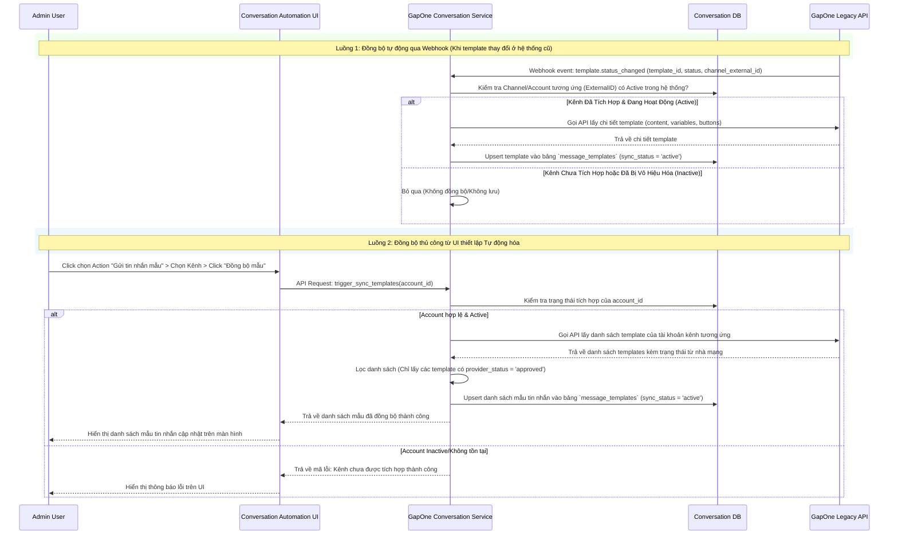
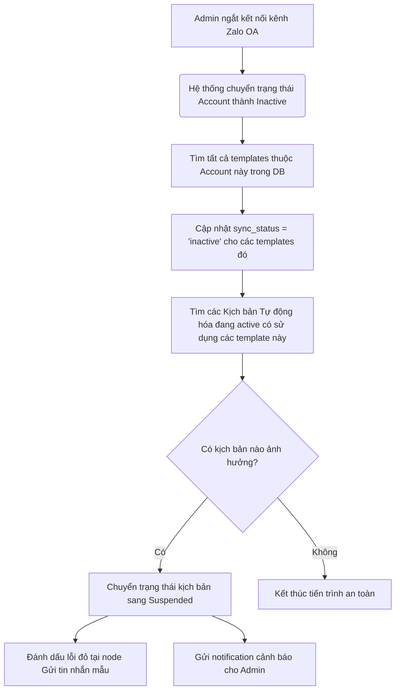

# SRS – ĐỒNG BỘ MẪU TIN NHẮN TỪ HỆ THỐNG GAPONE CŨ (MESSAGE TEMPLATE SYNC)

# BẢNG GHI NHẬN THAY ĐỔI TÀI LIỆU

| **Ngày thay đổi** | **Vị trí** | **Lý do** | **Mô tả thay đổi** | **Phiên bản cũ** | **Phiên bản mới** |
| --- | --- | --- | --- | --- | --- |
| 16/06/2026 | Tạo mới | Yêu cầu tính năng mới | Tài liệu đặc tả tính năng đồng bộ mẫu tin nhắn từ hệ thống GapOne cũ cho kịch bản tự động hóa | — | V1.0 |

---

# BẢNG QUẢN LÝ TIẾN ĐỘ THỰC THI

| **Giai đoạn** | **Thời gian** | **Phần mục** | **Phiên bản áp dụng** |
| --- | --- | --- | --- |
| Sprint 8 | 16/06/2026 - ... | Toàn bộ tài liệu | V1.0 |

---

# TÀI LIỆU THAM CHIẾU

| **STT** | **Tài liệu** | **Liên kết / Đường dẫn** |
| --- | --- | --- |
| 1 | SRS Conversation | [SRS Conversation](file:///f:/Gapone%20Conversation/Docs/SRS%20Conversation.md) |
| 2 | SRS Tự động hóa | [SRS AI chatbot - Automation](file:///f:/Gapone%20Conversation/Docs/SRS%20AI%20chatbot%20-%20Automation.md) |
| 3 | GAPCon AI Chatbot (PRD) | [PRD](file:///f:/Gapone%20Conversation/Docs/%5BGAPCON%5D%20AI%20Chatbot%20for%20e-commerce%20(PRD).docx) |

---

## I. TỔNG QUAN & MỤC TIÊU

### 1.1. Hiện trạng
Hệ thống **GapOne Conversation** đang phát triển module **Tự động hóa (Automation)** cho phép Admin thiết lập các kịch bản tự động phản hồi hoặc gửi tin nhắn chăm sóc khách hàng dựa trên các điều kiện (Trigger) và hành động (Action).
Một trong các hành động cốt lõi là **Gửi tin nhắn mẫu (Send Template Message)** (như mẫu ZNS của Zalo OA, tin nhắn Viber, tin nhắn mẫu WhatsApp). Tuy nhiên, các mẫu tin nhắn này hiện được quản lý, đăng ký và duyệt trên hệ thống **GapOne cũ** (nền tảng cũ xử lý luồng gửi tin và tích hợp trực tiếp nhà mạng/nhà cung cấp). 
Hiện tại, GapOne Conversation chưa có cơ chế đồng bộ và quản lý các mẫu tin nhắn này, dẫn đến việc Admin không thể lựa chọn hoặc xem trước mẫu tin nhắn khi thiết lập kịch bản tự động hóa.

### 1.2. Mục tiêu tính năng
Xây dựng tính năng **Đồng bộ và Xem mẫu tin nhắn khi khởi tạo tự động hóa (Message Template Sync)**.
- **Đồng bộ tự động**: Thiết lập cơ chế kết nối giữa hệ thống GapOne cũ và GapOne Conversation để đồng bộ danh sách mẫu tin nhắn.
- **Ràng buộc tích hợp kênh**: Chỉ đồng bộ và hiển thị các mẫu tin nhắn thuộc về những kênh đã được tích hợp thành công và đang hoạt động (Active) trên hệ thống GapOne Conversation.
- **Xem trước & Thiết lập biến số**: Cho phép Admin xem cấu trúc template (nội dung tĩnh, các biến động `{{placeholder}}` và các nút bấm CTA) trực tiếp trên giao diện Canvas thiết lập kịch bản tự động hóa.

### 1.3. Phạm vi áp dụng

| **Phạm vi** | **Chi tiết** |
| --- | --- |
| **Đường dẫn truy cập** | - **Cài đặt kịch bản**: Menu > Tự động hóa > Tạo mới/Chỉnh sửa kịch bản > Node Hành động: Gửi tin nhắn mẫu. |
| **Đối tượng áp dụng** | - **Admin / Manager**: Người cấu hình kịch bản tự động hóa và quản lý tích hợp kênh. |
| **Kênh hỗ trợ template** | - Zalo Official Account (Zalo ZNS, Zalo Template API).<br>- Các kênh khác sẽ mở rộng ở các phase sau (Viber, SMS Brandname, WhatsApp). |
| **Ngoài phạm vi** | - Đăng ký, chỉnh sửa nội dung hoặc gửi duyệt mẫu tin nhắn trực tiếp từ GapOne Conversation (tất cả các thao tác quản lý này vẫn thực hiện trên cổng GapOne cũ). |

---

## II. ĐỊNH NGHĨA ĐỐI TƯỢNG & PHÂN QUYỀN

### 2.1. Phân quyền người dùng

| **Vai trò** | **Quyền hạn** | **Mô tả** |
| --- | --- | --- |
| **Admin / Manager** | Toàn quyền | - Kích hoạt đồng bộ thủ công mẫu tin nhắn.<br>- Xem danh sách và chi tiết mẫu tin nhắn của các kênh hoạt động.<br>- Thiết lập gán biến số động cho mẫu tin nhắn khi tạo kịch bản. |
| **Agent / CSKH** | Không có quyền | - Không được phép truy cập màn hình thiết lập Tự động hóa và xem cấu hình mẫu tin nhắn. |

### 2.2. Mô hình dữ liệu bổ sung (Database Schema)

Để lưu trữ các mẫu tin nhắn được đồng bộ, bổ sung bảng `message_templates` vào cơ sở dữ liệu `conversation` của hệ thống GapOne Conversation.

#### Bảng: `conversation.message_templates`

| **Tên cột** | **Kiểu dữ liệu** | **Ràng buộc** | **Mô tả** |
| --- | --- | --- | --- |
| `template_id` | UUID | PK, Default `uuid_generate_v4()` | Mã định danh duy nhất của mẫu trên hệ thống Conversation. |
| `gapone_template_id` | VARCHAR(100) | Not Null, Unique | ID của mẫu tin nhắn đồng bộ từ hệ thống GapOne cũ. |
| `account_id` | BIGINT UNSIGNED | FK -> `conversation.accounts(account_id)` | ID tài khoản kênh tích hợp tương ứng trong hệ thống Conversation. |
| `channel_type` | VARCHAR(50) | Not Null | Loại kênh (ví dụ: `zalo_oa`, `viber`, `whatsapp`). |
| `template_name` | VARCHAR(255) | Not Null | Tên hiển thị của mẫu tin nhắn. |
| `content` | TEXT | Not Null | Nội dung chi tiết của mẫu tin nhắn, chứa biến (ví dụ: `Chào {{customer_name}}, đơn hàng {{order_id}}...`). |
| `variables` | JSON | Nullable | Danh sách các biến số được trích xuất (dưới dạng mảng string: `["customer_name", "order_id"]`). |
| `buttons_config` | JSON | Nullable | Cấu hình các nút bấm CTA đi kèm (loại nút, nhãn, link liên kết, số điện thoại...). |
| `provider_status` | VARCHAR(50) | Not Null | Trạng thái phê duyệt từ nhà cung cấp (ví dụ: `approved`, `pending`, `rejected`). |
| `sync_status` | VARCHAR(50) | Not Null | Trạng thái đồng bộ hiển thị: `active` (Kênh đang tích hợp) hoặc `inactive` (Kênh đã bị hủy/ngắt kết nối). |
| `synced_at` | TIMESTAMP | Not Null, Default `NOW()` | Thời điểm thực hiện đồng bộ gần nhất. |
| `created_at` | TIMESTAMP | Default `NOW()` | Thời điểm tạo bản ghi. |
| `updated_at` | TIMESTAMP | Default `NOW()` | Thời điểm cập nhật bản ghi gần nhất. |

---

## III. LOGIC ĐỒNG BỘ GIỮA HAI HỆ THỐNG (SYNC LOGIC)

### 3.1. Sơ đồ luồng xử lý đồng bộ (Sequence Diagram)

Sơ đồ thể hiện luồng đồng bộ mẫu tin nhắn từ hệ thống GapOne cũ sang GapOne Conversation dựa trên trạng thái tích hợp của kênh.



### 3.2. Cơ chế đồng bộ chi tiết (Synchronization Mechanisms)

Hệ thống kết hợp 3 cơ chế để đảm bảo dữ liệu mẫu tin nhắn luôn nhất quán và chính xác:

1. **Đồng bộ thời gian thực qua Webhook (Real-time Event-driven Sync)**:
   - Khi Admin thực hiện đăng ký mẫu, cập nhật nội dung hoặc khi nhà mạng duyệt mẫu (ZNS Approved/Rejected) trên hệ thống GapOne cũ, hệ thống cũ sẽ bắn một Webhook event sang GapOne Conversation.
   - Endpoint nhận webhook: `/api/v1/webhooks/gapone-sync/templates`.
   - **Payload Webhook mẫu**:
     ```json
     {
       "event": "template.updated",
       "timestamp": "2026-06-16T18:50:00Z",
       "data": {
         "gapone_template_id": "temp_zalo_zns_001",
         "channel_external_id": "oa_zalo_123456789",
         "channel_type": "zalo_oa",
         "template_name": "Xác nhận đơn hàng thành công",
         "provider_status": "approved"
       }
     }
     ```
   - Xử lý tại Conversation: Tìm kiếm `accounts` có `external_id = 'oa_zalo_123456789'` và `status = 'active'`. Nếu khớp, tiến hành gọi API GapOne cũ để kéo chi tiết nội dung mẫu về lưu vào DB.

2. **Quét định kỳ bằng Background Job (Cron Job Sync)**:
   - Chạy định kỳ vào lúc **02:00 sáng hàng ngày** để rà soát và đồng bộ lại toàn bộ mẫu tin nhắn của tất cả các kênh đang active nhằm tránh thất thoát sự kiện webhook.
   - Job sẽ truy vấn danh sách tất cả các `accounts` có trạng thái tích hợp là `active` trong bảng `conversation.accounts`, sau đó gọi API của GapOne cũ để tải về danh sách các template được duyệt tương ứng.

3. **Nút kích hoạt đồng bộ tức thời (On-demand UI Sync)**:
   - Trên giao diện Canvas thiết lập kịch bản tự động hóa, khi chọn một kênh cụ thể, hệ thống cung cấp nút **"Đồng bộ mẫu ngay"** bên cạnh droplist chọn mẫu.
   - Khi click, hệ thống sẽ thực hiện gọi API đồng bộ ngay lập tức cho riêng tài khoản kênh đó để Admin có thể sử dụng mẫu mới đăng ký mà không cần chờ Cron Job hay Webhook chậm.

---

### 3.3. Quy tắc kiểm tra tích hợp & Trạng thái kênh (Integration Constraints)

Đây là logic cốt lõi đảm bảo tính an toàn dữ liệu và trải nghiệm người dùng:

#### Quy tắc 1: Điều kiện đồng bộ
- Chỉ đồng bộ các template thỏa mãn:
  1. Có tài khoản kênh tương ứng (`channel_external_id` từ GapOne cũ) trùng khớp với `accounts.external_id` trên hệ thống GapOne Conversation.
  2. Tài khoản kênh đó phải có trạng thái tích hợp thành công (`accounts.integration_status = 'active'`).
  3. Mẫu tin nhắn phải có trạng thái phê duyệt từ nhà cung cấp là **Approved** (Đã phê duyệt). Các mẫu đang chờ duyệt (Pending) hoặc bị từ chối (Rejected) sẽ không được hiển thị cho thiết lập tự động hóa.

#### Quy tắc 2: Xử lý khi ngắt kết nối kênh (Channel Disconnection Behavior)
- Khi một kênh bị **ngắt kết nối** (Admin bấm hủy tích hợp kênh Zalo OA trên màn hình quản lý kênh, chuyển trạng thái account sang `inactive` hoặc xóa tài khoản kênh):
  - Hệ thống tự động chuyển trạng thái của toàn bộ template thuộc tài khoản kênh đó trong bảng `message_templates` thành `sync_status = 'inactive'`.
  - Các template này sẽ **bị ẩn hoàn toàn** khỏi giao diện chọn lựa mẫu tin nhắn khi khởi tạo kịch bản tự động hóa mới.
  - **Đối với các kịch bản tự động hóa đang hoạt động sử dụng mẫu của kênh này**:
    - Hệ thống tự động quét và đánh dấu lỗi cảnh báo trên node kịch bản bị ảnh hưởng.
    - Chuyển trạng thái của kịch bản tự động hóa chứa node này sang **Tạm ngưng (Suspended)** để tránh việc hệ thống gửi tin lỗi sang nhà mạng.
    - Hiển thị thông báo đỏ trên giao diện quản lý kịch bản: *"Kịch bản tạm ngưng do tài khoản kênh liên kết mẫu tin nhắn [Tên mẫu] đã ngắt kết nối."*



---

## IV. GIAO DIỆN NGƯỜI DÙNG (UI/UX)

### 4.1. Vị trí thiết lập mẫu tin nhắn trên Canvas Tự động hóa

Khi Admin thêm mới hoặc chỉnh sửa node hành động **"Gửi tin nhắn"**, giao diện thiết lập chi tiết của node ở panel bên trái (Establish Table) sẽ hiển thị như sau:

1. **Dropdown Chọn tài khoản gửi (Account Selector)**:
   - Chỉ hiển thị danh sách các tài khoản kênh đã tích hợp thành công (ví dụ: *Zalo OA GapIT Media*, *Zalo OA GapOne*).
2. **Loại tin nhắn (Message Type Selector)**:
   - Lựa chọn: `Tin nhắn thường` | `Tin nhắn mẫu (Template)`.
   - Khi chọn `Tin nhắn mẫu (Template)`, các trường cấu hình mẫu tin nhắn sẽ xuất hiện.
3. **Dropdown Chọn mẫu tin nhắn (Template Selector)**:
   - Hiển thị danh sách các template đã được đồng bộ thành công của tài khoản kênh đã chọn ở bước 1.
   - Định dạng hiển thị: `[Mã mẫu] - Tên mẫu tin nhắn` (Ví dụ: `[temp_zns_001] - Xác nhận đơn hàng`).
   - Cạnh dropdown có nút icon **Đồng bộ ngay (Sync icon)** để ép hệ thống gọi API đồng bộ ngay lập tức từ GapOne cũ.
4. **Khu vực cấu hình biến số động (Variables Mapping)**:
   - Tự động quét và hiển thị danh sách các biến động có trong template (ví dụ: `customer_name`, `order_code`).
   - Cung cấp ô nhập liệu cho mỗi biến số, cho phép:
     - Nhập text cứng (Tĩnh).
     - Chọn các biến hệ thống động (ví dụ: `{{contact.first_name}}`, `{{session.id}}`, `{{event.order_code}}`).
5. **Khu vực hiển thị nút bấm (Buttons Preview)**:
   - Đọc từ cấu hình `buttons_config` của template để hiển thị danh sách các nút bấm mà template hỗ trợ. Hiển thị thông tin tĩnh của nút (Label, URL/Phone) để người dùng xem trước, không cho phép chỉnh sửa cấu trúc nút.

---

### 4.2. Khung Xem trước Mẫu tin nhắn (Template Live Preview)

Nằm ở phía dưới cùng của panel thiết lập hoặc hiển thị dạng Popover khi hover vào tên mẫu. Giao diện giả lập lại hiển thị thực tế của tin nhắn trên thiết bị di động (Zalo ZNS UI Mockup):

```text
┌────────────────────────────────────────────────────────┐
│  💬 XEM TRƯỚC MẪU TIN NHẮN                             │
│                                                        │
│  ┌──────────────────────────────────────────────────┐  │
│  │ 🌟 [Tên Zalo OA của doanh nghiệp]                │  │
│  │                                                  │  │
│  │  XÁC NHẬN ĐƠN HÀNG THÀNH CÔNG                    │  │
│  │  Chào [customer_name],                           │  │
│  │  Cảm ơn bạn đã mua sắm tại cửa hàng.             │  │
│  │  Đơn hàng [order_code] của bạn đã được xác nhận  │  │
│  │  thành công và đang được chuẩn bị gửi đi.        │  │
│  │                                                  │  │
│  │  ──────────────────────────────────────────────  │  │
│  │  👉 [Xem chi tiết đơn hàng] (Link: https://...)  │  │
│  │  📞 [Gọi tổng đài hỗ trợ] (SĐT: 1900xxxx)        │  │
│  └──────────────────────────────────────────────────┘  │
│                                                        │
└────────────────────────────────────────────────────────┘
```
- Các biến động hiển thị dưới dạng bôi đậm hoặc nằm trong ngoặc vuông `[customer_name]` để người dùng dễ nhận biết phần nội dung sẽ thay đổi động theo thông tin khách hàng.

---

## V. CÁC RÀNG BUỘC VÀ XỬ LÝ LỖI (CONSTRAINTS & ERROR HANDLING)

### 5.1. Ràng buộc kỹ thuật
- **Đồng bộ biến số**: Hệ thống Conversation phải thực hiện parse chính xác toàn bộ placeholder trong nội dung text dạng `{{variable}}` để sinh ra đúng số lượng trường nhập liệu (input field) trên UI cấu hình.
- **Ràng buộc ký tự**: Khi đồng bộ, nếu nội dung template hoặc cấu trúc nút bấm vượt quá giới hạn thiết kế của hệ thống Conversation (ví dụ: nội dung text ZNS > 1000 ký tự), hệ thống vẫn lưu trữ bình thường nhưng sẽ hiển thị cảnh báo Warning cho Admin khi cấu hình kịch bản.

### 5.2. Xử lý lỗi hệ thống (Error Handling)

| **Mã lỗi** | **Tình huống lỗi** | **Hành vi xử lý của hệ thống** | **Trải nghiệm người dùng** |
| --- | --- | --- | --- |
| **TS001** | API GapOne cũ không phản hồi khi đồng bộ thủ công | Hệ thống retry 3 lần (mỗi lần cách nhau 2 giây). Nếu vẫn lỗi, dừng tiến trình và trả về lỗi. | Hiển thị thông báo trên UI: *"Đồng bộ thất bại: Hệ thống quản lý mẫu tin nhắn (GapOne) đang bận. Vui lòng thử lại sau."* |
| **TS002** | Sai lệch token / Lỗi xác thực tài khoản kênh | Ghi log hệ thống, đánh dấu trạng thái đồng bộ của tài khoản kênh đó là lỗi kết nối. | Hiển thị thông báo: *"Đồng bộ thất bại: Kết nối tới tài khoản kênh bị gián đoạn. Vui lòng kiểm tra lại tích hợp kênh."* |
| **TS003** | Template bị xóa trên GapOne cũ | Khi chạy Cron Job hoặc Webhook nhận sự kiện mẫu bị xóa: Chuyển trạng thái template trong DB thành `sync_status = 'deleted'`. | Cảnh báo lỗi đỏ tại các kịch bản đang sử dụng mẫu này và tạm dừng kịch bản tương tự như trường hợp ngắt kết nối kênh. |
| **TS004** | Sai cấu trúc JSON biến số hoặc nút bấm | Hệ thống tự động parse text thô, bỏ qua cấu trúc nút bấm bị lỗi và lưu nội dung text chính. | Hiển thị template không kèm nút bấm, ghi log warning cho lập trình viên hệ thống kiểm tra API Contract. |

---

## VI. TIÊU CHÍ NGHIỆM THU CHI TIẾT (ACCEPTANCE CRITERIA)

### 6.1. Luồng chạy thành công (Happy Path)

| **Mã AC** | **Tên tiêu chí** | **Điều kiện Đạt (Pass)** |
| --- | --- | --- |
| **AC-01** | Kiểm tra hiển thị mẫu tin nhắn của kênh Active | Khi mở node "Gửi tin nhắn mẫu" trên Canvas, dropdown hiển thị đầy đủ và chính xác danh sách các template được phê duyệt của các tài khoản Zalo OA đang có trạng thái `active`. |
| **AC-02** | Kiểm tra đồng bộ tức thời (Manual Sync) | Admin nhấn nút "Đồng bộ ngay". Hệ thống gửi request API, cập nhật và hiển thị ngay lập tức các mẫu tin nhắn mới được tạo ở GapOne cũ lên dropdown thiết lập. |
| **AC-03** | Ánh xạ và điền biến số động | Chọn một mẫu có 2 biến `{{customer_name}}` và `{{order_id}}`. Panel thiết lập hiển thị đúng 2 trường cấu hình biến. Cho phép gán thành công biến hệ thống `{{contact.first_name}}` vào trường nhập liệu. |
| **AC-04** | Hiển thị xem trước (Live Preview) | Giao diện Live Preview giả lập hiển thị chính xác nội dung văn bản của mẫu và hiển thị đúng các nút bấm CTA được cấu hình (Label của nút, link ẩn). |

### 6.2. Các trường hợp ngoại lệ & Biên (Edge Cases)

| **Mã AC** | **Tên tiêu chí** | **Điều kiện Đạt (Pass)** |
| --- | --- | --- |
| **AC-05** | Ngắt kết nối kênh đang cấu hình kịch bản | Ngắt kết nối Zalo OA đang chạy kịch bản tự động hóa sử dụng mẫu ZNS. Hệ thống phải chuyển kịch bản sang trạng thái `Suspended`, hiển thị lỗi đỏ tại node Gửi tin nhắn và hiển thị cảnh báo chi tiết lý do trên Dashboard kịch bản. |
| **AC-06** | Đồng bộ template của kênh chưa tích hợp | Tạo một template trên GapOne cũ cho tài khoản kênh Zalo OA chưa được tích hợp vào GapOne Conversation. Hệ thống tuyệt đối không đồng bộ mẫu này về cơ sở dữ liệu `message_templates` và không hiển thị trên danh sách. |
| **AC-07** | Template bị từ chối phê duyệt (Rejected) | Một template chuyển trạng thái từ `approved` sang `rejected` trên hệ thống cũ. Webhook bắn về cập nhật trạng thái trong DB. Template này phải bị vô hiệu hóa, không cho chọn mới, và cảnh báo lỗi ở các kịch bản đang dùng. |

---

## VII. HẠN CHẾ VÀ ĐỊNH HƯỚNG TƯƠNG LAI (OUT OF SCOPE)

- **Chỉnh sửa nội dung mẫu**: Không hỗ trợ chỉnh sửa nội dung mẫu tin nhắn (text tĩnh, nút bấm) trên giao diện GapOne Conversation. Mọi thay đổi cấu trúc template buộc phải thực hiện trên GapOne cũ và đồng bộ lại.
- **Tích hợp đa kênh phức tạp**: Phiên bản V1.0 chỉ hỗ trợ tối ưu đồng bộ cho mẫu Zalo ZNS. Các kênh Viber template và WhatsApp Template sẽ được thiết lập cấu trúc dữ liệu và xử lý đồng bộ riêng ở phiên bản V2.0.
