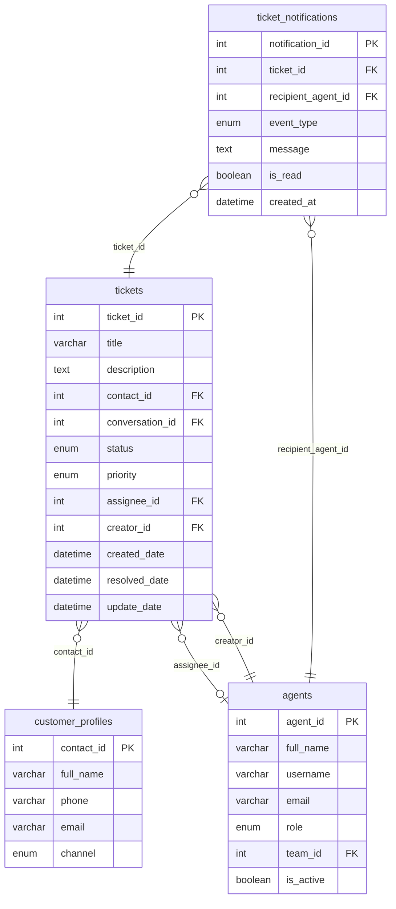
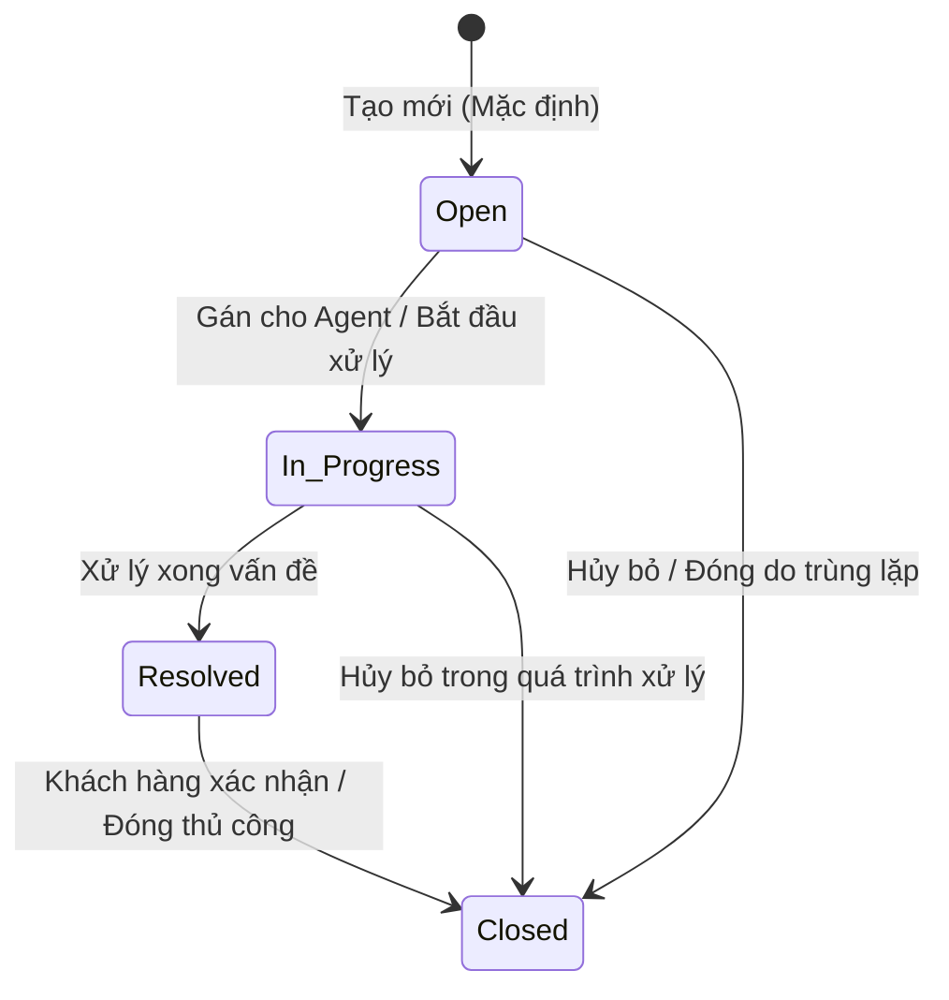

# BẢNG GHI NHẬN THAY ĐỔI TÀI LIỆU

| Phiên bản | Ngày | Người cập nhật | Vị trí thay đổi | Lý do chi tiết |
| :--- | :--- | :--- | :--- | :--- |
| 1.0.0 | 2026-07-01 | Mira-Miraaa | Toàn bộ tài liệu | Tạo mới tài liệu đặc tả tính năng Quản lý danh sách Ticket |
| 1.1.0 | 2026-07-02 | Mira-Miraaa | Toàn bộ tài liệu | Cập nhật chi tiết giao diện Dashboard, các bộ lọc, Data Table, cơ chế chỉnh sửa nhanh (Inline Edit), chi tiết popup SLA, kiểm tra SLA định kỳ (SLA Violation) và phân công việc (Assignment notification) dựa trên mockup thực tế. |
| 1.2.0 | 2026-07-15 | Phương Nguyễn | Mục III — US-01, US-02, US-04 | Bổ sung Acceptance Criteria chi tiết cho US-01 (xem/lọc/tìm kiếm Ticket), US-02 (Inline Edit), US-04 (Xem chi tiết & Xóa Ticket); cập nhật nội dung Toast thông báo theo từng hành động; bổ sung quy tắc phân quyền Agent chỉ tạo Ticket tại hội thoại được phân công đang "In processing"; bổ sung thông báo gỡ phân công đến Agent bị hủy; bổ sung AC-03 SLA Violation khi Urgent quá 4 giờ. |
| 1.2.1 | 2026-07-15 | Phương Nguyễn | Mục II — 2.2, 2.3, 2.4, 2.5 | Bổ sung trường `update_date` vào Ticket Entity Schema; bổ sung bảng định nghĩa đối tượng còn thiếu: `agents`, `customer_profiles`, `ticket_notifications`; bổ sung ERD quan hệ giữa các bảng. |
| 1.3.0 | 2026-07-15 | Phương Nguyễn | Mục 2.1, 2.2, AC-06 US-01, Mục IV, Mục 3.5 (mới) | Tách bảng phân quyền thành 3 vai trò rõ ràng (Admin/Manager/Agent); bổ sung ràng buộc: Agent không được đóng Ticket, không được hủy/chuyển phân công; Admin không bị BR-CRE-01; thêm quy tắc sinh `ticket_id` đồng thời vào schema; thống nhất "In process" xuyên suốt; bổ sung mục 3.5 bảng tổng hợp In-app Notification & Toast đầy đủ. |

---

# BẢNG QUẢN LÝ TIẾN ĐỘ THỰC THI

| Giai đoạn | Thời gian | Phần mục | Phiên bản áp dụng |
| :--- | :--- | :--- | :--- |
| Sprint 5 | 01/07/2026 - ... | Xây dựng màn hình danh sách Ticket, bộ lọc, chi tiết Ticket và cơ chế cập nhật trạng thái | V1.2 |

---

# TÀI LIỆU THAM CHIẾU

| STT | Tài liệu | Liên kết / Đường dẫn |
| :--- | :--- | :--- |
| 1 | SRS Conversation | [SRS Conversation](file:///f:/Gapone%20Conversation/Docs/SRS%20Conversation.md) |

---

## I. TỔNG QUAN & MỤC TIÊU

### 1.1. Hiện trạng
Hệ thống Gapone Conversation hiện tại đã hỗ trợ quản lý các cuộc hội thoại và thông tin hồ sơ khách hàng. Tuy nhiên, khi khách hàng gửi các yêu cầu nghiệp vụ phức tạp cần thời gian xử lý dài (như xử lý đơn lỗi, khiếu nại hoàn tiền, hỗ trợ kỹ thuật sâu), nhân viên chăm sóc khách hàng (Agent) không có công cụ để tiếp nhận, theo dõi tiến độ và phối hợp liên phòng ban. Việc ghi chú thủ công trên khung chat dẫn đến trôi thông tin và không thể đo lường chất lượng dịch vụ (SLA).

### 1.2. Mục tiêu tính năng
Xây dựng tính năng **Quản lý danh sách Ticket** nhằm:
*   Cung cấp màn hình quản lý tập trung toàn bộ các yêu cầu xử lý của khách hàng dưới dạng Ticket.
*   Cho phép lọc, tìm kiếm, phân công xử lý và cập nhật trạng thái Ticket một cách nhanh chóng.
*   Hỗ trợ theo dõi chỉ số hiệu suất xử lý Ticket của từng Agent và toàn bộ hệ thống.

### 1.3. Phạm vi áp dụng
*   **Đường dẫn truy cập**: Đăng nhập hệ thống > Menu điều hướng chính > **Ticket** (hoặc Quản lý > Ticket).
*   **Đối tượng người dùng**: Admin, Quản lý (Manager), Nhân viên CSKH (Agent).

---

## II. ĐỊNH NGHĨA ĐỐI TƯỢNG & PHÂN QUYỀN

### 2.1. Đối tượng người dùng và phân quyền

| Vai trò | Quyền hạn trên phân hệ Ticket | Ghi chú |
| :--- | :--- | :--- |
| **Admin** | - Toàn quyền: Xem tất cả Ticket, Tạo mới, Chỉnh sửa nội dung, Đóng (`Closed`), Xóa, Thay đổi và Hủy phân công. - Không bị giới hạn bởi BR-CRE-01 khi tạo Ticket từ màn hình Hội thoại. - Cấu hình thiết lập chung của Ticket. | Vai trò cao nhất, không bị giới hạn phân quyền. |
| **Manager** | - Xem toàn bộ Ticket trên hệ thống (không bị giới hạn theo phân công). - Chỉnh sửa trạng thái (bao gồm `Closed`), độ ưu tiên, Thay đổi và Hủy phân công. - **Không** có quyền Xóa Ticket và cấu hình hệ thống. | Phục vụ giám sát và phân phối công việc. |
| **Agent** | - Chỉ xem Ticket **được phân công cho mình** hoặc **do chính mình tạo**; không thấy Ticket của Agent khác. - Được chuyển trạng thái: `Open` → `In_Progress` → `Resolved`. **Không được chuyển sang `Closed`**. - **Không được** Hủy phân công hoặc chuyển phân công sang Agent khác. - Chỉ tạo Ticket tại hội thoại được phân công cho mình, đang ở trạng thái **In process** (BR-CRE-01). - Không có quyền Xóa Ticket hoặc cấu hình hệ thống. | Phạm vi truy cập bị giới hạn theo phân công cá nhân. |

### 2.2. Bảng định nghĩa đối tượng (Ticket Entity Schema)

Bảng dữ liệu `conversation.tickets` lưu trữ thông tin của các Ticket trong hệ thống:

| STT | Tên trường | Kiểu dữ liệu | Mô tả | Ràng buộc |
| :--- | :--- | :--- | :--- | :--- |
| 1 | `ticket_id` | INT | Mã định danh duy nhất của Ticket | PK, AUTO_INCREMENT. Trong trường hợp nhiều Ticket được tạo đồng thời, DB xử lý tuần tự theo thứ tự tiếp nhận request — request đến trước nhận `ticket_id` nhỏ hơn; request đến sau nhận `ticket_id` lớn hơn. Frontend không tự sinh giá trị này. |
| 2 | `title` | VARCHAR(255) | Tiêu đề tóm tắt vấn đề của Ticket | Bắt buộc, không để trống |
| 3 | `description` | TEXT | Chi tiết nội dung yêu cầu của khách hàng | Không bắt buộc |
| 4 | `contact_id` | INT | Liên kết tới hồ sơ khách hàng tạo ticket | FK -> `customer_profiles(contact_id)`, Bắt buộc |
| 5 | `conversation_id`| INT | Liên kết tới cuộc hội thoại phát sinh ticket | FK -> `conversations(conversation_id)`, Cho phép NULL |
| 6 | `status` | ENUM | Trạng thái hiện tại của Ticket | Giá trị: {`Open`, `In_Progress`, `Resolved`, `Closed`}. Mặc định: `Open` |
| 7 | `priority` | ENUM | Mức độ ưu tiên xử lý | Giá trị: {`Low`, `Medium`, `High`, `Urgent`}. Mặc định: `Medium` |
| 8 | `assignee_id` | INT | Nhân viên phụ trách xử lý Ticket | FK -> `agents(agent_id)`, Cho phép NULL |
| 9 | `creator_id` | INT | Người tạo Ticket (Agent hoặc hệ thống) | FK -> `agents(agent_id)`, Bắt buộc |
| 10 | `created_date` | DATETIME | Thời điểm tạo Ticket | Tự động ghi nhận thời gian hệ thống |
| 11 | `resolved_date` | DATETIME | Thời điểm Ticket được chuyển sang `Resolved` | Cho phép NULL; tự động ghi nhận khi `status` chuyển sang `Resolved`; reset về NULL nếu chuyển ngược lại |
| 12 | `update_date` | DATETIME | Thời điểm cập nhật gần nhất của Ticket (bất kỳ trường nào thay đổi) | Tự động cập nhật mỗi khi có thay đổi (`ON UPDATE CURRENT_TIMESTAMP`) |

### 2.3. Bảng định nghĩa đối tượng — `agents`

Bảng `agents` lưu trữ thông tin nhân viên CSKH (Agent) trong hệ thống — được tham chiếu bởi `assignee_id` và `creator_id` trong bảng `tickets`:

| STT | Tên trường | Kiểu dữ liệu | Mô tả | Ràng buộc |
| :--- | :--- | :--- | :--- | :--- |
| 1 | `agent_id` | INT | Mã định danh duy nhất của Agent | PK, AUTO_INCREMENT |
| 2 | `full_name` | VARCHAR(100) | Họ và tên đầy đủ của Agent, dùng hiển thị trên UI (bảng Ticket, Popup chi tiết, Toast) | Bắt buộc |
| 3 | `username` | VARCHAR(50) | Tên đăng nhập duy nhất trong hệ thống | Bắt buộc, UNIQUE |
| 4 | `email` | VARCHAR(150) | Địa chỉ email nhận thông báo phân công | Bắt buộc, UNIQUE |
| 5 | `role` | ENUM | Vai trò trong hệ thống | Giá trị: {`Admin`, `Manager`, `Agent`}. Bắt buộc |
| 6 | `team_id` | INT | Team mà Agent thuộc về (phục vụ phân quyền xem Ticket theo Team) | FK -> `teams(team_id)`, Cho phép NULL |
| 7 | `is_active` | BOOLEAN | Trạng thái hoạt động của tài khoản Agent | Mặc định: `true`. Agent không hoạt động không xuất hiện trong Dropdown phân công |

### 2.4. Bảng định nghĩa đối tượng — `customer_profiles`

Bảng `customer_profiles` lưu trữ thông tin khách hàng — được tham chiếu bởi `contact_id` trong bảng `tickets` và là đối tượng tìm kiếm LIKE trong Filter Bar:

| STT | Tên trường | Kiểu dữ liệu | Mô tả | Ràng buộc |
| :--- | :--- | :--- | :--- | :--- |
| 1 | `contact_id` | INT | Mã định danh duy nhất của hồ sơ khách hàng | PK, AUTO_INCREMENT |
| 2 | `full_name` | VARCHAR(150) | Họ và tên đầy đủ của khách hàng, hiển thị tại cột "Khách hàng" trên bảng Ticket và trong Popup chi tiết | Bắt buộc |
| 3 | `phone` | VARCHAR(20) | Số điện thoại khách hàng, là một trong các trường được tìm kiếm LIKE | Cho phép NULL |
| 4 | `email` | VARCHAR(150) | Địa chỉ email khách hàng | Cho phép NULL |
| 5 | `channel` | ENUM | Kênh liên lạc chính của khách hàng | Giá trị: {`Zalo`, `Facebook`, `Website`, `Internal`}. Cho phép NULL |

> [!NOTE]
> Tìm kiếm LIKE trong US-01 sẽ khớp theo `customer_profiles.full_name` và `customer_profiles.phone`, JOIN qua `tickets.contact_id`.

### 2.5. Bảng định nghĩa đối tượng — `ticket_notifications`

Bảng `ticket_notifications` lưu trữ các thông báo in-app phát sinh từ hành động trên Ticket (phân công, gỡ phân công, SLA vi phạm):

| STT | Tên trường | Kiểu dữ liệu | Mô tả | Ràng buộc |
| :--- | :--- | :--- | :--- | :--- |
| 1 | `notification_id` | INT | Mã định danh duy nhất của thông báo | PK, AUTO_INCREMENT |
| 2 | `ticket_id` | INT | Ticket phát sinh thông báo | FK -> `tickets(ticket_id)`, Bắt buộc |
| 3 | `recipient_agent_id` | INT | Agent nhận thông báo | FK -> `agents(agent_id)`, Bắt buộc |
| 4 | `event_type` | ENUM | Loại sự kiện tạo ra thông báo | Giá trị: {`ASSIGNMENT`, `UNASSIGNMENT`, `SLA_ALERT`}. Bắt buộc |
| 5 | `message` | TEXT | Nội dung thông báo đầy đủ hiển thị trên UI | Bắt buộc |
| 6 | `is_read` | BOOLEAN | Trạng thái đã đọc của thông báo | Mặc định: `false` |
| 7 | `created_at` | DATETIME | Thời điểm tạo thông báo | Tự động ghi nhận thời gian hệ thống |

**Mapping Event Type → Nội dung thông báo (`message`):**

| `event_type` | Điều kiện kích hoạt | Nội dung `message` |
| :--- | :--- | :--- |
| `ASSIGNMENT` | `assignee_id` được gán mới (khác NULL) | *"Bạn được phân công xử lý Ticket #[ID] - [Tiêu đề]"* |
| `UNASSIGNMENT` | `assignee_id` bị đặt về NULL | *"Phân công xử lý Ticket #[ID] - [Tiêu đề] của bạn bị hủy"* |
| `SLA_ALERT` | Ticket `Urgent` tồn tại > 4 giờ chưa `Resolved`/`Closed` | *"Ticket Urgent #[ID] - [Tiêu đề] quá hạn giải quyết (Thời gian: [X]h > 4h)"* — gửi đến Manager |

### 2.6. ERD — Quan hệ giữa các bảng

### 2.7. Vòng đời trạng thái Ticket (Ticket Lifecycle)

---

## III. PHÂN TÍCH CHI TIẾT TÍNH NĂNG

---

### US-01 · Xem, lọc và tìm kiếm danh sách Ticket

**Mục tiêu:** Để Admin/Manager/Agent nhanh chóng theo dõi và phân tích tiến độ xử lý các yêu cầu của khách hàng, hệ thống cung cấp màn hình quản lý tập trung với Dashboard chỉ số hiệu suất và bộ lọc đa dạng — thay thế việc ghi chú thủ công dẫn đến trôi thông tin và không đo được chất lượng dịch vụ.

**Đường dẫn:** `Đăng nhập > Menu chính > Ticket`

**Luồng nghiệp vụ:**
1. User truy cập màn hình Ticket → hệ thống hiển thị Dashboard + bảng danh sách mặc định lọc `Active` (tất cả trừ `Closed` và `deleted_at IS NULL`)
2. User áp dụng bộ lọc (trạng thái / độ ưu tiên / người phụ trách) hoặc nhập từ khóa tìm kiếm → bảng tự động render lại kết quả (áp dụng cơ chế Debounce cho ô tìm kiếm)
3. Không có kết quả → bảng hiển thị thông báo *"Không tìm thấy Ticket nào phù hợp."*

#### 3.1.1. Dashboard chỉ số hiệu suất

Tại phần đầu của màn hình quản lý (Panel ID: `view-tickets`), hiển thị 3 thẻ thông tin thống kê chính (Stats Cards Grid):

1.  **Tổng số Ticket** (ID Component: `stat-total-tickets`): Tổng số lượng ticket tồn tại trên hệ thống (không bao gồm Ticket đã bị xóa mềm).
2.  **Đang xử lý** (ID Component: `stat-pending-tickets`): Số lượng ticket có trạng thái là `Open` hoặc `In_Progress` (hiển thị màu vàng cam `#f59e0b`).
3.  **Tỷ lệ Giải quyết (RT)** (ID Component: `stat-resolution-rate`): Thống kê tỷ lệ phần trăm giải quyết thành công của toàn hệ thống (hiển thị màu xanh lá `#10b981`), tính theo công thức:
    $$RT = \frac{N_{\text{Resolved}} + N_{\text{Closed}}}{N_{\text{Total}}} \times 100\%$$

#### 3.1.2. Bộ lọc đa dạng (Filter Bar)

Thanh công cụ lọc (Filter Bar) hỗ trợ Agent và Manager tra cứu nhanh:

*   **Thanh tìm kiếm** (ID: `ticket-search-input`): Ô nhập văn bản hỗ trợ tìm gần đúng (LIKE) theo Mã Ticket, Tiêu đề, Tên khách hàng, hoặc Số điện thoại của khách hàng. Sự kiện `oninput` sẽ kích hoạt lọc tự động, tuy nhiên Frontend bắt buộc sử dụng cơ chế **Debounce (300ms)** (chờ 300ms kể từ ký tự gõ cuối cùng mới kích hoạt gọi hàm `renderTicketsTable()`) để tránh spam request liên tục lên Server.
*   **Bộ lọc trạng thái** (ID: `ticket-filter-status`): Dropdown chọn trạng thái cần lọc gồm:
    *   `Active` (Tất cả trừ Closed) — *Tùy chọn mặc định khi mở màn hình*.
    *   `All` (Tất cả trạng thái)
    *   `Open` (Mới)
    *   `In_Progress` (Đang xử lý)
    *   `Resolved` (Đã giải quyết)
    *   `Closed` (Đã đóng)
*   **Bộ lọc độ ưu tiên** (ID: `ticket-filter-priority`): Dropdown chọn mức độ ưu tiên gồm: `All` (Tất cả), `Low`, `Medium`, `High`, `Urgent`.
*   **Bộ lọc người phụ trách** (ID: `ticket-filter-assignee`): Dropdown chọn Agent gồm: `All` (Tất cả), `Unassigned` (Chưa phân công), hoặc chọn Agent cụ thể được tải động từ danh sách `agentsList`. Đối với bộ lọc này, cần hiển thị cả các Agent đã bị vô hiệu hóa (`is_active = false`) nếu họ đang gán với các Ticket hiện tại để Manager vẫn có thể lọc và xử lý việc cũ.

#### 3.1.3. Bảng dữ liệu Ticket (Table ID: `ticket-table-body`)

Danh sách Ticket hiển thị dưới dạng bảng dữ liệu có các cột thông tin chi tiết:

| STT | Tên cột | Hiển thị dữ liệu | Hành vi tương tác |
| :--- | :--- | :--- | :--- |
| 1 | Mã Ticket | `#ID` (Ví dụ: `#1024`) | Link text màu xanh (`var(--primary-color)`), in đậm. Click gọi hàm `openDetailTicketPopup(ticket_id)` để mở Popup xem chi tiết. |
| 2 | Tiêu đề | Chuỗi văn bản tiêu đề ngắn | Rút gọn bằng dấu `...` nếu vượt quá 50 ký tự (`text-overflow: ellipsis`). Sử dụng thuộc tính tooltip `title` để hiển thị đầy đủ tiêu đề khi hover. |
| 3 | Khách hàng | Tên khách hàng | Hiển thị link văn bản có gạch chân. Nếu `conversation_id` khác NULL, click gọi hàm `focusCustomerConversation(conversation_id)` để tự động chuyển sang phân hệ Hội thoại và mở đúng cuộc chat. Nếu `conversation_id` là NULL (tạo thủ công), link sẽ không có gạch chân và click vào sẽ hiển thị Toast lỗi: *"Ticket được tạo thủ công, không có cuộc hội thoại liên quan!"*. |
| 4 | Độ ưu tiên | Badge màu tương ứng + Dropdown chọn nhanh | Badge màu chuẩn theo mức độ. Dropdown chọn nhanh gọi hàm `changeTicketPriority(ticket_id, priority)`. |
| 5 | Trạng thái | Badge màu trạng thái + Dropdown chọn nhanh | Badge màu chuẩn theo trạng thái. Dropdown chọn nhanh gọi hàm `changeTicketStatus(ticket_id, status)`. |
| 6 | Người phụ trách | Dropdown chứa danh sách Agent | Dropdown chứa tên Agent và tùy chọn `-- Chưa gán --`. Thay đổi tùy chọn gọi hàm `changeTicketAssignee(ticket_id, assignee_id)`. |
| 7 | Ngày tạo | Định dạng `hh:mm dd/mm/yyyy` | Thời điểm tạo Ticket trong hệ thống. |
| 8 | Thao tác | Nút Xóa Ticket (ID: `btn-delete-inline`) | **Chỉ hiển thị với vai trò Admin**. Chứa biểu tượng Thùng rác màu đỏ (`#ef4444`). Biểu tượng chỉ hiển thị và cho click khi Ticket ở trạng thái `Closed`. Nếu ở trạng thái khác, biểu tượng bị ẩn hoặc disable (màu xám nhạt). Click vào biểu tượng sẽ trigger hàm `deleteTicketInline(ticket_id)` mở Confirm Dialog xác nhận xóa mềm. |

> [!NOTE]
> Khi không tìm thấy bất kỳ Ticket nào thỏa mãn các điều kiện lọc, bảng sẽ hiển thị một dòng thông báo duy nhất: *"Không tìm thấy Ticket nào phù hợp."* (căn giữa, màu chữ muted).

#### 3.1.4. Acceptance Criteria — US-01

**Happy Path (Luồng thành công):**

- [ ] **AC-01:** User truy cập màn hình Ticket → Dashboard hiển thị đúng 3 thẻ thống kê; bảng mặc định lọc `Active` (ẩn các Ticket `Closed`), bảng danh sách Ticket tương ứng với bộ lọc. Các Ticket đã bị xóa mềm (`deleted_at` khác NULL) tuyệt đối không hiển thị.
- [ ] **AC-02:** User nhập từ khóa vào ô tìm kiếm → hệ thống thực hiện tìm kiếm sau 300ms kể từ ký tự cuối cùng gõ vào và tự động lọc bảng mà không cần nhấn nút.
- [ ] **AC-03:** User chọn bộ lọc trạng thái → bảng chỉ hiển thị Ticket có trạng thái tương ứng; tương tự với các bộ lọc độ ưu tiên và người phụ trách.
- [ ] **AC-04:** Click tên khách hàng trong bảng → nếu cuộc hội thoại liên kết tồn tại (`conversation_id` khác NULL), tự động chuyển sang phân hệ Hội thoại và mở đúng cuộc chat.
- [ ] **AC-05:** Phân quyền theo hiển thị:
    * **Admin / Manager:** Xem toàn bộ Ticket trong hệ thống.
    * **Agent:** Chỉ hiển thị các Ticket thỏa mãn một trong các điều kiện: (1) Được phân công trực tiếp cho Agent (`assignee_id` trùng ID Agent đăng nhập); (2) Do chính Agent đó tạo (`creator_id` trùng ID Agent đăng nhập); (3) Chưa gán (`assignee_id = NULL`) nhưng thuộc cùng Team với Agent (`team_id` của Ticket trùng với `team_id` của Agent đăng nhập).
- [ ] **AC-06:** Agent chỉ có thể tạo Ticket mới tại phiên hội thoại được phân công cho mình và có trạng thái là **"In process"**. Admin không bị giới hạn bởi điều kiện này (BR-CRE-01 không áp dụng với Admin).
- [ ] **AC-09:** Admin nhìn thấy cột "Thao tác" với biểu tượng Thùng rác hoạt động trên các dòng Ticket có trạng thái `Closed`.
- [ ] **AC-10:** Manager và Agent hoàn toàn không nhìn thấy cột "Thao tác" trên bảng danh sách Ticket.

**Edge Cases / Luồng ngoại lệ:**

- [ ] **AC-07:** Không có Ticket nào thỏa mãn điều kiện lọc → bảng hiển thị thông báo *"Không tìm thấy Ticket nào phù hợp."* căn giữa, không hiển thị bảng rỗng.
- [ ] **AC-08:** Click liên kết tên khách hàng nhưng `conversation_id` là NULL → hiển thị Toast lỗi *"Ticket được tạo thủ công, không có cuộc hội thoại liên quan!"* và giữ nguyên giao diện hiện tại.

**Out of Scope:**
- Phân trang (pagination) → sẽ xem xét khi số lượng Ticket lớn.
- Xuất danh sách Ticket ra file (Excel/CSV) → story báo cáo riêng.
- Sắp xếp cột (sort) trên bảng → xem xét ở phiên bản sau.

---

### US-02 · Chỉnh sửa nhanh Ticket trực tiếp trên bảng (Inline Edit)

**Mục tiêu:** Để Agent và Manager tiết kiệm thao tác, hệ thống cho phép cập nhật nhanh độ ưu tiên, trạng thái và người phụ trách của Ticket ngay trên dòng bảng mà không cần mở popup — đồng thời tự động gửi thông báo phân công và kích hoạt cảnh báo SLA khi cần thiết.

**Luồng thay đổi độ ưu tiên:**
1. Chọn mức độ ưu tiên: `Low` / `Medium` / `High` / `Urgent` trong Dropdown độ ưu tiên (chỉ dành cho Admin/Manager).
2. Toast: *"Ticket #[ID] được đổi độ ưu tiên thành [Mức ưu tiên mới] lúc hh:mm"* hiển thị trên giao diện của người thực thi thao tác.

**Luồng thay đổi trạng thái:**
1. Chọn chuyển đổi trạng thái: `Open` > `In_Progress` > `Resolved` > `Closed` trong Dropdown trạng thái.
2. Toast tương ứng hiển thị trên giao diện của người thực thi:
   - Chuyển sang `Open`: *"Ticket #[ID] được tạo mới lúc hh:mm"*
   - Chuyển sang `In_Progress`: *"Ticket #[ID] đang xử lý lúc hh:mm"*
   - Chuyển sang `Resolved`: *"Ticket #[ID] đã xử lý lúc hh:mm"*
   - Chuyển sang `Closed`: *"Ticket #[ID] được đóng lúc hh:mm"*

**Luồng thay đổi người phụ trách:**
1. Chọn Agent trong Dropdown → ghi nhận `assignee_id` → tự động gửi thông báo in-app đến Agent nhận việc.
2. Chọn `-- Chưa gán --` → `assignee_id = null` → Toast xác nhận gỡ phân công + gửi thông báo đến Agent bị gỡ.

#### Bảng ma trận phân quyền chỉnh sửa nhanh (Inline Edit Matrix)

| Vai trò | Phạm vi Ticket được phép tác động | Chỉnh sửa Độ ưu tiên | Chỉnh sửa Trạng thái | Chỉnh sửa Người phụ trách |
| :--- | :--- | :--- | :--- | :--- |
| **Admin** | Toàn bộ Ticket hệ thống | **Có quyền** | **Có quyền** (Tất cả trạng thái, bao gồm `Closed`) | **Có quyền** (Gán cho bất kỳ Agent nào, hoặc gỡ phân công `-- Chưa gán --`) |
| **Manager** | Toàn bộ Ticket hệ thống | **Có quyền** | **Có quyền** (Tất cả trạng thái, bao gồm `Closed`) | **Có quyền** (Gán cho bất kỳ Agent nào, hoặc gỡ phân công `-- Chưa gán --`) |
| **Agent** (User) | Chỉ Ticket **do mình tạo** HOẶC **được gán cho mình** | **Không có quyền** (Khóa UI) | **Có quyền** chuyển đổi giữa {`Open`, `In_Progress`, `Resolved`}. **Không được đóng Ticket (`Closed`)** | **Không có quyền** chuyển phân công cho người khác, **không có quyền** gỡ phân công của bản thân (chỉ có quyền **Self-assignment** tự nhận Ticket chưa gán cùng Team/do mình tạo) |

*Lưu ý: Bất kỳ thao tác chỉnh sửa nào không được phép nếu cố tình gọi qua API sẽ bị Backend chặn lại và trả về lỗi `403 Forbidden`.*

#### 3.2.1. Thay đổi Độ ưu tiên

Khi thay đổi độ ưu tiên qua Dropdown trên dòng, hệ thống cập nhật trường `priority` tương ứng và hiển thị Toast thông báo:
*"Ticket #[Mã Ticket] được đổi độ ưu tiên thành [Mức độ ưu tiên mới] lúc hh:mm"*.

#### 3.2.2. Thay đổi Trạng thái & Tính toán SLA

Khi thay đổi trạng thái qua Dropdown trên dòng, hệ thống thực hiện hàm `changeTicketStatus()`:
*   Nếu chuyển trạng thái sang `Resolved`:
    *   Hệ thống ghi nhận thời điểm hiện tại vào trường `resolved_date`.
    *   Tính toán thời gian xử lý thực tế $T_{\text{xử lý}}$ theo **Giờ làm việc hành chính (Business Hours)** (đơn vị: giờ, làm tròn 1 chữ số thập phân, ví dụ: 2.3 giờ):
        *   Giờ làm việc được định nghĩa: **Từ Thứ 2 đến Thứ 6, khung giờ 8:00 - 17:30** (tổng cộng 9.5 giờ mỗi ngày làm việc, loại trừ hoàn toàn Thứ Bảy, Chủ Nhật, ngày lễ nghỉ).
        *   Nếu Ticket được tạo ngoài giờ làm việc (ví dụ lúc 20:00 tối), thời điểm bắt đầu tính toán sẽ được dời sang 08:00 của ngày làm việc tiếp theo.
        *   Thuật toán tính toán chỉ cộng dồn thời gian nằm trong khung giờ làm việc.
    *   Nếu mức độ ưu tiên là `Urgent`, thời gian xử lý $T_{\text{xử lý}} > 4\text{ giờ}$ và chưa từng cảnh báo trước đó (`sla_alert_triggered === false`):
        *   Hệ thống lập tức kích hoạt thông báo vi phạm SLA quá hạn gửi tới Manager.
        *   Đồng thời lưu trạng thái `sla_alert_triggered = true` vào cơ sở dữ liệu.
    *   Hiển thị Toast: *"Ticket #[Mã Ticket] đã xử lý. Thời gian xử lý: [Số giờ] giờ lúc hh:mm"*.
*   Nếu chuyển trạng thái từ `Resolved` ngược về các trạng thái trước đó (ví dụ: `In_Progress` để xử lý lại), hệ thống sẽ reset trường `resolved_date` về `NULL`, reset `sla_alert_triggered` về `false` và hiển thị Toast trạng thái tương ứng.

#### 3.2.3. Thay đổi Người phụ trách & Phân quyền UI / Self-assignment

**Cấu hình hiển thị UI theo vai trò (Role-based UI Control):**
*   **Với Admin/Manager:** Dropdown Độ ưu tiên, Trạng thái (hiển thị đủ 4 trạng thái), và Người phụ trách (hiển thị đủ danh sách Agent và `-- Chưa gán --`) có quyền chỉnh sửa bình thường.
*   **Với Agent:**
    *   *Dropdown Trạng thái:* Ẩn hoàn toàn tùy chọn `Closed` khỏi menu lựa chọn (chỉ hiển thị `Open`, `In_Progress`, `Resolved`). Nếu cố tình thay đổi qua API, Backend sẽ chặn và trả về lỗi.
    *   *Dropdown Người phụ trách:* 
        *   Nếu Ticket đã được gán cho Agent khác: Dropdown này sẽ bị **disable** (chỉ hiển thị dưới dạng văn bản tĩnh). Agent không được quyền thay đổi.
        *   Nếu Ticket chưa được gán (`assignee_id = NULL`):
            *   Nếu Ticket thuộc cùng `team_id` của Agent hoặc do chính Agent tạo: Cho phép Agent tự gán cho chính mình (**Self-assignment**). Lúc này dropdown chỉ hiển thị duy nhất tùy chọn tên của chính Agent đó và tùy chọn `-- Chưa gán --` để thực hiện thao tác nhận việc. Agent không được phép chọn tên Agent khác.
            *   Nếu không thỏa mãn điều kiện trên: Dropdown bị disable hoàn toàn.
    *   *Dropdown Độ ưu tiên:* Disable hoàn toàn (Agent chỉ được quyền xem, không được thay đổi độ ưu tiên).

Khi thay đổi người phụ trách qua Dropdown trên dòng:
*   **Gán cho một Agent (khác trống):** Hệ thống ghi nhận `assignee_id` và tự động gửi thông báo in-app (Event Type: `ASSIGNMENT`, Module: `Ticket`):
    *   Nội dung thông báo gửi đến Agent nhận việc: *"Bạn được phân công xử lý Ticket #[Mã Ticket] - [Tiêu đề Ticket]"*.
    *   Nếu Agent nhận việc chính là Agent đang đăng nhập, hệ thống hiển thị Toast Notification in-app cá nhân thay vì chỉ Toast chung.
    *   Ngược lại, hiển thị Toast chung: *"Đã phân công xử lý Ticket #[Mã Ticket] cho [Tên Agent nhận]"*.
*   **Gỡ phân công (chọn `-- Chưa gán --`):** Cập nhật `assignee_id = null`:
    *   Hiển thị Toast trên giao diện người thực thi: *"Gỡ phân công Ticket #[Mã Ticket]"*.
    *   Gửi thông báo in-app đến Agent bị gỡ phân công: *"Phân công xử lý Ticket #[Mã Ticket] - [Tiêu đề] của bạn bị hủy"*.

#### 3.2.4. Acceptance Criteria — US-02

**Happy Path (Luồng thành công):**

- [ ] **AC-01:** Thay đổi độ ưu tiên qua Dropdown (Admin/Manager) → badge màu cập nhật ngay trên dòng → Toast xác nhận hiển thị đúng mức mới kèm thời gian `hh:mm`.
- [ ] **AC-02:** Chuyển trạng thái → trạng thái mới được ghi nhận → `update_date` được ghi nhận → Toast hiển thị thời gian xử lý tính bằng giờ (làm tròn 1 chữ số thập phân, tính theo Giờ làm việc hành chính).
- [ ] **AC-03:** Ticket `Urgent` chuyển sang `Resolved` sau > 4 giờ làm việc hành chính kể từ khi bắt đầu tính SLA → hệ thống kích hoạt thông báo vi phạm SLA gửi tới Manager, cập nhật `sla_alert_triggered = true` xuống DB.
- [ ] **AC-04:** Gán Ticket cho Agent B → Agent B nhận thông báo in-app *"Bạn được phân công xử lý Ticket #[ID] - [Tiêu đề]"*.
- [ ] **AC-05:** Chọn `-- Chưa gán --` → `assignee_id` về `null` → Toast *"Gỡ phân công Ticket #[ID]"* xuất hiện trên giao diện người thực thi; Agent bị gỡ phân công nhận thông báo in-app *"Phân công xử lý Ticket #[ID] - [Tiêu đề] của bạn bị hủy"*.
- [ ] **AC-06:** Agent tự nhận Ticket chưa phân công thuộc Team/do mình tạo (Self-assignment) → dropdown cho phép chọn tên của chính mình → gán thành công.

**Edge Cases / Luồng ngoại lệ:**

- [ ] **AC-07:** Agent đang đăng nhập tự gán Ticket cho chính mình → hiển thị Toast in-app cá nhân thay vì Toast chung.
- [ ] **AC-08:** API cập nhật thất bại (lỗi mạng/lỗi DB) → hiển thị Toast báo lỗi, Dropdown trên UI tự động Rollback (quay về giá trị cũ trước khi chọn).

> [!NOTE]
> Thời điểm hiển thị trong Toast (định dạng `hh:mm`) là thời điểm hệ thống ghi nhận thay đổi, không phải thời điểm người dùng click.

**Out of Scope:**
- Lịch sử thay đổi trạng thái/người phụ trách (Audit trail) → xem xét ở phiên bản sau.
- Cấu hình ngưỡng SLA khác nhau theo từng loại Ticket → story cấu hình SLA riêng.

---

### 3.3. Quy trình Cảnh báo vi phạm SLA định kỳ (SLA Violation Checker)

Hệ thống tích hợp tiến trình kiểm tra ngầm định kỳ mỗi 30 giây (`setInterval`):
1.  Hệ thống lọc tất cả các Ticket có mức độ ưu tiên là **Urgent**, trạng thái **khác** `Resolved` và `Closed`, có `sla_alert_triggered = false` và `deleted_at IS NULL`.
2.  Với mỗi Ticket thỏa mãn, tính toán thời gian trôi qua thực tế $T_{\text{trôi qua}}$ trong khung **Giờ làm việc hành chính (Business Hours)** từ lúc `created_date` đến thời điểm hiện tại (loại trừ giờ nghỉ, thứ Bảy, Chủ Nhật, ngày lễ).
3.  Nếu $T_{\text{trôi qua}} > 4 \text{ giờ}$:
    *   Đánh dấu `sla_alert_triggered = true` và cập nhật ngay xuống Database để tránh quét gửi lặp lại.
    *   Gửi một thông báo cảnh báo in-app (Event Type: `SLA_ALERT`, Module: `Ticket`) với tiêu đề *"Cảnh báo SLA quá hạn"* và nội dung chi tiết:
        *"Ticket Urgent #[Mã Ticket] - \"[Tiêu đề Ticket]\" quá hạn giải quyết (Thời gian: [Số giờ]h > 4h)"*.
    *   Đẩy thông báo vào Bell Notification List của toàn bộ các Agent có vai trò là **Manager** và hiển thị Popup Toast thông báo khẩn cấp trên màn hình cho họ.

---

### US-04 · Xem chi tiết & Xóa Ticket

**Mục tiêu:** Để Agent/Manager nắm đầy đủ thông tin một Ticket cụ thể (mô tả, nguồn hội thoại, trạng thái SLA động) và dọn dẹp các Ticket đã hoàn tất, hệ thống cung cấp Popup chi tiết với thông tin toàn diện và cơ chế xóa an toàn chỉ khi Ticket ở trạng thái `Closed`.

**Luồng xem chi tiết:** Click liên kết `#ID` trên bảng → Popup `detail-ticket-modal` (rộng tối đa 550px) mở ra.

**Luồng xóa:** Ticket ở trạng thái `Closed` → nút **[Xóa Ticket]** (nền đỏ) tại chân Popup hiển thị, hoặc click biểu tượng Thùng rác trực tiếp tại cột Thao tác trên bảng danh sách (chỉ hiển thị với Admin) → Confirm dialog xác nhận → cập nhật `deleted_at = CURRENT_TIMESTAMP` (xóa mềm) → biến mất khỏi hệ thống hiển thị.

#### 3.4.1. Popup Chi tiết Ticket (Modal ID: `detail-ticket-modal`)

Popup hiển thị thông tin chi tiết đầy đủ khi người dùng click vào liên kết `#ID` trên bảng hoặc liên kết trên timeline trò chuyện (chiều rộng tối đa 550px):

*   **Tiêu đề Modal**: `Chi tiết Ticket #[Mã Ticket]` (ID: `ticket-detail-header`).
*   **Tiêu đề chính**: Tiêu đề Ticket dạng chữ lớn (ID: `ticket-detail-title`).
*   **Badge**: Hiển thị song song badge Độ ưu tiên (ID: `ticket-detail-priority-badge`) và badge Trạng thái (ID: `ticket-detail-status-badge`).
*   **Hộp mô tả**: Thẻ div hiển thị nội dung (ID: `ticket-detail-desc`), có màu nền `var(--bg-hover)` và đường viền mỏng. Áp dụng style `white-space: pre-wrap` để bảo toàn định dạng văn bản xuống dòng do Agent nhập.
*   **Chi tiết hồ sơ nguồn**: Hiển thị Tên khách hàng (ID: `ticket-detail-cust`) và Mã cuộc hội thoại nguồn (ID: `ticket-detail-conv`).
*   **Thông tin gán việc**: Hiển thị tên đầy đủ của Người phụ trách (ID: `ticket-detail-assignee`) và Người tạo (ID: `ticket-detail-creator`).
*   **Mốc thời gian**: Hiển thị Ngày tạo (ID: `ticket-detail-created`) và Thời điểm giải quyết (ID: `ticket-detail-resolved`).
*   **Hộp trạng thái SLA động** (ID: `ticket-detail-sla-status`): Hiển thị thông tin thời gian xử lý thay đổi màu nền và màu chữ động:
    *   *Đã `Resolved` hoặc `Closed`*: Nền xanh mờ, chữ xanh lá `#10b981`. Nội dung: *"Đã giải quyết sau [Số giờ] giờ."*
    *   *Đang xử lý / Mới (Mức `Urgent`)*:
        *   Nếu quá 4 giờ: Nền đỏ mờ, chữ đỏ `#ef4444`. Nội dung: *"Quá hạn SLA 4 giờ! Đang xử lý: [Số giờ] giờ."*
        *   Nếu trong vòng 4 giờ: Nền cam mờ, chữ cam `#f59e0b`. Nội dung: *"Ưu tiên khẩn cấp (SLA 4h). Đã xử lý: [Số giờ] giờ."*
    *   *Đang xử lý / Mới (Các mức ưu tiên khác)*: Nền xám mờ, chữ xám `var(--text-muted)`. Nội dung: *"Thời gian trôi qua: [Số giờ] giờ."*

> [!WARNING]
> **Quy tắc Xóa Ticket (BR-DEL-01):**
> 1. **Xóa từ Popup chi tiết:** Nút "Xóa Ticket" (ID: `btn-delete-ticket`, màu nền đỏ `#ef4444`) tại chân Popup **chỉ hiển thị** khi Ticket đang ở trạng thái **Closed**. Nếu ở các trạng thái khác (`Open`, `In_Progress`, `Resolved`), nút này sẽ bị ẩn hoàn toàn (`display: none`).
> 2. **Xóa trực tiếp trên bảng danh sách:** Nút Thùng rác (ID: `btn-delete-inline`) tại cột Thao tác **chỉ hiển thị và hoạt động** đối với vai trò **Admin** và khi Ticket đang ở trạng thái **Closed**.
> Khi click nút xóa (tại bất kỳ vị trí nào), hệ thống yêu cầu xác nhận qua Confirm Dialog: *"Bạn có chắc chắn muốn xóa Ticket #[Mã Ticket]? Hành động này sẽ thực hiện ẩn Ticket khỏi hệ thống và không thể hoàn tác."*. Khi xác nhận OK, hệ thống tiến hành cập nhật trường `deleted_at = CURRENT_TIMESTAMP` (Xóa mềm - Soft Delete) trong cơ sở dữ liệu để ẩn hoàn toàn Ticket khỏi danh sách hiển thị, đồng thời bảo toàn dữ liệu lịch sử để tránh lỗi ràng buộc khóa ngoại với các bảng liên quan.

#### 3.4.2. Acceptance Criteria — US-04

**Happy Path (Luồng thành công):**

- [ ] **AC-01:** Click `#ID` trên bảng → Popup mở hiển thị đầy đủ 4 phần thông tin: thông tin cơ bản, mô tả, hồ sơ nguồn, thông tin gán việc & mốc thời gian.
- [ ] **AC-02:** Popup Ticket `Urgent` đang `In_Progress` chưa quá 4 giờ làm việc hành chính → hộp SLA nền cam, hiển thị đúng thời gian đã xử lý.
- [ ] **AC-03:** Popup Ticket `Urgent` đang `In_Progress` đã quá 4 giờ làm việc hành chính → hộp SLA nền đỏ, nội dung *"Quá hạn SLA 4 giờ! Đang xử lý: [Số giờ] giờ."*
- [ ] **AC-04:** Popup Ticket `Closed` → nút **[Xóa Ticket]** hiển thị; click → Confirm dialog; xác nhận OK → Ticket được cập nhật `deleted_at` (xóa mềm), Popup đóng, bảng không còn hiển thị Ticket đó.
- [ ] **AC-07:** Admin click nút Thùng rác trực tiếp trên bảng danh sách của Ticket `Closed` → Confirm dialog xuất hiện; xác nhận OK → Ticket được cập nhật `deleted_at` (xóa mềm), dòng Ticket biến mất khỏi bảng ngay lập tức mà không cần tải lại trang.

**Edge Cases / Luồng ngoại lệ:**

- [ ] **AC-05:** Popup Ticket có `status = Open`, `In_Progress`, hoặc `Resolved` → nút **[Xóa Ticket]** *không* xuất hiện.
- [ ] **AC-06:** Confirm dialog xuất hiện (từ cả hai luồng xóa) → User chọn **Hủy** → Ticket không bị xóa mềm, Popup vẫn giữ nguyên (nếu xóa từ popup) hoặc dòng danh sách giữ nguyên.

**Out of Scope:**
- Chỉnh sửa nội dung Ticket từ bên trong Popup (tiêu đề, mô tả) → V1 chỉ hỗ trợ xem.
- Ghi chú nội bộ (Internal Note) trên Ticket → story riêng.

---

### US-05 · Tạo mới Ticket (Create Ticket)

**Mục tiêu:** Hệ thống cung cấp Form tạo Ticket trực tiếp giúp nhân viên dễ dàng lập phiếu yêu cầu mới khi phát sinh vấn đề từ phía khách hàng.

**Đường dẫn:** 
*   **Luồng 1:** Tạo từ Màn hình Hội thoại (Click icon Tạo Ticket tại khung chat của khách hàng được phân công đang *In process*). Áp dụng cho cả Admin, Manager và Agent.
*   **Luồng 2:** Tạo từ Màn hình Quản lý Ticket (Click nút **[Tạo Ticket mới]** - **chỉ hiển thị đối với Admin**; Manager và Agent bị ẩn hoàn toàn nút này).

**Giao diện Form Tạo Ticket (Modal ID: `create-ticket-modal`):**
*   **Tiêu đề Modal:** `Tạo mới Ticket`
*   **Tiêu đề Ticket** (ID: `create-ticket-title`): Ô nhập văn bản, bắt buộc, tối đa 255 ký tự.
*   **Mô tả chi tiết** (ID: `create-ticket-desc`): Khung nhập văn bản đa dòng (TEXT area), không bắt buộc, tối đa 5000 ký tự.
*   **Khách hàng** (ID: `create-ticket-customer-select`): 
    *   *Luồng 1:* Mặc định khóa cứng thông tin của khách hàng thuộc cuộc hội thoại đang chat.
    *   *Luồng 2:* Dropdown tìm kiếm khách hàng bằng Autocomplete theo tên/SĐT từ bảng `customer_profiles`, bắt buộc chọn (chỉ dành cho Admin).
*   **Mức độ ưu tiên** (ID: `create-ticket-priority`): Dropdown chọn: `Low`, `Medium`, `High`, `Urgent`. Mặc định: `Medium`.
*   **Trạng thái** (ID: `create-ticket-status`): Mặc định khóa cứng là `Open` khi tạo mới.
*   **Người phụ trách** (ID: `create-ticket-assignee`): 
    *   *Admin (khi tạo ở Luồng 1 hoặc Luồng 2) / Manager (khi tạo ở Luồng 1):* Được chọn Agent bất kỳ hoặc chọn `-- Chưa gán --`.
    *   *Agent (khi tạo ở Luồng 1):* Mặc định khóa cứng là chính mình (Agent đang đăng nhập), không được chọn người khác hoặc bỏ gán.

**Luồng nghiệp vụ xử lý khi lưu:**
1. Hệ thống validate dữ liệu:
   * Nếu Tiêu đề rỗng → hiển thị thông báo lỗi ngay dưới ô nhập: *"Tiêu đề Ticket không được để trống."*
   * Nếu ở Luồng 2 và chưa chọn Khách hàng → hiển thị thông báo lỗi: *"Vui lòng chọn khách hàng."*
2. Nhấn nút **[Lưu]**:
   * Hệ thống ghi nhận `created_date = CURRENT_TIMESTAMP`.
   * Ghi nhận `creator_id` là ID Agent/Admin đang đăng nhập.
   * Ghi nhận `status = 'Open'`.
   * Nếu có gán người phụ trách → gửi thông báo in-app `ASSIGNMENT` đến Agent đó.
   * Đóng popup, hiển thị Toast: *"Tạo Ticket #[ID] thành công!"*, load lại bảng Ticket hiển thị bản ghi mới lên đầu.

#### 3.5.1. Acceptance Criteria — US-05

**Happy Path (Luồng thành công):**
- [ ] **AC-01:** Mở form tạo từ cuộc chat → Thông tin khách hàng tự động điền và khóa cứng, người phụ trách mặc định là chính Agent đăng nhập (đối với Agent).
- [ ] **AC-02:** Admin tạo Ticket từ màn hình quản lý Ticket → Autocomplete tìm kiếm khách hàng hoạt động bình thường, dropdown Người phụ trách cho phép gán cho Agent bất kỳ hoặc để trống.
- [ ] **AC-03:** Nhập đầy đủ thông tin bắt buộc và lưu → tạo thành công Ticket dưới DB, gán đúng `creator_id`, sinh `ticket_id` tự động, hiển thị Toast thành công và tự động tải lại bảng.

**Edge Cases / Luồng ngoại lệ:**
- [ ] **AC-04:** Tiêu đề rỗng hoặc chỉ có khoảng trắng → Bấm Lưu bị chặn, hiển thị cảnh báo validation lỗi màu đỏ dưới input và không gửi request lên backend.
- [ ] **AC-05:** Tiêu đề hoặc mô tả vượt quá giới hạn ký tự (255/5000) → Hệ thống tự động cắt bớt ký tự thừa hoặc hiển thị thông báo validation lỗi.
- [ ] **AC-06:** Manager hoặc Agent tìm cách gửi request API tạo ticket trực tiếp từ màn hình quản lý (không truyền `conversation_id`) → Backend chặn, trả về lỗi `403 Forbidden` và hiển thị Toast báo lỗi.
- [ ] **AC-07:** Agent tạo ticket từ màn hình Hội thoại nhưng cuộc hội thoại chưa được phân công hoặc trạng thái khác "In process" → Bị chặn tạo theo quy tắc **BR-CRE-01**.

---

### 3.6. Bảng tổng hợp Thông báo — In-app Notification & Toast

#### 3.6.1. In-app Notification (Bell — lưu vào `ticket_notifications`, gửi đến người nhận)

| Sự kiện kích hoạt | Người nhận | `event_type` | Nội dung thông báo |
| :--- | :--- | :--- | :--- |
| Ticket được phân công cho Agent | Agent nhận việc | `ASSIGNMENT` | *"Bạn được phân công xử lý Ticket #[ID] - [Tiêu đề]"* |
| Phân công bị hủy (`assignee_id` → `null`) | Agent bị hủy phân công | `UNASSIGNMENT` | *"Phân công xử lý Ticket #[ID] - [Tiêu đề] của bạn bị hủy"* |
| Ticket `Urgent` tồn tại > 4 giờ chưa `Resolved`/`Closed` | Manager | `SLA_ALERT` | *"Ticket Urgent #[ID] - [Tiêu đề] quá hạn giải quyết (Thời gian: [X]h > 4h)"* |

#### 3.6.2. Toast Notification (hiển thị trên giao diện người thực thi hành động hoặc người dùng thao tác)

| Hành động / Sự kiện | Điều kiện / Vai trò | Nội dung Toast |
| :--- | :--- | :--- |
| Tạo Ticket thành công | Agent / Admin | *"Tạo Ticket #[ID] thành công!"* |
| Bị chặn tạo Ticket | Agent không thỏa BR-CRE-01 | *"Bạn chỉ được tạo Ticket khi cuộc hội thoại ở trạng thái In process và được gán cho chính bạn! (BR-CRE-01)"* |
| Thay đổi độ ưu tiên | Bất kỳ | *"Ticket #[ID] được đổi độ ưu tiên thành [Mức] lúc hh:mm"* |
| Chuyển trạng thái → `Open` | Bất kỳ | *"Ticket #[ID] được tạo mới lúc hh:mm"* |
| Chuyển trạng thái → `In_Progress` | Bất kỳ | *"Ticket #[ID] đang xử lý lúc hh:mm"* |
| Chuyển trạng thái → `Resolved` | Bất kỳ | *"Ticket #[ID] đã xử lý. Thời gian xử lý: [X] giờ lúc hh:mm"* |
| Chuyển trạng thái → `Closed` | Chỉ Admin / Manager | *"Ticket #[ID] được đóng lúc hh:mm"* |
| Agent cố chuyển sang `Closed` | Agent (bị chặn) | *"Bạn không có quyền đóng Ticket. Chỉ Admin/Manager mới được thực hiện thao tác này."* |
| Gán người phụ trách cho Agent khác | Admin / Manager | *"Đã phân công xử lý Ticket #[ID] cho [Tên Agent]"* |
| Tự gán Ticket cho chính mình | Agent / Admin | Toast in-app cá nhân: *"Bạn được phân công xử lý Ticket #[ID] - [Tiêu đề]"* |
| Gỡ phân công (`-- Chưa gán --`) | Admin / Manager | *"Gỡ phân công Ticket #[ID] lúc hh:mm"* |
| Agent cố gỡ / thay đổi phân công | Agent (bị chặn) | *"Bạn không có quyền thay đổi hoặc hủy phân công Ticket."* |
| Xóa Ticket thành công | Admin | *"Đã xóa Ticket #[ID] thành công."* |
| SLA vi phạm — cảnh báo khẩn cấp | Người dùng trên màn hình | Toast khẩn cấp: *"Cảnh báo SLA quá hạn! Ticket #[ID] - [Tiêu đề]"* |
| Truy cập thông báo của Ticket đã bị xóa | Bất kỳ | *"Truy cập thất bại vì Ticket #[ID] không còn tồn tại"* |

---

## IV. RÀNG BUỘC HỆ THỐNG & CÁC LỖI NGOẠI LỆ

*   **Ràng buộc gán việc (Assignment notification)**: Mỗi khi trường `assignee_id` thay đổi (Ticket được gán cho Agent mới), hệ thống phải tự động tạo một thông báo in-app gửi tới Agent nhận việc với nội dung: *"Bạn được phân công xử lý Ticket #[ID] - [Tiêu đề]"*.
*   **Ràng buộc gỡ phân công**: Khi `assignee_id` bị đặt về `null`, hệ thống gửi thông báo in-app đến Agent bị hủy phân công: *"Phân công xử lý Ticket #[ID] - [Tiêu đề] của bạn bị hủy"*.
*   **Ràng buộc tạo Ticket (BR-CRE-01)**: Agent chỉ được tạo Ticket mới tại hội thoại được phân công cho mình và có trạng thái **"In process"**. Admin không bị giới hạn bởi quy tắc này. Không thể tạo Ticket từ hội thoại chưa được phân công hoặc đã đóng (đối với Agent).
*   **Ràng buộc chuyển sang Closed**: Chỉ Admin và Manager mới được phép chuyển trạng thái Ticket sang `Closed`. Agent không có quyền thực hiện thao tác này; hệ thống chặn và hiển thị Toast lỗi.
*   **Ràng buộc thay đổi phân công**: Chỉ Admin và Manager mới được phép Hủy phân công hoặc chuyển phân công Ticket sang Agent khác. Agent không được thực hiện các thao tác này; hệ thống chặn và hiển thị Toast lỗi.
*   **Ràng buộc xóa Ticket (BR-DEL-01)**: Chỉ cho phép Admin xóa Ticket khi trạng thái đã chuyển sang `Closed` bằng cơ chế **Xóa mềm (Soft Delete)** (thiết lập `deleted_at = CURRENT_TIMESTAMP`) nhằm ẩn Ticket khỏi giao diện người dùng nhưng vẫn lưu trữ dữ liệu gốc trong DB phục vụ phân tích báo cáo và duy trì tính toàn vẹn khóa ngoại.
*   **Ràng buộc truy cập Ticket đã xóa mềm**: Hệ thống không tự động ẩn các thông báo in-app cũ của Ticket đã xóa dưới Database. Khi người dùng click vào một thông báo in-app liên quan đến Ticket đã bị xóa mềm (`deleted_at IS NOT NULL`), Frontend gọi API chi tiết nhận lỗi `404/410` và hiển thị Toast cảnh báo: *"Truy cập thất bại vì Ticket #[ID] không còn tồn tại"*.
