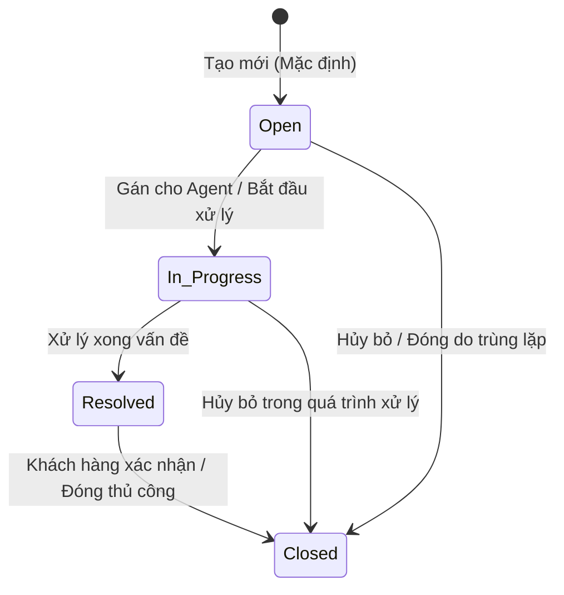

# BẢNG GHI NHẬN THAY ĐỔI TÀI LIỆU

| Phiên bản | Ngày | Người cập nhật | Vị trí thay đổi | Lý do chi tiết |
| :--- | :--- | :--- | :--- | :--- |
| 1.0.0 | 2026-07-01 | Mira-Miraaa | Toàn bộ tài liệu | Tạo mới tài liệu đặc tả tính năng Quản lý danh sách Ticket |

---

# BẢNG QUẢN LÝ TIẾN ĐỘ THỰC THI

| Giai đoạn | Thời gian | Phần mục | Phiên bản áp dụng |
| :--- | :--- | :--- | :--- |
| Sprint 5 | 01/07/2026 - ... | Xây dựng màn hình danh sách Ticket, bộ lọc, chi tiết Ticket và cơ chế cập nhật trạng thái | V1.0 |

---

# TÀI LIỆU THAM CHIẾU

| STT | Tài liệu | Liên kết / Đường dẫn |
| :--- | :--- | :--- |
| 1 | SRS Conversation | [SRS Conversation](file:///F:/Gapone%20Conversation/Docs/SRS%20Conversation.md) |

---

## I. TỔNG QUAN & MỤC TIÊU

### 1.1. Hiện trạng
Hệ thống Gapone Conversation hiện tại đã hỗ trợ quản lý các cuộc hội thoại và thông tin hồ sơ khách hàng. Tuy nhiên, khi khách hàng gửi các yêu cầu nghiệp vụ phức tạp cần thời gian xử lý dài (như xử lý đơn lỗi, khiếu nại hoàn tiền, hỗ trợ kỹ thuật sâu), nhân viên chăm sóc khách hàng (Agent) không có công cụ để tiếp nhận, theo dõi tiến độ và phối hợp liên phòng ban. Việc ghi chú thủ công trên khung chat dẫn đến trôi thông tin và không thể đo lường chất lượng dịch vụ (SLA).

### 1.2. Mục tiêu tính năng
Xây dựng tính năng **Quản lý danh sách Ticket** nhằm:
*   Cung cấp màn hình quản lý tập trung toàn bộ các yêu cầu xử lý của khách hàng dưới dạng Ticket.
*   Cho phép lọc, tìm kiếm, phân công xử lý và cập nhật trạng thái Ticket một cách nhanh chóng.
*   Hỗ trợ theo dõi chỉ số hiệu suất xử lý Ticket của từng Agent và toàn bộ hệ thống.

### 1.3. Phạm vi áp dụng
*   **Đường dẫn truy cập**: Đăng nhập hệ thống > Menu điều hướng chính > **Ticket** (hoặc Quản lý > Ticket).
*   **Đối tượng người dùng**: Admin, Quản lý (Manager), Nhân viên CSKH (Agent).

---

## II. ĐỊNH NGHĨA ĐỐI TƯỢNG & PHÂN QUYỀN

### 2.1. Đối tượng người dùng và phân quyền

| Vai trò | Quyền hạn trên phân hệ Ticket | Ghi chú |
| :--- | :--- | :--- |
| **Admin / Manager** | - Toàn quyền Xem, Tạo mới, Chỉnh sửa, Phân công, Xóa Ticket. - Cấu hình các thiết lập chung của Ticket (mức độ ưu tiên, danh mục loại ticket). | Phục vụ giám sát hệ thống và phân phối công việc. |
| **Agent** | - Xem danh sách Ticket được phân công cho mình hoặc cho Team của mình. - Cập nhật trạng thái, ghi chú xử lý đối với Ticket phụ trách. - Tạo mới Ticket khi hỗ trợ khách hàng. | Không có quyền xóa Ticket hoặc cấu hình hệ thống. |

### 2.2. Bảng định nghĩa đối tượng (Ticket Entity Schema)

Bảng dữ liệu `conversation.tickets` lưu trữ thông tin của các Ticket trong hệ thống:

| STT | Tên trường | Kiểu dữ liệu | Mô tả | Ràng buộc |
| :--- | :--- | :--- | :--- | :--- |
| 1 | `ticket_id` | INT | Mã định danh duy nhất của Ticket | PK, AUTO_INCREMENT |
| 2 | `title` | VARCHAR(255) | Tiêu đề tóm tắt vấn đề của Ticket | Bắt buộc, không để trống |
| 3 | `description` | TEXT | Chi tiết nội dung yêu cầu của khách hàng | Không bắt buộc |
| 4 | `contact_id` | INT | Liên kết tới hồ sơ khách hàng tạo ticket | FK -> `customer_profiles(contact_id)`, Bắt buộc |
| 5 | `conversation_id`| INT | Liên kết tới cuộc hội thoại phát sinh ticket | FK -> `conversations(conversation_id)`, Cho phép NULL |
| 6 | `status` | ENUM | Trạng thái hiện tại của Ticket | Giá trị: {`Open`, `In_Progress`, `Resolved`, `Closed`}. Mặc định: `Open` |
| 7 | `priority` | ENUM | Mức độ ưu tiên xử lý | Giá trị: {`Low`, `Medium`, `High`, `Urgent`}. Mặc định: `Medium` |
| 8 | `assignee_id` | INT | Nhân viên phụ trách xử lý Ticket | FK -> `agents(agent_id)`, Cho phép NULL |
| 9 | `creator_id` | INT | Người tạo Ticket (Agent hoặc hệ thống) | FK -> `agents(agent_id)`, Bắt buộc |
| 10 | `created_date` | DATETIME | Thời điểm tạo Ticket | Tự động ghi nhận thời gian hệ thống |
| 11 | `resolved_date` | DATETIME | Thời điểm Ticket được chuyển sang Resolved | Cho phép NULL, ghi nhận khi status chuyển sang Resolved |

### 2.3. Vòng đời trạng thái Ticket (Ticket Lifecycle)

---

## III. PHÂN TÍCH CHI TIẾT TÍNH NĂNG

### 3.1. Xem danh sách Ticket tổng quan

#### Mô tả chức năng
Màn hình danh sách hiển thị tất cả các Ticket dưới dạng bảng (Data table) có phân trang, bộ lọc đa dạng và thanh tìm kiếm hỗ trợ tra cứu nhanh.

#### Giao diện & Các bộ lọc
*   **Thanh tìm kiếm**: Cho phép gõ tìm kiếm gần đúng (LIKE) theo Mã Ticket, Tiêu đề Ticket, Tên khách hàng hoặc Số điện thoại khách hàng.
*   **Bộ lọc trạng thái (Status Filter)**: Cho phép chọn nhiều trạng thái cùng lúc (Open, In Progress, Resolved, Closed). Mặc định hiển thị tất cả trừ các Ticket đã `Closed`.
*   **Bộ lọc độ ưu tiên (Priority Filter)**: Droplist chọn các mức độ ưu tiên (Low, Medium, High, Urgent).
*   **Bộ lọc người phụ trách (Assignee Filter)**: Cho phép lọc theo Agent cụ thể hoặc lọc "Chưa phân công".
*   **Bộ lọc khoảng thời gian**: Lọc các Ticket được tạo trong khoảng `Từ ngày - Đến ngày`.

#### Trường dữ liệu trên bảng danh sách

| STT | Tên cột | Hiển thị dữ liệu | Hành vi tương tác |
| :--- | :--- | :--- | :--- |
| 1 | Mã Ticket | `#ID` (Ví dụ: `#1024`) | Click vào ID mở màn hình chi tiết Ticket |
| 2 | Tiêu đề | Chuỗi văn bản tiêu đề ngắn | Rút gọn dấu `...` nếu dài quá 50 ký tự |
| 3 | Khách hàng | Tên khách hàng + SĐT kèm icon kênh phát sinh (nếu có) | Click vào tên chuyển hướng sang Hồ sơ khách hàng |
| 4 | Độ ưu tiên | Nhãn màu tương ứng mức độ: - Urgent: Đỏ - High: Cam - Medium: Xanh dương - Low: Xám | Cho phép click đổi nhanh độ ưu tiên qua Dropdown |
| 5 | Trạng thái | Nhãn màu trạng thái hiện tại | Cho phép click đổi nhanh trạng thái |
| 6 | Người phụ trách | Tên Agent xử lý | Click hiển thị Droplist Agent để gán lại nhanh |
| 7 | Ngày tạo | Định dạng `hh:mm dd/mm/yyyy` | Sắp xếp tăng/giảm dần theo thời gian tạo |

---

### 3.2. Cập nhật trạng thái & Đo lường hiệu suất xử lý (SLA)

#### Cập nhật trạng thái
*   Khi chuyển trạng thái Ticket sang `Resolved`:
    *   Hệ thống tự động điền thời gian hiện tại vào trường `resolved_date`.
    *   Tính toán thời gian xử lý thực tế $T_{\text{xử lý}}$ của Ticket:
        $$T_{\text{xử lý}} = \text{resolved\_date} - \text{created\_date}$$
*   Nếu chuyển trạng thái từ `Resolved` quay ngược lại `In_Progress` (do phát sinh vấn đề chưa triệt để), trường `resolved_date` sẽ được reset về `NULL`.

#### Đo lường chỉ số giải quyết Ticket (Resolution Rate)
Để báo cáo hiệu suất của bộ phận hỗ trợ khách hàng, hệ thống tính toán tỷ lệ giải quyết thành công ($RT$) theo công thức sau:
$$RT = \frac{N_{\text{Resolved}} + N_{\text{Closed}}}{N_{\text{Total}}} \times 100\%$$
*Trong đó:*
*   \(N_{\text{Resolved}}\): Số lượng Ticket chuyển sang trạng thái `Resolved` trong kỳ báo cáo.
*   \(N_{\text{Closed}}\): Số lượng Ticket chuyển sang trạng thái `Closed` trong kỳ báo cáo.
*   \(N_{\text{Total}}\): Tổng số lượng Ticket phát sinh mới trong kỳ báo cáo.

> [!WARNING]
> Đối với các Ticket có độ ưu tiên là `Urgent`, nếu thời gian xử lý thực tế $T_{\text{xử lý}} > 4 \text{ giờ}$ mà chưa chuyển sang trạng thái `Resolved`, hệ thống phải kích hoạt gửi cảnh báo quá hạn xử lý (SLA Violation) trực tiếp tới Quản lý qua Bell Icon.

---

### 3.3. Ràng buộc hệ thống & Các lỗi ngoại lệ

*   **Ràng buộc gán việc (Assignment notification)**: Mỗi khi trường `assignee_id` thay đổi (Ticket được gán cho Agent mới), hệ thống phải tự động tạo một thông báo in-app gửi tới Agent nhận việc với nội dung: *"Bạn được phân công xử lý Ticket #[ID] - [Tiêu đề]"*.
*   **Ràng buộc xóa Ticket**: Chỉ cho phép xóa Ticket khi trạng thái đã chuyển sang `Closed` để tránh mất mát dữ liệu lịch sử phản hồi khách hàng khi đang xử lý.
