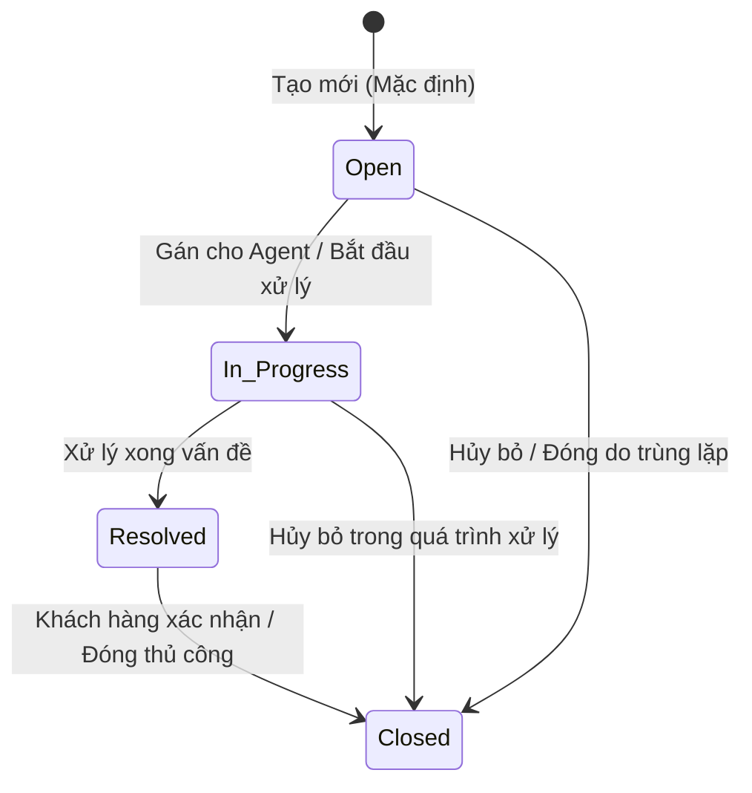

# BẢNG GHI NHẬN THAY ĐỔI TÀI LIỆU

| Phiên bản | Ngày | Người cập nhật | Vị trí thay đổi | Lý do chi tiết |
| :--- | :--- | :--- | :--- | :--- |
| 1.0.0 | 2026-07-01 | Mira-Miraaa | Toàn bộ tài liệu | Tạo mới tài liệu đặc tả tính năng Quản lý danh sách Ticket |
| 1.1.0 | 2026-07-02 | Mira-Miraaa | Toàn bộ tài liệu | Cập nhật chi tiết giao diện Dashboard, các bộ lọc, Data Table, cơ chế chỉnh sửa nhanh (Inline Edit), chi tiết popup SLA, kiểm tra SLA định kỳ (SLA Violation) và phân công việc (Assignment notification) dựa trên mockup thực tế. |

---

# BẢNG QUẢN LÝ TIẾN ĐỘ THỰC THI

| Giai đoạn | Thời gian | Phần mục | Phiên bản áp dụng |
| :--- | :--- | :--- | :--- |
| Sprint 5 | 01/07/2026 - ... | Xây dựng màn hình danh sách Ticket, bộ lọc, chi tiết Ticket và cơ chế cập nhật trạng thái | V1.1 |

---

# TÀI LIỆU THAM CHIẾU

| STT | Tài liệu | Liên kết / Đường dẫn |
| :--- | :--- | :--- |
| 1 | SRS Conversation | [SRS Conversation](file:///f:/Gapone%20Conversation/Docs/SRS%20Conversation.md) |

---

## I. TỔNG QUAN & MỤC TIÊU

### 1.1. Hiện trạng
Hệ thống Gapone Conversation hiện tại đã hỗ trợ quản lý các cuộc hội thoại và thông tin hồ sơ khách hàng. Tuy nhiên, khi khách hàng gửi các yêu cầu nghiệp vụ phức tạp cần thời gian xử lý dài (như xử lý đơn lỗi, khiếu nại hoàn tiền, hỗ trợ kỹ thuật sâu), nhân viên chăm sóc khách hàng (Agent) không có công cụ để tiếp nhận, theo dõi tiến độ và phối hợp liên phòng ban. Việc ghi chú thủ công trên khung chat dẫn đến trôi thông tin và không thể đo lường chất lượng dịch vụ (SLA).

### 1.2. Mục tiêu tính năng
Xây dựng tính năng **Quản lý danh sách Ticket** nhằm:
*   Cung cấp màn hình quản lý tập trung toàn bộ các yêu cầu xử lý của khách hàng dưới dạng Ticket.
*   Cho phép lọc, tìm kiếm, phân công xử lý và cập nhật trạng thái Ticket một cách nhanh chóng.
*   Hỗ trợ theo dõi chỉ số hiệu suất xử lý Ticket của từng Agent và toàn bộ hệ thống.

### 1.3. Phạm vi áp dụng
*   **Đường dẫn truy cập**: Đăng nhập hệ thống > Menu điều hướng chính > **Ticket** (hoặc Quản lý > Ticket).
*   **Đối tượng người dùng**: Admin, Quản lý (Manager), Nhân viên CSKH (Agent).

---

## II. ĐỊNH NGHĨA ĐỐI TƯỢNG & PHÂN QUYỀN

### 2.1. Đối tượng người dùng và phân quyền

| Vai trò | Quyền hạn trên phân hệ Ticket | Ghi chú |
| :--- | :--- | :--- |
| **Admin / Manager** | - Toàn quyền Xem, Tạo mới, Chỉnh sửa, Phân công, Xóa Ticket. - Cấu hình các thiết lập chung của Ticket (mức độ ưu tiên, danh mục loại ticket). | Phục vụ giám sát hệ thống và phân phối công việc. |
| **Agent** | - Xem danh sách Ticket được phân công cho mình hoặc cho Team của mình. - Cập nhật trạng thái, ghi chú xử lý đối với Ticket phụ trách. - Tạo mới Ticket khi hỗ trợ khách hàng. | Không có quyền xóa Ticket (ngoại trừ Ticket đã Closed và được xác nhận) hoặc cấu hình hệ thống. |

### 2.2. Bảng định nghĩa đối tượng (Ticket Entity Schema)

Bảng dữ liệu `conversation.tickets` lưu trữ thông tin của các Ticket trong hệ thống:

| STT | Tên trường | Kiểu dữ liệu | Mô tả | Ràng buộc |
| :--- | :--- | :--- | :--- | :--- |
| 1 | `ticket_id` | INT | Mã định danh duy nhất của Ticket | PK, AUTO_INCREMENT |
| 2 | `title` | VARCHAR(255) | Tiêu đề tóm tắt vấn đề của Ticket | Bắt buộc, không để trống |
| 3 | `description` | TEXT | Chi tiết nội dung yêu cầu của khách hàng | Không bắt buộc |
| 4 | `contact_id` | INT | Liên kết tới hồ sơ khách hàng tạo ticket | FK -> `customer_profiles(contact_id)`, Bắt buộc |
| 5 | `conversation_id`| INT | Liên kết tới cuộc hội thoại phát sinh ticket | FK -> `conversations(conversation_id)`, Cho phép NULL |
| 6 | `status` | ENUM | Trạng thái hiện tại của Ticket | Giá trị: {`Open`, `In_Progress`, `Resolved`, `Closed`}. Mặc định: `Open` |
| 7 | `priority` | ENUM | Mức độ ưu tiên xử lý | Giá trị: {`Low`, `Medium`, `High`, `Urgent`}. Mặc định: `Medium` |
| 8 | `assignee_id` | INT | Nhân viên phụ trách xử lý Ticket | FK -> `agents(agent_id)`, Cho phép NULL |
| 9 | `creator_id` | INT | Người tạo Ticket (Agent hoặc hệ thống) | FK -> `agents(agent_id)`, Bắt buộc |
| 10 | `created_date` | DATETIME | Thời điểm tạo Ticket | Tự động ghi nhận thời gian hệ thống |
| 11 | `resolved_date` | DATETIME | Thời điểm Ticket được chuyển sang Resolved | Cho phép NULL, ghi nhận khi status chuyển sang Resolved |

### 2.3. Vòng đời trạng thái Ticket (Ticket Lifecycle)

---

## III. PHÂN TÍCH CHI TIẾT TÍNH NĂNG

### 3.1. Xem danh sách Ticket tổng quan

#### 3.1.1. Dashboard chỉ số hiệu suất
Tại phần đầu của màn hình quản lý (Panel ID: `view-tickets`), hiển thị 3 thẻ thông tin thống kê chính (Stats Cards Grid):
1.  **Tổng số Ticket** (ID Component: `stat-total-tickets`): Tổng số lượng ticket tồn tại trên hệ thống.
2.  **Đang xử lý** (ID Component: `stat-pending-tickets`): Số lượng ticket có trạng thái là `Open` hoặc `In_Progress` (hiển thị màu vàng cam `#f59e0b`).
3.  **Tỷ lệ Giải quyết (RT)** (ID Component: `stat-resolution-rate`): Thống kê tỷ lệ phần trăm giải quyết thành công của toàn hệ thống (hiển thị màu xanh lá `#10b981`), tính theo công thức:
    $$RT = \frac{N_{\text{Resolved}} + N_{\text{Closed}}}{N_{\text{Total}}} \times 100\%$$

#### 3.1.2. Bộ lọc đa dạng (Filter Bar)
Thanh công cụ lọc (Filter Bar) hỗ trợ Agent và Manager tra cứu nhanh:
*   **Thanh tìm kiếm** (ID: `ticket-search-input`): Ô nhập văn bản hỗ trợ tìm gần đúng (LIKE) theo Mã Ticket, Tiêu đề, Tên khách hàng, hoặc Số điện thoại của khách hàng. Sự kiện `oninput` sẽ trigger tự động vẽ lại bảng (`renderTicketsTable()`).
*   **Bộ lọc trạng thái** (ID: `ticket-filter-status`): Dropdown chọn trạng thái cần lọc gồm:
    *   `Active` (Tất cả trừ Closed) - *Tùy chọn mặc định khi mở màn hình*.
    *   `All` (Tất cả trạng thái)
    *   `Open` (Mới)
    *   `In_Progress` (Đang xử lý)
    *   `Resolved` (Đã giải quyết)
    *   `Closed` (Đã đóng)
*   **Bộ lọc độ ưu tiên** (ID: `ticket-filter-priority`): Dropdown chọn mức độ ưu tiên gồm: `All` (Tất cả), `Low`, `Medium`, `High`, `Urgent`.
*   **Bộ lọc người phụ trách** (ID: `ticket-filter-assignee`): Dropdown chọn Agent gồm: `All` (Tất cả), `Unassigned` (Chưa phân công), hoặc chọn Agent cụ thể được tải động từ danh sách `agentsList`.

#### 3.1.3. Bảng dữ liệu Ticket (Table ID: `ticket-table-body`)
Danh sách Ticket hiển thị dưới dạng bảng dữ liệu có các cột thông tin chi tiết:

| STT | Tên cột | Hiển thị dữ liệu | Hành vi tương tác |
| :--- | :--- | :--- | :--- |
| 1 | Mã Ticket | `#ID` (Ví dụ: `#1024`) | Link text màu xanh (`var(--primary-color)`), in đậm. Click gọi hàm `openDetailTicketPopup(ticket_id)` để mở Popup xem chi tiết. |
| 2 | Tiêu đề | Chuỗi văn bản tiêu đề ngắn | Sử dụng thuộc tính tooltip `title` để hiển thị đầy đủ tiêu đề. Rút gọn bằng dấu `...` nếu vượt quá 50 ký tự (`text-overflow: ellipsis`). |
| 3 | Khách hàng | Tên khách hàng | Hiển thị link văn bản có gạch chân. Click gọi hàm `focusCustomerConversation(conversation_id)` để tự động chuyển sang phân hệ Hội thoại và mở đúng cuộc chat của khách hàng này. |
| 4 | Độ ưu tiên | Badge màu tương ứng + Dropdown chọn nhanh | Badge màu chuẩn theo mức độ. Dropdown chọn nhanh gọi hàm `changeTicketPriority(ticket_id, priority)`. |
| 5 | Trạng thái | Badge màu trạng thái + Dropdown chọn nhanh | Badge màu chuẩn theo trạng thái. Dropdown chọn nhanh gọi hàm `changeTicketStatus(ticket_id, status)`. |
| 6 | Người phụ trách | Dropdown chứa danh sách Agent | Dropdown chứa tên Agent và tùy chọn `-- Chưa gán --`. Thay đổi tùy chọn gọi hàm `changeTicketAssignee(ticket_id, assignee_id)`. |
| 7 | Ngày tạo | Định dạng `hh:mm dd/mm/yyyy` | Thời điểm tạo Ticket trong hệ thống. |

> [!NOTE]
> Khi không tìm thấy bất kỳ Ticket nào thỏa mãn các điều kiện lọc, bảng sẽ hiển thị một dòng thông báo duy nhất: *"Không tìm thấy Ticket nào phù hợp."* (căn giữa, màu chữ muted).

---

### 3.2. Cơ chế chỉnh sửa nhanh trực tiếp (Inline Edit) & Trạng thái SLA

#### 3.2.1. Thay đổi Độ ưu tiên
Khi thay đổi độ ưu tiên qua Dropdown trên dòng, hệ thống cập nhật trường `priority` tương ứng và hiển thị Toast thông báo:
*"Cập nhật độ ưu tiên Ticket #[Mã Ticket] thành: [Mức độ ưu tiên mới]"*.

#### 3.2.2. Thay đổi Trạng thái & Tính toán SLA
Khi thay đổi trạng thái qua Dropdown trên dòng, hệ thống thực hiện hàm `changeTicketStatus()`:
*   Nếu chuyển trạng thái sang `Resolved`:
    *   Hệ thống ghi nhận thời điểm hiện tại vào trường `resolved_date`.
    *   Tính toán thời gian xử lý thực tế $T_{\text{xử lý}}$ (đơn vị: giờ, làm tròn 1 chữ số thập phân):
        $$T_{\text{xử lý}} = \frac{\text{resolved\_date} - \text{created\_date}}{3600 \times 1000}$$
    *   Nếu mức độ ưu tiên là `Urgent` và thời gian xử lý $T_{\text{xử lý}} > 4\text{ giờ}$, hệ thống lập tức kích hoạt thông báo vi phạm SLA quá hạn gửi tới Manager.
    *   Hiển thị Toast: *"Ticket #[Mã Ticket] đã giải quyết. Thời gian xử lý: [Số giờ] giờ"*.
*   Nếu chuyển trạng thái từ `Resolved` ngược về các trạng thái trước đó (ví dụ: `In_Progress` để xử lý lại), hệ thống sẽ reset trường `resolved_date` về `NULL` và hiển thị Toast trạng thái tương ứng.

#### 3.2.3. Thay đổi Người phụ trách & Thông báo phân công (Event Assignment)
Khi thay đổi người phụ trách qua Dropdown trên dòng:
*   Nếu được gán cho một Agent (khác trống), hệ thống ghi nhận `assignee_id` và tự động gửi thông báo in-app (Event Type: `ASSIGNMENT`, Module: `Ticket`):
    *   Nội dung thông báo: *"Bạn được phân công xử lý Ticket #[Mã Ticket] - [Tiêu đề Ticket]"*.
    *   Nếu Agent nhận việc chính là Agent đang đăng nhập (`phuongntt`), hệ thống hiển thị Toast Notification in-app. Ngược lại, hiển thị Toast chung: *"Đã phân công xử lý Ticket #[Mã Ticket] cho [Tên Agent nhận]"*.
*   Nếu gỡ phân công (chọn `-- Chưa gán --`), cập nhật `assignee_id = null` và hiển thị Toast: *"Gỡ phân công Ticket #[Mã Ticket]"*.

---

### 3.3. Quy trình Cảnh báo vi phạm SLA định kỳ (SLA Violation Checker)

Hệ thống tích hợp tiến trình kiểm tra ngầm định kỳ mỗi 30 giây (`setInterval`):
1.  Hệ thống lọc tất cả các Ticket có mức độ ưu tiên là **Urgent** và trạng thái **khác** `Resolved` và `Closed`.
2.  Với mỗi Ticket thỏa mãn, tính toán thời gian trôi qua thực tế:
    $$T_{\text{trôi qua}} = \frac{\text{Thời điểm hiện tại} - \text{created\_date}}{3600 \times 1000}$$
3.  Nếu $T_{\text{trôi qua}} > 4 \text{ giờ}$ và chưa được cảnh báo trước đó (`slaAlertTriggered === false`):
    *   Đánh dấu `slaAlertTriggered = true` trên Ticket để tránh gửi lặp lại.
    *   Gửi một thông báo cảnh báo in-app (Event Type: `SLA_ALERT`, Module: `Ticket`) với tiêu đề *"Cảnh báo SLA quá hạn"* và nội dung chi tiết:
        *"Ticket Urgent #[Mã Ticket] - \"[Tiêu đề Ticket]\" quá hạn giải quyết (Thời gian: [Số giờ]h > 4h)"*.
    *   Đẩy thông báo vào Bell Notification List và hiển thị Popup Toast thông báo khẩn cấp trên màn hình.

---

### 3.4. Popup Chi tiết Ticket (Modal ID: `detail-ticket-modal`)

Popup hiển thị thông tin chi tiết đầy đủ khi người dùng click vào liên kết `#ID` trên bảng hoặc liên kết trên timeline trò chuyện (chiều rộng tối đa 550px):
*   **Tiêu đề Modal**: `Chi tiết Ticket #[Mã Ticket]` (ID: `ticket-detail-header`).
*   **Tiêu đề chính**: Tiêu đề Ticket dạng chữ lớn (ID: `ticket-detail-title`).
*   **Badge**: Hiển thị song song badge Độ ưu tiên (ID: `ticket-detail-priority-badge`) và badge Trạng thái (ID: `ticket-detail-status-badge`).
*   **Hộp mô tả**: Thẻ div hiển thị nội dung (ID: `ticket-detail-desc`), có màu nền `var(--bg-hover)` và đường viền mỏng. Áp dụng style `white-space: pre-wrap` để bảo toàn định dạng văn bản xuống dòng do Agent nhập.
*   **Chi tiết hồ sơ nguồn**: Hiển thị Tên khách hàng (ID: `ticket-detail-cust`) và Mã cuộc hội thoại nguồn (ID: `ticket-detail-conv`).
*   **Thông tin gán việc**: Hiển thị tên đầy đủ của Người phụ trách (ID: `ticket-detail-assignee`) và Người tạo (ID: `ticket-detail-creator`).
*   **Mốc thời gian**: Hiển thị Ngày tạo (ID: `ticket-detail-created`) và Thời điểm giải quyết (ID: `ticket-detail-resolved`).
*   **Hộp trạng thái SLA động** (ID: `ticket-detail-sla-status`): Hiển thị thông tin thời gian xử lý thay đổi màu nền và màu chữ động:
    *   *Đã Resolved hoặc Closed*: Nền xanh mờ, chữ xanh lá `#10b981`. Nội dung: *"Đã giải quyết sau [Số giờ] giờ."*
    *   *Đang xử lý / Mới (Mức Urgent)*:
        *   Nếu quá 4 giờ: Nền đỏ mờ, chữ đỏ `#ef4444`. Nội dung: *"Quá hạn SLA 4 giờ! Đang xử lý: [Số giờ] giờ."*
        *   Nếu trong vòng 4 giờ: Nền cam mờ, chữ cam `#f59e0b`. Nội dung: *"Ưu tiên khẩn cấp (SLA 4h). Đã xử lý: [Số giờ] giờ."*
    *   *Đang xử lý / Mới (Các mức ưu tiên khác)*: Nền xám mờ, chữ xám `var(--text-muted)`. Nội dung: *"Thời gian trôi qua: [Số giờ] giờ."*

> [!WARNING]
> **Quy tắc Xóa Ticket (BR-DEL-01):**
> Nút "Xóa Ticket" (ID: `btn-delete-ticket`, màu nền đỏ `#ef4444`) tại chân Popup **chỉ hiển thị** khi Ticket đang ở trạng thái **Closed**. Nếu ở các trạng thái khác, nút này sẽ bị ẩn (`display: none`). 
> Khi click nút xóa, hệ thống yêu cầu xác nhận: *"Bạn có chắc muốn xóa Ticket #[Mã Ticket]? Hành động này sẽ không thể hoàn tác."*. Khi xác nhận OK, hệ thống tiến hành xóa bỏ hoàn toàn dữ liệu Ticket khỏi danh sách.

---

### 3.5. Ràng buộc hệ thống & Các lỗi ngoại lệ

*   **Ràng buộc gán việc (Assignment notification)**: Mỗi khi trường `assignee_id` thay đổi (Ticket được gán cho Agent mới), hệ thống phải tự động tạo một thông báo in-app gửi tới Agent nhận việc với nội dung: *"Bạn được phân công xử lý Ticket #[ID] - [Tiêu đề]"*.
*   **Ràng buộc xóa Ticket**: Chỉ cho phép xóa Ticket khi trạng thái đã chuyển sang `Closed` để tránh mất mát dữ liệu lịch sử phản hồi khách hàng khi đang xử lý.
