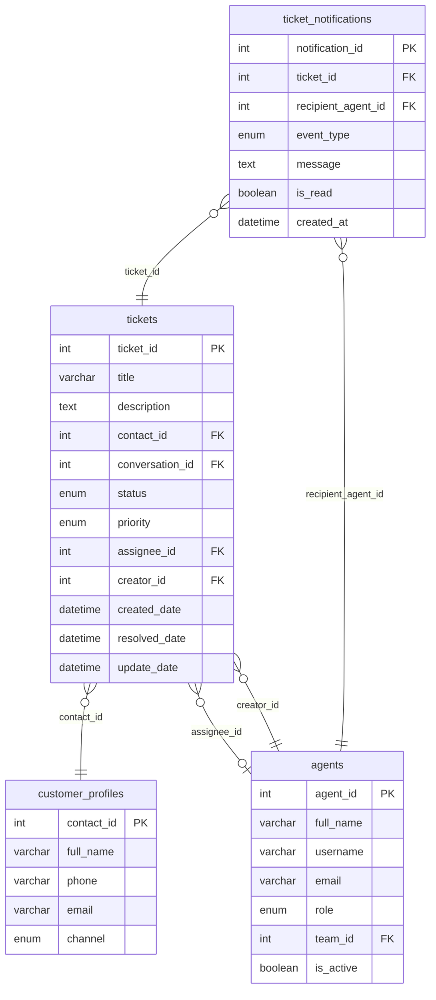
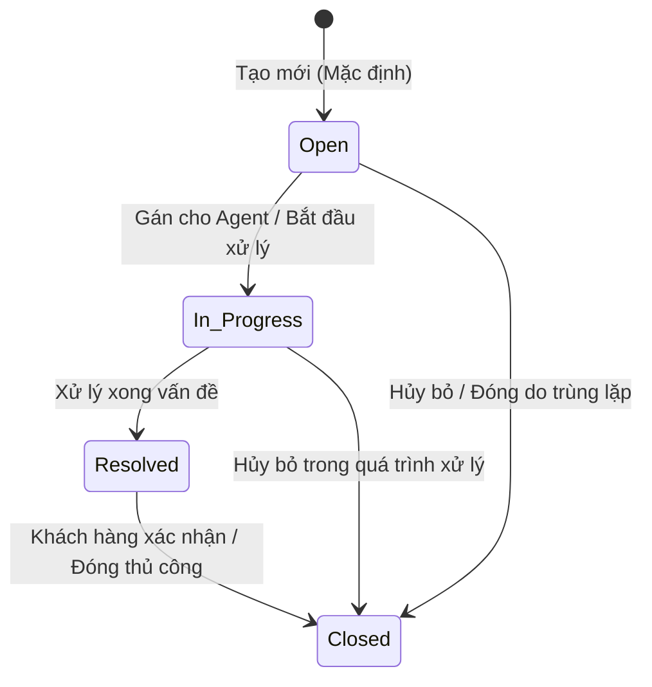

# BẢNG GHI NHẬN THAY ĐỔI TÀI LIỆU

| Phiên bản | Ngày | Người cập nhật | Vị trí thay đổi | Lý do chi tiết |
| :--- | :--- | :--- | :--- | :--- |
| 1.0.0 | 2026-07-01 | Mira-Miraaa | Toàn bộ tài liệu | Tạo mới tài liệu đặc tả tính năng Quản lý danh sách Ticket |
| 1.1.0 | 2026-07-02 | Mira-Miraaa | Toàn bộ tài liệu | Cập nhật chi tiết giao diện Dashboard, các bộ lọc, Data Table, cơ chế chỉnh sửa nhanh (Inline Edit), chi tiết popup SLA, kiểm tra SLA định kỳ (SLA Violation) và phân công việc (Assignment notification) dựa trên mockup thực tế. |
| 1.2.0 | 2026-07-15 | Phương Nguyễn | Mục III — US-01, US-02, US-04 | Bổ sung Acceptance Criteria chi tiết cho US-01 (xem/lọc/tìm kiếm Ticket), US-02 (Inline Edit), US-04 (Xem chi tiết & Xóa Ticket); cập nhật nội dung Toast thông báo theo từng hành động; bổ sung quy tắc phân quyền Agent chỉ tạo Ticket tại hội thoại được phân công đang "In processing"; bổ sung thông báo gỡ phân công đến Agent bị hủy; bổ sung AC-03 SLA Violation khi Urgent quá 4 giờ. |
| 1.2.1 | 2026-07-15 | Phương Nguyễn | Mục II — 2.2, 2.3, 2.4, 2.5 | Bổ sung trường `update_date` vào Ticket Entity Schema; bổ sung bảng định nghĩa đối tượng còn thiếu: `agents`, `customer_profiles`, `ticket_notifications`; bổ sung ERD quan hệ giữa các bảng. |

---

# BẢNG QUẢN LÝ TIẾN ĐỘ THỰC THI

| Giai đoạn | Thời gian | Phần mục | Phiên bản áp dụng |
| :--- | :--- | :--- | :--- |
| Sprint 5 | 01/07/2026 - ... | Xây dựng màn hình danh sách Ticket, bộ lọc, chi tiết Ticket và cơ chế cập nhật trạng thái | V1.2 |

---

# TÀI LIỆU THAM CHIẾU

| STT | Tài liệu | Liên kết / Đường dẫn |
| :--- | :--- | :--- |
| 1 | SRS Conversation | [SRS Conversation](file:///f:/Gapone%20Conversation/Docs/SRS%20Conversation.md) |

---

## I. TỔNG QUAN & MỤC TIÊU

### 1.1. Hiện trạng
Hệ thống Gapone Conversation hiện tại đã hỗ trợ quản lý các cuộc hội thoại và thông tin hồ sơ khách hàng. Tuy nhiên, khi khách hàng gửi các yêu cầu nghiệp vụ phức tạp cần thời gian xử lý dài (như xử lý đơn lỗi, khiếu nại hoàn tiền, hỗ trợ kỹ thuật sâu), nhân viên chăm sóc khách hàng (Agent) không có công cụ để tiếp nhận, theo dõi tiến độ và phối hợp liên phòng ban. Việc ghi chú thủ công trên khung chat dẫn đến trôi thông tin và không thể đo lường chất lượng dịch vụ (SLA).

### 1.2. Mục tiêu tính năng
Xây dựng tính năng **Quản lý danh sách Ticket** nhằm:
*   Cung cấp màn hình quản lý tập trung toàn bộ các yêu cầu xử lý của khách hàng dưới dạng Ticket.
*   Cho phép lọc, tìm kiếm, phân công xử lý và cập nhật trạng thái Ticket một cách nhanh chóng.
*   Hỗ trợ theo dõi chỉ số hiệu suất xử lý Ticket của từng Agent và toàn bộ hệ thống.

### 1.3. Phạm vi áp dụng
*   **Đường dẫn truy cập**: Đăng nhập hệ thống > Menu điều hướng chính > **Ticket** (hoặc Quản lý > Ticket).
*   **Đối tượng người dùng**: Admin, Quản lý (Manager), Nhân viên CSKH (Agent).

---

## II. ĐỊNH NGHĨA ĐỐI TƯỢNG & PHÂN QUYỀN

### 2.1. Đối tượng người dùng và phân quyền

| Vai trò | Quyền hạn trên phân hệ Ticket | Ghi chú |
| :--- | :--- | :--- |
| **Admin / Manager** | - Toàn quyền Xem, Tạo mới, Chỉnh sửa, Phân công, Xóa Ticket. - Xem toàn bộ Ticket của hệ thống (không bị giới hạn theo phân công). - Cấu hình các thiết lập chung của Ticket (mức độ ưu tiên, danh mục loại ticket). | Phục vụ giám sát hệ thống và phân phối công việc. |
| **Agent** | - Chỉ xem danh sách Ticket được phân công cho mình hoặc cho Team của mình; không thấy Ticket của Agent khác. - Cập nhật trạng thái, ghi chú xử lý đối với Ticket phụ trách. - Tạo mới Ticket **chỉ** tại phiên hội thoại được phân công cho mình và có trạng thái **"In processing"**. - Không có quyền xóa Ticket (ngoại trừ Ticket đã Closed và được xác nhận) hoặc cấu hình hệ thống. | Không có quyền xóa Ticket hoặc cấu hình hệ thống. |

### 2.2. Bảng định nghĩa đối tượng (Ticket Entity Schema)

Bảng dữ liệu `conversation.tickets` lưu trữ thông tin của các Ticket trong hệ thống:

| STT | Tên trường | Kiểu dữ liệu | Mô tả | Ràng buộc |
| :--- | :--- | :--- | :--- | :--- |
| 1 | `ticket_id` | INT | Mã định danh duy nhất của Ticket | PK, AUTO_INCREMENT |
| 2 | `title` | VARCHAR(255) | Tiêu đề tóm tắt vấn đề của Ticket | Bắt buộc, không để trống |
| 3 | `description` | TEXT | Chi tiết nội dung yêu cầu của khách hàng | Không bắt buộc |
| 4 | `contact_id` | INT | Liên kết tới hồ sơ khách hàng tạo ticket | FK -> `customer_profiles(contact_id)`, Bắt buộc |
| 5 | `conversation_id`| INT | Liên kết tới cuộc hội thoại phát sinh ticket | FK -> `conversations(conversation_id)`, Cho phép NULL |
| 6 | `status` | ENUM | Trạng thái hiện tại của Ticket | Giá trị: {`Open`, `In_Progress`, `Resolved`, `Closed`}. Mặc định: `Open` |
| 7 | `priority` | ENUM | Mức độ ưu tiên xử lý | Giá trị: {`Low`, `Medium`, `High`, `Urgent`}. Mặc định: `Medium` |
| 8 | `assignee_id` | INT | Nhân viên phụ trách xử lý Ticket | FK -> `agents(agent_id)`, Cho phép NULL |
| 9 | `creator_id` | INT | Người tạo Ticket (Agent hoặc hệ thống) | FK -> `agents(agent_id)`, Bắt buộc |
| 10 | `created_date` | DATETIME | Thời điểm tạo Ticket | Tự động ghi nhận thời gian hệ thống |
| 11 | `resolved_date` | DATETIME | Thời điểm Ticket được chuyển sang `Resolved` | Cho phép NULL; tự động ghi nhận khi `status` chuyển sang `Resolved`; reset về NULL nếu chuyển ngược lại |
| 12 | `update_date` | DATETIME | Thời điểm cập nhật gần nhất của Ticket (bất kỳ trường nào thay đổi) | Tự động cập nhật mỗi khi có thay đổi (`ON UPDATE CURRENT_TIMESTAMP`) |

### 2.3. Bảng định nghĩa đối tượng — `agents`

Bảng `agents` lưu trữ thông tin nhân viên CSKH (Agent) trong hệ thống — được tham chiếu bởi `assignee_id` và `creator_id` trong bảng `tickets`:

| STT | Tên trường | Kiểu dữ liệu | Mô tả | Ràng buộc |
| :--- | :--- | :--- | :--- | :--- |
| 1 | `agent_id` | INT | Mã định danh duy nhất của Agent | PK, AUTO_INCREMENT |
| 2 | `full_name` | VARCHAR(100) | Họ và tên đầy đủ của Agent, dùng hiển thị trên UI (bảng Ticket, Popup chi tiết, Toast) | Bắt buộc |
| 3 | `username` | VARCHAR(50) | Tên đăng nhập duy nhất trong hệ thống | Bắt buộc, UNIQUE |
| 4 | `email` | VARCHAR(150) | Địa chỉ email nhận thông báo phân công | Bắt buộc, UNIQUE |
| 5 | `role` | ENUM | Vai trò trong hệ thống | Giá trị: {`Admin`, `Manager`, `Agent`}. Bắt buộc |
| 6 | `team_id` | INT | Team mà Agent thuộc về (phục vụ phân quyền xem Ticket theo Team) | FK -> `teams(team_id)`, Cho phép NULL |
| 7 | `is_active` | BOOLEAN | Trạng thái hoạt động của tài khoản Agent | Mặc định: `true`. Agent không hoạt động không xuất hiện trong Dropdown phân công |

### 2.4. Bảng định nghĩa đối tượng — `customer_profiles`

Bảng `customer_profiles` lưu trữ thông tin khách hàng — được tham chiếu bởi `contact_id` trong bảng `tickets` và là đối tượng tìm kiếm LIKE trong Filter Bar:

| STT | Tên trường | Kiểu dữ liệu | Mô tả | Ràng buộc |
| :--- | :--- | :--- | :--- | :--- |
| 1 | `contact_id` | INT | Mã định danh duy nhất của hồ sơ khách hàng | PK, AUTO_INCREMENT |
| 2 | `full_name` | VARCHAR(150) | Họ và tên đầy đủ của khách hàng, hiển thị tại cột "Khách hàng" trên bảng Ticket và trong Popup chi tiết | Bắt buộc |
| 3 | `phone` | VARCHAR(20) | Số điện thoại khách hàng, là một trong các trường được tìm kiếm LIKE | Cho phép NULL |
| 4 | `email` | VARCHAR(150) | Địa chỉ email khách hàng | Cho phép NULL |
| 5 | `channel` | ENUM | Kênh liên lạc chính của khách hàng | Giá trị: {`Zalo`, `Facebook`, `Website`, `Internal`}. Cho phép NULL |

> [!NOTE]
> Tìm kiếm LIKE trong US-01 sẽ khớp theo `customer_profiles.full_name` và `customer_profiles.phone`, JOIN qua `tickets.contact_id`.

### 2.5. Bảng định nghĩa đối tượng — `ticket_notifications`

Bảng `ticket_notifications` lưu trữ các thông báo in-app phát sinh từ hành động trên Ticket (phân công, gỡ phân công, SLA vi phạm):

| STT | Tên trường | Kiểu dữ liệu | Mô tả | Ràng buộc |
| :--- | :--- | :--- | :--- | :--- |
| 1 | `notification_id` | INT | Mã định danh duy nhất của thông báo | PK, AUTO_INCREMENT |
| 2 | `ticket_id` | INT | Ticket phát sinh thông báo | FK -> `tickets(ticket_id)`, Bắt buộc |
| 3 | `recipient_agent_id` | INT | Agent nhận thông báo | FK -> `agents(agent_id)`, Bắt buộc |
| 4 | `event_type` | ENUM | Loại sự kiện tạo ra thông báo | Giá trị: {`ASSIGNMENT`, `UNASSIGNMENT`, `SLA_ALERT`}. Bắt buộc |
| 5 | `message` | TEXT | Nội dung thông báo đầy đủ hiển thị trên UI | Bắt buộc |
| 6 | `is_read` | BOOLEAN | Trạng thái đã đọc của thông báo | Mặc định: `false` |
| 7 | `created_at` | DATETIME | Thời điểm tạo thông báo | Tự động ghi nhận thời gian hệ thống |

**Mapping Event Type → Nội dung thông báo (`message`):**

| `event_type` | Điều kiện kích hoạt | Nội dung `message` |
| :--- | :--- | :--- |
| `ASSIGNMENT` | `assignee_id` được gán mới (khác NULL) | *"Bạn được phân công xử lý Ticket #[ID] - [Tiêu đề]"* |
| `UNASSIGNMENT` | `assignee_id` bị đặt về NULL | *"Phân công xử lý Ticket #[ID] - [Tiêu đề] của bạn bị hủy"* |
| `SLA_ALERT` | Ticket `Urgent` tồn tại > 4 giờ chưa `Resolved`/`Closed` | *"Ticket Urgent #[ID] - [Tiêu đề] quá hạn giải quyết (Thời gian: [X]h > 4h)"* — gửi đến Manager |

### 2.6. ERD — Quan hệ giữa các bảng

### 2.7. Vòng đời trạng thái Ticket (Ticket Lifecycle)

---

## III. PHÂN TÍCH CHI TIẾT TÍNH NĂNG

---

### US-01 · Xem, lọc và tìm kiếm danh sách Ticket

**Mục tiêu:** Để Admin/Manager/Agent nhanh chóng theo dõi và phân tích tiến độ xử lý các yêu cầu của khách hàng, hệ thống cung cấp màn hình quản lý tập trung với Dashboard chỉ số hiệu suất và bộ lọc đa dạng — thay thế việc ghi chú thủ công dẫn đến trôi thông tin và không đo được chất lượng dịch vụ.

**Đường dẫn:** `Đăng nhập > Menu chính > Ticket`

**Luồng nghiệp vụ:**
1. User truy cập màn hình Ticket → hệ thống hiển thị Dashboard + bảng danh sách mặc định lọc `Active` (tất cả trừ `Closed`)
2. User áp dụng bộ lọc (trạng thái / độ ưu tiên / người phụ trách) hoặc nhập từ khóa tìm kiếm → bảng tự động render lại kết quả (`oninput`)
3. Không có kết quả → bảng hiển thị thông báo *"Không tìm thấy Ticket nào phù hợp."*

#### 3.1.1. Dashboard chỉ số hiệu suất

Tại phần đầu của màn hình quản lý (Panel ID: `view-tickets`), hiển thị 3 thẻ thông tin thống kê chính (Stats Cards Grid):

1.  **Tổng số Ticket** (ID Component: `stat-total-tickets`): Tổng số lượng ticket tồn tại trên hệ thống.
2.  **Đang xử lý** (ID Component: `stat-pending-tickets`): Số lượng ticket có trạng thái là `Open` hoặc `In_Progress` (hiển thị màu vàng cam `#f59e0b`).
3.  **Tỷ lệ Giải quyết (RT)** (ID Component: `stat-resolution-rate`): Thống kê tỷ lệ phần trăm giải quyết thành công của toàn hệ thống (hiển thị màu xanh lá `#10b981`), tính theo công thức:
    $$RT = \frac{N_{\text{Resolved}} + N_{\text{Closed}}}{N_{\text{Total}}} \times 100\%$$

#### 3.1.2. Bộ lọc đa dạng (Filter Bar)

Thanh công cụ lọc (Filter Bar) hỗ trợ Agent và Manager tra cứu nhanh:

*   **Thanh tìm kiếm** (ID: `ticket-search-input`): Ô nhập văn bản hỗ trợ tìm gần đúng (LIKE) theo Mã Ticket, Tiêu đề, Tên khách hàng, hoặc Số điện thoại của khách hàng. Sự kiện `oninput` sẽ trigger tự động vẽ lại bảng (`renderTicketsTable()`) mà không cần nhấn nút.
*   **Bộ lọc trạng thái** (ID: `ticket-filter-status`): Dropdown chọn trạng thái cần lọc gồm:
    *   `Active` (Tất cả trừ Closed) — *Tùy chọn mặc định khi mở màn hình*.
    *   `All` (Tất cả trạng thái)
    *   `Open` (Mới)
    *   `In_Progress` (Đang xử lý)
    *   `Resolved` (Đã giải quyết)
    *   `Closed` (Đã đóng)
*   **Bộ lọc độ ưu tiên** (ID: `ticket-filter-priority`): Dropdown chọn mức độ ưu tiên gồm: `All` (Tất cả), `Low`, `Medium`, `High`, `Urgent`.
*   **Bộ lọc người phụ trách** (ID: `ticket-filter-assignee`): Dropdown chọn Agent gồm: `All` (Tất cả), `Unassigned` (Chưa phân công), hoặc chọn Agent cụ thể được tải động từ danh sách `agentsList`.

#### 3.1.3. Bảng dữ liệu Ticket (Table ID: `ticket-table-body`)

Danh sách Ticket hiển thị dưới dạng bảng dữ liệu có các cột thông tin chi tiết:

| STT | Tên cột | Hiển thị dữ liệu | Hành vi tương tác |
| :--- | :--- | :--- | :--- |
| 1 | Mã Ticket | `#ID` (Ví dụ: `#1024`) | Link text màu xanh (`var(--primary-color)`), in đậm. Click gọi hàm `openDetailTicketPopup(ticket_id)` để mở Popup xem chi tiết. |
| 2 | Tiêu đề | Chuỗi văn bản tiêu đề ngắn | Rút gọn bằng dấu `...` nếu vượt quá 50 ký tự (`text-overflow: ellipsis`). Sử dụng thuộc tính tooltip `title` để hiển thị đầy đủ tiêu đề khi hover. |
| 3 | Khách hàng | Tên khách hàng | Hiển thị link văn bản có gạch chân. Click gọi hàm `focusCustomerConversation(conversation_id)` để tự động chuyển sang phân hệ Hội thoại, mở đúng cuộc chat, mở panel và hiển thị nội dung của expanded ticket. |
| 4 | Độ ưu tiên | Badge màu tương ứng + Dropdown chọn nhanh | Badge màu chuẩn theo mức độ. Dropdown chọn nhanh gọi hàm `changeTicketPriority(ticket_id, priority)`. |
| 5 | Trạng thái | Badge màu trạng thái + Dropdown chọn nhanh | Badge màu chuẩn theo trạng thái. Dropdown chọn nhanh gọi hàm `changeTicketStatus(ticket_id, status)`. |
| 6 | Người phụ trách | Dropdown chứa danh sách Agent | Dropdown chứa tên Agent và tùy chọn `-- Chưa gán --`. Thay đổi tùy chọn gọi hàm `changeTicketAssignee(ticket_id, assignee_id)`. |
| 7 | Ngày tạo | Định dạng `hh:mm dd/mm/yyyy` | Thời điểm tạo Ticket trong hệ thống. |

> [!NOTE]
> Khi không tìm thấy bất kỳ Ticket nào thỏa mãn các điều kiện lọc, bảng sẽ hiển thị một dòng thông báo duy nhất: *"Không tìm thấy Ticket nào phù hợp."* (căn giữa, màu chữ muted).

#### 3.1.4. Acceptance Criteria — US-01

**Happy Path (Luồng thành công):**

- [ ] **AC-01:** User truy cập màn hình Ticket → Dashboard hiển thị đúng 3 thẻ thống kê; bảng mặc định lọc `Active` (ẩn các Ticket `Closed`), bảng danh sách Ticket tương ứng với bộ lọc.
- [ ] **AC-02:** User nhập từ khóa vào ô tìm kiếm → bảng tự động lọc theo Mã Ticket, Tiêu đề, Tên hoặc SĐT khách hàng mà không cần nhấn nút.
- [ ] **AC-03:** User chọn bộ lọc trạng thái → bảng chỉ hiển thị Ticket có trạng thái tương ứng; tương tự với các bộ lọc độ ưu tiên và người phụ trách.
- [ ] **AC-04:** Click tên khách hàng trong bảng → hệ thống tự động chuyển sang phân hệ Hội thoại và mở đúng cuộc chat của khách hàng đó, mở panel và hiển thị nội dung của expanded ticket.
- [ ] **AC-05:** Agent đăng nhập → chỉ thấy Ticket được phân công cho mình/Team; không thấy Ticket của Agent khác. Admin/Manager có thể xem/sửa/xóa tất cả các Ticket.
- [ ] **AC-06:** Agent chỉ có thể tạo Ticket mới tại phiên hội thoại được phân công cho mình và có trạng thái là **"In processing"**.

**Edge Cases / Luồng ngoại lệ:**

- [ ] **AC-07:** Không có Ticket nào thỏa mãn điều kiện lọc → bảng hiển thị thông báo *"Không tìm thấy Ticket nào phù hợp."* căn giữa, không hiển thị bảng rỗng.

**Out of Scope:**
- Phân trang (pagination) → sẽ xem xét khi số lượng Ticket lớn.
- Xuất danh sách Ticket ra file (Excel/CSV) → story báo cáo riêng.
- Sắp xếp cột (sort) trên bảng → xem xét ở phiên bản sau.

---

### US-02 · Chỉnh sửa nhanh Ticket trực tiếp trên bảng (Inline Edit)

**Mục tiêu:** Để Agent và Manager tiết kiệm thao tác, hệ thống cho phép cập nhật nhanh độ ưu tiên, trạng thái và người phụ trách của Ticket ngay trên dòng bảng mà không cần mở popup — đồng thời tự động gửi thông báo phân công và kích hoạt cảnh báo SLA khi cần thiết.

**Luồng thay đổi độ ưu tiên:**
1. Chọn mức độ ưu tiên: `Low` / `Medium` / `High` / `Urgent` trong Dropdown độ ưu tiên.
2. Toast: *"Ticket #[ID] được đổi độ ưu tiên thành [Mức ưu tiên mới] lúc hh:mm"* hiển thị trên giao diện của người thực thi thao tác.

**Luồng thay đổi trạng thái:**
1. Chọn chuyển đổi trạng thái: `Open` > `In_Progress` > `Resolved` > `Closed` trong Dropdown trạng thái.
2. Toast tương ứng hiển thị trên giao diện của người thực thi:
   - Chuyển sang `Open`: *"Ticket #[ID] được tạo mới lúc hh:mm"*
   - Chuyển sang `In_Progress`: *"Ticket #[ID] đang xử lý lúc hh:mm"*
   - Chuyển sang `Resolved`: *"Ticket #[ID] đã xử lý lúc hh:mm"*
   - Chuyển sang `Closed`: *"Ticket #[ID] được đóng lúc hh:mm"*

**Luồng thay đổi người phụ trách:**
1. Chọn Agent trong Dropdown → ghi nhận `assignee_id` → tự động gửi thông báo in-app đến Agent nhận việc.
2. Chọn `-- Chưa gán --` → `assignee_id = null` → Toast xác nhận gỡ phân công + gửi thông báo đến Agent bị gỡ.

#### 3.2.1. Thay đổi Độ ưu tiên

Khi thay đổi độ ưu tiên qua Dropdown trên dòng, hệ thống cập nhật trường `priority` tương ứng và hiển thị Toast thông báo:
*"Ticket #[Mã Ticket] được đổi độ ưu tiên thành [Mức độ ưu tiên mới] lúc hh:mm"*.

#### 3.2.2. Thay đổi Trạng thái & Tính toán SLA

Khi thay đổi trạng thái qua Dropdown trên dòng, hệ thống thực hiện hàm `changeTicketStatus()`:
*   Nếu chuyển trạng thái sang `Resolved`:
    *   Hệ thống ghi nhận thời điểm hiện tại vào trường `resolved_date`.
    *   Tính toán thời gian xử lý thực tế $T_{\text{xử lý}}$ (đơn vị: giờ, làm tròn 1 chữ số thập phân):
        $$T_{\text{xử lý}} = \frac{\text{resolved\_date} - \text{created\_date}}{3600 \times 1000}$$
    *   Nếu mức độ ưu tiên là `Urgent` và thời gian xử lý $T_{\text{xử lý}} > 4\text{ giờ}$, hệ thống lập tức kích hoạt thông báo vi phạm SLA quá hạn gửi tới Manager.
    *   Hiển thị Toast: *"Ticket #[Mã Ticket] đã xử lý. Thời gian xử lý: [Số giờ] giờ lúc hh:mm"*.
*   Nếu chuyển trạng thái từ `Resolved` ngược về các trạng thái trước đó (ví dụ: `In_Progress` để xử lý lại), hệ thống sẽ reset trường `resolved_date` về `NULL` và hiển thị Toast trạng thái tương ứng.

#### 3.2.3. Thay đổi Người phụ trách & Thông báo phân công (Event Assignment)

Khi thay đổi người phụ trách qua Dropdown trên dòng:
*   **Gán cho một Agent (khác trống):** Hệ thống ghi nhận `assignee_id` và tự động gửi thông báo in-app (Event Type: `ASSIGNMENT`, Module: `Ticket`):
    *   Nội dung thông báo gửi đến Agent nhận việc: *"Bạn được phân công xử lý Ticket #[Mã Ticket] - [Tiêu đề Ticket]"*.
    *   Nếu Agent nhận việc chính là Agent đang đăng nhập, hệ thống hiển thị Toast Notification in-app cá nhân thay vì chỉ Toast chung.
    *   Ngược lại, hiển thị Toast chung: *"Đã phân công xử lý Ticket #[Mã Ticket] cho [Tên Agent nhận]"*.
*   **Gỡ phân công (chọn `-- Chưa gán --`):** Cập nhật `assignee_id = null`:
    *   Hiển thị Toast trên giao diện người thực thi: *"Gỡ phân công Ticket #[Mã Ticket]"*.
    *   Gửi thông báo in-app đến Agent bị gỡ phân công: *"Phân công xử lý Ticket #[Mã Ticket] - [Tiêu đề] của bạn bị hủy"*.

#### 3.2.4. Acceptance Criteria — US-02

**Happy Path (Luồng thành công):**

- [ ] **AC-01:** Thay đổi độ ưu tiên qua Dropdown → badge màu cập nhật ngay trên dòng → Toast xác nhận hiển thị đúng mức mới kèm thời gian `hh:mm`.
- [ ] **AC-02:** Chuyển trạng thái → trạng thái mới được ghi nhận → `update_date` được ghi nhận → Toast hiển thị thời gian xử lý tính bằng giờ (làm tròn 1 chữ số thập phân).
- [ ] **AC-03:** Ticket `Urgent` chuyển sang `Resolved` sau > 4 giờ kể từ khi tạo → hệ thống kích hoạt thông báo vi phạm SLA gửi tới Manager.
- [ ] **AC-04:** Gán Ticket cho Agent B → Agent B nhận thông báo in-app *"Bạn được phân công xử lý Ticket #[ID] - [Tiêu đề]"*.
- [ ] **AC-05:** Chọn `-- Chưa gán --` → `assignee_id` về `null` → Toast *"Gỡ phân công Ticket #[ID]"* xuất hiện trên giao diện người thực thi; Agent bị gỡ phân công nhận thông báo in-app *"Phân công xử lý Ticket #[ID] - [Tiêu đề] của bạn bị hủy"*.

**Edge Cases / Luồng ngoại lệ:**

- [ ] **AC-06:** Agent đang đăng nhập tự gán Ticket cho chính mình → hiển thị Toast in-app cá nhân thay vì Toast chung.

> [!NOTE]
> Thời điểm hiển thị trong Toast (định dạng `hh:mm`) là thời điểm hệ thống ghi nhận thay đổi, không phải thời điểm người dùng click.

**Out of Scope:**
- Lịch sử thay đổi trạng thái/người phụ trách (Audit trail) → xem xét ở phiên bản sau.
- Cấu hình ngưỡng SLA khác nhau theo từng loại Ticket → story cấu hình SLA riêng.

---

### 3.3. Quy trình Cảnh báo vi phạm SLA định kỳ (SLA Violation Checker)

Hệ thống tích hợp tiến trình kiểm tra ngầm định kỳ mỗi 30 giây (`setInterval`):
1.  Hệ thống lọc tất cả các Ticket có mức độ ưu tiên là **Urgent** và trạng thái **khác** `Resolved` và `Closed`.
2.  Với mỗi Ticket thỏa mãn, tính toán thời gian trôi qua thực tế:
    $$T_{\text{trôi qua}} = \frac{\text{Thời điểm hiện tại} - \text{created\_date}}{3600 \times 1000}$$
3.  Nếu $T_{\text{trôi qua}} > 4 \text{ giờ}$ và chưa được cảnh báo trước đó (`slaAlertTriggered === false`):
    *   Đánh dấu `slaAlertTriggered = true` trên Ticket để tránh gửi lặp lại.
    *   Gửi một thông báo cảnh báo in-app (Event Type: `SLA_ALERT`, Module: `Ticket`) với tiêu đề *"Cảnh báo SLA quá hạn"* và nội dung chi tiết:
        *"Ticket Urgent #[Mã Ticket] - \"[Tiêu đề Ticket]\" quá hạn giải quyết (Thời gian: [Số giờ]h > 4h)"*.
    *   Đẩy thông báo vào Bell Notification List và hiển thị Popup Toast thông báo khẩn cấp trên màn hình.

---

### US-04 · Xem chi tiết & Xóa Ticket

**Mục tiêu:** Để Agent/Manager nắm đầy đủ thông tin một Ticket cụ thể (mô tả, nguồn hội thoại, trạng thái SLA động) và dọn dẹp các Ticket đã hoàn tất, hệ thống cung cấp Popup chi tiết với thông tin toàn diện và cơ chế xóa an toàn chỉ khi Ticket ở trạng thái `Closed`.

**Luồng xem chi tiết:** Click liên kết `#ID` trên bảng → Popup `detail-ticket-modal` (rộng tối đa 550px) mở ra.

**Luồng xóa:** Ticket ở trạng thái `Closed` → nút **[Xóa Ticket]** (nền đỏ) hiển thị → click → Confirm dialog → xác nhận → xóa khỏi hệ thống.

#### 3.4.1. Popup Chi tiết Ticket (Modal ID: `detail-ticket-modal`)

Popup hiển thị thông tin chi tiết đầy đủ khi người dùng click vào liên kết `#ID` trên bảng hoặc liên kết trên timeline trò chuyện (chiều rộng tối đa 550px):

*   **Tiêu đề Modal**: `Chi tiết Ticket #[Mã Ticket]` (ID: `ticket-detail-header`).
*   **Tiêu đề chính**: Tiêu đề Ticket dạng chữ lớn (ID: `ticket-detail-title`).
*   **Badge**: Hiển thị song song badge Độ ưu tiên (ID: `ticket-detail-priority-badge`) và badge Trạng thái (ID: `ticket-detail-status-badge`).
*   **Hộp mô tả**: Thẻ div hiển thị nội dung (ID: `ticket-detail-desc`), có màu nền `var(--bg-hover)` và đường viền mỏng. Áp dụng style `white-space: pre-wrap` để bảo toàn định dạng văn bản xuống dòng do Agent nhập.
*   **Chi tiết hồ sơ nguồn**: Hiển thị Tên khách hàng (ID: `ticket-detail-cust`) và Mã cuộc hội thoại nguồn (ID: `ticket-detail-conv`).
*   **Thông tin gán việc**: Hiển thị tên đầy đủ của Người phụ trách (ID: `ticket-detail-assignee`) và Người tạo (ID: `ticket-detail-creator`).
*   **Mốc thời gian**: Hiển thị Ngày tạo (ID: `ticket-detail-created`) và Thời điểm giải quyết (ID: `ticket-detail-resolved`).
*   **Hộp trạng thái SLA động** (ID: `ticket-detail-sla-status`): Hiển thị thông tin thời gian xử lý thay đổi màu nền và màu chữ động:
    *   *Đã `Resolved` hoặc `Closed`*: Nền xanh mờ, chữ xanh lá `#10b981`. Nội dung: *"Đã giải quyết sau [Số giờ] giờ."*
    *   *Đang xử lý / Mới (Mức `Urgent`)*:
        *   Nếu quá 4 giờ: Nền đỏ mờ, chữ đỏ `#ef4444`. Nội dung: *"Quá hạn SLA 4 giờ! Đang xử lý: [Số giờ] giờ."*
        *   Nếu trong vòng 4 giờ: Nền cam mờ, chữ cam `#f59e0b`. Nội dung: *"Ưu tiên khẩn cấp (SLA 4h). Đã xử lý: [Số giờ] giờ."*
    *   *Đang xử lý / Mới (Các mức ưu tiên khác)*: Nền xám mờ, chữ xám `var(--text-muted)`. Nội dung: *"Thời gian trôi qua: [Số giờ] giờ."*

> [!WARNING]
> **Quy tắc Xóa Ticket (BR-DEL-01):**
> Nút "Xóa Ticket" (ID: `btn-delete-ticket`, màu nền đỏ `#ef4444`) tại chân Popup **chỉ hiển thị** khi Ticket đang ở trạng thái **Closed**. Nếu ở các trạng thái khác (`Open`, `In_Progress`, `Resolved`), nút này sẽ bị ẩn hoàn toàn (`display: none`).
> Khi click nút xóa, hệ thống yêu cầu xác nhận: *"Bạn có chắc muốn xóa Ticket #[Mã Ticket]? Hành động này sẽ không thể hoàn tác."*. Khi xác nhận OK, hệ thống tiến hành xóa bỏ hoàn toàn dữ liệu Ticket khỏi danh sách.

#### 3.4.2. Acceptance Criteria — US-04

**Happy Path (Luồng thành công):**

- [ ] **AC-01:** Click `#ID` trên bảng → Popup mở hiển thị đầy đủ 4 phần thông tin: thông tin cơ bản, mô tả, hồ sơ nguồn, thông tin gán việc & mốc thời gian.
- [ ] **AC-02:** Popup Ticket `Urgent` đang `In_Progress` chưa quá 4 giờ → hộp SLA nền cam, hiển thị đúng thời gian đã xử lý.
- [ ] **AC-03:** Popup Ticket `Urgent` đang `In_Progress` đã quá 4 giờ → hộp SLA nền đỏ, nội dung *"Quá hạn SLA 4 giờ! Đang xử lý: [Số giờ] giờ."*
- [ ] **AC-04:** Popup Ticket `Closed` → nút **[Xóa Ticket]** hiển thị; click → Confirm dialog; xác nhận OK → Ticket bị xóa, Popup đóng, bảng không còn hiển thị Ticket đó.

**Edge Cases / Luồng ngoại lệ:**

- [ ] **AC-05:** Popup Ticket có `status = Open`, `In_Progress`, hoặc `Resolved` → nút **[Xóa Ticket]** *không* xuất hiện.
- [ ] **AC-06:** Confirm dialog xuất hiện → User chọn **Hủy** → Ticket không bị xóa, Popup vẫn mở.

**Out of Scope:**
- Chỉnh sửa nội dung Ticket từ bên trong Popup (tiêu đề, mô tả) → V1 chỉ hỗ trợ xem.
- Ghi chú nội bộ (Internal Note) trên Ticket → story riêng.

---

## IV. RÀNG BUỘC HỆ THỐNG & CÁC LỖI NGOẠI LỆ

*   **Ràng buộc gán việc (Assignment notification)**: Mỗi khi trường `assignee_id` thay đổi (Ticket được gán cho Agent mới), hệ thống phải tự động tạo một thông báo in-app gửi tới Agent nhận việc với nội dung: *"Bạn được phân công xử lý Ticket #[ID] - [Tiêu đề]"*.
*   **Ràng buộc gỡ phân công**: Khi `assignee_id` bị đặt về `null`, hệ thống gửi thông báo in-app đến Agent bị hủy phân công: *"Phân công xử lý Ticket #[ID] - [Tiêu đề] của bạn bị hủy"*.
*   **Ràng buộc tạo Ticket**: Agent chỉ được tạo Ticket mới trong phiên hội thoại được phân công cho mình và có trạng thái **"In processing"**. Không thể tạo Ticket từ hội thoại chưa được phân công hoặc đã đóng.
*   **Ràng buộc xóa Ticket**: Chỉ cho phép xóa Ticket khi trạng thái đã chuyển sang `Closed` để tránh mất mát dữ liệu lịch sử phản hồi khách hàng khi đang xử lý.
