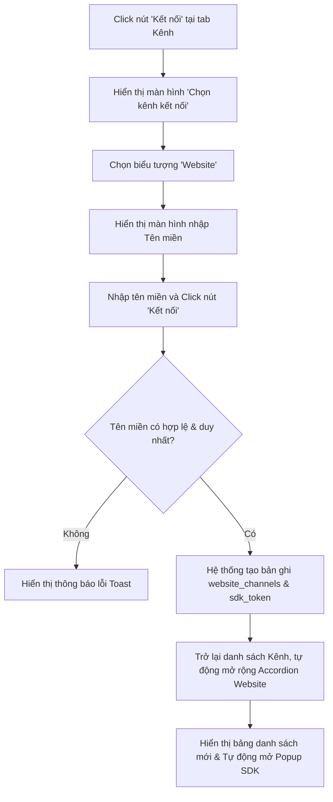

# BẢNG GHI NHẬN THAY ĐỔI TÀI LIỆU

| Phiên bản | Ngày | Người cập nhật | Vị trí thay đổi | Lý do chi tiết |
| :--- | :--- | :--- | :--- | :--- |
| 1.0.0 | 2026-07-02 | Mira-Miraaa | Toàn bộ tài liệu | Tạo mới tài liệu đặc tả tính năng Kết nối Website Channel cho AI Chatbot |

---

# BẢNG QUẢN LÝ TIẾN ĐỘ THỰC THI

| Giai đoạn | Thời gian | Phần mục | Phiên bản áp dụng |
| :--- | :--- | :--- | :--- |
| Sprint 5 | 02/07/2026 - ... | Xây dựng giao diện đăng ký tên miền, bảng danh sách website, và bộ sinh mã nhúng chat widget SDK | V1.0 |

---

# TÀI LIỆU THAM CHIẾU

| STT | Tài liệu | Liên kết / Đường dẫn |
| :--- | :--- | :--- |
| 1 | SRS Conversation | [SRS Conversation](file:///F:/Gapone%20Conversation/Docs/SRS%20Conversation.md) |

---

## I. TỔNG QUAN & MỤC TIÊU

### 1.1. Hiện trạng
Hệ thống Gapone Conversation hiện đang hỗ trợ quản lý tập trung và tích hợp AI Chatbot cho các kênh mạng xã hội phổ biến như Zalo OA, Facebook Messenger, và Telegram. Tuy nhiên, doanh nghiệp sử dụng hệ thống vẫn chưa có giải pháp để tiếp cận trực tiếp khách hàng đang truy cập trang web bán hàng hoặc landing page chính thức của họ. Việc thiếu kênh hỗ trợ trực tuyến trên Website (Web Livechat) khiến doanh nghiệp bỏ lỡ cơ hội chuyển đổi lưu lượng truy cập trực tiếp thành khách hàng tiềm năng.

### 1.2. Mục tiêu tính năng
Xây dựng tính năng **Kết nối kênh Website** nhằm:
*   Cho phép người quản trị (Admin) đăng ký các tên miền (domain) thuộc sở hữu của doanh nghiệp vào hệ thống.
*   Tự động phát sinh mã nhúng SDK Chat Widget (đoạn mã JavaScript) để doanh nghiệp dán vào mã nguồn website.
*   Kích hoạt khung chat AI Chatbot tự động chào hỏi, hỗ trợ FAQ và thu thập thông tin khách truy cập trực tiếp trên trang web.

### 1.3. Phạm vi áp dụng
*   **Đường dẫn truy cập**: Đăng nhập > Cài đặt > Kênh (Lựa chọn tab Kênh, các website đã kết nối nằm ở khối Accordion Website bên dưới các kênh Telegram, Zalo, Messenger).
*   **Đối tượng người dùng**: Admin, Quản lý (Manager).

---

## II. ĐỊNH NGHĨA ĐỐI TƯỢNG & PHÂN QUYỀN

### 2.1. Đối tượng người dùng và phân quyền

| Vai trò | Quyền hạn trên tính năng Website | Ghi chú |
| :--- | :--- | :--- |
| **Admin / Manager** | - Đăng ký thêm Website mới.<br>- Xem danh sách tên miền đang hoạt động.<br>- Lấy mã nhúng SDK Chat Widget của từng website.<br>- Xóa / Ngắt kết nối Website. | Phục vụ thiết lập và triển khai hệ thống ban đầu. |
| **Agent / Nhân viên** | Không có quyền xem hay thao tác trên màn hình cấu hình này. | Chỉ tiếp nhận và phản hồi các cuộc hội thoại được chuyển tiếp từ Website sang màn hình chat. |

### 2.2. Bảng định nghĩa đối tượng (Website Channel Schema)

Bảng dữ liệu `conversation.website_channels` quản lý các trang web được tích hợp chat widget:

| STT | Tên trường | Kiểu dữ liệu | Mô tả | Ràng buộc |
| :--- | :--- | :--- | :--- | :--- |
| 1 | `website_id` | INT | Mã định danh duy nhất của Website đã kết nối | PK, AUTO_INCREMENT |
| 2 | `domain` | VARCHAR(255) | Tên miền đăng ký tích hợp (Ví dụ: `app.gapone.vn`) | Bắt buộc, duy nhất, không trùng lặp |
| 3 | `status` | ENUM | Trạng thái hoạt động của kênh | Giá trị: {`Active`, `Inactive`}. Mặc định: `Active` |
| 4 | `sdk_token` | VARCHAR(255) | Token định danh duy nhất dùng để xác thực SDK client | Bắt buộc, sinh ngẫu nhiên UUID |
| 5 | `created_date` | DATETIME | Thời điểm kết nối tên miền | Tự động ghi nhận thời gian hệ thống |
| 6 | `created_by` | INT | Người thực hiện kết nối | FK -> `agents(agent_id)`, Bắt buộc |

---

## III. PHÂN TÍCH CHI TIẾT TÍNH NĂNG

### 3.1. Giao diện Thêm Website & Quản lý danh sách

#### Luồng thao tác của người dùng
Admin truy cập theo đường dẫn: **Đăng nhập > Cài đặt > Kênh (chọn tab Kênh)**.



#### Quy tắc xác thực tên miền (Domain Validation Rules)
Khi Admin nhập tên miền và bấm nút "Kết nối" tại form đăng ký, hệ thống bắt buộc kiểm tra các điều kiện:
1.  **Định dạng**: Chỉ chấp nhận tên miền hợp lệ theo tiêu chuẩn RFC 1035 (ví dụ: `gapone.vn`, `sub.domain.com`).
2.  **Ký tự cấm**: Không chứa giao thức truyền tải (loại bỏ `http://` hoặc `https://`), không chứa đường dẫn thư mục con (loại bỏ `/path/sub-page`), không chứa các ký tự đặc biệt ngoài dấu gạch ngang `-` và dấu chấm `.`.

> [!WARNING]
> Nếu tên miền nhập vào không hợp lệ hoặc đã tồn tại trên hệ thống, quá trình kết nối sẽ dừng xử lý và hiển thị thông báo: *"Tên miền không hợp lệ hoặc đã được kết nối trước đó!"*.

#### Cấu trúc bảng danh sách Website đã kết nối
Bảng hiển thị danh sách các website đã thêm vào hệ thống với các cột:
*   **STT**: Số thứ tự tăng dần.
*   **Website**: Tên miền đã kết nối (hiển thị dạng liên kết, khi click sẽ mở lại Popup mã nhúng SDK tương ứng).
*   **Ngày kết nối**: Thời gian đăng ký thành công (định dạng `dd/mm/yyyy hh:mm:ss`).
*   **Cột hành động (không có tiêu đề cột)**: Nút ba dấu chấm dọc `⋮` (More options). Khi click sẽ mở rộng một dropdown nhỏ chứa nút **Xóa** (không chứa nút chỉnh sửa). Khi người dùng chọn **Xóa**, hệ thống sẽ hiển thị Modal xác nhận ngắt kết nối Website.

---

### 3.2. Mã nhúng SDK Chat Widget (Embed Script Generator)

Mỗi website sau khi kết nối thành công sẽ có một `sdk_token` riêng biệt. Hệ thống tự động biên dịch thành đoạn mã HTML Script để tích hợp vào website khách hàng.

#### Cấu trúc mã nhúng SDK:
```html
<!-- Gapone AI Chatbot SDK Embed Code -->
<script>
  (function(g,a,p,o,n,e){
    g['GaponeChatbot']=n;g[n]=g[n]||function(){
    (g[n].q=g[n].q||[]).push(arguments)},g[n].l=1*new Date();
    e=a.createElement(p),o=a.getElementsByTagName(p)[0];
    e.async=1;e.src='https://gapone.vn/sdk/chatbot.js?id=GP-W-10293';
    o.parentNode.insertBefore(e,o);
  })(window,document,'script','gapone_chatbot');
  gapone_chatbot('init', 'gp_token_2026_x7a8');
</script>
```

#### Ràng buộc nghiệp vụ hiển thị mã nhúng:
*   Mã nhúng được hiển thị trong một hộp văn bản (Textarea) đặt ở trạng thái chỉ đọc (Read-only).
*   Cung cấp nút **"Sao chép mã"** (Copy to clipboard). Khi click, hệ thống tự động copy toàn bộ nội dung trong hộp văn bản và hiển thị Toast xanh: *"Đã sao chép mã nhúng SDK vào bộ nhớ tạm!"*.

---

### 3.3. Quy tắc an toàn & Đo lường hiệu suất

#### Quy tắc an toàn (CORS & Whitelisting)
*   **BR-SEC-01 (Domain Whitelisting)**: Hệ thống AI Chatbot Gateway chỉ chấp nhận tải tài nguyên chat widget và kết nối WebSockets khi tên miền của Client gửi yêu cầu (`Origin` header) trùng khớp chính xác với một tên miền đã đăng ký trong cơ sở dữ liệu `website_channels` ở trạng thái `Active`.
*   **BR-SEC-02 (Yêu cầu SSL)**: Các website tích hợp bắt buộc phải hoạt động trên giao thức bảo mật HTTPS để đảm bảo tính toàn vẹn dữ liệu chat và tránh bị trình duyệt chặn mã chạy SDK.

#### Chỉ số đo lường hiệu quả (Engagement Rate)
Hệ thống tính toán tỷ lệ tương tác của AI Chatbot trên Website (\(ER_{\text{web}}\)) theo công thức:
$$ER_{\text{web}} = \frac{S_{\text{chat}}}{V_{\text{total}}} \times 100\%$$
*Trong đó:*
*   \(S_{\text{chat}}\): Tổng số phiên hội thoại được khởi tạo thành công từ Website trong kỳ.
*   \(V_{\text{total}}\): Tổng số lượng người truy cập (Unique Visitors) được ghi nhận trên trang web có cài đặt SDK trong cùng kỳ.

---

## IV. TIÊU CHÍ NGHIỆM THU CHI TIẾT (ACCEPTANCE CRITERIA)

| Mã AC | Tên tiêu chí | Điều kiện nghiệm thu thành công |
| :--- | :--- | :--- |
| **AC-01** | Kiểm tra định dạng tên miền | Nhập `http://myweb.com` hoặc `myweb.com/index` -> Bấm Kết nối -> Hệ thống báo lỗi. Nhập `myweb.com` -> Bấm Kết nối -> Kết nối thành công. |
| **AC-02** | Sinh mã nhúng SDK chính xác | Thêm mới tên miền `test.vn`. Mở popup xem SDK -> Token hiển thị trong đoạn mã script phải khớp với token sinh ra cho `test.vn` trong Database. |
| **AC-03** | Ngắt kết nối Website | Bấm nút ba chấm dọc `⋮` -> Chọn **Xóa** -> Hiển thị Modal hỏi xác nhận -> Chọn Xác nhận -> Row bị xóa khỏi bảng, chatbot trên website `test.vn` ngừng hoạt động. |
| **AC-04** | Kiểm tra chặn CORS | Giả lập website chưa đăng ký `hack.com` gọi SDK Gapone -> Server từ chối kết nối và trả về lỗi `403 Forbidden`. |
